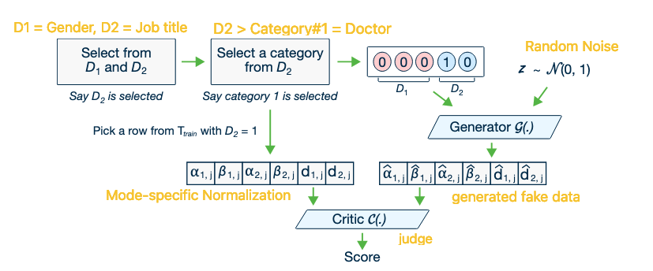

## 1. Problem Statement

Modeling tabular data poses unique challenges for GANs, which existing statistical and deep neural network models fail to address properly:

- **Mixed Data Types:** Tabular data contains a mix of discrete and continuous columns.
- **Non-Gaussian & Multimodal Distributions:** Continuous columns often have multiple modes (peaks) and do not follow a simple Gaussian distribution.
- **Imbalanced Discrete Columns:** Categorical columns are often heavily imbalanced (e.g., 90% 'Normal', 10% 'Fraud'), leading to mode collapse where minor categories are ignored.

## 2. Methodology

To address these challenges, the authors propose **CTGAN**, which introduces **Mode-specific Normalization**, a **Conditional Generator**, and a **Training-by-Sampling** strategy.

### A. Mode-Specific Normalization

- **Challenge:** Representing continuous values with arbitrary, non-Gaussian distributions is non-trivial. Simple Min-Max normalization to `[-1, 1]` fails on multimodal data.
- **Solution:** Treat each continuous column $C_i$ independently using a **Variational Gaussian Mixture Model (VGM)**.

  1. Estimate the number of modes $m_i$ and fit a Gaussian mixture.
  2. Represent each value as a concatenation of:

     - **One-hot vector (**$\beta$**):** Indicates which mode the value belongs to.
     - **Scalar (**$\alpha$**):** Represents the normalized value within that mode.

### B. Conditional Generator and Training-by-Sampling

- **Challenge:** Random sampling during training neglects minor categories in imbalanced columns, causing the generator to fail in learning them.
- **Solution:** Condition the generator to produce specific discrete values.
  - **Conditional Vector:** defined as $cond = m_1 \oplus ... \oplus m_{N_d}$.
    - *Example:* For columns $D_1=\{1,2,3\}$ and $D_2=\{1,2\}$, the condition $(D_2=1)$ is represented as mask vectors $m_1=[0,0,0]$ (ignored) and $m_2=[1,0]$ (selected).
  - **Generator Loss:** Penalize the generator if it fails to produce the requested condition. This is done by adding the **cross-entropy** between the input mask $m_{i^*}$ and the generated output $\hat{d}_{i^*}$ to the loss.
  - **Training-by-Sampling (Curriculum):**

    1. Create zero-filled mask vectors.
    2. Randomly select a discrete column $D_i$.
    3. Construct a PMF based on the **log-frequency** of values in that column (giving minor classes a higher chance).
    4. Sample a value $k^*$ based on this PMF and set the mask bit to 1.
    5. This ensures the model evenly explores all possible discrete values, not just the majority classes.



### C. Network Structure (CTGAN)

- **Architecture:** Two fully-connected hidden layers for both Generator and Critic.
  - **Generator:** Batch Normalization + ReLU.
  - **Critic:** Dropout + Leaky ReLU.
- **Optimization:** WGAN loss with gradient penalty + Adam optimizer ($lr=2 \cdot 10^{-4}$).

**Generator Flow:**

```text
h0 = z ⊕ cond
h1 = h0 ⊕ ReLU(BN(FC_256(h0)))
h2 = h1 ⊕ ReLU(BN(FC_256(h1)))
α_hat = tanh(FC(h2))              # Continuous scalar
β_hat = gumbel_0.2(FC(h2))        # Continuous mode (one-hot)
d_hat = gumbel_0.2(FC(h2))        # Discrete value (one-hot)
```

**Critic Flow:**

```text
h0 = r1 ⊕ ... ⊕ r10 ⊕ cond1 ⊕ ... ⊕ cond10
h1 = drop(leaky_0.2(FC_256(h0)))
h2 = drop(leaky_0.2(FC_256(h1)))
Score = FC_1(h2)
```

### D. TVAE (Tabular Variational AutoEncoder)

The authors also propose **TVAE** as a robust baseline for comparison.

- Uses two networks to model $p_\theta(r_j|z_j)$ and $q_\phi(z_j|r_j)$.
- Optimized using Evidence Lower-Bound (ELBO) loss.
- Treats continuous variables ($\alpha$) as Gaussian and discrete variables ($\beta, d$) using softmax.

## 3. Evaluation & Benchmarks

### Evaluation Metrics

1. **Likelihood Fitness (Simulated Data):**

   - Uses a known **Oracle** $S$ (Gaussian Mixture or Bayesian Network).
   - $\mathcal{L}_{syn}$**:** Likelihood of synthetic data on original Oracle $S$. (Prone to overfitting).
   - $\mathcal{L}_{test}$**:** Train a *new* Oracle $S'$ using synthetic data $T_{syn}$, then compute likelihood of real test data $T_{test}$ on $S'$. (Detects **mode collapse**).

2. **Machine Learning Efficacy (Real Data):**

   - Train classifiers/regressors on Synthetic Data ($T_{syn}$).
   - Test them on Real Test Data ($T_{test}$).
   - Metrics: Accuracy, F1-Score (Classification), $R^2$ (Regression).

### Benchmarks

- **Baselines:** 2 Bayesian Networks (CLBN, PrivBN) + 3 Deep Learning methods (MedGAN, VeeGAN, TableGAN).
- **Simulated Datasets:** Grid, GridR (Grid + Offset), Ring (GMM Oracles), and Bayesian Networks (Alarm, Child, Asia, Insurance).
- **Real Datasets:** 6 UCI datasets (Adult, Census, etc.), Credit (Kaggle), MNIST28.

## 4. Outcomes & Conclusion

- **Performance:** CTGAN outperforms all deep learning methods and surpasses Bayesian networks on **87.5%** of datasets.
- **TVAE vs CTGAN:** TVAE is highly competitive and outperforms CTGAN in several cases. However, CTGAN is preferred for privacy applications (easier to implement Differential Privacy) since the generator doesn't access real data during inference.
- **Key Contributions:**
  - **Mode-specific normalization** solves the non-Gaussian/multimodal distribution issue.
  - **Conditional Generator & Training-by-sampling** effectively solve the imbalanced data issue.

## Ref

- Xu, L., Skoularidou, M., Cuesta-Infante, A., & Veeramachaneni, K. (2019). Modeling tabular data using conditional gan. Advances in neural information processing systems, 32.
