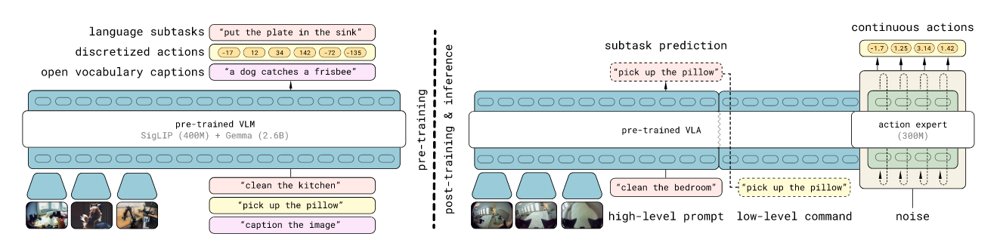

# $\pi_{0.5}$: A Vision-Language-Action Model with Open-World Generalization

## 1. Abstract

* **Core Concept:** $\pi_{0.5}$ is a model designed for broad generalization by utilizing co-training on heterogeneous tasks.
* **Method:** It combines hybrid multi-modal examples including image observations, language commands, object detection, semantic subtask prediction, and low-level actions.
* **Impact:** This knowledge transfer is essential for effective generalization, enabling the execution of long-horizon and dexterous manipulation skills in the wild.

## 2. Introduction

* **Goal:** Design training recipes that provide the breadth of knowledge required for robots to generalize at multiple levels of abstraction, from physical behaviors to scene semantics.
* **Unified Framework:** By casting different modalities into a single sequence modeling framework, VLAs can be trained on diverse sources: robot data, language data, computer vision tasks, and combinations thereof.
* **Capabilities:** The model can control mobile manipulators to perform varied household tasks even in homes never seen during training.
* **Hierarchical Architecture:**
  * **Training:** Pre-trains on a heterogeneous mixture of tasks, then fine-tunes specifically for mobile manipulation using both low-level action examples and high-level semantic actions (e.g., predicting "pick up the cutting board").
  * **Inference:** At runtime, the model first predicts a **semantic subtask** (inferring appropriate next behavior based on scene semantics) and then predicts the **robot action chunk** based on this subtask.

## 3. Model Structure

### Unified Transformer Architecture

* The model corresponds to a transformer taking in $N$ multimodal input tokens $x_{1:N}$ (images, text, and actions) and producing multimodal outputs.
* **Input Processing:** Different token types are processed by specific encoders (e.g., Vision Encoder for images, Embedding Matrix for text).
* **Output Split:** The output is split into two streams:
  * **Text Logits ($y^{l}_{1:M}$):** Used for QA, reasoning, and **dividing the task** (predicting subtasks $\hat{l}$).
  * **Action Tokens ($y^{a}_{1:H}$):** Produced by a separate **Action Expert** to create continuous outputs for robot control.

### Probabilistic Decomposition

The distribution captured by the model is decomposed using the chain rule and a conditional independence assumption:

$$
\pi_{\theta}(a_{t:t+H}, \hat{l} | o_{t}, l) = \pi_{\theta}(a_{t:t+H} | o_{t}, \hat{l}) \cdot \pi_{\theta}(\hat{l} | o_{t}, l)
$$

* **Assumption:** The action distribution ($a_{t:t+H}$) does not depend on the overall task prompt ($l$), but only on the predicted subtask ($\hat{l}$).
* **High-Level Inference:** $\pi_{\theta}(\hat{l} | o_{t}, l)$ (Predicting "what to do next").
* **Low-Level Inference:** $\pi_{\theta}(a_{t:t+H} | o_{t}, \hat{l})$ (Predicting "how to move").

## 4. Combining Discrete & Continuous Actions

The model employs a hybrid approach to balance training efficiency with inference speed and quality.

* **The Dilemma:**
  * **Discrete Tokens (FAST):** Fast training, but requires slow autoregressive decoding during inference.
  * **Continuous (Flow Matching):** High quality and smooth control, but computationally expensive to train from scratch on massive datasets.
* **The Solution:** Train on discretized actions (FAST) but use Flow Matching for inference.
  * **Attention Masking:** Ensures discrete and continuous action representations do not attend to each other during joint training.

### Hybrid Loss Function

The model minimizes a combined objective:

$$
\mathbb{E} \left[ \underbrace{H(x, f^l_\theta)}_{\text{Cross Entropy}} + \alpha \underbrace{\| \omega - a - f^a_\theta \|^2}_{\text{MSE for Flow}} \right]
$$

* **Cross Entropy:** For text and discrete action tokens.
* **MSE:** For the Flow Matching vector field (Action Expert).

## 5. Training Recipe

The training is split into two distinct stages based on the $\alpha$ parameter and the inclusion of the Action Expert.

### Stage 1: Pre-training ($\alpha = 0$)

* **Goal:** Efficient large-scale learning.
* **Method:** **Action Expert is OFF.** Trains as a standard auto-regressive transformer using next-token prediction for text and **discrete FAST action tokens**.
* **Datasets**:
  * **MM:** Mobile Manipulator data (100+ homes).
  * **ME:** Multi-Environment non-mobile robots.
  * **CE:** Cross-Embodiment laboratory data (diverse tasks like folding).
  * **HL:** High-Level subtask prediction data.
  * **WD:** Multimodal Web Data (VQA, captioning).

### Stage 2: Post-training ($\alpha = 10.0$)

* **Goal:** Specialization for mobile manipulation and enabling continuous control.
* **Method:** **Action Expert is ON.**
  * Initialized with random weights.
  * Jointly trains next-token prediction (to preserve text capabilities) and **Flow Matching** for continuous actions.
* **Key Addition (Verbal Instructions - VI):**
  * Data collected by "teleoperating" the robot using language commands (e.g., expert users selecting sub-tasks step-by-step).
  * Crucial for training the model to predict high-quality subtasks ($\hat{l}$).

## 6. Evaluation

### Methodology

* **Settings:** Tested in entirely new kitchens and bedrooms not seen during training.
* **Tasks:** Long-horizon tasks like cleaning kitchens, putting laundry away, and making beds.
* **Metrics:** Task progress (percentage of steps completed) and Language Following Rate.

### Key Findings

* **Generalization:** $\pi_{0.5}$ successfully performs multi-stage tasks in real, unseen homes.
* **Scaling:** Performance improves consistently as the number of training environments increases.
* **Ablation Studies:**
  * **Cross-Embodiment (CE/ME):** Excluding data from other robots significantly degrades performance, indicating strong transfer learning.
  * **Web Data (WD):** While less critical for general task progress, it is essential for **Out-of-Distribution (OOD)** object generalization and language following.
* **Comparison:** Significantly outperforms $\pi_0$ and the $\pi_0$-FAST+Flow baseline.

## 7. Conclusions & Future Work

* **Current Status:** $\pi_{0.5}$ demonstrates that co-training with heterogeneous data enables end-to-end robotic systems to perform long-horizon, dexterous skills in open-world settings.
* **Limitations:**
  * Struggles with physical constraints (hard-to-open cabinets) or partial observability.
  * Limited to relatively simple prompts based on training data.
* **Future Directions:**
  * Incorporating richer context and memory for better handling of partial observability.
  * Expanding data sources, particularly exploring **verbal instructions** as a powerful new supervision modality.

## Ref

* Intelligence, P., Black, K., Brown, N., Darpinian, J., Dhabalia, K., Driess, D., Esmail, A., Equi, M., Finn, C., & Fusai, N. (2025). π0.5: a Vision-Language-Action Model with Open-World Generalization. arXiv preprint arXiv:2504.16054.
