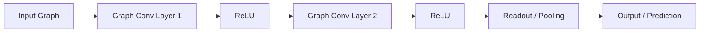

## 개념

**GCN (Graph Convolutional Networks)** 은 그래프 구조 데이터에서 노드(Node)와 엣지(Edge) 정보를 활용하여 특징(Feature)을 학습하는 딥러닝 모델임. 이미지 처리에 주로 사용되는 CNN(Convolutional Neural Networks)의 합성곱 연산을 그래프 데이터로 확장한 개념으로, **이웃 노드들의 정보를 집계(Aggregate)하여 현재 노드의 표현(Representation)을 업데이트**하는 방식을 사용함.


## 등장배경

- **비유클리드 데이터 처리의 한계**: 기존의 CNN은 이미지나 텍스트와 같이 격자(Grid) 구조를 가진 유클리드 데이터(Euclidean Data)에서 뛰어난 성능을 보였으나, 소셜 네트워크, 분자 구조, 웹 링크 등 불규칙한 관계를 가진 **비유클리드 데이터(Non-Euclidean Data)**를 처리하는 데에는 한계가 존재함.
- **관계성 정보의 중요성**: 데이터 자체의 속성뿐만 아니라 데이터 간의 **연결 관계(Structure)**가 중요한 정보를 담고 있는 경우가 많아, 이를 효과적으로 학습할 수 있는 모델이 필요해짐.

## 구성도

GCN은 기본적으로 입력된 그래프 데이터에 대해 여러 번의 그래프 합성곱 연산(Graph Convolution)과 활성화 함수(Activation Function)를 거쳐 최종적으로 노드 분류나 링크 예측 등의 작업을 수행함.



1. **Input Layer**: 노드의 특징 행렬($X$)과 인접 행렬($A$)을 입력받음.
2. **Hidden Layers (Graph Convolution)**: 각 노드는 이웃 노드의 정보를 모아 자신의 정보를 갱신함. (Message Passing)
3. **Activation Function**: 비선형성(Non-linearity)을 추가하기 위해 ReLU 등을 사용함.
4. **Output Layer**: 최종적으로 학습된 노드 임베딩을 사용하여 분류(Classification)나 회귀(Regression) 등의 태스크를 수행함.

## GCN의 유형

GCN은 접근 방식에 따라 크게 두 가지 유형으로 분류됨.

1. **스펙트럼 기반 (Spectral-based GCNs)**
    - 그래프 신호 처리 이론에 기반하여, 그래프 라플라시안(Graph Laplacian)과 푸리에 변환(Fourier Transform)을 이용해 스펙트럼 도메인에서 합성곱을 수행함.
    - **특징**: 이론적 토대가 탄탄하지만, 그래프 전체 구조에 의존적이어서 구조가 바뀌면 재학습이 필요하며 계산 복잡도가 높음.
    - **대표 모델**: ChebNet (Chebyshev 다항식 근사), GCN (Kipf & Welling의 1차 근사).

2. **공간 기반 (Spatial-based GCNs)**
    - 노드의 공간적 이웃 관계를 기반으로 정보를 직접 집계(Aggregation)하는 방식. CNN 필터가 픽셀 위를 이동하는 것과 유사함.
    - **특징**: 직관적이며 계산 효율성이 높고, 거대 그래프나 유동적인 그래프에도 적용하기 용이함.
    - **대표 모델**: GraphSAGE (이웃 샘플링), GAT (Attention 가중치).

## 구성요소

| 구성요소 | 설명 | 역할 |
| --- | --- | --- |
| **Node (Vertex)** | 그래프의 각 점 (데이터 개체) | 데이터의 주체, 특징($X$) 보유 |
| **Edge (Link)** | 노드 간의 연결 선 | 데이터 간의 관계 및 상호작용 정보 제공 |
| **Adjacency Matrix ($A$)** | 노드 간 연결 정보를 담은 행렬 | 그래프의 구조적 정보를 수학적으로 표현 |
| **Node Feature Matrix ($X$)** | 각 노드의 속성 벡터를 모은 행렬 | 노드 자체의 고유 정보 입력 |
| **Degree Matrix ($D$)** | 각 노드의 연결 수(차수)를 나타내는 대각 행렬 | 연산 시 정보의 크기를 정규화(Normalize)하는 데 사용 |
| **Weight Matrix ($W$)** | 학습 가능한 파라미터 행렬 | 입력 특징을 변환하고 중요도 학습 |
| **Aggregation Function** | 이웃 노드의 정보를 합치는 함수 | 이웃 정보의 평균(Mean)이나 합(Sum) 등을 계산 |

## 작동 원리

GCN의 핵심 작동 원리는 **메시지 패싱(Message Passing)**으로, 이웃 노드의 정보를 수집하고 가중치를 적용하여 자신의 상태를 업데이트하는 과정임.

### 1. 수학적 정의

가장 널리 쓰이는 Kipf & Welling의 GCN 레이어 갱신 규칙은 다음과 같음.

$$
H^{(l+1)} = \sigma(\tilde{A}H^{(l)}W^{(l)})
$$

- $H^{(l)}$: $l$번째 층의 노드 특징 행렬 ($N \times D$).
- $\tilde{A}$: 정규화된 인접 행렬 (Normalized Adjacency Matrix).
  - 보통 $\tilde{A} = D^{-\frac{1}{2}}\hat{A}D^{-\frac{1}{2}}$로 정의 ($\hat{A} = A + I$, $I$는 자기 자신을 포함하기 위한 단위 행렬).
- $W^{(l)}$: 학습 가능한 가중치 행렬 ($D \times F$).
- $\sigma$: 활성화 함수 (ReLU 등).

### 2. 정규화

단순히 인접 행렬 $A$를 곱하면 연결이 많은 노드(Hub)의 값이 폭발적으로 커지거나, 적은 노드는 소실될 수 있음. 이를 방지하기 위해 차수(Degree) $D$를 이용해 정규화($D^{-\frac{1}{2}}AD^{-\frac{1}{2}}$)를 수행하여 수치적 안정성을 확보함.

### 3. 구현 예시

```python
import numpy as np

def graph_convolutional_layer(A, X, W):
    # A: Adjacency matrix, X: Input features, W: Weights
    
    # 1. Self-loop 추가 (자기 자신의 정보도 포함하기 위함)
    I = np.eye(A.shape[0])
    A_hat = A + I
    
    # 2. 차수 행렬 계산 및 정규화 (Normalization)
    D = np.sum(A_hat, axis=0)
    D_inv_sqrt = np.power(D, -0.5)
    D_inv_sqrt[np.isinf(D_inv_sqrt)] = 0.
    D_mat_inv_sqrt = np.diag(D_inv_sqrt)
    
    # A_norm = D^-0.5 * A_hat * D^-0.5
    A_norm = np.dot(np.dot(D_mat_inv_sqrt, A_hat), D_mat_inv_sqrt)
    
    # 3. 집계 및 변환 (Aggregation & Transformation)
    output = np.dot(A_norm, X)  # 이웃 정보 집계
    output = np.dot(output, W)  # 가중치 변환
    
    return output
```

## CNN과의 비교

| 비교 항목 | CNN (Convolutional Neural Networks) | GCN (Graph Convolutional Networks) |
| --- | --- | --- |
| **주요 데이터** | 이미지, 텍스트 (유클리드 데이터, Grid) | 소셜 네트워크, 분자 구조 (비유클리드 데이터, Graph) |
| **이웃 구조** | 고정된 크기와 순서 (상, 하, 좌, 우 픽셀) | 가변적인 크기와 순서 없음 (연결된 모든 노드) |
| **합성곱 연산** | 필터(Kernel)가 윈도우를 슬라이딩하며 연산 | 이웃 노드의 정보를 집계(Aggregate)하여 연산 |
| **불변성 (Invariance)** | **이동 불변성**: 대상이 이동해도 인식 가능 | **순열 불변성**: 노드 순서가 바뀌어도 결과는 동일해야 함 |
| **주요 목적** | 지역적 특징(Local Feature) 추출 | 관계성 및 구조적 특징(Structural Feature) 학습 |

## 주요 변형 모델 (Variants)

- **GraphSAGE**: 모든 이웃을 사용하는 GCN의 계산 비용 문제를 해결하기 위해, 고정된 수의 이웃을 **샘플링(Sampling)**하여 집계함.
- **GAT (Graph Attention Networks)**: 모든 이웃에 동일한 중요도를 부여하는 대신, **어텐션(Attention)** 메커니즘을 적용하여 더 중요한 이웃의 정보에 높은 가중치를 부여함.
- **ChebNet**: 스펙트럼 기반 방식을 효율화하기 위해 Chebyshev 다항식을 사용하여 필터를 근사함.
- **GIN (Graph Isomorphism Network)**: 그래프 동형성(Isomorphism)을 구분할 수 있을 정도로 강력한 표현력을 갖도록 설계됨.

## 장단점

| 구분 | 내용 |
| --- | --- |
| **장점** | - **비정형 데이터 처리**: 이미지/텍스트 외의 복잡한 연결 관계 데이터 처리에 탁월.<br />- **관계 학습**: 개체 간의 상호작용과 구조적 정보를 효과적으로 포착.<br />- **성과**: 추천 시스템, 신약 개발 등 다양한 분야에서 SOTA(State-of-the-Art) 성능 달성. |
| **단점** | - **Oversmoothing**: 층이 깊어질수록 노드 간의 정보가 섞여 구분이 어려워지는 현상.<br />- **확장성(Scalability)**: 거대 그래프의 경우 전체 인접 행렬을 메모리에 올리기 어려움 (GraphSAGE 등으로 해결 시도).<br />- **동적 그래프**: 실시간으로 변하는 그래프 구조를 반영하기 까다로움. |

## 활용방안

- **소셜 네트워크 분석 (Social Network Analysis)**: 친구 추천(Facebook), 커뮤니티 탐지, 가짜 뉴스 전파 경로 분석.
- **생물정보학 및 화학 (Bioinformatics & Chemistry)**: 신약 개발을 위한 분자 구조 분석(Drug Discovery), 단백질 상호작용 예측.
- **추천 시스템 (Recommender Systems)**: 사용자(User)와 아이템(Item) 간의 상호작용 그래프를 분석하여 정교한 추천 제공 (Pinterest 등).
- **지식 그래프 (Knowledge Graph)**: 개체 간의 복잡한 관계를 추론하고 질의응답 시스템 고도화(Google).
- **컴퓨터 비전 (Computer Vision)**: 이미지 내 객체 간의 관계를 그래프로 모델링하여 장면(Scene) 이해.

## 최근 연구 동향

1. **GNN과 LLM의 융합 (GNN-LLM Convergence)**: GCN 모델 자체의 개선을 넘어, **GraphRAG**와 같이 지식 그래프를 인코딩하여 LLM의 추론을 돕거나 상호보완하는 연구가 주류를 이룸.
2. **그래프 파운데이션 모델 (Graph Foundation Models)**: 특정 태스크에 국한되지 않고, 다양한 그래프 데이터에 범용적으로 적용 가능한 대규모 사전 학습 모델(Pre-trained Models) 개발이 가속화됨.
3. **Graph Transformers**: 기존 메시지 패싱(Message Passing) 방식의 한계를 넘어서기 위해, 트랜스포머(Transformer) 아키텍처를 그래프 도메인에 최적화하여 적용하는 연구 활발.
4. **생성형 GNN (Generative GNNs)**: 신약 개발이나 소재 설계 등에서 원하는 속성을 가진 새로운 그래프 구조를 생성하는 확산 모델(Diffusion Models) 기반 연구 증가.
5. **설명 가능성 및 신뢰성 (Explainability & Trustworthiness)**: 금융이나 의료 등 민감한 분야의 도입 확대로 인해, 모델의 예측 근거를 제시하고 견고성(Robustness)을 확보하는 기술이 필수적임.

## Ref

- [A Gentle Introduction to Graph Neural Networks](https://distill.pub/2021/gnn-intro/)
