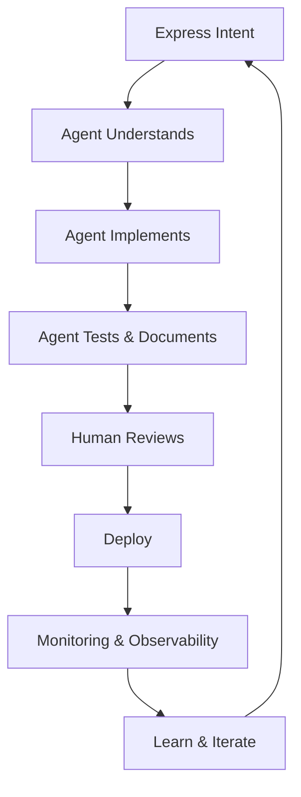

## Agentic SDLC

- Agentic Software Development Life Cycle (SDLC) is an approach that integrates autonomous agents into the software development process.
- This method decreases human intervention by allowing AI agents to handle various stages of development, from requirements gathering to deployment and maintainance.
- It reduces the cycle time for SW development. Traditional SDLC takes weeks-to-months, while Agentic SDLC can potentially reduce this to days or even hours.

## Cycles

## Key differences

| Aspect | Traditional SDLC | Agentic SDLC |
| --- | --- | --- |
| Cycle Time | Weeks to Months | Days to Hours |
| Flow | Linear, Sequential | Fluid, Iterative |
| Human Involvement | Human codes everything | Human guides, agent executes |
| Documentation | Docs as afterthought | Auto-generated inline docs |
| Testing | Manual testing | Automated agent testing |
| Incident Response | Manual Incident handling | Agent-assisted remediation |

## Ref

- [2026 Agentic Coding Trends Report](https://resources.anthropic.com/hubfs/2026%20Agentic%20Coding%20Trends%20Report.pdf)
