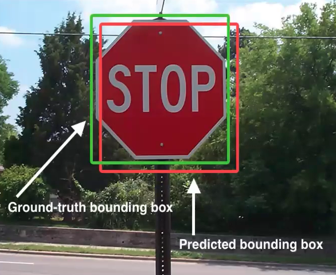

## Type of ML Systems

- Supervised Learning
- Unsupervised Learning
- Semi-supervised Learning
- Reinforcement Learning
- Batch and Online Learning
  - Whether system can learn on the fly
- Instance-based and Model-based Learning
  - Comparing data points or detect patterns in training data to build a predictive model

## Evaluation Metrics

### Interesction over Union (IoU)

- a metric used for the evaluation of object detection detectors
- how good is the predicted bounding box for an object detected closely matches.

$$ IoU = \frac{Area\ of\ Overlap}{Area\ of\ Union} $$

## Digital Image

- made of picture elements (pixels)
- an array or a matrix of Pixels arranges in columns and rows
- Each Pixel has its own intesity value, or brightness
- Intensity values in digital images are defined by bits.
  - 8 bits image = 256 (2^8) intensity values (0-255)
- Black & White images have a single 8-bits intensity range.
