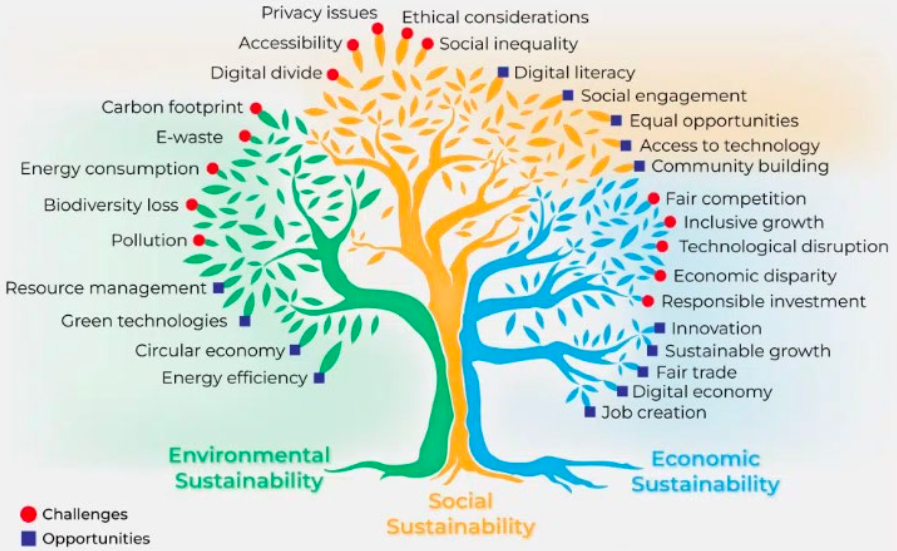

## Push & Pull Factors

- Techonology - Push (Supply-side Pushing Innovation)
- Demand - Pull (Demand-side Pulling Innovation)

| Technology Push | Demand Pull |
| --- | --- |
| Starts with Scientific Breakthrough | Starts with Customer need |
| iPad | Zoom (COVID-19) |
| VR Headset | Selfie Stick |
| Post-it Notes | Tesla Model 3 |

## Disruptive Innovation

- Creative Destruction
  - a process by which new innovations and technological advancements ("creative")
  - desmantle long-standing economic structures, practices, and organizations ("destruction")
  - while creating new markets and opportunities
- Disruptive Innovation
  - a process where a smaller company successfully challenges estabilished businesses bgy offering simpler, more affordable, or more accessible products or services.
  - low-cast, low-performance, alternative, improve over time and displace established playwers
- Innovator's Dilemma
  - successful, well-managed companies often fail when disuptive technologies emerge
  - even when they do everything "right" according to traditional management principles.

| Sustaining Innovation | Disruptive Innovation |
| --- | --- |
| Improves existing products | Creates new markets or value |
| Higher margins | Initially lower margins |
| High-end customers | Low-end market segments |

- Sustaining Innovation: Tesla improving battery range
- Disruptive Innovation: Netflix replacing Blockbuster

## Attention Economy

- Human attention a scarce resource
- The attention economy is made up of anything trying to capture our limited attention.

## Responsible Innovation

- Innovation can create benefits (growth, efficiency, solutions) but also risks (inequality, pollution, privacy loss).
- Responsible Innovation is about developing new techonologies, products, or services in a way that is ethically acceptatble, socially desirable, and environmentally sustainable, while actively considering their potential impacts on society.

- **Anticipation**: Exploring possible risks, unintended consequences, and long-term effects.
- **Reflexivity**: Innovators reflecting on their own values, assumptions, and biases.
- **Inclusion**: Engaging stakeholders (citizens, users, regulators, communities), not just engineers or investors shaping outcomes.
- **Responsiveness**: Ability to change direction if concerns arise.

| Product questions | Process questions | Purpose questions |
| --- | --- | --- |
| How will the risks and benefits be distributed? | How should standards be drawn up and applied? | Why are researchers doing it? |
| What other impacts can we anticipate? | How should risks and benefits be defined and measured? | Are these motivations transparent and in the public interest? |
| How might these change in the future? | Who is in control? | Who will benefit? |
| What don't we know about? | Who is taking part? | What are they going to gain? |
| What might we never know about? | Who will take responsibility if things go wrong? | What are the alternatives? |
| - | How do we know we are right? | - |

## Sustainability

- No poverty
- Zero hunger
- Good health and Well-being
- Quality education
- Gender equality
- Clean water and Sanitation
- Affordable and Clean energy
- Decent work and Econnomic growth
- Industry, Innovation and Infrastructure
- Reduced Inequalities
- Sustainable Cities and Communities
- Responsible consumption and Production
- Climate action
- Life below water
- Life on land
- Peace, Justice, and Strong Institutions
- Partnerships for the goals

## Sustainability Dilemma

### Externailities

> Impacts on third parties

- **Ecology / Environmental**
  - Bio-diversity
  - Habitat loss
  - Pollution
  - Carbon footprint
- **Social - human side**
  - Human trafficking
  - Working conditions
  - Child labour
  - Social cohesion
  - Addiction and psychological damages

## Internal Perspectives

- **Economic - Business sustainability**
  - Solvency
  - Regulations
  - Management
  - Succession planning
  - Disaster management
  - Short-term thinking / goals
  - Fiduciary obligations to Shareholders
