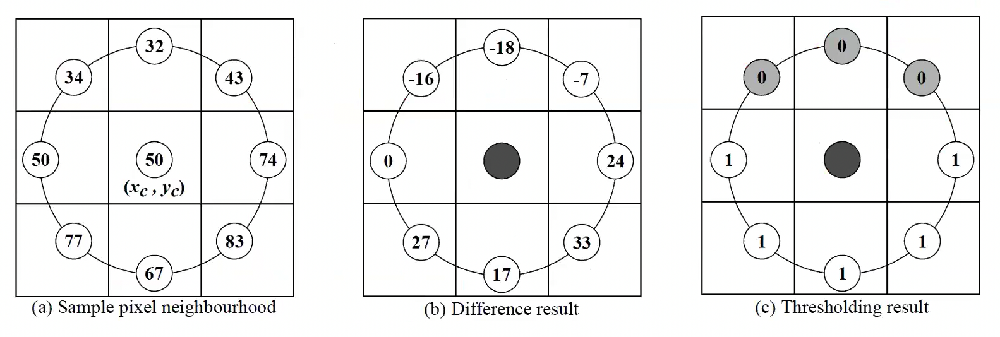
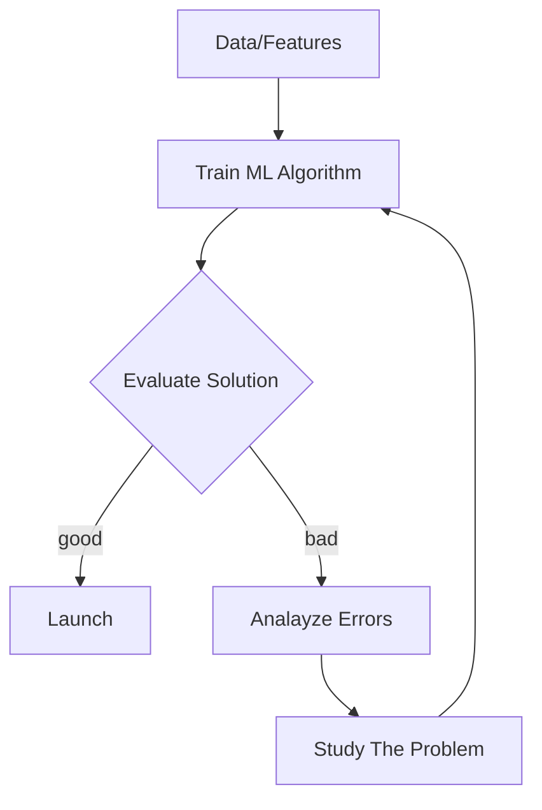

## Image Gradient

- It is a directional change in the intensity or color in an image.
- can be used to extract valuable information from images.
- commonly used in edge detection.
- ➡️ Change is X-directions, ⬇️ Change is Y-directions.
- Combining both X and Y diretion to estimate if changes are in both directions.

### HoG, Histogram of Oriented Gradient

> To find edge and shape of the object in the image

- **Computing Image Gradient**
  - Use the horizontal and vertical filters to compute gradient values
- **Compute the strength/magnitude and direction of gradient**
  - Strength/Magnitude(g): $\sqrt{g_x^2 + g_y^2}$
  - Direction($\theta$): $\tan^{-1}(g_y / g_x)$
- **Create orientation histogram**
  - Divide the image into small connected regions called *Cells* which is a 8x8 patch
  - Create cell histogram based on gradient direction and magnitude
  - 64 (8x8) gradient vectors are put into a 9-bin histogram.
  - The bins are the gradient directions ($\theta$) quantized into 9-bins
- **Block Normalization**
  - 16x16 pixels blocks or 22 cells are used for normalization, which has 4 histograms.
  - Normalization will make it scale/multiplication invariant
  - Each block will represent 36x1 element vector
- Intensity: brightness of the pixel
- Saturation: HSV color space, the amount of gray in the color
- **Calculate the HoG feature vector**
  - Each of the 36x1 vectors in each blocks are concatenated into one big vector
  - Size of the vector will be 36xN, where N is the number of blocks in the image
- Hog feature extractor

## LBP, Local Binary Pattern

> To describe the image textures

$$LBP_{P,R}(x_c, y_c) = \sum_{p=0}^{P-1} s(g_p - g_c) \cdot 2^p$$

- An eifficient texture operator which labels each pixels of an image by thresholding their neighbours.
- A powerful feature for texture classification
- LBP operator is to describe the image textures using two measures namely, local spatial patterns and the gray scale constract of its strength.
- $S(x)$ is a thresholding function
- $(x_c, y_c)$ is the center pixel in the 8 pixel neighbourhood
- $g_c$ is gray level of the center pixel
- $g_p$ is gray value of a smpling point in an equally spaced circular neighbourhood of P sampling points and radius R around the point $(x_c, y_c)$

1. Sample pixel neighbourhood
2. Difference result
3. Thresholding result

## ANN

