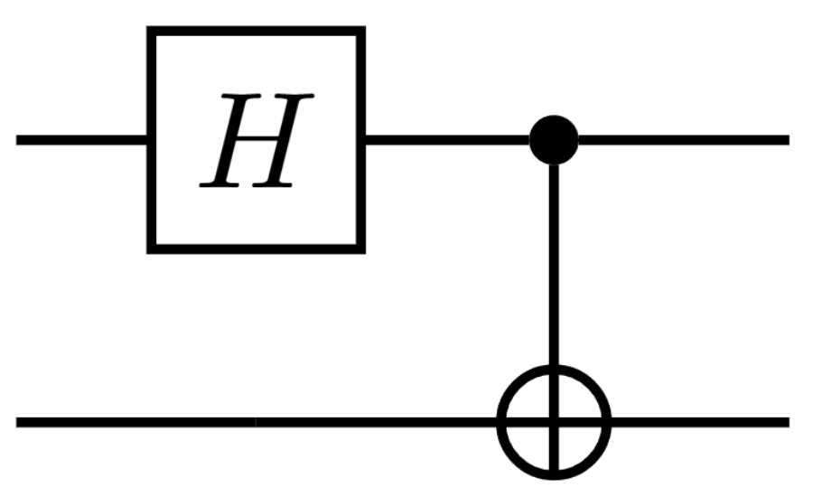
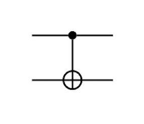
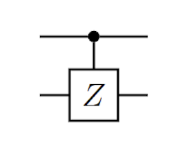
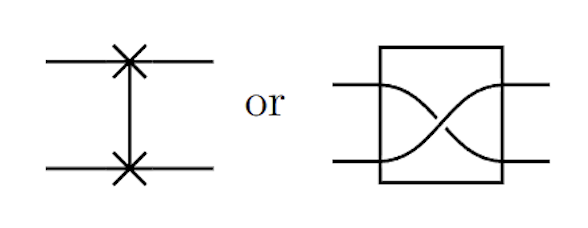
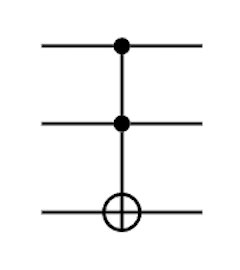

## Tensor Products

> Kronecker product

- a way to multiply vectors and matrices to generate bigger vectors and matrices

$$ |\psi\rangle \otimes |\phi\rangle = \begin{pmatrix} \psi_0 \\ \psi_1 \end{pmatrix} \otimes \begin{pmatrix} \phi_0 \\ \phi_1 \end{pmatrix} = \begin{pmatrix} \psi_0 \begin{pmatrix} \phi_0 \\ \phi_1 \end{pmatrix} \\  \\ \psi_1 \begin{pmatrix} \phi_0 \\ \phi_1 \end{pmatrix}  \end{pmatrix} = \begin{pmatrix} \psi_0 \phi_0 \\ \psi_0 \phi_1 \\ \psi_1 \phi_0 \\ \psi_1 \phi_1 \end{pmatrix} $$

$$ |\psi\rangle \otimes |\phi\rangle  \equiv |\psi\rangle |\phi\rangle \equiv|\psi\phi\rangle $$

### Tensor product of Matrices

$$ A \otimes B = \begin{pmatrix} a_{00}B & a_{01}B \\ a_{10}B & a_{11}B \end{pmatrix} $$

- The tensor product $|0\rangle \langle1| \otimes |1\rangle \langle0|$ is:

$$ |0\rangle \langle 1| \otimes |1\rangle \langle 0| = \begin{pmatrix} 0 & 1 \\ 0 & 0 \end{pmatrix} \otimes \begin{pmatrix} 0 & 0 \\ 1 & 0 \end{pmatrix}$$

$$ |0\rangle \langle 1| \otimes |1\rangle \langle 0| = \begin{pmatrix} 0 \cdot \begin{pmatrix} 0 & 0 \\ 1 & 0 \end{pmatrix} & 1 \cdot \begin{pmatrix} 0 & 0 \\ 1 & 0 \end{pmatrix} \\ 0 \cdot \begin{pmatrix} 0 & 0 \\ 1 & 0 \end{pmatrix} & 0 \cdot \begin{pmatrix} 0 & 0 \\ 1 & 0 \end{pmatrix} \end{pmatrix} = \begin{pmatrix} 0 & 0 & 0 & 0 \\ 0 & 0 & 1 & 0 \\ 0 & 0 & 0 & 0 \\ 0 & 0 & 0 & 0 \end{pmatrix} $$

- To short hand this, we can write:

$$ |0\rangle \langle 1| \otimes |1\rangle \langle 0| \equiv |0\rangle|1\rangle \langle 1|  \langle 0| \equiv |01\rangle \langle 10| $$
- $(|a\rangle \langle b|) \otimes (|c\rangle \langle d|) = (|a\rangle |c\rangle)(\langle b| \langle d|) = |ac\rangle \langle bd|$

## Bases

- The basis for a single qubit is $\{|0\rangle, |1\rangle\}$
- It is given by taking the tensor product of the basis for each qubit:
  - $\{|0\rangle \otimes |0\rangle, |0\rangle \otimes |1\rangle, |1\rangle \otimes |0\rangle, |1\rangle \otimes |1\rangle\}$
  - For short hand, we write $\{|00\rangle, |01\rangle, |10\rangle, |11\rangle\}$
- The computational basis for two qubits is $\{|00\rangle, |01\rangle, |10\rangle, |11\rangle\}$
- For three qubits $\{|000\rangle, |001\rangle, |010\rangle, |011\rangle, |100\rangle, |101\rangle, |110\rangle, |111\rangle\}$ 

### Matrices

$$ \{|0\rangle\langle0|,\; |0\rangle\langle1|,\; |1\rangle\langle0|,\; |1\rangle\langle1|\} $$

- forms a basis for the space of $2 \times 2$ matrices
- **operator basis**: a set of matrices that can be used to express any matrix as a linear combination of the basis matrices

$$ \begin{pmatrix} a & b \\ c & d \end{pmatrix} = a |0\rangle\langle0| + b |0\rangle\langle1| + c |1\rangle\langle0| + d |1\rangle\langle1| $$

- One of the basis elements is: $|0\rangle\langle0| \otimes |0\rangle\langle0| = |00\rangle\langle00|$
- Similarly $|0\rangle\langle0| \otimes |0\rangle\langle1| = |00\rangle\langle01|$
- In total, the tensor products yields $4 \times 4 = 16$ basis elements for the space of $4 \times 4$ matrices: $\{|00\rangle\langle00|,\; |00\rangle\langle01|,\; |00\rangle\langle10|,\; |00\rangle\langle11|,\; |01\rangle\langle00|,\; |01\rangle\langle01|,\; \ldots,\; |11\rangle\langle11|\}.$

## The Golden Rule of Tensor Products

> What starts on the **left** of the tensor product says on the **left**

$$ (A \otimes B)(|\psi\rangle \otimes |\phi\rangle) = (A|\psi\rangle) \otimes (B|\phi\rangle) $$

$$ (|0\rangle\langle0| \otimes |1\rangle\langle1|)(|00\rangle) \\ = (|0\rangle\langle 0| \otimes |1\rangle\langle1|)(|0\rangle \otimes |0\rangle) \\ \\ = (|0\rangle\langle0||0\rangle) \otimes (|1\rangle\langle1||0\rangle) \\ = |0\rangle \otimes 0 \\ = 0 $$

- $ |\psi\rangle \otimes |\phi\rangle \equiv |\psi\rangle|\phi\rangle \equiv |\psi\phi\rangle$
- $(|\psi\rangle \otimes |\phi\rangle)^\dagger = \langle\psi| \otimes \langle\phi| $
- $(\alpha|\psi\rangle + \beta|\phi\rangle) \otimes |\omega\rangle = \alpha|\psi\rangle \otimes |\omega\rangle + \beta|\phi\rangle \otimes |\omega\rangle $
- $((\langle\psi| \otimes \langle\phi|)(|\omega\rangle \otimes |\eta\rangle)) = \langle\psi|\omega\rangle \langle\phi|\eta\rangle$
- $(A + B) \otimes C = A \otimes C + B \otimes C$
- $A \otimes (B + C) = A \otimes B + A \otimes C$
- $(A \otimes B)(C \otimes D) = AC \otimes BD$
- $(A \otimes B)^\dagger = A^\dagger \otimes B^\dagger$

## Entanglement

- Single-qubit state is a two dimensional vector: $ |\psi\rangle = \alpha|0\rangle + \beta|1\rangle $
- where $\alpha$ and $\beta$ are complex numbers such that $\||\psi\rangle\|^2 = |\alpha|^2 + |\beta|^2 = 1$
- Two qubits $\psi_1\rangle$ and $\psi_2\rangle$ can be combined to form a four-dimensional vector: $ |\psi_{12}\rangle = |\psi_1\rangle \otimes |\psi_2\rangle \equiv |\psi_1\rangle|\psi_2\rangle \equiv |\psi_1\psi_2\rangle$
- **Separable States**: can be written as a tensor product of single-qubit states
  - $|\Psi\rangle = \alpha_{00} |00\rangle + \alpha_{01} |01\rangle + \alpha_{10} |10\rangle + \alpha_{11} |11\rangle \\ = |\psi_1\rangle| \otimes \psi_2\rangle$
- if the state is not separable, it is called **entangled**.
  - **entangled**: $\frac{1}{\sqrt{2}}(|00\rangle + |11\rangle)$
- if $ad = 0$ and $bc = 0$, then $ac$ or $bd$ must also vanish.
  - **separable**: $\frac{1}{2}(|00\rangle + |01\rangle) = |0\rangle \otimes \frac{1}{\sqrt{2}}(|0\rangle + |1\rangle)$

## Two-Qubit Gates

- Two-qubit gates are $4 \times 4$ unitary matrices that act on two-qubit states.

### CNOT Gate

> Controlled NOT gate

- flips target if control is $|1\rangle$

$$ \text{CNOT} = \begin{pmatrix} 1 & 0 & 0 & 0 \\ 0 & 1 & 0 & 0 \\ 0 & 0 & 0 & 1 \\ 0 & 0 & 1 & 0 \end{pmatrix} = |0\rangle\langle0| \otimes \mathbb I + |1\rangle\langle1| \otimes X $$

### SWAP Gate

- Exchanges the two qubits.

$$ \text{SWAP} = \begin{pmatrix} 1 & 0 & 0 & 0 \\ 0 & 0 & 1 & 0 \\ 0 & 1 & 0 & 0 \\ 0 & 0 & 0 & 1 \end{pmatrix} $$

### CZ Gate

> Controlled Z gate

- Applies $Z$ to target if control is $|1\rangle$

$$ \text{CZ} = \begin{pmatrix} 1 & 0 & 0 & 0 \\ 0 & 1 & 0 & 0 \\ 0 & 0 & 1 & 0 \\ 0 & 0 & 0 & -1 \end{pmatrix}$$

## Building Multi-Qubit Gates

- Two qubits $|\psi_1\rangle$ and $|\psi_2\rangle$ can be combined to form a four-dimensional vector:
  - if $U_1$ and $U_2$ are single-qubit gates, then $U_1 \otimes U_2$ is a two-qubit gate that acts on the combined state $|\psi_1\rangle \otimes |\psi_2\rangle$.
  - $(U_1 \otimes U_2)(|\psi_1\rangle \otimes |\psi_2\rangle) = (U_1|\psi_1\rangle) \otimes (U_2|\psi_2\rangle)$
  - For shorthand, $U_1 U_2|\psi_1\psi_2\rangle$

### Order of Operations

- When gates act independently, it doesn't matter the order in which they are apply with the understanding that if only a single gate is applied, identity acts on the other qubits.

$$ (U_1 \otimes U_2) = (\mathbb I \otimes U_2)(U_1 \otimes \mathbb I) = (U_1 \otimes \mathbb I)(\mathbb I \otimes U_2) $$
- Example: Apply $X$ to qubit 1 and $H$ to qubit 2, starting with $|00\rangle$:
- $ (X \otimes \mathbb I)|00\rangle = |10\rangle$
- $ (\mathbb I \otimes H)|10\rangle \\ = (\mathbb I \otimes H)(|1\rangle \otimes |0\rangle) \\ = |1\rangle \otimes H|0\rangle \\ = |1\rangle \otimes \frac{1}{\sqrt{2}}(|0\rangle + |1\rangle) \\ = \frac{1}{\sqrt{2}}(|1\rangle \otimes |0\rangle + |1\rangle \otimes |1\rangle) \\ = \frac{1}{\sqrt{2}}(|10\rangle + |11\rangle) $

## Quantum Circuits

- A quantum program is a sequance of gates applied to qubits, which are typically assumed  to be initialized in the state $|0\rangle$.
- Two qubits start in the state $|0\rangle \otimes |0\rangle = |00\rangle$

$$CNOT(H \otimes \mathbb I)|00\rangle = CNOT\left(\frac{1}{\sqrt{2}}(|00\rangle + |10\rangle)\right) = \frac{1}{\sqrt{2}}(|00\rangle + |11\rangle)$$

| Name | Gates | Matrix |
| --- | --- | --- |
| Pauli-X | $X$ or $\oplus$ | $\begin{pmatrix} 0 & 1 \\ 1 & 0 \end{pmatrix}$ |
| Pauli-Y | $Y$ | $\begin{pmatrix} 0 & -i \\ i & 0 \end{pmatrix}$ |
| Pauli-Z | $Z$ | $\begin{pmatrix} 1 & 0 \\ 0 & -1 \end{pmatrix}$ |
| Rotation-X | $R_x(\theta)$ | $\begin{pmatrix} \cos\frac{\theta}{2} & -i\sin\frac{\theta}{2} \\ -i\sin\frac{\theta}{2} & \cos\frac{\theta}{2} \end{pmatrix}$ |
| Rotation-Y | $R_y(\theta)$ | $\begin{pmatrix} \cos\frac{\theta}{2} & \sin\frac{\theta}{2} \\ -\sin\frac{\theta}{2} & \cos\frac{\theta}{2} \end{pmatrix}$ |
| Rotation-Z | $R_z(\theta)$ | $\begin{pmatrix} e^{i\theta/2} & 0 \\ 0 & e^{-i\theta/2} \end{pmatrix}$ |
| Phase Shift | $Ph(\delta)$ | $\begin{pmatrix} 1 & 0 \\ 0 & e^{i\delta} \end{pmatrix}$ |
| Hadamard | $H$ | $\frac{1}{\sqrt{2}}\begin{pmatrix} 1 & 1 \\ 1 & -1 \end{pmatrix}$ |
| Phase | $S$ | $\begin{pmatrix} 1 & 0 \\ 0 & i \end{pmatrix}$ |
| T | $T$ | $\begin{pmatrix} 1 & 0 \\ 0 & e^{i\pi/4} \end{pmatrix}$ |

- $S = Ph(\pi/2)$
- $T = Ph(\pi/4)$
- $Z = Ph(\pi)$

### Multi-Qubit Gates

| Name | Gates | Matrix |
| --- | --- | --- |
| CNOT |  | $\begin{pmatrix} 1 & 0 & 0 & 0 \\ 0 & 1 & 0 & 0 \\ 0 & 0 & 0 & 1 \\ 0 & 0 & 1 & 0 \end{pmatrix}$ |
| CZ |  | $\begin{pmatrix} 1 & 0 & 0 & 0 \\ 0 & 1 & 0 & 0 \\ 0 & 0 & 1 & 0 \\ 0 & 0 & 0 & -1 \end{pmatrix}$ |
| SWAP |  | $\begin{pmatrix} 1 & 0 & 0 & 0 \\ 0 & 0 & 1 & 0 \\ 0 & 1 & 0 & 0 \\ 0 & 0 & 0 & 1 \end{pmatrix}$ |
| Toffoli |  | $\begin{pmatrix} 1 & 0 & 0 & 0 & 0 & 0 & 0 & 0 \\ 0 & 1 & 0 & 0 & 0 & 0 & 0 & 0 \\ 0 & 0 & 1 & 0 & 0 & 0 & 0 & 0 \\ 0 & 0 & 0 & 1 & 0 & 0 & 0 & 0 \\ 0 & 0 & 0 & 0 & 1 & 0 & 0 & 0 \\ 0 & 0 & 0 & 0 & 0 & 1 & 0 & 0 \\ 0 & 0 & 0 & 0 & 0 & 0 & 0 & 1 \\ 0 & 0 & 0 & 0 & 0 & 0 & 1 & 0 \end{pmatrix}$ |

- **CNOT** gate can be $|0\rangle\langle0| \otimes \mathbb I + |1\rangle\langle1| \otimes X$ 
  - $|0\rangle \text{state} \rightarrow \mathbb I$ (do nothing)
  - $|1\rangle \text{state} \rightarrow X$ (flip the target)
- Larger gates can be **built from smaller ones**
- **Toffoli gate** (CCNOT): flips the target if both controls are $|1\rangle$.
- $\text{Toffoli} = |00\rangle\langle00| \otimes \mathbb I_4 + |11\rangle\langle11| \otimes X$
  - two control qubits and one target qubit
  - if both control qubits are $|1\rangle$, then apply $X$
  - $|110\rangle \rightarrow |111\rangle$
  - $|111\rangle \rightarrow |110\rangle$
- Can be generalized to $n$-qubits: $C^{n-1}NOT$ gate, which flips the target if all $n-1$ control qubits are $|1\rangle$.
  - **CNOT**: $|10\rangle \rightarrow |11\rangle$ and $|11\rangle \rightarrow |10\rangle$
  - **Toffoli**: $|110\rangle \rightarrow |111\rangle$ and $|111\rangle \rightarrow |110\rangle$
  - **3-control gate**: $|1110\rangle \rightarrow |1111\rangle$ and $|1111\rangle \rightarrow |1110\rangle$

$$(\mathbb I - |111\ldots\rangle\langle 111\ldots|)\otimes \mathbb I + |111\ldots\rangle\langle 111\ldots|\otimes U$$

## The Rules of Quantum Computing

### Initialization

- An $n$-qubit computation starts in the all-zero state:

$$ |phi\rangle = |0\rangle \otimes |0\rangle \otimes \ldots \otimes |0\rangle = |00\ldots0\rangle $$

### Algorithm

- Apply a sequence of unitary gates to obtain the final state:

$$ U = U_1U_2\ldots U_m \implies U|\psi\rangle $$

### Measurement

> The Born Rule

- Reading $n$ qubits producs $n$ classical bits.
- The probability of outcome $b_1b_2\ldots b_n$:

$$ Pr(b_1b_2\ldots b_n) = |\langle b_1b_2\ldots b_n|\psi\rangle|^2 $$

- $|\psi\rangle$: initial state of the system
- $U$: an unitary matrix summing up the gates applied to the system
- $U|\psi\rangle$: final state of the system
- $\langle b_1b_2\ldots b_n|U|\psi\rangle$: the amplitude of the outcome $b_1b_2\ldots b_n$
- $|\text{amplitude}|^2$: The probability of the outcome $b_1b_2\ldots b_n$ being observed when measuring the system
  - if $\frac{1}{\sqrt{2}}(|00\rangle + |11\rangle)$
  - then $Pr(00) = Pr(11) = \frac{1}{2}$

## Post-measurement States

> Measurement causes the state to collapse

- **Measuring all qubits**: outcome $b_1 \ldots b_n$ collapses state to $|b_1 \ldots b_n\rangle$
- **Measuring a subset**: keep matching terms and renormalize.

$$ |\psi\rangle = c_{00\ldots0}|00\ldots0\rangle + c_{00\ldots1}|00\ldots1\rangle + \ldots + c_{11\ldots1}|11\ldots1\rangle $$
- If we measure all qubits, we get outcome $b_1b_2\ldots b_n$
  - The state will collapse to $|\psi'\rangle = |b_1b_2\ldots b_n\rangle$
  - The probability of this outcome is $Pr(b_1b_2\ldots b_n) = |\langle b_1b_2\ldots b_n|\psi\rangle|^2$

$$ |\psi\rangle = \alpha|00\rangle + \beta|01\rangle + \gamma|10\rangle + \delta|11\rangle $$
- If we measure only the first qubit, and get outcome $0$, the state maintains only terms with $0$ in the first position:
  - $|00\rangle$ and $|01\rangle$
  - The remaining state is $|\psi'\rangle = \alpha|00\rangle + \beta|01\rangle$
  - $|10\rangle$ and $|11\rangle$ are removed from the state
- This gives us the unnormalized state: $ |\psi'\rangle_{unnorm} = \alpha|00\rangle + \beta|01\rangle$
- The probability of this outcome is $Pr(0) = |\alpha|^2 + |\beta|^2$
  - $|00\rangle$ and $|01\rangle$ are the only terms that contribute to the probability of outcome $0$ for the first qubit
- After measurement, the state must be $\||\psi\|^2 = 1$, so we need to renormalize the state:

$$|\psi'\rangle = \frac{(\alpha|00\rangle + \beta|01\rangle)}{\sqrt{|\alpha|^2 + |\beta|^2}}$$

## QASM2.0

| Quantum Gate | QASM Equivalent | Description |
|--|--|--|
| $R_x(\theta)$| rx | Rotation around X-axis: `rx(pi/2) q[0];` |
| $R_y(\theta)$| ry | Rotation around Y-axis: `ry(0) q[0];` |
| $R_z(\theta)$| rz | Rotation around Z-axis: `rz(pi) q[0];` |
| $X$ | x | Pauli-gate bit  flip: `x q[0];`|
| $Z$ | z | Pauli-gate phase flip: `z q[0];` |
| $XZ$ | y | Pauli-gate bit+phase flip: `y q[0];` |
| $H$ | h | Hadamard gate: `h q[0];` |
| $CNOT$| cx  | Controlled NOT gate: `cx q[0], q[1];`|
| $SWAP$| swap| Swap two qubit registers: `swap q[0], q[1];` |
| $CZ$ | cz | Controlled $Z$ gate: `cz q[0], q[1];` |
