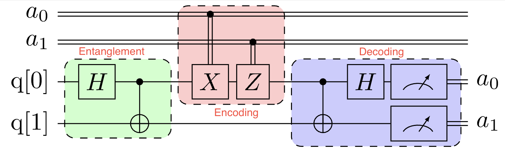

## Superdense Coding

- counterintuitive protocol that allows us to send 2 bits of classical information by sending only 1 qubit, using pre-shared entanglement
- it's often contextualized as a game with Alice and Bob.
- Alice and Bob share and entangled pair of qubits
- Pre-shared Entanglement (Shared **Bell pair**)
  - $|\Phi^+\rangle = \frac{1}{\sqrt{2}}(|00\rangle + |11\rangle)$
- Alice wants to send 2 bits of classical information (*00, 01, 10, or 11*) to Bob
  - For **00**: Apply Identity $I$ (do nothing)
  - For **01**: Apply Pauli-X $X$ (bit flip)
  - For **10**: Apply Pauli-Z $Z$ (phase flip)
  - For **11**: Apply $XZ$ (bit and phase flip)
- Alice sends her one qubit to Bob (Bob possesses both qubits of the entangled pair)
- Bob decodes the information
  - Inverts the entanglement operation on the two qubits
  - Measures each of the qubits
  - The outcome of this measurement reveals the two bits Alice encoded.

### Superdense Coding Circuit

## Channels

- **Classical Channel**: carries bits (fibre, radio, paper, ...)
- **Quantum Channel**: carries qubits (can also carry bits)
  - Quantum channels can emulate classical ones, but not vice versa
- **Teleportation**: `classical channel + pre-shared entanglement -> effective quantum channel`

## Quantum programming languages

- QASM
- Qiskit
- Cirq
- Pennylane
