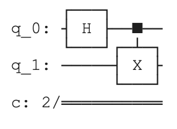
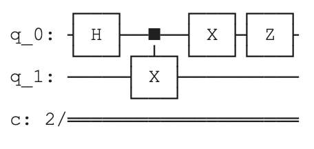
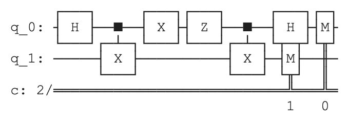
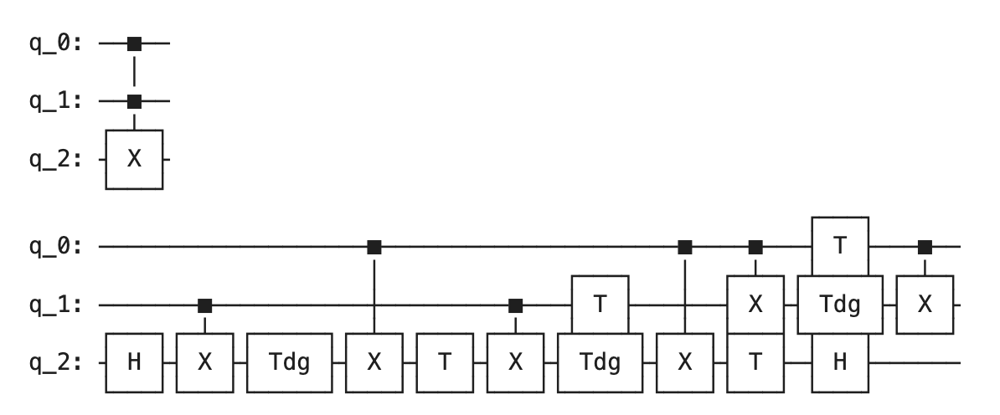
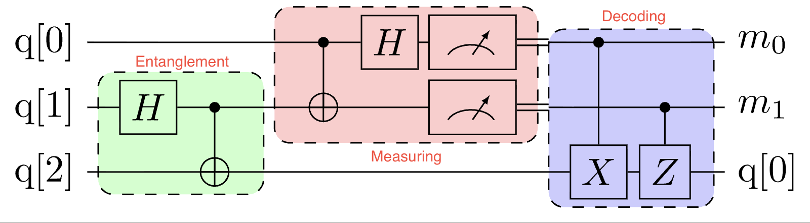

## Superdense Coding

- counterintuitive protocol that allows us to send 2 bits of classical information by sending only 1 qubit, using pre-shared entanglement
- it's often contextualized as a game with Alice and Bob.
- Alice and Bob share and entangled pair of qubits
- Pre-shared Entanglement (Shared **Bell pair**)
  - $|\Phi^+\rangle = \frac{1}{\sqrt{2}}(|00\rangle + |11\rangle)$
- Alice wants to send 2 bits of classical information (*00, 01, 10, or 11*) to Bob
  - For **00**: Apply Identity $I$ (do nothing)
  - For **01**: Apply Pauli-X $X$ (bit flip)
  - For **10**: Apply Pauli-Z $Z$ (phase flip)
  - For **11**: Apply $XZ$ (bit and phase flip)
- Alice sends her one qubit to Bob (Bob possesses both qubits of the entangled pair)
- Bob decodes the information
  - Inverts the entanglement operation on the two qubits (CNOT followed by Hadamard)
  - Measures each of the qubits
  - The outcome of this measurement reveals the two bits Alice encoded.
- **$|\Phi^+\rangle$**: is the most common and convenient form (Bell State) of entanglement and is also *maximally entangled* state despite single-qubit unitary gates.
  - Easy to build circuits for it
  - Symmetric and has nice properties that make it ideal for protocols like superdense coding and teleportation
  - Other Bell states can be generated from $|\Phi^+\rangle$ by applying single-qubit gates.

### Superdense Coding Circuit


- Alice's message $mn$, where each of $m$ and $n$ is a bit (0 or 1)
- Alice's operation can be represented as $Z^m X^n \otimes \mathbb{I} | \Phi^+\rangle$
  - $m=0 \Rightarrow Z^0 = I$ (no phase flip)
  - $m=1 \Rightarrow Z^1 = Z$ (phase flip)
  - $n=0 \Rightarrow X^0 = I$ (no bit flip
  - $n=1 \Rightarrow X^1 = X$ (bit flip)
  - $00 \rightarrow I$
  - $01 \rightarrow X$
  - $10 \rightarrow Z$
  - $11 \rightarrow ZX$
- $Z^m|b\rangle = (-1)^{mb}|b\rangle$ (phase flip)
- $X^n|a\rangle = |a \oplus n\rangle$ (xor operation)

$$X^n \left(\frac{1}{\sqrt{2}} (|00\rangle + |11\rangle)\right) = \frac{1}{\sqrt{2}} \left( |n0\rangle + |(1\oplus n)1\rangle \right)$$

- $n=0$: $\frac{1}{\sqrt{2}} (|00\rangle + |11\rangle) = |\Phi^+\rangle$
- $n=1$: $\frac{1}{\sqrt{2}} (|10\rangle + |01\rangle)$

$$Z^m X^n \left(\frac{1}{\sqrt{2}} (|00\rangle + |11\rangle)\right) = \frac{1}{\sqrt{2}} \left( (-1)^{mn}|n0\rangle + (-1)^{m(1\oplus n)}|(1\oplus n)1\rangle \right)$$

- $|n0\rangle$: first qubit is $n$, $(-1)^{mn}$ is the phase factor
- $|(1\oplus n)1\rangle$: first qubit is $1\oplus n$, $(-1)^{m(1\oplus n)}$ is the phase factor
- Bob's decoding operation is the inverse of the entanglement operation
  - $CNOT |a\rangle |b\rangle = |a\rangle |a \oplus b\rangle$

$$
\begin{aligned}
CNOT\, Z^m X^n \left(\frac{1}{\sqrt{2}} (|00\rangle + |11\rangle)\right)
&= \frac{(-1)^{mn}}{\sqrt{2}} \left(|nn\rangle + (-1)^m|(1 \oplus n)n\rangle\right) \\
&= \frac{(-1)^{mn}}{\sqrt{2}} \left(|n\rangle + (-1)^m|1 \oplus n\rangle\right)|n\rangle
\end{aligned}
$$

- which is seperable state.
- First qubit is $|n\rangle + (-1)^m|1 \oplus n\rangle$ and second qubit is $|n\rangle$.
- $n, m \in \{0, 1\}$, then apply Hadamard to the first qubit:

$$
H\, \frac{1}{\sqrt{2}} \left(|n\rangle + (-1)^m|1 \oplus n\rangle\right) = (-1)^{mn}|m\rangle
$$

- second qubit is $|n\rangle$, so the final state is:

$$(-1)^{mn}(-1)^{nm}|m\rangle|n\rangle = |mn\rangle$$

### Superdense QASM

```qasm
OPENQASM 2.0;
qreg q[2];
creg c[2];

// Prepare Bell pair
h q[0];
cx q[0],q[1];

// Alice's encoding
// For message 11: apply X and Z
x q[0];
z q[0];

// Alice sends q[0] to Bob (in simulation, we just proceed)

// Bob's decoding
cx q[0],q[1];
h q[0];

// Measure both qubits
measure q[0] -> c[0];
measure q[1] -> c[1];
```

## QASM Programming

### Custom Gates

```qasm
// params: parameters for the gate (e.g., rotation angles)
// q_args: quantum arguments (qubits the gate acts on)
gate NAME(parameters) q_args {
  // Define gate operations
}

gate bell a,b {
  h a;
  cx a,b;
}

qreg q[2];
creg c[2];

// Use the custom bell gate
bell q[0], q[1];

// Measure the qubits
measure q[0] -> c[0];
measure q[1] -> c[1];
```

### Toffoli Gate

```qasm
// Toffoli gate (CCX)
gate ccx a, b, c {
  h c;
  cx b, c;
  tdg c;
  cx a, c;
  t c;
  cx b, c;
  tdg c;
  cx a, c;
  t b;
  t c;
  cx a, b;
  h c;
  t a;
  tdg b;
  cx a, b;
}
```

### Rotation Gates

```qasm
// Rotation around Y-axis
gate ry_deg(theta) q {
  ry(theta/180 * pi) q;
}

// Rotation around X-axis
gate rx_deg(theta) q {
  rx(theta/180 * pi) q;
}
```

## Qiskit

> IBM

```python
import qiskit

superdense = qiskit.QuantumCircuit(2, 2)
superdense.draw()

superdense.h(0)
superdense.cx(0, 1)
superdense.draw()
```



```python
# Alice's encoding for message '11'
superdense.x(0)
superdense.z(0)
superdense.draw()
```



```python
# Bob unentangles the two qubits (reverses the entangling gate)
superdense.cx(0,1)
superdense.h(0)

# The measurement pattern is `measure(qubit to measure, classical bit to store result)`
superdense.measure(0,0)
superdense.measure(1,1)
superdense.draw()
```



```python
from qiskit.providers.basic_provider import BasicSimulator

sim = BasicSimulator()
# run the circuit on the simulator with 1 shot (execute the circuit once)
result = sim.run(superdense, shots=1).result().get_counts()

print(result)
# {'11': 1}
```

### Custom Gates in Qiskit

```python
bell = qiskit.QuantumCircuit(2, name='bell')
bell.h(0)
bell.cx(0, 1)
bell_gate = bell.to_gate()

c = qiskit.QuantumCircuit(2)
c.append(bell_gate, [0, 1])
c.draw()
```

### Decompose a custom gate

```python
ccxgate = qiskit.circuit.library.CCXGate()
ccx = qiskit.QuantumCircuit(3)
ccx.append(ccxgate, [0, 1, 2])

print(ccx)
print(ccx.decompose())
```



## Cirq

> Google

```python
import cirq

alice = cirq.NamedQubit('Alice')
bob = cirq.NamedQubit('Bob')

superdense = cirq.Circuit()
superdense.append([
  cirq.H(alice),
  cirq.CNOT(alice, bob),
])

superdense.append([
  cirq.X(alice),
  cirq.Z(alice),
])

superdense.append([
  cirq.CNOT(alice, bob),
  cirq.H(alice),
])

superdense.append(cirq.measure(alice, bob, key='received'))

print(superdense)
```

```python
simulator = cirq.Simulator()
result = simulator.run(superdense, repetitions=1)
print(result)
# received=1, 1
```

## Pennylane

> Xanadu

```python
import pennylane as qml

def entangle():
    qml.Hadamard(wires=0)
    qml.CNOT(wires=[0, 1])

print(qml.draw(entangle)())

device = qml.device("default.qubit", wires=[0, 1])

# Wrap the quantum function as a QNode
entangle_qnode = qml.QNode(my_circuit, device)

# Set the number of shots to 10
entangle_qnode = qml.set_shots(entangle_qnode, shots=10)
```

```python
import numpy as np

state = np.array([1, 1j], dtype=complex)

state = state / np.linalg.norm(state)
```

```python
def teleport(state):
    # Ensure "state" is loaded into the first qubit
    # (otherwise qubits would start in |0>)
    qml.StatePrep(state, wires=0)

    # Shared entanglement between qubits 1 and 2
    qml.Hadamard(wires=1)
    qml.CNOT(wires=[1, 2])

    # Alice's operation:
    # CNOT from Alice's input qubit to her half of the Bell pair,
    # then Hadamard on the input qubit
    qml.CNOT(wires=[0, 1])
    qml.Hadamard(wires=0)

    # Measurement (store the classical outcomes)
    m0 = qml.measure(0)
    m1 = qml.measure(1)

    # Bob's conditional correction operations
    qml.cond(m1, qml.PauliX)(wires=2)
    qml.cond(m0, qml.PauliZ)(wires=2)

    # Return Bob's qubit as a density matrix
    return qml.density_matrix(wires=2)

print(qml.draw(teleport)(state))
```

## Quantum Teleportation


| - | Superdense Coding | Teleportation |
| --- | --- | --- |
| **Consumes** | Entanglement | Entanglement |
| **Sends** | 1 qubit | 2 bits |
| **Transmits** | 2 bits | 1 qubit |

- if there is entanglement:
  - we can use it to send 2 bits of classical information by sending 1 qubit (superdense coding)
  - we can use it to send 1 qubit of quantum information by sending 2 bits of classical information (teleportation)
- Alice wants to send a qubit $|\psi\rangle = \alpha|0\rangle + \beta|1\rangle$ to Bob, but only has a classical channel.

### Protocol

1. Alice and Bob share $|\Phi^+\rangle$ (pre-shared entanglement)
2. Alice applies $CNOT$ (her qubit `->` her Bell half), then $H$, then measures both, obtaining 2 classical bits (00, 01, 10, or 11)
3. Alice sends $mn$ classically to Bob
4. Bob applies $X^n Z^m$ to his qubit, recovering $|\psi\rangle$

- For **00**: Apply Identity $I$ (do nothing)
- For **01**: Apply Pauli-X $X$ (bit flip)
- For **10**: Apply Pauli-Z $Z$ (phase flip)
- For **11**: Apply $XZ$ (bit and phase flip)
- Bob now has a qubit in the state Alice wanted to send $|\psi\rangle$ without Alice ever sending a qubit directly to Bob.

### Teleportation Circuit



$$|\psi\rangle \otimes |\Phi^+\rangle = \left(\alpha |0\rangle + \beta |1\rangle\right) \otimes \frac{1}{\sqrt{2}} \left(|00\rangle + |11\rangle\right)$$

$$|\psi\rangle \otimes |\Phi^+\rangle = \frac{1}{\sqrt{2}} \left(\alpha |0\rangle |00\rangle + \alpha |0\rangle |11\rangle + \beta |1\rangle |00\rangle + \beta |1\rangle |11\rangle\right)$$

- Alice applies a $CNOT$ gate with her qubit $|\psi\rangle$ as control and her half of the Bell pair $|\Phi^+\rangle$ as target.
  - $\beta |1\rangle |00\rangle$ becomes $\beta |1\rangle |10\rangle$ (target flips when control is 1)
  - $\beta |1\rangle |11\rangle$ becomes $\beta |1\rangle |01\rangle$ (target flips when control is 1)

$$\frac{1}{\sqrt{2}} \Big(\alpha |0\rangle |00\rangle + \alpha |0\rangle |11\rangle + \beta |1\rangle |10\rangle + \beta |1\rangle |01\rangle\Big)$$

- Alice then applies a Hadamard gate to her qubit ($|\psi\rangle$).
  - $H|0\rangle = \frac{|0\rangle + |1\rangle}{\sqrt{2}}$
  - $H|1\rangle = \frac{|0\rangle - |1\rangle}{\sqrt{2}}$
- To prepare for measurement, Bell measurement is performed on Alice's two qubits, which can be expressed as:

$$
\begin{aligned}
\frac{1}{\sqrt{2}} \Bigg[&\alpha \left(\frac{|0\rangle + |1\rangle}{\sqrt{2}}\right) \otimes |00\rangle
+ \alpha \left(\frac{|0\rangle + |1\rangle}{\sqrt{2}}\right) \otimes |11\rangle \\
&+ \beta \left(\frac{|0\rangle - |1\rangle}{\sqrt{2}}\right) \otimes |10\rangle
+ \beta \left(\frac{|0\rangle - |1\rangle}{\sqrt{2}}\right) \otimes |01\rangle \Bigg] \\
=\, &\frac{1}{2} \Big[ |00\rangle (\alpha |0\rangle + \beta |1\rangle)
+ |01\rangle (\alpha |1\rangle + \beta |0\rangle) \\
&+ |10\rangle (\alpha |0\rangle - \beta |1\rangle)
+ |11\rangle (\alpha |1\rangle - \beta |0\rangle) \Big]
\end{aligned}
$$

- Alice measures her two qubits, resulting in one of four possible outcomes corresponding to the classical bits $|mn\rangle$ where $m, n \in \{0, 1\}$
  - Alice's two qubits: $|00\rangle, |0 1\rangle, |1 0\rangle, |1 1\rangle$
  - Bob's qubit is in a state that depends on Alice's measurement outcome

$$X^n Z^m |\psi\rangle$$

| mn | Bob's state | Bob applies |
| --- | --- | --- |
| 00 | $\alpha \lvert 0\rangle + \beta \lvert 1\rangle$ | $\mathbb{I}$ |
| 01 | $\alpha \lvert 1\rangle + \beta \lvert 0\rangle$ | $X$ |
| 10 | $\alpha \lvert 0\rangle - \beta \lvert 1\rangle$ | $Z$ |
| 11 | $\alpha \lvert 1\rangle - \beta \lvert 0\rangle$ | $XZ$ |

## Channels

- **Classical Channel**: carries bits (fibre, radio, paper, ...)
- **Quantum Channel**: carries qubits (can also carry bits)
  - Quantum channels can emulate classical ones, but not vice versa
- **Teleportation**: `classical channel + pre-shared entanglement -> effective quantum channel`

## Summary

- In superdense coding, by sending only one qubit and using pre-shared entanglement, Alice can transmit two classical bits of information.
- The operation $X^n \lvert a \rangle = \lvert a \oplus (n \bmod 2) \rangle$ correctly defines the effect of applying the $X$ gate $n$ times.
- The tensor product of two identity operators is the identity operator on the composite space. In symbols, where the subscript is the dimension: $I_2 \otimes I_2 = I_4$.
- The state $\lvert \phi \rangle = \frac{1}{\sqrt{2}}(\lvert 0 \rangle + \lvert 1 \rangle)$ is an eigenstate of the Pauli-$X$ gate with eigenvalue $+1$.
- In the teleportation protocol, the classical communication channel is used to transmit two classical bits from Alice to Bob.
- Three qubits are required for quantum teleportation.
- After the teleportation protocol completes, Bob has a qubit in the state $\lvert \psi \rangle$.
- Of QASM, Qiskit, Cirq, and PennyLane, PennyLane is the only quantum language that spells out the full name of the Hadamard gate for its built-in gates.
