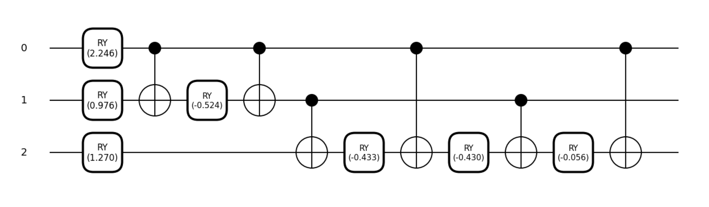
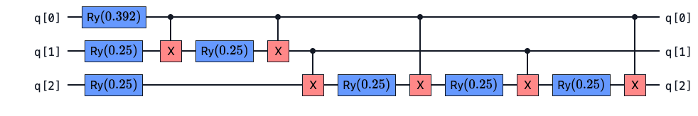
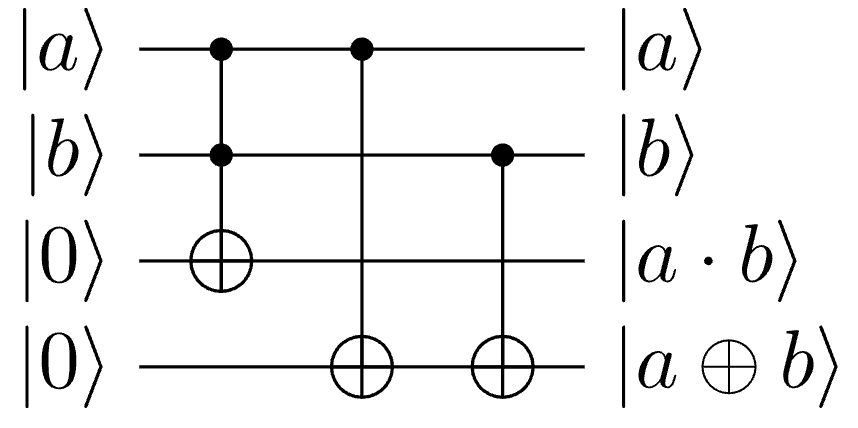
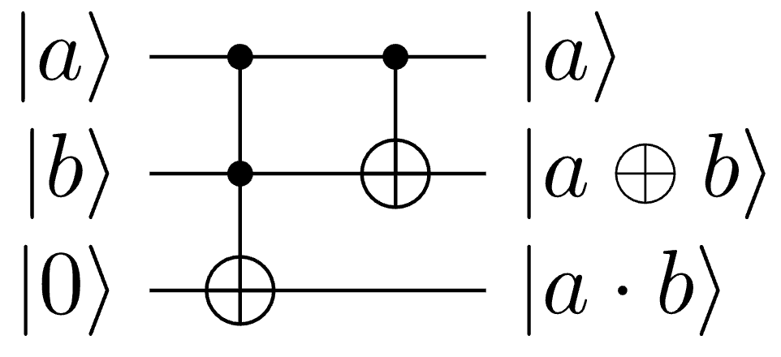
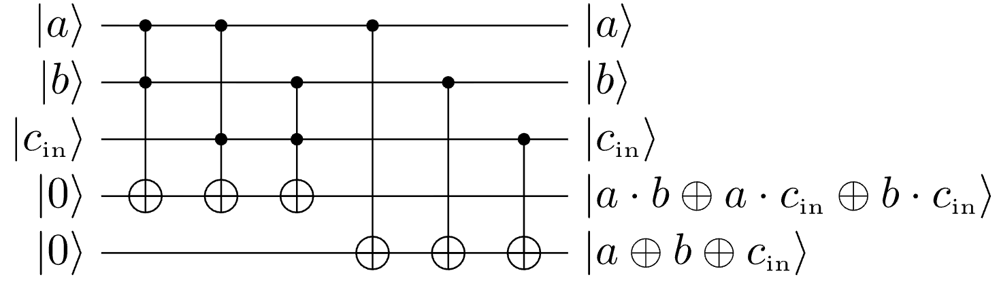
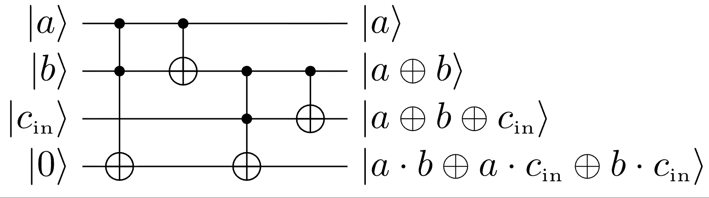
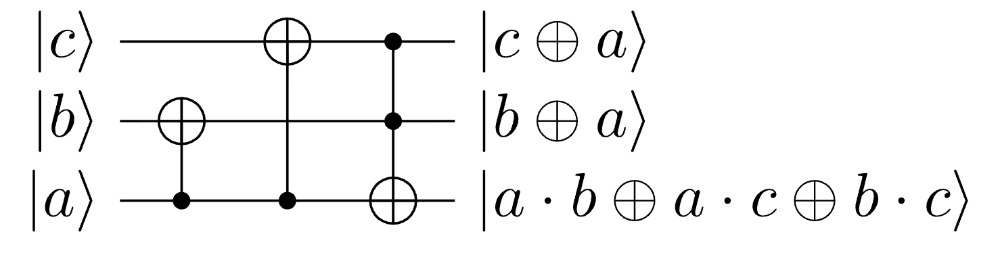
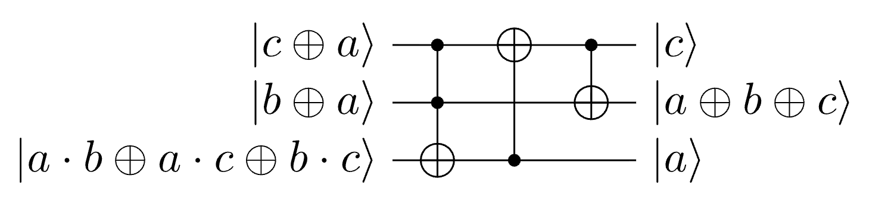
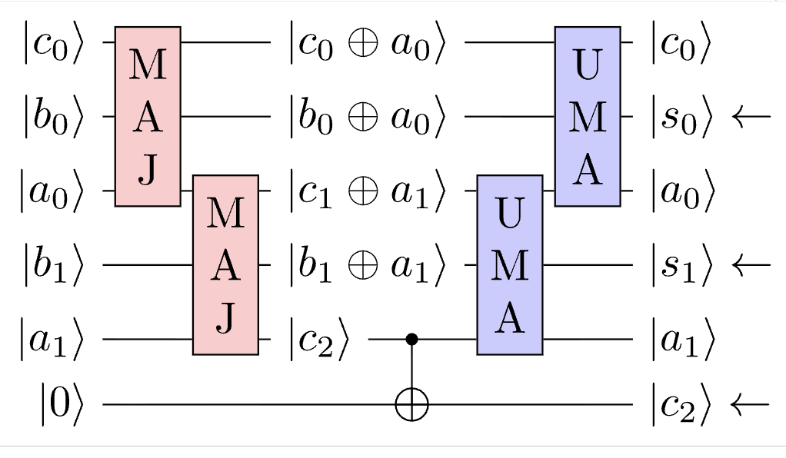

## Encoding

- **Basis encoding**: `binary srings -> computational basis states`
- **Amplitude encoding**: `data values -> amplitudes of a quantum state`
- **Angle encoding**: `data values -> rotation angles on individual qubits`

### Basis Encoding

$$x = b_1 b_2 ... b_n \rightarrow \ket{x} = \ket{b_1 b_2 ... b_n}$$

- applying $X$ gates to flip qubits from $\ket{0}$ to $\ket{1}$ based on the binary representation of the data.
- $\ket{00} \rightarrow \ket{01}$ (X gate on the second qubit)
- $\ket{00} \rightarrow \ket{10}$ (X gate on the first qubit)
- **Dataset superposition**: to encode set $\{01, 11\}$
  - $\ket{S} = \frac{1}{\sqrt{2}}(\ket{01} + \ket{11})$
  - it requires Hadamard and/or controlled gates
- **Hadamard transform**
  - $\ket{H^{\otimes n}}\ket{0}^{\otimes n} = \frac{1}{\sqrt{2^n}} \sum_{x=0}^{2^n-1} \ket{x}$

```python
import pennylane as qml

x = [int(b) for b in '1011']

def circuit(x):
  qml.BasisEmbedding(features=x, wires=range(len(x)))

dev = qml.device('default.qubit', wires=4)
qnode = qml.QNode(circuit, dev)

print(qml.draw(qml.transforms.decompose(qnode), show_all_wires=True)(x))
```

### Amplitude Encoding

$$ x = [x_0, x_1, ..., x_{N-1}] \rightarrow |\psi\rangle = \sum_{i=0}^{2^N-1} x_k |k\rangle $$

- The most qubit-efficient encoding method, since $n$ qubits can encode $2^n$ amplitudes.

$$
\begin{align*}
\ket{\bf 0} &\equiv \ket{000} \\
\ket{\bf 1} &\equiv \ket{001} \\
\ket{\bf 2} &\equiv \ket{010} \\
\ket{\bf 3} &\equiv \ket{011} \\
\ket{\bf 4} &\equiv \ket{100} \\
\ket{\bf 5} &\equiv \ket{101} \\
\ket{\bf 6} &\equiv \ket{110} \\
\ket{\bf 7} &\equiv \ket{111}
\end{align*}
$$

- The state can be rewritten more explicitly (for 3 qubits)

$$ \ket{\psi} = x_0 \ket{000} + x_1 \ket{001} + x_2 \ket{010} + x_3 \ket{011} + x_4 \ket{100} + x_5 \ket{101} + x_6 \ket{110} + x_7 \ket{111} $$

- For $N$ data points, we need $n = \log_2(N)$ qubits.
- **Converting to binary**
  - with $n$ qubits, the *computational basis states* range from
    - $\ket{0}$ to $\ket{2^n - 1}$
  - $[x_0, x_1, ..., x_{N-1}]$ can be mapped to $x_0\ket{000} + x_1\ket{001} + \cdots + x_{N-1}\ket{(N-1)}$.
  - $b_i = \left\lfloor \frac{k}{2^i} \right\rfloor \bmod 2$.
- if $k = 5$
  - $b_0 = \left\lfloor \frac{5}{2^0} \right\rfloor \bmod 2 = 1$
  - $b_1 = \left\lfloor \frac{5}{2^1} \right\rfloor \bmod 2 = 0$
  - $b_2 = \left\lfloor \frac{5}{2^2} \right\rfloor \bmod 2 = 1$
  - gives $b_2 b_1 b_0 = 101$ (binary representation of 5)
  - $\ket{\bf 5} = \ket{101}$

### Angle Encoding

- Each classical value controls the roation angle of a qubit gate.
- $ x = [x_1, x_2, ..., x_n]$
- $RY(x_0) \ket{0} \otimes RY(x_1) \ket{0} \otimes ... \otimes RY(x_{n-1}) \ket{0}$
- where $RY(\theta) = \begin{bmatrix} \cos(\theta/2) & -\sin(\theta/2) \\ \sin(\theta/2) & \cos(\theta/2) \end{bmatrix}$ is the $Y$ rotation gate.

### Summary of Encoding Methods

| Method | Qubit cost | Eample Classical Data | Use Case | Circuit Complexity |
| --- | --- | --- | --- | --- |
| **Basis Encoding** | 1 qubit per bit | Binary strings ('1011') | Binary data, configs | Easy |
| **Amplitude Encoding** | $\log_2(N)$ qubits | Vector of real numbers | QML, optimization | Hard |
| **Angle Encoding** | 1 qubit per data point | Vector of angles | Variational / hybrid algorithms | Easy |

- Pennylane: BasisEmbedding, AmplitudeEmbedding, AngleEmbedding
- Qiskit: initialize
- PyTKET: StatePreparationBox

## Amplitude Encoding Circuit

- The algorithm to prepare an arbitrary vector of length $2^n$ takes roughly that many gates. (e.g. $2^3 \approx 10$)

```py
wires = [0, 1, 2]

def circuit(x):
  qml.AmplitudeEmbedding(x, wires)

dev = qml.device("default.qubit", wires=wires)
qnode = qml.QNode(circuit, dev)

# Random vector of length 8 (for 3 qubits)
x = np.random.rand(8)
# Normalize the vector to have unit length (required for quantum states)
x = x/np.sqrt(np.sum(x**2))

qml.draw_mpl(qnode)(x);
qml.draw_mpl(qml.transforms.decompose(qnode), decimals=3)(x);
```



```py
from pytket.circuit import StatePreparationBox
from pytket.circuit.display import render_circuit_jupyter as draw

state_circ = pytket.circuit.Circuit(3)

# Example 3-qubit state to prepare
w_state = 1 / np.sqrt(3) * np.array([0, 1, 1, 0, 1, 0, 0, 0])

w_state_box = StatePreparationBox(w_state)
state_circ.add_gate(w_state_box, [0, 1, 2])

draw(state_circ)

pytket.transform.Transform.DecomposeBoxes().apply(state_circ)
draw(state_circ)
```



### Different algorithms for Rotation gate

- Pennylane: Transformation of quantum states using uniformly controlled rotations
$$Ry(\theta) = e^{-\theta Y / 2} = \begin{bmatrix} \cos(\theta/2) & -\sin(\theta/2) \\ \sin(\theta/2) & \cos(\theta/2) \end{bmatrix}$$

- PyTKET: Synthesis of Quantum Logic Circuits
$$R_y(\theta) = e^{-\theta \pi Y / 2} = \begin{bmatrix} \cos(\theta \pi / 2) & -\sin(\theta \pi / 2) \\ \sin(\theta \pi / 2) & \cos(\theta \pi / 2) \end{bmatrix}$$

- Qiskit: Quantum Circuits for Isometries
- There are concreate algorithms for encoding classical data into quantum states, but this process is generally computationally expensive.
- It usually requires classical preprocessing, and the resulting circuit can be quite deep.
- In general, amplitude encoding an arbitary large vector is expensive.
- "a quantum computer can store an exponential amount of data" should be always considered together with the cost of state preparation.
- The real advantage of quantum computers does not appear for every problem, but only for specific problems that are well-suited to them.
  - Problems where state preparation is natural or efficient.
  - Problems that involve simulating quantum systems themselves.
  - Structured linear algebra, optimization, or sampling problems.
  - Problems where the input is already given as a quantum state.

## Binary Logic Gates

| a | b | sum | carry |
| --- | --- | --- | --- |
| 0 | 0 | 0 | 0 |
| 0 | 1 | 1 | 0 |
| 1 | 0 | 1 | 0 |
| 1 | 1 | 0 | 1 |

- Sum $s = a \oplus b$ (XOR)
- Carry $c = a \cdot b$ (AND)

1. Declare registers
2. Apply opertions
3. Read the result

### Full-Adder in Binary Logic

- Handles three inpus ($a$, $b$, and carry-in $c_{in}$) and produces two outputs (sum $s$ and carry-out $c_{out}$).

| $a$ | $b$ | $c_{\text{in}}$ | $s$ | $c_{\text{out}}$ |
|---|---|------|-----|-------|
| 0 | 0 | 0    |  0  |   0   |
| 0 | 0 | 1    |  1  |   0   |
| 0 | 1 | 0    |  1  |   0   |
| 0 | 1 | 1    |  0  |   1   |
| 1 | 0 | 0    |  1  |   0   |
| 1 | 0 | 1    |  0  |   1   |
| 1 | 1 | 0    |  0  |   1   |
| 1 | 1 | 1    |  1  |   1   |

- $s = a \oplus b \oplus c_{in}$
- $c_{out} = (a \cdot b) \oplus (a \cdot c_{in}) \oplus (b \cdot c_{in})$
- A full-adder = two half-adders + an OR gate
- Chaning full-adders producs a **ripple-carry adder** for multi-bit numbers.

## Quantum Arithmetic

- All quantum gates must be **Unitary** (Invertable)
- A classical half-adder *discards* input information after computing the sum and carry.
  - This irreversibility is forbidden in quantum circuits.
- The computation must be done in a way that preserves all input information.
  - XOR and AND operations must be implemented using reversible gates (e.g. Toffoli gate).
  - XOR $\rightarrow$ CNOT gate
  - AND $\rightarrow$ Toffoli gate

| Classical op | Quantum gate |
| --- | --- |
| XOR $(a \oplus b)$ | $\text{CNOT}(a, b) = \ket{a} \otimes \ket{b \oplus a}$ |
| AND $(a \cdot b)$ | $\text{CCX}\ket{a}\ket{b}\ket{c} = \ket{a} \ket{b} \ket{(a \cdot b) \oplus c}$ |

- With a third qubit initialized to $\ket{0}$, we can compute the AND of $a$ and $b$ without losing information about $a$ and $b$.

### Half-Adder





### Full-Adder



$$C_{out} = (a \cdot b) \oplus (a \cdot c_{in}) \oplus (b \cdot c_{in})$$
$$s = a \oplus b \oplus c_{in}$$



$$CCX(a, b, c_{out}) \rightarrow CNOT(a, b) \rightarrow CCX(b, c_{in}, c_{out}) \rightarrow CNOT(b, c_{in})$$

### Ripple Carry Adder

- Two full-adder circuits in sequence, overlapping on the carry qubit ("rippling" the carry through the circuit).
- **CDKM adder**
  - Carry-out is the **majority vote** of the three inputs



- **MAJ**: Majority, computes carry in-place using only 2 CNOTs + 1 Toffoli
  - $(c, b, a) \rightarrow (c \oplus a, b \oplus a, a \cdot b \oplus a \cdot c \oplus b \cdot c)$
  
- **UMA**: UnMajority-and-Add, reverses MAJ but overwrites $b$ with the sum.
  - $c \oplus a, b \oplus a, c_{out} \rightarrow c, a\oplus b\oplus c, s$



- **CDKM Ripple-Carry Adder**: For two n-bit numbers, chain MAJ/UMA pairs, sharing the carry qubit.
  - `CDKMRippleCarryAdder`



## Quantum Multiplication

| - | - | - | - | - | - | - |
| --- | --- | --- | --- | --- | --- | --- |
| | | | | **1** | **1** | **0** |
| **x** | | | | **1** | **0** | **1** |
| | | | | 1 | 1 | 0 |
| | | | 0 | 0 | 0 | |
| **+** | | 1 | 1 | 0 | | |
| | | **1** | **1** | **1** | **0** | **0** |

- Binary multiplication is "shift and add"
  - for each 1-bit in the multiplier, add a shifted version of the multiplicand to the result.
  - for each 0-bit, add nothing (or add a zero vector).
- In quantum, each partial addition is a **conditional adder**
, every internal gate is controlled by a bit of the multiplier.

$$ CU = \ket{0}\bra{0} \otimes I + \ket{1}\bra{1} \otimes U $$

## Superposition

- Same adder circuit works on superposition of inputs

$$ \text{ADDER} \ket{2} (\ket{1} + \ket{3}) \ket{0} = \ket{2} (\ket{1} \ket{3})(\ket{3} \ket{5}) $$

- With one adder, both $2 + 1$ and $2 + 3$ are computed simultaneously.
- measurement collapses the superposition, we can only ever see one result per run. Either $2 + 1 = 3$ or $2 + 3 = 5$.
- Amplifying the probability of amplitudes corresponding to correct answers is a key part of quantum algorithms.

## Summary

- Basis encoding maps each classical bit to a qubit, with 0 mapped to $|0\rangle$ and 1 mapped to $|1\rangle$.
- To encode 1011, we need X gates on qubits 0, 2, and 3 (assuming qubit 0 is the most significant bit).
- Applying an H gate (Hadamard gate) to each qubit puts the system in a uniform superposition over all basis states.
- Amplitude encoding of an arbitrary vector of size $2^n$ generally requires $O(2^n)$ gates.
- In angle encoding, each classical value $x_i$ becomes the rotation angle of an RY gate on the $i$-th qubit.
- Using the binary conversion formula, the decimal number 5 maps to $|101\rangle$ for 3 qubits.
- In short, in quantum addition, the sum is an XOR operation, and the carry is an AND operation.
- A quantum half-adder must keep the original inputs to remain reversible and maintain its unitary nature.
- The Toffoli gate is defined as: $|a\rangle|b\rangle|c\rangle \mapsto |a\rangle|b\rangle|c \oplus a \cdot b\rangle$.
- A full-adder should produce a carry-out as follows: $c_{\text{out}} = a \cdot b \oplus a \cdot c_{\text{in}} \oplus b \cdot c_{\text{in}}$.
- The following operation is reversible: $|a\rangle|b\rangle|c\rangle \mapsto |a\rangle|a \oplus b\rangle|c \oplus a \cdot b\rangle$.
- For addition "in superposition," measuring the output register yields exactly one of the partial sums, chosen probabilistically.
- The MAJ circuit computes the majority function as: $a \cdot b \oplus a \cdot c \oplus b \cdot c$.
- The QASM snippet for a half-adder uses `ccx q[0], q[1], q[2]` to compute the carry ($a \cdot b$) and a `cx q[0], q[1]` (or `cx q[1], q[0]`) gate to compute the sum ($a \oplus b$).
- Quantum multiplication can be implemented via conditional addition, one per multiplier bit.
