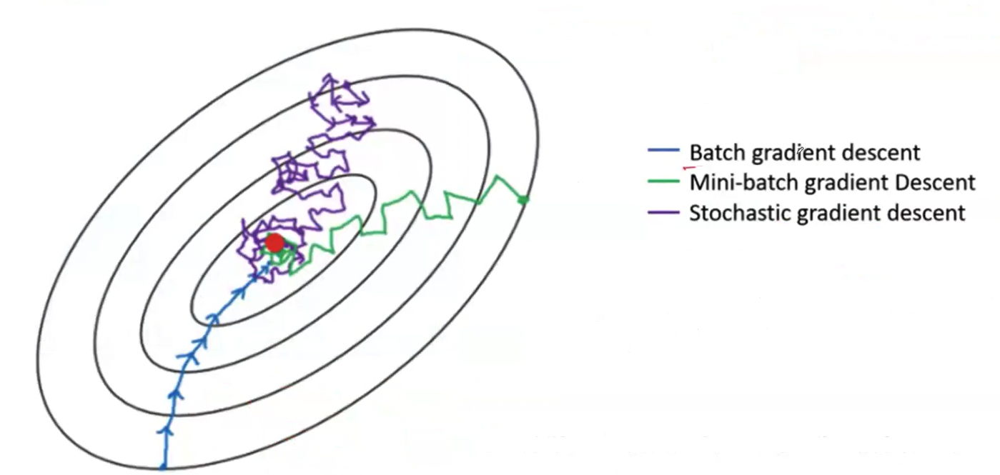

## Logistic Regression as Neural Network

- if $y = 1$
  - $L = -\log(\hat{y})$
  - if $\hat{y} \to 1$, then $L \to 0$ (low loss)
  - if $\hat{y} \to 0$, then $L \to \infty$ (high loss)
- if $y = 0$
  - $L = -\log(1 - \hat{y})$
  - if $\hat{y} \to 0$, then $L \to 0$ (low loss)
  - if $\hat{y} \to 1$, then $L \to \infty$ (high loss)

## Gradient Descent

- it is an iterative approach for error correction in a machene learning model
- Find $w$ and $b$ that will minimize $GD(w, b)$ (requires Loss/Cost function)

1. Initialize $w$ and $b$
2. Perform Forward pass operation/calculations
3. Compute Loss/Cost function $L(a, y)$
4. Compute change in $w$ and $b$ (Take the partial derivative of the cost function with respect to Weights and bias $dw$ and $db$)
5. Update $w$ and $b$ ($w := w - \alpha dw$ and $b := b - \alpha db$)
6. Repeat from Step 2 with new values of $w$ and $b$ for 'n' number of iterations.

- $\alpha$ is the learning rate (hyperparameter) that controls how much we are adjusting the weights and bias of our model with respect to the loss gradient. It is a small positive value (e.g., 0.01, 0.001) that determines the step size at each iteration while moving toward a minimum of the loss function.

### Gradient Descent Types

- Batch Gradient Descent (BGD)
- **Stochastic Gradient Descent** (SGD)
- **Mini-batch Gradient Descent** (MBGD)

### Batch Gradient Descent (BGD)

1. Process each input sample and find the cost
2. Find the average cost oveer all input samples
3. Update $w$ and $b$ and repeat the steps for "n" epochs(iterations)

- Disadvantages:
  - It uses the complete dataset to calculate the gradients at every steps
  - Slow when training data is large
  - Difficult to find the learning rate
  - Difficult to ascertain the number of epochs(iterations)

### Stochastic Gradient Descent (SGD)

> Due to the random nature, the algorithm is much less regular than BGD.

1. Process a random input sample and find the cost.
2. Update $w$ and $b$, and repeat the steps for "n" iterations on the training samples.

- Advantages:
  - Computes gradient based on single input sample, which is memory efficient.
  - Much faster compared to BGD.
  - Possible to train on large datasets.
  - Randomness is helpful to escape local minima.
- Disadvantages:
  - Might not reach the optimal value, but very close to it.
    - **Simulated annealing**: Reduce the learning rate gradually
    - Create a Learning Schedule to determine the learning rate at each iteration.

### Mini-batch Gradient Descent (MBGD)

1. Divide the tranining set into mini-batches of size $n$ (e.g., 64, 128, 256).
2. Process all the samples in a mini-batch and find the average cost
3. Update $w$ and $b$, and repeat the steps for "n" iterations/epoches on the traning samples.

- Advantages:
  - Computes gradient based on small sets of input smaple
  - Much faster compared to BGD.
  - Possible to train on large dataset.
  - Performance boost on matrix operations using GPUs.
  - Might not reach the optional value but, very close to it and possibly better than SGD.
- Disadvantages:
  - It may be harder to escape the local minima compared to SGD.

## Exponentially Weighted Averages

- One of the popular algorithm for smoothing sequential data (time series data), aka. moving average.
- Weight the number of observations and using their average

$$
V_0 = 0 \\
V_1 = 0.9 \cdot V_0 + 0.1 \cdot \theta_1 \\
V_2 = 0.9 \cdot V_1 + 0.1 \cdot \theta_2 \\
V_3 = 0.9 \cdot V_2 + 0.1 \cdot \theta_3 \\
\vdots \\
V_t = 0.9 \cdot V_{t-1} + 0.1 \cdot \theta_t \\
V_t = \beta \cdot V_{t-1} + (1 - \beta) \cdot \theta_t
$$

$V_t$ is approximate average over $\approx \frac{1}{1 - \beta}$ time steps.

- For $\beta = 0.9$, $V_t$ is average over the last 10 time steps.
- For $\beta = 0.98$, $V_t$ is average over the last 50 time steps.
- For $\beta = 0.5$, $V_t$ is average over the last 2 time steps.

## Optimizers

### SGD with Moementum

At iteration $t$:

- Calculate $dw$ and $db$ on the current mini-batch (Hyper parameters: $\alpha$ and $\beta$)
- Update the velocity:
  - $V_{dw} = \beta V_{dw} + (1 - \beta) dw \rightarrow V_t = \beta V_{t-1} + (1 - \beta) \theta_t$
  - $V_{db} = \beta V_{db} + (1 - \beta) db$
- Update parameters:
  - $w := w - \alpha V_{dw}$
  - $b := b - \alpha V_{db}$

### RMSProp

- Root Mean Square Propagation.
- Unpublished adaptive learning method by Geoffrey Hinton.
- Reduces oscillation but in a different way than Momentum.
- Divides the learning rate by an exponentially decaying average of squared gradients.
