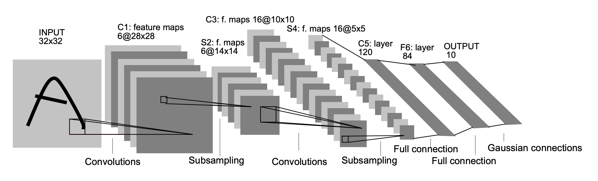

## Computer Vision

- Classification
- Classification with Localization
- Object Detection

| - | ANN | CNN |
| --- | --- | --- |
| Input | 1D vector | 3D tensor (height, width, channels) |
| Connections | Fully connected | Local connections (receptive fields) |
| Overfitting | Prone to overfitting | Less prone to overfitting |

## Convolutional Neural Networks (CNN)

1. Convolutional Layer (**CONV**)
2. Pooling Layer (**POOL**)
3. Fully Connected Layer (**FC**)

### Convulutional Layer (CONV)

- The first layer to extraact features from an input image
- Core buildling block of a CNN
- Convolutions are basic operation in this layer
- A number of filters (e.g. edge detectors) are applied to the input image.
- **Padding** is used to control the spatial size of the output feature maps.
  - Negative values at the edges can naturally arise because of padding, and they usually are not a big problem because activation functions and later layers come afterward.
  - Input Matrix dimension: $n \times n \times c$ (height, width, channels)
  - Filter size: $f \times f$
  - Padding ($P$): 1, number of pixels added to the border of the input
  - $(n \times n) * (f \times f) \to (n + 2P - f + 1) \times (n + 2P - f + 1)$
    - Example: $5 \times 5$ input with $3 \times 3$ filter and padding of 1 results in a $5 \times 5$ output feature map.
  - if input and output matrix dimensions are the same, then $P = \frac{f - 1}{2}$.
