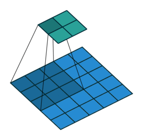

## Computer Vision

- Classification
- Classification with Localization
- Object Detection

| - | ANN | CNN |
| --- | --- | --- |
| Input | 1D vector | 3D tensor (height, width, channels) |
| Connections | Fully connected | Local connections (receptive fields) |
| Overfitting | Prone to overfitting | Less prone to overfitting |

## Convolutional Neural Networks (CNN)

1. Convolutional Layer (**CONV**)
2. Pooling Layer (**POOL**)
3. Fully Connected Layer (**FC**)

### Convulutional Layer (CONV)

- The first layer to extraact features from an input image
- Core buildling block of a CNN
- Convolutions are basic operation in this layer
- A number of filters (e.g. edge detectors) are applied to the input image.

### Padding

- **Padding** is used to control the spatial size of the output feature maps.
- Negative values at the edges can naturally arise because of padding, and they usually are not a big problem because activation functions and later layers come afterward.
- Input Matrix dimension: $n \times n \times c$ (height, width, channels)
- Filter size: $f \times f$
- Padding ($P$): 1, number of pixels added to the border of the input
- $(n \times n) * (f \times f) \to (n + 2P - f + 1) \times (n + 2P - f + 1)$
  - Example: $5 \times 5$ input with $3 \times 3$ filter and padding of 1 results in a $5 \times 5$ output feature map.
- if input and output matrix dimensions are the same, then $P = \frac{f - 1}{2}$.
- Valid padding ($P = 0$): No Padding
- Same padding ($P = \frac{f - 1}{2}$): Output size and input size is same, this requires appropriate padding.

### Stride

- It is the number of pixels by which slide the filter across the input image.

| No Padding Strides | Stride with Padding |
| --- | --- |
|  |  |

- [Github: vdumoulin/conv_arithmetic](https://github.com/vdumoulin/conv_arithmetic)
- Input Matrix dimension: $n \times n$
- Filter size: $f \times f$
- Padding: $P$
- Stride: $S$
- Output Size = $ \left\lfloor \frac{n + 2P - f}{S} + 1 \right\rfloor  \times \left\lfloor \frac{n + 2P - f}{S} + 1 \right\rfloor$
  - Example: Input Matrix dimension: $5 \times 5$, Filter size: $3 \times 3$, Padding: $1$, Stride: $2$ results in an output size of $2 \times 2$.

### Pooling Layer (POOL)

- Down sampling operation which reduces the dimensionality of a matrix.
- Reduces the number of parameters for large image, but retain the valuable information.
- Max pooling
- Average pooling
- Sum pooling

### Fully Connected Layer (FC)

- a traditional Multi-layer Perception (MLP) layer
- For multi-class classification, usually Softmax activation is used.
- Softmax ensures the output.
- Output of the CONV and POOL layers represent a high level features of the Input image.
- The FC layer takes these features to classify the input image into the desired output classes.
