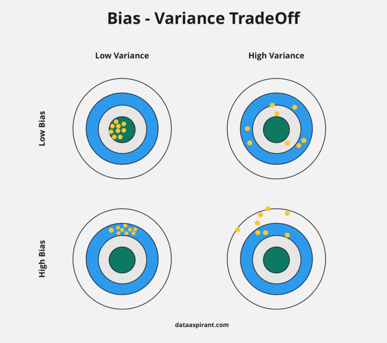

## Data Preparation

- Small Dataset (Range: 100 to 100,000 samples)
  - Train/Valid/Test: 60/20/20
  - Train/Test: 70/30
- Large Dataset (Range: 500,000 to 1M+ samples)
  - Train/Valid/Test: 98%/10,000/10,000
  - usaully more traning data is get better performance.
- **Rule of Thumb**: Validation and Test set should com from the same distribution.

## Bias and Variance

- **Bias**: A value that allows to shift the activation function to left or right to better fit the data.
  - With bias the curve/line will not always pass through origin
  - can get a better fit to training data
- **Variance**: The sensitivity of the model to small fluctuations in the training data.
  - The change in prediction accuracy of ML model between training data and test data.
  - Model with high variance pays a lot of attention to tranining data and does not generalize on the data which is has not seen before.
  - With high variance, model perform very well on training data but poorly on test data.

- **High Bias**
  - High training error, underfitting
  - Validation/test error nearly same as train error
  - Potential things to try:
    - Increase features
    - Make ML model more complicated
    - Decrease Regularation parameters
- **High Variance**
  - Low tranining error, overfitting
  - High validation/test error
  - Potential things to try:
    - Increase dataset size
    - Reduce input features
    - Increasing Regularization parameter

## Accuracy

- **Bayesian Optimal Error (BOE)**: Best optimal error that can be achieved by any model on a given dataset.
- **Human-Level performance**:
  - Humans are very good at a lot of tasks
  - Can get labelled data from humans to help improve the model performance
  - Gain insights from manual error analysis

## Regularization

- a technique which makes slight modifications to the learning algorithm such that the model generalizes better on the unseen data.
- Update the loss/cost function by adding a regularization term
  - $\text{Loss function} = \text{Loss} + \text{Regularization term}(\lambda)$
  - Due to $\lambda$, the weight matrices will decrease, assuming a neural network with smaller weight matrices leads to simpler model.
  - Regularization penalizes the weights matrices of the nodes
- L2 regularization
- L1 regularization
- Dropout

### L2 Regularization

$$ \text{Cost function} = \text{Loss} + \frac{\lambda}{2m} \sum_{j=1}^{n_x} w_j^2 $$

- $\lambda$ is a hyper-parameter
- as weight decay, as it forces the weight to decay towards zero, but not exactly zero.

### L1 Regularization

$$ \text{Cost function} = \text{Loss} + \frac{\lambda}{2m} \sum_{j=1}^{n_x} |w_j| $$

- Penalize the absolute value of the $w$
- Weight may reduce to zero
- Useful in compressing a model (sparse model)

### Dropout

- It produces good reuslts and most popular regularization technique in deep learning.
- At every iteration, it randomly selects and drops some nodes and remove all the connections to those nodes.
- Each iteration has a different set of nodes.

## Data Augmentation

- Simple way to reduce overfitting is to increase size of tranining dataset.
- By creating more sample using the existing set and applying the following simple operations
  - Flip
  - Rotate
  - Scale
  - Crop
  - Translate
  - Gaussian Noise
