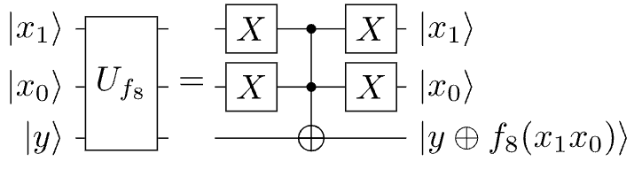
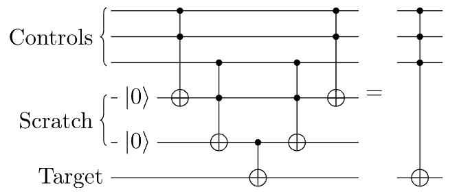

## Boolean Functions

$$f: \{0,1\}^n \to \{0,1\}$$

| x | $f_0$ | $f_1$ | $f_2$ | $f_3$ |
| --- | --- | --- | --- | --- |
| 0 | 0 | 0 | 1 | 1 |
| 1 | 0 | 1 | 0 | 1 |

- $n=1$
- **Constant**: smae output for all inputs ($f_0$ and $f_3$).
- **Balanced**: outputs 0 for exactly half, 1 for the other half ($f_1$ and $f_2$).
- In the worst case, need $2^{n-1}+1$ quries to decide which type $f$ is exponetial in $n$.

$$
\begin{array}{c|cccccccccccccccc}
x  & {\color{orange}{f_0}} & f_1 & f_2 & {\color{blue}{f_3}} & f_4 & {\color{blue}{f_5}} & {\color{blue}{f_6}} & f_7 &
     f_8 & {\color{blue}{f_9}} & {\color{blue}{f_{10}}} & f_{11} & {\color{blue}{f_{12}}} & f_{13} & f_{14} & {\color{orange}{f_{15}}} \\
\hline
00 & {\color{orange}0} & 0 & 0 & {\color{blue}0} & 0 & {\color{blue}0} & {\color{blue}0} & 0 &
     1 & {\color{blue}1} & {\color{blue}1} & 1 & {\color{blue}1} & 1 & 1 & {\color{orange}1} \\
01 & {\color{orange}0} & 0 & 0 & {\color{blue}0} & 1 & {\color{blue}1} & {\color{blue}1} & 1 &
     0 & {\color{blue}0} & {\color{blue}0} & 0 & {\color{blue}1} & 1 & 1 & {\color{orange}1} \\
10 & {\color{orange}0} & 0 & 1 & {\color{blue}1} & 0 & {\color{blue}0} & {\color{blue}1} & 1 &
     0 & {\color{blue}0} & {\color{blue}1} & 1 & {\color{blue}0} & 0 & 1 & {\color{orange}1} \\
11 & {\color{orange}0} & 1 & 0 & {\color{blue}1} & 0 & {\color{blue}1} & {\color{blue}0} & 1 &
     0 & {\color{blue}1} & {\color{blue}0} & 1 & {\color{blue}0} & 1 & 0 & {\color{orange}1}
\end{array}
$$

## The Quantum Oracle

- Traditional **Oracle**: black box that computes $f$.
- Query complexity: number of queries to the oracle needed to solve a problem.

$$ x \xrightarrow{O_f} f(x) $$

- **Quantum Oracle**: unitary operation that encodes $f$.

$$ U_f \ket{x}\ket{y} = \ket{x}\ket{y \oplus f(x)} $$

- First register: input $x$.
- Second register: auxiliary qubit initialized to $\ket{0}$ or $\ket{1}$.
- Oracle don't change $x$, but flips $y$ if $f(x)=1$.
  - $0 \oplus 0 = 0$
  - $0 \oplus 1 = 1$
  - $1 \oplus 0 = 1$
  - $1 \oplus 1 = 0$
- $f(x) = 0$: $y$ unchanged.
- $f(x) = 1$: $y$ flipped.
- Example:
  - $\ket{x}\ket{0}$
  - $U_f \ket{x}\ket{0} = \ket{x}\ket{0} \oplus \ket{f(x)} = \ket{x}\ket{f(x)}$.
  - if $f(x) = 0$: $\ket{x}\ket{0}$.
  - if $f(x) = 1$: $\ket{x}\ket{1}$
- so that it ignores the input $x$ and only flips the second qubit if $f(x)=1$.
- it can be reversed: $(y \oplus f(x)) \oplus f(x) = y$.

## Phase Kickback

- Prepare the scratch qubit in $\ket{-} = \frac{1}{\sqrt{2}}(\ket{0} - \ket{1})$.
  - $U_f \ket{x}\ket{-} = \frac{1}{\sqrt{2}}(U_f \ket{x} \ket{0} - U_f \ket{x} \ket{1})$
  - $ = \frac{1}{\sqrt{2}}(\ket{x} \ket{0 \oplus f(x)} - \ket{x}\ket{1 \oplus f(x)})$
  - if $f(x) = 0 \rightarrow \\ \frac{1}{\sqrt{2}}(\ket{x}\ket{0 \oplus 0} - \ket{x}\ket{1 \oplus 0}) \\ = \frac{1}{\sqrt{2}}(\ket{x}\ket{0} - \ket{x}\ket{1}) \\ = \ket{x} \frac{1}{\sqrt{2}}(\ket{0} - \ket{1}) \\ = \ket{x}\ket{-}$.
  - if $f(x) = 1 \rightarrow \\ \frac{1}{\sqrt{2}}(\ket{x}\ket{0 \oplus 1} - \ket{x}\ket{1 \oplus 1}) \\ = \frac{1}{\sqrt{2}}(\ket{x}\ket{1} - \ket{x}\ket{0}) \\ = - \ket{x} \frac{1}{\sqrt{2}}(\ket{0} - \ket{1}) \\ = -\ket{x}\ket{-}$.
    - it doesn't matter where the phase is, it can be moved around:
    - $\alpha(\ket{\psi} \otimes \ket{\phi}) = \alpha\ket{\psi} \otimes \ket{\phi} = \ket{\psi} \otimes \alpha\ket{\phi}$.
- if we put the second register to $\ket{-}$, $f(x)$ will be encoded **in the phase** of the first register.

$$\ket{x}\ket{-}\mapsto (-1)^{f(x)} \ket{x} \ket{-}$$

- The function's output has been **"kicked back"** into the phase of the first register, while the second register remains unchanged.

## The Deutsch Problem

- Given a boolean function $f:\{0,1\}^{n} \to \{0,1\}$, determine if $f$ is constant or balanced.
- **Constant**: same output for all inputs.
- **Balanced**: outpus 0 for half the inputs and 1 for the other half.


1. Prepare $\ket{0}\ket{1}$.
2. Apply $H$ to both qubits $\to \ket{+}\ket{-}$.
3. Apply oracle $U_f$.
4. Phase kickback encodes $f$ in the input phase.
5. Apply $H$ to input qubit, then measure.

- One query to the oracle is sufficient to determine if $f$ is constant or balanced.
- if measure 0: $f$ is constant.
- if measure 1: $f$ is balanced.

## Deustch-Jozsa Algorithm

> The direct generalization for any $n$-bit boolean function.

1. Input register $n$ qubits: Initialize qubits in $\ket{0}$ and apply $H$ gate to each one.
2. Scratch Qubit $1$ qubit: Initialize in $\ket{1}$ with $X$ and then apply an $H$ gate.
3. Oracle: Apply $U_f$ to the input and scratch registers (All qubits).
4. Final Hadamards: Apply $H$ to input qubits.
5. Measurement: Measure the input register.

- if all qubits returned $0$: $f$ is **constant**.
- if any qubit returned $1$: $f$ is **balanced**.


### How it works

- The initial state is

$$ \ket{00 \cdots 0} \ket{1} $$

- After applying $H$ gates to the input and scratch registers, we get

$$ \ket{00 \cdots 0} \rightarrow \frac{1}{\sqrt{2^n}} \left( \ket{00 \cdots 0} + \ket{00 \cdots 1} + \cdots + \ket{11 \cdots 1} \right) $$

- The input register is in a superposition of a computational states containing all possible inputs to $n$-bit string.
- The last qubit hasn't changed from $n = 1$ case, so it is in the state $\ket{-}$.
  - $H\ket{1} = \ket{-}$
- The definition of the oracle was generic for any bit string:
$$ U_f \ket{x}\ket{-} = (-1)^{f(x)} \ket{x} \ket{-} $$
- The phase-kickback puts a phase in front of each term in the input register that depends on the output of the function $f$:
$$ \frac{1}{\sqrt{2^n}}\big(\;(-1)^{f(00\ldots0)}|00\ldots 0\rangle+ \cdots +(-1)^{f(11\ldots1)}|11\ldots 1\rangle\;\big) $$
  - The scratch qubit remains in $\ket{-}$, so we can ignore it for the rest of the algorithm.
- **Constant case**
  - if $f$ is constant, then all the phases are the same, either $+1$ or $-1$:
  - $f(00 \cdots 0) = f(00 \cdots 1) = \cdots = f(11 \cdots 1) = 0$
  - $f(00 \cdots 0) = f(00 \cdots 1) = \cdots = f(11 \cdots 1) = 1$
  - The phse in front of every computational state is the same, Either $+1$ or $-1$.
  - Before the second application of the $H$ gates, the state of the input register is:
  - $$ \pm \frac{1}{\sqrt{2^n}} \left( \ket{00 \cdots 0} + \ket{00 \cdots 1} + \cdots + \ket{11 \cdots 1} \right) $$
  - In measurement, in either case, the probability to obtain $P(00 \cdots 0) = 1$
  - A constant function deterministically returns all zeros with a single query.
- **Balanced case**
  - we are promised the function is either constant or balanced, so there are equal number of $+1$ and $-1$ phases. so we don't need to consider this case.
  - If the measurement produces anything but all zeros, we know with certainty the function is not constant, so it must be balanced.
  - There are a lot of balanced function, but half the terms in the superposition will exactly have a $-1$ phase.
  - It's clearly orthogonal to the state with all ones in superposition.
  - Appllying $H$'s will change the state to some other superpostiion, or perhaps a unique computational state.
  - But, orthogonality to $\ket{00 \cdots 0}$ must remain.
  - A balenced function deterministically returns a state with at least one entry as $1$, with a single query.

> **One quantum query** vs $2^{n-1} + 1$ classical queries.
> It is an algorithm that puts all inputs into superposition at once, encodes the function values as phases, and then uses interference to distinguish between constant and balanced functions.

## Buildling Oracles

### Multi-Controlled and Anti-Controlled Gates

- build $U_f$ that applies $X$ to the output qubit exactly when $f(x) = 1$.
  - if $n=2$, the multi-controlled $X$ gate is a Toffoli gate.
  - $x=11$ is the only input that gives $f(x) = 1$, so we can use a Toffoli gate with controls on the first two qubits and target on the output qubit.
    - This is because the Toffoli gate will flip the output qubit if and only if both control qubits are $\ket{1}$, which corresponds to the input $x=11$.
  - if $x=00$ is the only input that gives $f(x) = 1$, we can use an anti-controlled Toffoli gate, which applies $X$ to the target qubit if both control qubits are $\ket{0}$.
    - This is because the anti-controlled Toffoli gate will flip the output qubit if and only if both control qubits are $\ket{0}$, which corresponds to the input $x=00$.
    - Applying $X$ gates to the two control qubits, then applying a Toffoli gate, and then applying $X$ gates again to the control qubits will effectively create an anti-controlled Toffoli gate.



- A multi-controlled $X$ gates ($C^nX$) flips the target only all control qubits are $\ket{1}$.
- To target a specific input $x$:
  - Place $X$ gates on each qubit $i$ where $x_i = 0$. (anti-control)
  - Apply $C^nX$.
  - Undo the $X$ gates.
- For $n$ qubits, it can be generalized to perform an $X$ gate (or any $U$) with $n$ control qubits, requireing $n-1$ extra scratch qubits and $2(n-1)$ Toffoli gates.
- Whenever scratch qubits are invoked, always see a symmetric pattern of gates.
- $U_{f8} U_{f1} \ket{x}\ket{y} = \ket{x}\ket{y \oplus f_1(x) \oplus f_8(x)} = \ket{x}\ket{y \oplus f_9(x)}$



1. The computation is done using the scratch qubits.
2. The answer is copied to the target or output register
3. The computation is inverted to reset the scratch qubits to $\ket{0}$.

- called "uncomputation", ensures the scratch qubits are returned to their initial state.
- no input or output qubits are entangled with the scratch qubits at the end of the algorithm.

### Implementing Deutsch-Jozsa

```py
def random_oracle(n):
    # Circuit object to hold the gates
    circuit = qiskit.QuantumCircuit(n + 1)

    # With 50% probability, return a constant oracle
    if np.random.randint(0, 2):
        qasm = ""
        # another 50:50 chance of it being a 1 instead of 0 oracle
        if np.random.randint(0, 2):
            qasm += f"x q[{n-1}];"
        return qasm, "constant"

    # A balanced function has half the inputs as 0
    # Randomly select where those are
    zero_strings = np.random.choice(range(2**n),int(2**(n-1)),replace=False)

    for string in zero_strings:

        # Convert base 10 to 2
        bitstring= f"{string:0b}"

        # X gates for 0 locations
        for xi, bit in enumerate(reversed(bitstring)): # enumerate iterates through the list as well as the index in the list
            if bit == "1":
                circuit.x(xi)

        # C^n X gate
        circuit.mcx(list(range(n)), n)

        # X gates for 0 locations
        for xi, bit in enumerate(reversed(bitstring)):
            if bit == "1":
                circuit.x(xi)

    transpiled_circuit = qiskit.transpile(circuit, basis_gates=["u1", "u3", "u2", "cx"])
    qasm = qiskit.qasm2.dumps(transpiled_circuit)[47:]
    return qasm, "balanced"
```

```qasm
OPENQASM 2.0;
qreg q[3];
creg c[2];

x q[2];
h q[0];
h q[1];
h q[2];

/* oracle for f(00)=1 */
x q[0];
x q[1];
ccx q[0],q[1],q[2];
x q[0];
x q[1];

/* oracle for f(11)=1 */
ccx q[0],q[1],q[2];

h q[0];
h q[1];

measure q[0] -> c[0];
measure q[1] -> c[1];
```

```QASM
OPENQASM 2.0;
qreg q[n+1];
creg c[n];

x q[n];
h q[0];
h q[1];
...
h q[n];
/* oracle U_f */
h q[0];
h q[1];
...
h q[n-1];
measure q[0] -> c[0];
...
measure q[n-1] -> c[n-1];
```

## Bernstein-Vazirani Algorithm

- Given $f_s: \{0,1\}^n \to \{0,1\}$ defined as $f_s(x) = s \cdot x \mod 2$
  - where $s$ is an unknown $n$-bit string and $x$ is the input.
- The goal is to determine the hidden string $s$ as few queries as possible.
- Classically: query $f$ with input $e_0 = 00 \cdots 01$, $e_1 = 00 \cdots 10$, ..., $e_{n-1} = 10 \cdots 00$ to get each bit of $s$.
  - Total $n$ queries.
- Quantum: use the exact same circuit as Deutsch-Jozsa.
  - $U_{f_s} \ket{x} = (-1)^{s \cdot x} \ket{x}$.
    - where we can ignore the output register in the $\ket{-}$ state.
    - For $n =1$, the state after the oracle before the final $H$ gate is:
      - $\frac{1}{\sqrt{2}} \left( \ket{0} + (-1)^{s} \ket{1} \right)$
    - which is $\ket{+}$ if $s=0$ and $\ket{-}$ if $s=1$.
  - Applying $H$ to this state returns $s$:
    - $H \frac{1}{\sqrt{2}} \left( \ket{0} + (-1)^{s} \ket{1} \right) = \ket{s}$.
  - The measurement deterministically reveals $s$.

### n=2 case

- $s = s_1s_0$ and $x = x_1 x_0$
- $\rightarrow s\cdot x = s_1x_1 + s_0 x_0$

$$ \begin{array}{rrrr}
\frac{1}{2}\big(&(-1) ^{s_0\cdot  0+s_1\cdot 0} \ket{00} + &(-1) ^{s_0\cdot  1+s_1\cdot 0} \ket{01}+&(-1) ^{s_0\cdot  0+s_1\cdot 1} \ket{10}+&(-1) ^{s_0\cdot 1+s_1\cdot 1} \ket{11}\big)\\
=\frac1{2}\big(& \ket{00} + &(-1) ^{s_0} \ket{01}+&(-1) ^{s_1} \ket{10}+&(-1) ^{s_1+s_0} \ket{11}\big).
\end{array}
$$

this factorized into:

$$\frac{1}{\sqrt{2}}\big(\ket 0 + (-1)^{s_1}\ket 1\big)\otimes \frac{1}{\sqrt{2}}\big(\ket 0 + (-1)^{s_0}\ket 1\big).$$

this reduces the same agument as $n=1$ for each qubit where after the final $H$ gates, the state becomes:

$$
\ket{s_1}\otimes \ket {s_0} \equiv \ket{s_1 s_0}.
$$

### Implemnting Bernstein-Vazirani

$$
U_{f_s} \ket{x} \ket y  = \ket{x} \ket {y\oplus (s\cdot x)}
$$

$$
y\oplus (s\cdot x) = y\oplus s_0 x_0 \oplus s_1 x_1 \oplus \cdots \oplus s_{n-1} x_{n-1}
$$

$$
U_{f_s} \ket{x} \ket y  = \ket{x} \ket {y\oplus s x}
$$

- $\mathbb{I}$ if $s = 0$ and $CNOT$ if $s = 1$.
- To implement $f_{s}(x) = s \cdot x$, we can use a CNOT from qubit $i$ to the scratch qubit if $s_i = 1$.

```py
import numpy as np
from qiskit import QuantumCircuit, transpile
from qiskit_aer import AerSimulator


def bv_query(n, secret=None):
    # Build oracle for f_s(x) = s · x
    # q[0]..q[n-1] = input register
    # q[n] = scratch/output qubit

    if secret is None:
        value = np.random.randint(0, 2 ** n)
        secret = format(value, f"0{n}b")
    else:
        secret = secret.zfill(n)

    oracle = QuantumCircuit(n + 1, name="Uf")
    for index, bit in enumerate(reversed(secret)):
        if bit == "1":
            oracle.cx(index, n)

    return oracle, secret


def bernstein_vazirani_circuit(n, secret=None):
    # Build full Bernstein-Vazirani circuit
    oracle, secret = bv_query(n, secret)

    qc = QuantumCircuit(n + 1, n)

    # Prepare scratch qubit in |->
    qc.x(n)

    # Apply Hadamards to all qubits
    for i in range(n + 1):
        qc.h(i)

    # Apply oracle
    qc.compose(oracle, inplace=True)

    # Apply final Hadamards to input register
    for i in range(n):
        qc.h(i)

    # Measure input register
    for i in range(n):
        qc.measure(i, i)

    return qc, secret


def run_bernstein_vazirani(n, secret=None, shots=1):
    qc, secret = bernstein_vazirani_circuit(n, secret)

    simulator = AerSimulator()
    compiled = transpile(qc, simulator)
    result = simulator.run(compiled, shots=shots).result()
    counts = result.get_counts()

    measured = max(counts, key=counts.get)
    recovered = measured[::-1]

    return qc, secret, recovered, counts


# Example
qc, secret, recovered, counts = run_bernstein_vazirani(5, "01101")
print(qc.draw())
print("Secret   :", secret)
print("Measured :", recovered)
print("Counts   :", counts)
```

```qasm
OPENQASM 2.0;
qreg q[6];
creg c[5];

x q[5];
h q[0];
h q[1];
h q[2];
h q[3];
h q[4];
h q[5];

cx q[0],q[5];
cx q[2],q[5];
cx q[3],q[5];

h q[0];
h q[1];
h q[2];
h q[3];
h q[4];

measure q[0] -> c[0];
measure q[1] -> c[1];
measure q[2] -> c[2];
measure q[3] -> c[3];
measure q[4] -> c[4];
```

## Summary

- There are $2^{2^n}$ possible Boolean functions from $\{0,1\}^n$ to $\{0,1\}$.
- A Boolean function is balanced if it outputs 1 on exactly half of the inputs, that is, on $2^{n-1}$ out of the $2^n$ possible inputs.
- In Deutsch’s algorithm with $n=1$, only **1 quantum query** is needed to distinguish a constant function from a balanced function.
- A quantum oracle for $f$ is defined as the unitary
  $U_f:\ |x\rangle|y\rangle \mapsto |x\rangle|y\oplus f(x)\rangle.$
- Every XOR-based function of the form $f(x)=x_j\oplus x_k\oplus\cdots$ that depends on at least one input bit is balanced.
- Using multi-controlled $X$ gates, together with anti-controls when needed, we can implement an oracle for any Boolean function.
- The phase kickback multiplies the state by the phase factor $(-1)^{f(x)}$, so the phase changes exactly when $f(x)=1$.
- If these questions were stored in a Python list called `questions`, then the 8th question would be `questions[7]`.
- Applying Hadamard gates to $n$ qubits initialized in $|0\rangle$ produces an equal superposition over all $2^n$ computational basis states.
- In Deutsch–Jozsa for $n>1$, measuring all input qubits as 0 means that $f$ is constant.
- Bernstein–Vazirani solves the hidden-string problem $f(x)=s\cdot x$ with **1 quantum query**.
- A multi-controlled $X$ gate with 3 controls can be implemented using scratch qubits and **4 Toffoli gates**.
- Applying $U_{f_1}$ followed by $U_{f_2}$ yields an oracle whose action on the scratch qubit corresponds to $f_1(x)\oplus f_2(x)$.
- Uncomputation resets scratch qubits to their initial states by applying the inverse of the computation, which means reversing the order of the steps.
- Multi-controlled gates with more than one control can be decomposed into simpler gates, but in general this requires more than just $CX$ and $X$; single-qubit gates are also needed.
