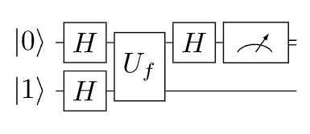
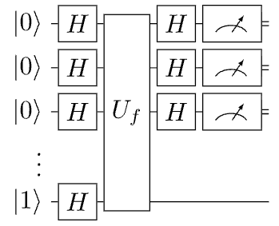

## Boolean Functions

$$f: \{0,1\}^n \to \{0,1\}$$

| x | $f_0$ | $f_1$ | $f_2$ | $f_3$ |
| --- | --- | --- | --- | --- |
| 0 | 0 | 0 | 1 | 1 |
| 1 | 0 | 1 | 0 | 1 |

- $n=1$
- **Constant**: smae output for all inputs ($f_0$ and $f_3$).
- **Balanced**: outputs 0 for exactly half, 1 for the other half ($f_1$ and $f_2$).
- In the worst case, need $2^{n-1}+1$ quries to decide which type $f$ is exponetial in $n$.

$$
\begin{array}{c|cccccccccccccccc}
x  & {\color{orange}{f_0}} & f_1 & f_2 & {\color{blue}{f_3}} & f_4 & {\color{blue}{f_5}} & {\color{blue}{f_6}} & f_7 &
     f_8 & {\color{blue}{f_9}} & {\color{blue}{f_{10}}} & f_{11} & {\color{blue}{f_{12}}} & f_{13} & f_{14} & {\color{orange}{f_{15}}} \\
\hline
00 & {\color{orange}0} & 0 & 0 & {\color{blue}0} & 0 & {\color{blue}0} & {\color{blue}0} & 0 &
     1 & {\color{blue}1} & {\color{blue}1} & 1 & {\color{blue}1} & 1 & 1 & {\color{orange}1} \\
01 & {\color{orange}0} & 0 & 0 & {\color{blue}0} & 1 & {\color{blue}1} & {\color{blue}1} & 1 &
     0 & {\color{blue}0} & {\color{blue}0} & 0 & {\color{blue}1} & 1 & 1 & {\color{orange}1} \\
10 & {\color{orange}0} & 0 & 1 & {\color{blue}1} & 0 & {\color{blue}0} & {\color{blue}1} & 1 &
     0 & {\color{blue}0} & {\color{blue}1} & 1 & {\color{blue}0} & 0 & 1 & {\color{orange}1} \\
11 & {\color{orange}0} & 1 & 0 & {\color{blue}1} & 0 & {\color{blue}1} & {\color{blue}0} & 1 &
     0 & {\color{blue}1} & {\color{blue}0} & 1 & {\color{blue}0} & 1 & 0 & {\color{orange}1}
\end{array}
$$

## The Quantum Oracle

- Traditional **Oracle**: black box that computes $f$.
- Query complexity: number of queries to the oracle needed to solve a problem.

$$ x \xrightarrow{O_f} f(x) $$

- **Quantum Oracle**: unitary operation that encodes $f$.

$$ U_f \ket{x}\ket{y} = \ket{x}\ket{y \oplus f(x)} $$

- First register: input $x$.
- Second register: auxiliary qubit initialized to $\ket{0}$ or $\ket{1}$.
- Oracle don't change $x$, but flips $y$ if $f(x)=1$.
  - $0 \oplus 0 = 0$
  - $0 \oplus 1 = 1$
  - $1 \oplus 0 = 1$
  - $1 \oplus 1 = 0$
- $f(x) = 0$: $y$ unchanged.
- $f(x) = 1$: $y$ flipped.
- Example:
  - $\ket{x}\ket{0}$
  - $U_f \ket{x}\ket{0} = \ket{x}\ket{0} \oplus \ket{f(x)} = \ket{x}\ket{f(x)}$.
  - if $f(x) = 0$: $\ket{x}\ket{0}$.
  - if $f(x) = 1$: $\ket{x}\ket{1}$
- so that it ignores the input $x$ and only flips the second qubit if $f(x)=1$.
- it can be reversed: $(y \oplus f(x)) \oplus f(x) = y$.

## Phase Kickback

- Prepare the scratch qubit in $\ket{-} = \frac{1}{\sqrt{2}}(\ket{0} - \ket{1})$.
  - $U_f \ket{x}\ket{-} = \frac{1}{\sqrt{2}}(U_f \ket{x} \ket{0} - U_f \ket{x} \ket{1})$
  - $ = \frac{1}{\sqrt{2}}(\ket{x} \ket{0 \oplus f(x)} - \ket{x}\ket{1 \oplus f(x)})$
  - if $f(x) = 0 \rightarrow \\ \frac{1}{\sqrt{2}}(\ket{x}\ket{0 \oplus 0} - \ket{x}\ket{1 \oplus 0}) \\ = \frac{1}{\sqrt{2}}(\ket{x}\ket{0} - \ket{x}\ket{1}) \\ = \ket{x} \frac{1}{\sqrt{2}}(\ket{0} - \ket{1}) \\ = \ket{x}\ket{-}$.
  - if $f(x) = 1 \rightarrow \\ \frac{1}{\sqrt{2}}(\ket{x}\ket{0 \oplus 1} - \ket{x}\ket{1 \oplus 1}) \\ = \frac{1}{\sqrt{2}}(\ket{x}\ket{1} - \ket{x}\ket{0}) \\ = - \ket{x} \frac{1}{\sqrt{2}}(\ket{0} - \ket{1}) \\ = -\ket{x}\ket{-}$.
    - it doesn't matter where the phase is, it can be moved around:
    - $\alpha(\ket{\psi} \otimes \ket{\phi}) = \alpha\ket{\psi} \otimes \ket{\phi} = \ket{\psi} \otimes \alpha\ket{\phi}$.
- if we put the second register to $\ket{-}$, $f(x)$ will be encoded **in the phase** of the first register.

$$\ket{x}\ket{-}\mapsto (-1)^{f(x)} \ket{x} \ket{-}$$

- The function's output has been **"kicked back"** into the phase of the first register, while the second register remains unchanged.

## The Deutsch Problem

- Given a boolean function $f:\{0,1\}^{n} \to \{0,1\}$, determine if $f$ is constant or balanced.
- **Constant**: same output for all inputs.
- **Balanced**: outpus 0 for half the inputs and 1 for the other half.

1. Prepare $\ket{0}\ket{1}$.
2. Apply $H$ to both qubits $\to \ket{+}\ket{-}$.
3. Apply oracle $U_f$.
4. Phase kickback encodes $f$ in the input phase.
5. Apply $H$ to input qubit, then measure.

- One query to the oracle is sufficient to determine if $f$ is constant or balanced.
- if measure 0: $f$ is constant.
- if measure 1: $f$ is balanced.

## Deustch-Jozsa Algorithm

> The direct generalization for any $n$-bit boolean function.

1. Input register $n$ qubits: Initialize qubits in $\ket{0}$ and apply $H$ gate to each one.
2. Scratch Qubit $1$ qubit: Initialize in $\ket{1}$ with $X$ and then apply an $H$ gate.
3. Oracle: Apply $U_f$ to the input and scratch registers (All qubits).
4. Final Hadamards: Apply $H$ to input qubits.
5. Measurement: Measure the input register.

- if all qubits returned $0$: $f$ is **constant**.
- if any qubit returned $1$: $f$ is **balanced**.

### How it works

- The initial state is

$$ \ket{00 \cdots 0} \ket{1} $$

- After applying $H$ gates to the input and scratch registers, we get

$$ \ket{00 \cdots 0} \rightarrow \frac{1}{\sqrt{2^n}} \left( \ket{00 \cdots 0} + \ket{00 \cdots 1} + \cdots + \ket{11 \cdots 1} \right) $$

- The input register is in a superposition of a computational states containing all possible inputs to $n$-bit string.
- The last qubit hasn't changed from $n = 1$ case, so it is in the state $\ket{-}$.
  - $H\ket{1} = \ket{-}$
- The definition of the oracle was generic for any bit string:
$$ U_f \ket{x}\ket{-} = (-1)^{f(x)} \ket{x} \ket{-} $$
- The phase-kickback puts a phase in front of each term in the input register that depends on the output of the function $f$:
$$ \frac{1}{\sqrt{2^n}}\big(\;(-1)^{f(00\ldots0)}|00\ldots 0\rangle+ \cdots +(-1)^{f(11\ldots1)}|11\ldots 1\rangle\;\big) $$
  - The scratch qubit remains in $\ket{-}$, so we can ignore it for the rest of the algorithm.
- **Constant case**
  - if $f$ is constant, then all the phases are the same, either $+1$ or $-1$:
  - $f(00 \cdots 0) = f(00 \cdots 1) = \cdots = f(11 \cdots 1) = 0$
  - $f(00 \cdots 0) = f(00 \cdots 1) = \cdots = f(11 \cdots 1) = 1$
  - The phse in front of every computational state is the same, Either $+1$ or $-1$.
  - Before the second application of the $H$ gates, the state of the input register is:
  - $$ \pm \frac{1}{\sqrt{2^n}} \left( \ket{00 \cdots 0} + \ket{00 \cdots 1} + \cdots + \ket{11 \cdots 1} \right) $$
  - In measurement, in either case, the probability to obtain $P(00 \cdots 0) = 1$
  - A constant function deterministically returns all zeros with a single query.
- **Balanced case**
  - we are promised the function is either constant or balanced, so there are equal number of $+1$ and $-1$ phases. so we don't need to consider this case.
  - If the measurement produces anything but all zeros, we know with certainty the function is not constant, so it must be balanced.
  - There are a lot of balanced function, but half the terms in the superposition will exactly have a $-1$ phase.
  - It's clearly orthogonal to the state with all ones in superposition.
  - Appllying $H$'s will change the state to some other superpostiion, or perhaps a unique computational state.
  - But, orthogonality to $\ket{00 \cdots 0}$ must remain.
  - A balenced function deterministically returns a state with at least one entry as $1$, with a single query.

> **One quantum query** vs $2^{n-1} + 1$ classical queries.
> It is an algorithm that puts all inputs into superposition at once, encodes the function values as phases, and then uses interference to distinguish between constant and balanced functions.
