## Transfer Learning

- Knowledge acquired while solving one task, can be used to solve related tasks
- Similar to the way humans apply knowledge acquired from on task to solve a new but similar, related task.

### Transfer Learning Benefits

1. Less training data required: Model trained using a large (similar) dataset can be used as a starting point for training on a smaller dataset.
2. Faster training: Traninig can converage faster, du the use to existing knowledge (weights) to start with rather than from scratch.
3. Better model generalization: Model is trained to identify features which can be applied to new contexts.

### VGG-16

```mermaid
graph LR

    A[Input Image] --> B[Conv Layer 1-1]
    B --> C[Conv Layer 1-2]
    C --> D[Max Pooling]

    D --> E[Conv Layer 2-1]
    E --> F[Conv Layer 2-2]
    F --> G[Max Pooling]

    G --> H[Conv Layer 3-1]
    H --> I[Conv Layer 3-2]
    I --> J[Conv Layer 3-3]
    J --> K[Max Pooling]

    K --> L[Conv Layer 4-1]
    L --> M[Conv Layer 4-2]
    M --> N[Conv Layer 4-3]
    N --> O[Max Pooling]

    O --> P[Conv Layer 5-1]
    P --> Q[Conv Layer 5-2]
    Q --> R[Conv Layer 5-3]
    R --> S[Max Pooling]

    S --> T[Dense Layer 1 (Fully Connected)]
    T --> U[Dense Layer 2]
    U --> V[Dense Layer 3]

    V --> W[Output]
```

| Approach | Description | Use Case | When to Use |
|----------|-------------|----------|------------|
| **Use Pre-trained Model** | Use ImageNet pre-trained model without any additional training | Dogs & cats classification | When dataset distribution is similar to ImageNet with few samples |
| **Train FC Layers Only** | Use CONV layers for feature extraction, train FC layers only | Different class classification on similar domain | When dataset is similar to ImageNet but different classes with limited samples |
| **Train Last CONV + FC Layers** | Train last CONV layers (specialized features) and FC layers | Significantly different data distribution domain | When dataset differs greatly from ImageNet, different classes, and limited samples |
| **Train All CONV + FC Layers** | Train all CONV layers and FC layers (with modifications) | Complex task with different domain | When dataset differs greatly from ImageNet, different classes, dataset is large, and task is complex |

## AlexNet

```mermaid
graph LR
    A[Input Image] --> B[Conv Layer 1<br/>Filters: 96<br/>Kernal: 11x11<br/>Stride: 4<br/>Padding: 0]
    B --> C[Max Pooling 1<br/>Kernal: 3x3<br/>Stride: 2]
    C --> D[Conv Layer 2<br/>Filters: 256<br/>Kernal: 5x5<br/>Stride: 1<br/>Padding: 2]
    D --> E[Max Pooling 2<br/>Kernal: 3x3<br/>Stride: 2]
    E --> F[Conv Layer 3<br/>Filters: 384<br/>Kernal: 3x3<br/>Stride: 1<br/>Padding: 1]
    F --> G[Conv Layer 4<br/>Filters: 384<br/>Kernal: 3x3<br/>Stride: 1<br/>Padding: 1]
    G --> H[Conv Layer 5<br/>Filters: 256<br/>Kernal: 3x3<br/>Stride: 1<br/>Padding: 1]
    H --> I[Max Pooling 3<br/>Kernal: 3x3<br/>Stride: 2]
    I --> J[Dense Layer 1<br/>Units: 4096]
    J --> K[Dense Layer 2<br/>Units: 4096]
    K --> L[Dense Layer 3<br/>Units: 1000]
    L --> M[Output]
```



- Input: 224x224x3 image
- Activiations: ReLU after each CONV and FC layer
- Optimizer: SGD with Momentum
- Regularization: Dropout in FC1 and FC2
- Total Trainable Parameters: ~60 million
- Traninig settings: Nvidia GTX 580 3BG GPUs for 6 days
