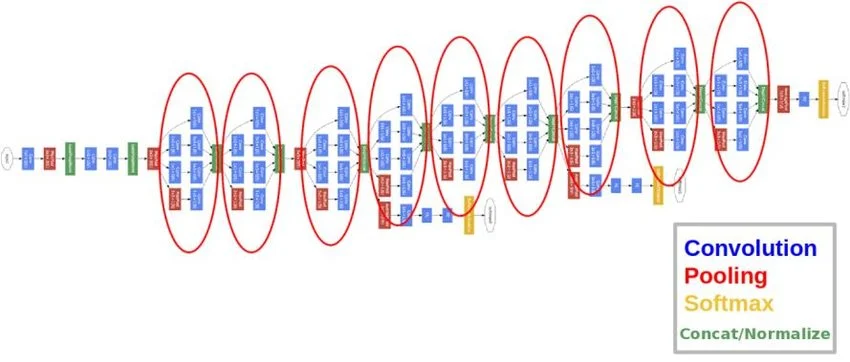
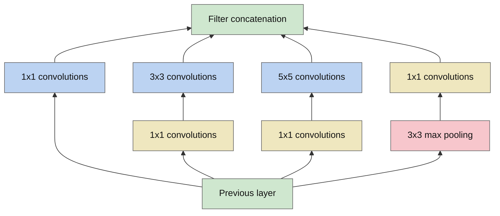
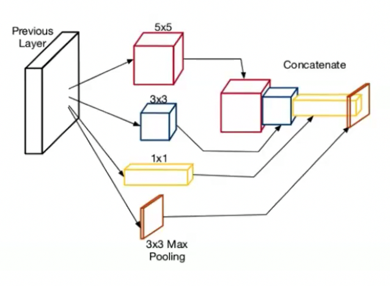
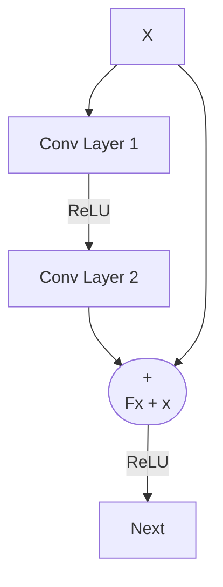
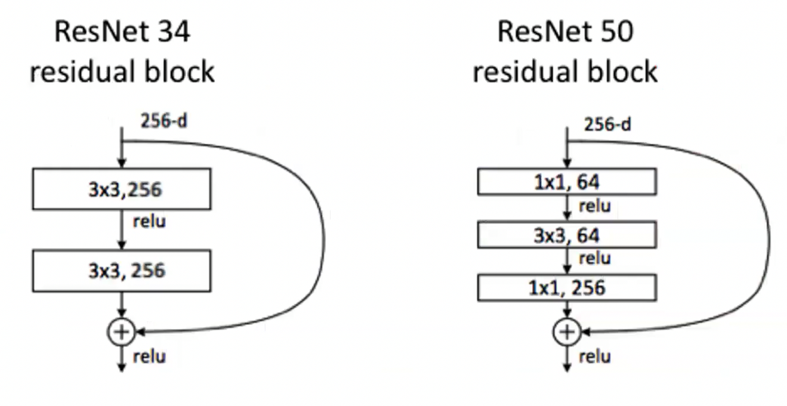

## Transfer Learning

- Knowledge acquired while solving one task, can be used to solve related tasks
- Similar to the way humans apply knowledge acquired from on task to solve a new but similar, related task.

### Transfer Learning Benefits

1. Less training data required: Model trained using a large (similar) dataset can be used as a starting point for training on a smaller dataset.
2. Faster training: Traninig can converage faster, du the use to existing knowledge (weights) to start with rather than from scratch.
3. Better model generalization: Model is trained to identify features which can be applied to new contexts.

### VGG-16

```mermaid
graph LR

    A[Input Image] --> B[Conv Layer 1-1]
    B --> C[Conv Layer 1-2]
    C --> D[Max Pooling]

    D --> E[Conv Layer 2-1]
    E --> F[Conv Layer 2-2]
    F --> G[Max Pooling]

    G --> H[Conv Layer 3-1]
    H --> I[Conv Layer 3-2]
    I --> J[Conv Layer 3-3]
    J --> K[Max Pooling]

    K --> L[Conv Layer 4-1]
    L --> M[Conv Layer 4-2]
    M --> N[Conv Layer 4-3]
    N --> O[Max Pooling]

    O --> P[Conv Layer 5-1]
    P --> Q[Conv Layer 5-2]
    Q --> R[Conv Layer 5-3]
    R --> S[Max Pooling]

    S --> T[Dense Layer 1 (Fully Connected)]
    T --> U[Dense Layer 2]
    U --> V[Dense Layer 3]

    V --> W[Output]
```

| Approach | Description | Use Case | When to Use |
|----------|-------------|----------|------------|
| **Use Pre-trained Model** | Use ImageNet pre-trained model without any additional training | Dogs & cats classification | When dataset distribution is similar to ImageNet with few samples |
| **Train FC Layers Only** | Use CONV layers for feature extraction, train FC layers only | Different class classification on similar domain | When dataset is similar to ImageNet but different classes with limited samples |
| **Train Last CONV + FC Layers** | Train last CONV layers (specialized features) and FC layers | Significantly different data distribution domain | When dataset differs greatly from ImageNet, different classes, and limited samples |
| **Train All CONV + FC Layers** | Train all CONV layers and FC layers (with modifications) | Complex task with different domain | When dataset differs greatly from ImageNet, different classes, dataset is large, and task is complex |

## AlexNet

```mermaid
graph LR
    A[Input Image] --> B[Conv Layer 1<br/>Filters: 96<br/>Kernal: 11x11<br/>Stride: 4<br/>Padding: 0]
    B --> C[Max Pooling 1<br/>Kernal: 3x3<br/>Stride: 2]
    C --> D[Conv Layer 2<br/>Filters: 256<br/>Kernal: 5x5<br/>Stride: 1<br/>Padding: 2]
    D --> E[Max Pooling 2<br/>Kernal: 3x3<br/>Stride: 2]
    E --> F[Conv Layer 3<br/>Filters: 384<br/>Kernal: 3x3<br/>Stride: 1<br/>Padding: 1]
    F --> G[Conv Layer 4<br/>Filters: 384<br/>Kernal: 3x3<br/>Stride: 1<br/>Padding: 1]
    G --> H[Conv Layer 5<br/>Filters: 256<br/>Kernal: 3x3<br/>Stride: 1<br/>Padding: 1]
    H --> I[Max Pooling 3<br/>Kernal: 3x3<br/>Stride: 2]
    I --> J[Dense Layer 1<br/>Units: 4096]
    J --> K[Dense Layer 2<br/>Units: 4096]
    K --> L[Dense Layer 3<br/>Units: 1000]
    L --> M[Output]
```



- Input: 224x224x3 image
- Activiations: ReLU after each CONV and FC layer
- Optimizer: SGD with Momentum
- Regularization: Dropout in FC1 and FC2
- Total Trainable Parameters: ~60 million
- Traninig settings: Nvidia GTX 580 3BG GPUs for 6 days

## GoogleNet

- Accurary: top-5 test erorr rate of 6.7%
- Close to human level performance
- 22 layer deep CNN
- Optimizer: RMSProp
- Total Trainable Parameters: ~4 million (Significantly reduced)
- A novel **inception module** was introduced



### Inecption Module





- Use filters with different size together
- Use different types of layers (CONV, POOL etc.) together
- It leads to better performance and efficiency but complicated architecture.

### 1X1 Convolution

Input image ($6 \times 6 \times 1$), 1x1 kernel, and output can be declared as:

$$
X=
\begin{bmatrix}
100&100&100&0&0&0\\
100&100&100&0&0&0\\
100&100&100&0&0&0\\
100&100&100&0&0&0\\
100&100&100&0&0&0\\
100&100&100&0&0&0
\end{bmatrix},
\quad
K=\begin{bmatrix}3\end{bmatrix}
$$

$$
Y = K * X
$$

$$
Y=
\begin{bmatrix}
300&300&300&0&0&0\\
300&300&300&0&0&0\\
300&300&300&0&0&0\\
300&300&300&0&0&0\\
300&300&300&0&0&0\\
300&300&300&0&0&0
\end{bmatrix}
$$

For channel reduction with a 1x1 convolution, each spatial location $(i,j)$ is a vector:

$$
\mathbf{x}_{i,j} \in \mathbb{R}^{256}
$$

One 1x1 layer with 128 filters is a matrix:

$$
W \in \mathbb{R}^{128 \times 256},\quad \mathbf{b} \in \mathbb{R}^{128}
$$

At each location, output channels are computed by matrix multiplication:

$$
\mathbf{z}_{i,j}=W\mathbf{x}_{i,j}+\mathbf{b},\quad
\mathbf{y}_{i,j}=\mathrm{ReLU}(\mathbf{z}_{i,j})
$$

So the shape changes as:

$$
64\times64\times256
\;\xrightarrow{\;1\times1\;\text{Conv (128 filters)}+\mathrm{ReLU}\;}
64\times64\times128
$$

If we flatten all spatial positions ($64\times64=4096$):

$$
X_{\text{flat}} \in \mathbb{R}^{4096\times256},\quad
Y_{\text{flat}}=\mathrm{ReLU}\left(X_{\text{flat}}W^T+\mathbf{1}\mathbf{b}^T\right)
\in \mathbb{R}^{4096\times128}
$$

### Inception V2 and V3

- V1 (GoogleNet): Replace one 5x5 conv with two stacked 3x3 conv layers.
  - Number of parameters: $5^2=25$ vs. $2\times3^2=18$ (about 28% reduction)
- V2: Factorize an $n\times n$ conv into $1\times n$ and $n\times1$ convs.
  - For $3\times3$: $3^2=9$ vs. $3+3=6$ (about 33% reduction)
- V3: Use more aggressive factorization and branch design (e.g., $1\times7$ and $7\times1$), plus efficient grid-size reduction.
  - Improves the accuracy-efficiency tradeoff while keeping computation manageable

## ResNet

> Deep Residual Networks, skip connections, and identity mappings

- Enabled the development of the much deeper networks
- ResNet is composed of residual blocks were introduced to address the vanishing gradient problem in deep networks.
  - Degradation problem: adding more layers eventually have negative effect on the final performance




