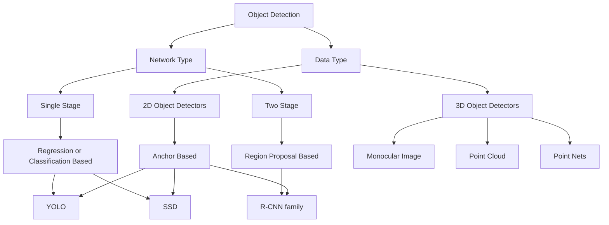

## Datasets

### PASCAL isual Object Classifcation

> PASCAL VOC

- a popular dataset for object detection, classification and segmentation
- 20 categories

### ImageNet

- a dataset for object detection
- 500,000 images, 200 categories
- Not very popular due to large number of classes and size of the dataset

### COCO

> Microsoft Common Objects in Context dataset

- a large-scale object detection, segmentation, and captioning dataset.
- 330,000 images, 80 categories
- 200,000 labeled images, 1.5 million object instances
- 91 stuff categories

## Intersecxtion over Union (IoU)

$$ IoU = \frac{Area of Overlap}{Area of Union} $$

- a metric used of the evaluation of an object detector
- how good is the predicted bounding box for an object detected colosely matches

## AP

> Average Precision

| Metric | Description |
| --- | --- |
| $AP$ | AP at IoU=.50:0.05:0.95 (primary challenge metric) |
| $AP^{IoU=.50} $ | AP at IoU=0.50 (PASCAL VOC metric) |
| $AP^{IoU=.75} $ | AP at IoU=0.75 (strict metric) |
| $AP^{small}$ | AP for small objects: $area < 32^2$ |
| $AP^{medium}$ | AP for medium objects: $32^2 < area < 96^2$ |
| $AP^{large}$ | AP for large objects: $area > 96^2$ |
| $AR^{max=1}$ | AR given 1 detection per image |
| $AR^{max=10}$ | AR given 10 detections per image |
| $AR^{max=100}$ | AR given 100 detections per image |
| $AR^{small}$ | AR for small objects: $area < 32^2$ |
| $AR^{medium}$ | AR for medium objects: $32^2 < area < 96^2$ |
| $AR^{large}$ | AR for large objects: $area > 96^2$ |

## Taxonomy of Object Detection

