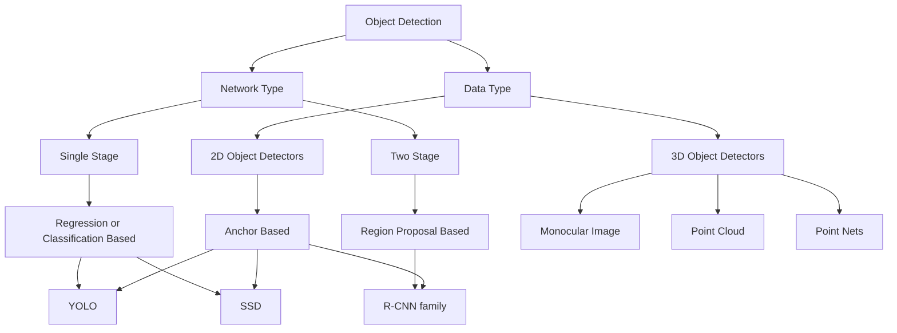
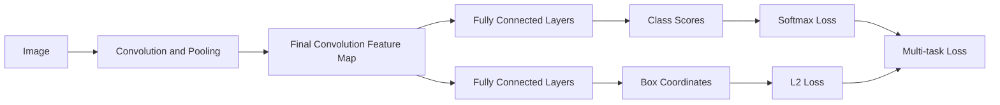

## Datasets

### PASCAL isual Object Classifcation

> PASCAL VOC

- a popular dataset for object detection, classification and segmentation
- 20 categories

### ImageNet

- a dataset for object detection
- 500,000 images, 200 categories
- Not very popular due to large number of classes and size of the dataset

### COCO

> Microsoft Common Objects in Context dataset

- a large-scale object detection, segmentation, and captioning dataset.
- 330,000 images, 80 categories
- 200,000 labeled images, 1.5 million object instances
- 91 stuff categories

## Intersecxtion over Union (IoU)

$$ IoU = \frac{Area of Overlap}{Area of Union} $$

- a metric used of the evaluation of an object detector
- how good is the predicted bounding box for an object detected colosely matches

## AP

> Average Precision

| Metric | Description |
| --- | --- |
| $AP$ | AP at IoU=.50:0.05:0.95 (primary challenge metric) |
| $AP^{IoU=.50} $ | AP at IoU=0.50 (PASCAL VOC metric) |
| $AP^{IoU=.75} $ | AP at IoU=0.75 (strict metric) |
| $AP^{small}$ | AP for small objects: $area < 32^2$ |
| $AP^{medium}$ | AP for medium objects: $32^2 < area < 96^2$ |
| $AP^{large}$ | AP for large objects: $area > 96^2$ |
| $AR^{max=1}$ | AR given 1 detection per image |
| $AR^{max=10}$ | AR given 10 detections per image |
| $AR^{max=100}$ | AR given 100 detections per image |
| $AR^{small}$ | AR for small objects: $area < 32^2$ |
| $AR^{medium}$ | AR for medium objects: $32^2 < area < 96^2$ |
| $AR^{large}$ | AR for large objects: $area > 96^2$ |

## Taxonomy of Object Detection



## Classification with Localization

- Classification Task
  - Input: Image
  - Output: Class label
  - Performance Metric: Accuracy
- Localization Task
  - Input: Image
  - Output: Bounding box coordinates $(x, y, Ht, Wd)$ or $(x, y, x', y')$
  - Performance Metric: IoU

### Localization Loss

```mermaid
graph LR
  Image --> CNN --> Output[4 coordinates<br/>$(x', y', Ht', Wd')$] --> Loss[Calculate Loss<br/>L2 Loss]
                    GroundTruth[4 coordinates<br/>$(x, y, Ht, Wd)$] --> Loss
```

> Localization as a regression problem



## Detection as a Classification Problem

### Region Proposal

- Find blobs in the image that are most likely to contain objects.
- Selective Search: ~1000-2000 region proposal using CPU

## R-CNN

> Region based CNN

- Convolution Neural Network as feature extractor
- SVM as classifier
- Bounding box regression for localization
- Pass each region through CNN to extract features, then classify using SVM and refine bounding box using regression
- Warped image region to fixed size (e.g., 227x227) before passing through CNN
- Region-of-Interest (RoI) from proposal method around 2000 per image, which is computationally expensive

### Fast R-CNN

- Run Whole image through CNN to get feature map, then classify each region proposal using RoI pooling and fully connected layers
  - Region of Interest (RoIs) from proposal method
  - Crop and Resize features
  - Per-Region Network
  - Linear + Softmax for Object category
  - Linear for Box offset
- Reduce computation
- ROIs from feature maps using selective search
- mAP: 70% for PASCAL VOC 2007

### Faster R-CNN

- Use CNNs to make proposal
- RPN (Region Proposal Network) to generate region proposals
  - Small nural network to predict proposals from feature map
- RoI pooling to extract features for each proposal
  - then classify and refine bounding box
- mAP: 78.8% for PASCAL VOC 2007

| Model | Description |
| --- | --- |
| R-CNN | Look at every patch one by one |
| Fast R-CNN | Look once, and then inspect patches on feature map |
| Faster R-CNN | Propose patches using a neural network (RPN) |

### R-CNN Family Comparison

| Feature | R-CNN | Fast R-CNN | Faster R-CNN |
| --- | --- | --- | --- |
| Region proposal | Selective search | Selective search | RPN (learned) |
| CNN Usage | Per region | Once per image | Once per image |
| Speed | Very slow | Faster | Can work in real-time |
| Training | Multi-stage, discrete | Partially end-to-end | Fully end-to-end |
| Accuracy | Good | Better | Best of all three |
