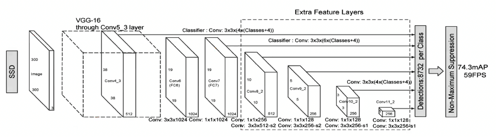

## Prediciting Bounding Boxes

- Using:
  - Sliding Window (Slow)
  - Selective Search
  - Region Proposals
- Task:
  - Predict Bouding boxes from CNN

## Non Maxima Suppression (NMS)

1. Check the probabilities of each detection and keep ones with score above a certain threshold (0.7)
2. For remaining boxes,
  a. Box with highest score is the detection results.
  b. Discard any remaining boxes with `IoU > 0.5` with final detected box
  c. i.e. overlap with the box with highest score.

## Anchor Boxes

- Associate each object to:
  - A cell which contains its mid-point and
  - Anchor box for the cell with highest IoU
- Calculate the IoU of Anchor boxes and prediected Bounding Boxes.
  - $IoU(P_{bb}, A_{bb}) = \frac{Area of Overlap}{Area of Union}$
- $\hat{y} = \{P_0, x, y, h, w, C1, C2, \quad P_0 x, y, h, w, C1, C2\}$
  - $P_0$ is objectness score
  - $x, y$ are the coordinates of the center of the bounding box relative to
  - $h, w$ are the height and width of the bounding box
  - $C1, C2$ are the class information for the object in the bounding box

## YOLO

- Real-time performance with 45 FPS, 0.02 sec per image
- Not suitable for small objects
- Issues with new or multiple aspect ratios and unable to generalize

## SSD, Single Shot Detector

- Similar to YOLO, VGG16 base Convolutional Neural Network layers
- Take advantage of Anchor boxes with different aspect ratios
- Large number of anchors boxes are chosen
- Not suitable for small objects
- 3 times faster than Faster R-CNN
- with ResNet-101 base SSD may help in detecting small objects with better features from the CONV layers

