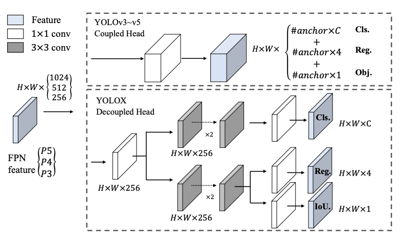
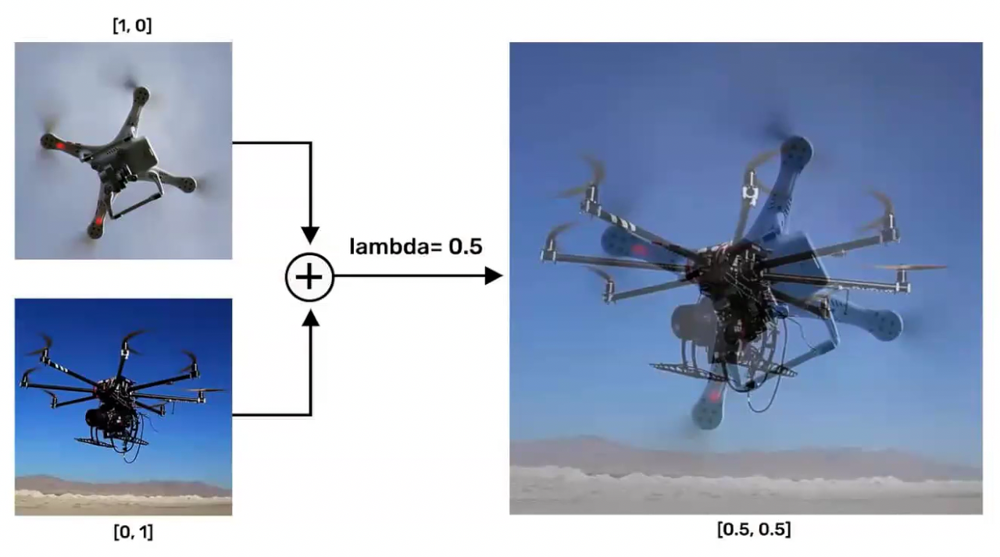
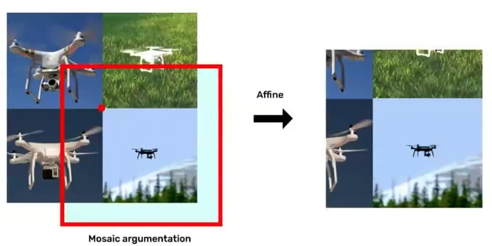
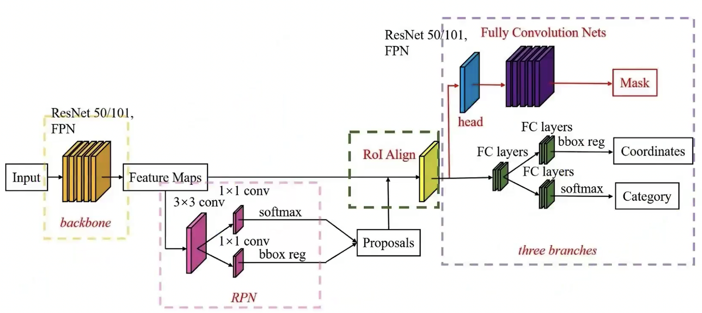
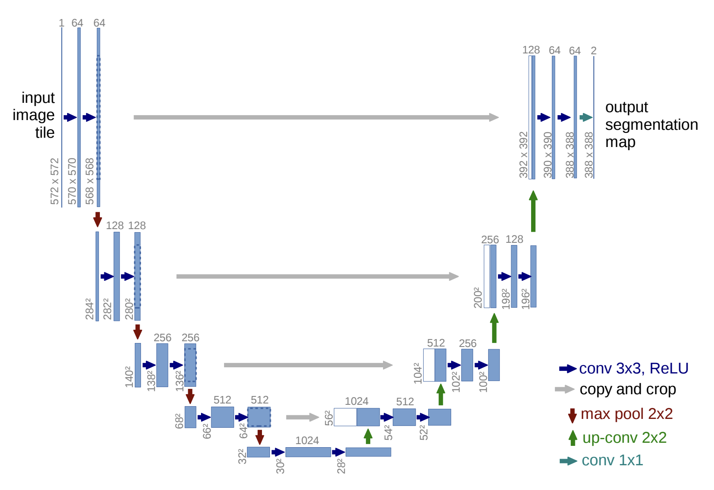

- Three main layers of a CNN
  - **CONV**: Convolution Layer
  - **POOL**: Pooling Layer
  - **FC**: Fully Connected Layer
- Why CNNs use over ANNs for image processing
  - Computationally efficient
  - Using Filters to capture spatial features
  - Sharing weights across the image
- Overfitting
  - The model essentially memorizes the training data, leading to poor performance on unseen data
  - To prevent overfitting, we can use techniques like:
    - **Dropout**: Randomly dropping out neurons during training to prevent co-adaptation
    - **Batch Normalization**: Normalizing the inputs of each layer to stabilize learning
    - **L1/L2 Regularization**: Adding a penalty to the loss function to discourage large weights
    - **Data Augmentation**: Creating new training samples by applying transformations to existing data
- ReLU
  - If the input is below zero, ReLU does output `0`.
  - If the input is above zero, it outputs the input value itself.
  - `max(0, x)`
  - ReLU can output any number from `0` to `infinity`, which allows it to capture a wide range of features in the data.
  - It fixes gradient vanishing problem by allowing gradients to flow through the network without being squashed to zero, which can happen with activation functions like sigmoid or tanh.
- Gradient Descent
  - It uses Backpropagation to calculate the exact slope (the gradient) of the error (loss).
  - Then it takes a step in the opposite direction of the gradient to minimize the error.
  - It repeats this interative process until it reaches a local minimum.
- Learning Rate $\alpha$
  - It's a hyperparameter that controls how big of a step the model takes down the slope.
  - If $\alpha$ is too small, the model will take tiny steps and may take a long time to converge.
  - If $\alpha$ is too large, the model may overshoot the minimum and diverge.
- Precision: $\frac{TP}{TP + FP}$
  - Of all the patients the model predicted as having the disease, how many actually have the disease?
- Recall: $\frac{TP}{TP + FN}$
  - Of all the patients who actually have the disease, how many did the model successfully catch?
  - Recall is more important in medical diagnosis because we want to minimize false negatives (missing a disease).
- Sliding Window
  - Computationally expensive because it requires multiple passes over the image with different window sizes and strides.
  - Multiple scales are needed to detect objects of varying sizes, which further increases the computational cost.
- Edge
  - The points or pixels in an image where brightness or intensities change sharply.
  - Sobel filter
  - Prewitt filter
  - Canny edge detector
  ---
  title: CNN 010
  date: 2026-05-02T13:19:01.747+10:00
  description: Convolutional Neural Network 010
  authors: me
  tags:
  - cnn
  ---

  ## Drawbacks of Anchor-based detectors

  *It is sensitive to:*

  - Size
  - Aspect Ratio
  - Number of Anchor boxes (Fixed)
  - To much variation with shape
  - Small object
  - May not generalize due to pre-defined anchor boxes
  - Computation expensive

  ## Anchor-free detectors

  - Localize objects without using boxes as proposals

  1. Key-point based
  2. Center-based

  ### Key-point based

  - Locates key object parts in an image
  - Detects spatial locations or points unique to an object
  - With human body as an example
  - Key part of face: nose, eyes, eyebrows, mouth ...
  - Key point of human body: joints, elbows, knees ...
  - Object is represented using Key-points

  ### Center-based

  - Finds positives in the center
  - Predicts four distances from the positive to the potential object boundary
    - Top, left, bottom, right
    - `{x, y, T, R, B, L}`

  ## YOLO

  - Yolo V1: 2015
    - darknet backbone
  - Yolo V2: 2016
    - Anchor boxes
    - Batch normalization
  - Yolo V3: 2018
    - Objectness score
    - improvement for small objects
  - Yolo V4/**V5**: 2020
    - Solid Baseline Model
    - Lightweight and Fast
    - image classification, object detection, and instance segmentation
    - Multiple input processing (Video, Image, Live stream)
    - Optimize weights
    - Developed by Ultralytics (not original author)
  - Yolo X/R: 2021
    - Decoupled head
    - First version of Anchor free
    - Improvement efficiency in backbone
  - Yolo V6/V7: 2022
    - Faster and more accurate
  - Yolo NAS/**V8**: 2023
    - Anchor free
    - Architectural improvement
    - Strong baseline for realtime object detection
  - Yolo V9/V10/**V11**: 2024
    - Oriented bounding box
    - Strong baseline for oriented object detection
  - Yolo V12: 2025
    - Attention mechanism, introduced transformer
    - Little slower
  - Yolo **26**: 2026
    - Deployment on a small form factor hardware
    - realtime object detection on edge devices
    - Strongest baseline for edge device deployment (realtime and accuracy)
    - Efficient Loss Function

  ### YoloX X

  - Anchor-free detector in the Yolo Family
  - Decoupled head used
  - Label assignment using SimOTA
  - Use YoloV3 SPP with DarkNet53 backbone
  - Uses advanced augmentation such as Mix-up & Mosaic

  ```mermaid
  graph LR
    Backbone --> Neck --> Head
  ```

  - Backbone: Feature extraction
  - Neck: Aggregation of multi-scale feature
  - Head: Localization and Classification scores

  #### Decoupled head

  

  - Coupled Head: one head gives regression score and classification score (Dog/Cat + Location, BBox)
  - Decoupled Head:
    - First head gives Classification score (Dog/Cat)
    - Another head gives Regression score (Location, BBox)

  #### Data Augmentation

  

  - occluded and overlapped objects
  - improve model robustness

  

  - four images are combined into one
  - crops and resizes the images to create a new training sample

  ### Yolo 26

  - Realtime computer vision model
  - Detection, Segmentation, Classification, Pose, Tracking, OBB (Oriented Bounding Box)
  - Available in Nano, Small, Medium, Large, XLarge
  - E2E detection pipeline (NMS-free, Non-Maximum Suppression free)
  - Designed for edge AI and fast deployment

  #### Why is it faster

  - NMS-free infrerence removes post-processing overhead
  - Direct bounding box regression (No DFL, Distribution Focal Loss)
  - Lower latency and simpler deploymenet graph
  - CPU-optimized architecture
  - Up to 43% faster on CPUs than V11

  #### Key Changes

  - **ProgLoss** (Progressive Loss Balancing): improves training stability and convergence
  - **STAL** (Small-Target-Aware Label Assignment): improves small-object detection
  - **MuSGD** optimizer improves convergence speed
  - Better speed-accuracy trade-off than many previous YOLO models
  - Ideal for robotics, drones, surveillance, and edge devices

  #### Inference pipeline

  ```mermaid
  graph LR
    InputImage --> Backbone --> Neck --> Head --> Predictions

    subgraph Head
      OneToManyHead[One-to-Many Head]
      OneToOneHead[One-to-One Head]
    end
  ```

  - Backbone: Efficient Hybrid CNN + Attention
  - Neck: PAN-FPN (Multi-scale Feature Fusion)
  - Head (Decoupled & Dual Head)
    - One-to-Many Head: Dense supervision (Traning only, many positives)
    - One-to-One Head: Single best match NMS-free inference (Inference & tranining)

  #### Tranining pipeline

  ```mermaid
  graph LR
    DataInputAndAugmentation[Data Input & Augmentation] --> ForwardPass[Forward Pass]

    subgraph ForwardPass
      Backbone --> Neck --> DualHeads
    end

    ForwardPass --> LabelAssignment[Label Assignment with STAL]
    LabelAssignment --> LossComputation[Loss Computation with ProgLoss]
    LossComputation --> Backpropagation[Backpropagation & Optimizer<br/>with MuSGD]
    Backpropagation --> ForwardPass
    Backpropagation --> RepeatUntilConvergence[Repeat Until Convergence]
  ```

  ## Instance Segmentation

  - Identifies each pixel of an object instance
  - whereas Semantic Segmentation classifies object pixels to specific classes/categories
  - Instance Segmentation
    - SegNet
    - DeepMask
    - SharpMask
    - **Mask RCNN**
  - Semantic Segmentation
    - Conditional Random Field (CRF)
    - Fully Convolutional Networks (FCN)
    - U-Net
    - Pyramid scene parsing network (PSPNet)

  ### Application of Instance Segmentation

  - Autonomous Driving
  - Scene Understanding
  - Aerial Image Processing

  ## Mask R-CNN

  > Mask-Region Convolutional Neural Network

  - An addition to the RCNN family, perfoming instance segmentation
  - Improved over Faster RCNN
  - Full Convolutional Network for predicting mask for each class/object.
  - Two stages:
    1. RPN proposes candidiate object bounding boxes
    2. Classify the Candidates, refine bounding boxes, and predict mask.

  

  ### Limitations of Mask R-CNN

  - Computational Complexity: Traning and inference can be computationally intensive, requiring substantial resources (high resolution images or large datasets).
  - Small-Object Segmentation: may struggle with accurately segment very small objects due to limited pixel information.
  - Data Requirements: Training requires a large amount of annotated data, which can be time-consuming and expensive to acquire.
  - Limited Generalization to Unseen Categories: The model's ability to generalize to unseen object categories is limited.

  ## Semantic Segmentation

  

  - `input image -> u-net -> output segmentation map`

  ## References

  - Ge, Z., Liu, S., Wang, F., Li, Z., & Sun, J. (2021). YOLOX: Exceeding YOLO series in 2021. arXiv. [https://doi.org/10.48550/arXiv.2107.08430](https://doi.org/10.48550/arXiv.2107.08430)
  - Ronneberger, O., Fischer, P., & Brox, T. (2015). U-Net: Convolutional networks for biomedical image segmentation. In N. Navab, J. Hornegger, W. M. Wells, & A. F. Frangi (Eds.), Medical Image Computing and Computer-Assisted Intervention – MICCAI 2015 (Vol. 9351, pp. 234–241). Springer. [https://doi.org/10.1007/978-3-319-24574-4_28](https://doi.org/10.1007/978-3-319-24574-4_28)
