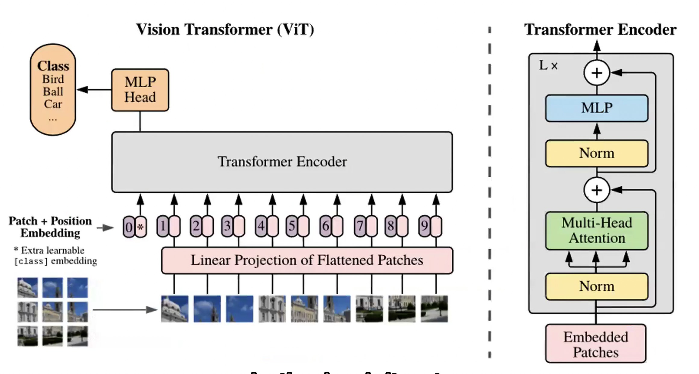
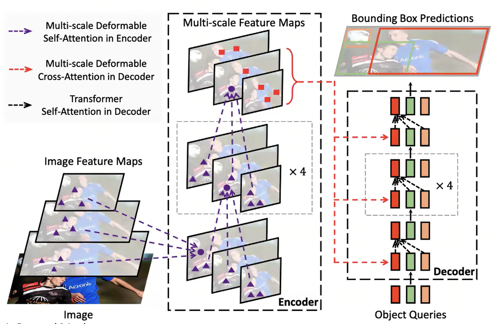

## Sequence

- has a lot of context to predict the next behavior

### Sequence modelling types

- One to One Binary classification
  - `X -> Y'`
  - Will it rain today? Yes/No
- Many to One Sentiment Analysis
  - `X1, X2, X3, ... -> Y'`
  - Is this review positive or negative?
- One to Many Image Captioning
  - `X -> Y1, Y2, Y3, ...`
  - Image: A Women is throwing a frisbee in the park
- Many to Many Q&A with LLMs, Language translations
  - `X1, X2, X3, ... -> Y1, Y2, Y3, ...`
  - Q: Hey, Siri How's the weather today? A: It's sunny and warm outside.

### RNN

> Recurrent Neural Network

- $y'-t = f(x_t, h_{t-1})$
  - $y'-t$: output at time t
  - $x_t$: input at time t
  - $h_{t-1}$: Past momery

### Sequence Modelling

- Support for Variable-Length input
- Has Temploral Dependency (Long, Short-term)
- Preserve the information order
- Share parameters across sequence

## Attention

- Why
  - RNNs process sequences one step at a time
  - Long sentences lead to Long-term memory loss
  - Important words can be hidden in long dependencies
- Attention helps to focus on relevant parts of the input
- For each output word, atention decides which input word is most important
- Computes a weighted sum of all input vectors
- Higher weights words are more important

## Transformer

- Self-Attention is the foundation for Transformers architecture
- Entire sequence is processed in parallel
- Has Encoder and Decoder block
- Stack of Layers with Self Attention and Feed Forward Neural Network

## Vision Image Transformer (ViT)

- Vision transformer have extensive application in all computer vision tasks
- ViT looks at images, like how lanauge model looks at words
- Image are represented as sequence of patches

### Steps to use ViT

1. Split an image into patches
2. Flatten the patches
3. Produce lower-dimensional linear embeddings from the flattened patches
4. Add positional embeddings
5. Feed the sequence as input to a standard transformer encoder
6. Pretrain the model with image labels (fully supervised on a huge dataset)
7. Finetune on the downstream dataset for image classification

### CNNs vs Vision Transformer (ViT)

| Key Aspects | CNNs | ViT |
| --- | --- | --- |
| Input Handling | Processes the entire image using filters (kernels) | Splits image into fixed-size patches (like tokens) |
| Local vs. Global | Focuses on local patterns first (edges, textures) | Uses global self-attention to relate all patches |
| Architecture | Hierarchical (`convs -> pools -> deeper features`) | Flat transformer encoder stack |
| Training Data Need | Works well with limited data | Needs lots of data or pretraining |
| Computation | Efficient with low-res inputs | Computationally heavier, especially on large images |
| Parallelism | Limited; uses sequential feature stacking | High; patch processing is highly parallelizable |

## RF-DETR

> Roboflow Detection Transformer

- Object detection techniques using Transformers
- An improvement over the original DETR (Detection Transformer) model
- DETR looks at everything globally but miss small things.
- RF-DETR looks globally and understands the relationships between things.
- First real-time Transformer-based object detection architecture
- Outperforms all object detection models, 60+% mAP on COCO dataset

## Diffusion Models

- Generate new data samples (images, audio, text) that is similar to a training dataset by learning to reverse a gradual noise process
- Forward Diffusion
  - Add noise gradually to the original image for many steps
  - Iterate until the image becomes pure noise
  - Gaussian noise used (no learning)
- Reverse Diffusion
  - Denosing, model is trained to predict and reverse this noise
  - Use the prediction to denoise the image
  - Given a noisy image, it predicts a slightly less noisy image version
  - After several steps, it reconstructs a clean and new image from pure noise

### Steps to train a diffusion model

1. Start with real data
2. Add noise step by step, until the image becomes pure noise
3. Train a model to reverse this process, denoising to recover the original image
4. Once trained, the model can start from pure noise and generate new and realistic samples

### Applications of Diffusion Models

- Given a lof of sprite sample images
- Can generate New sprite images
  - New image generation from image input
