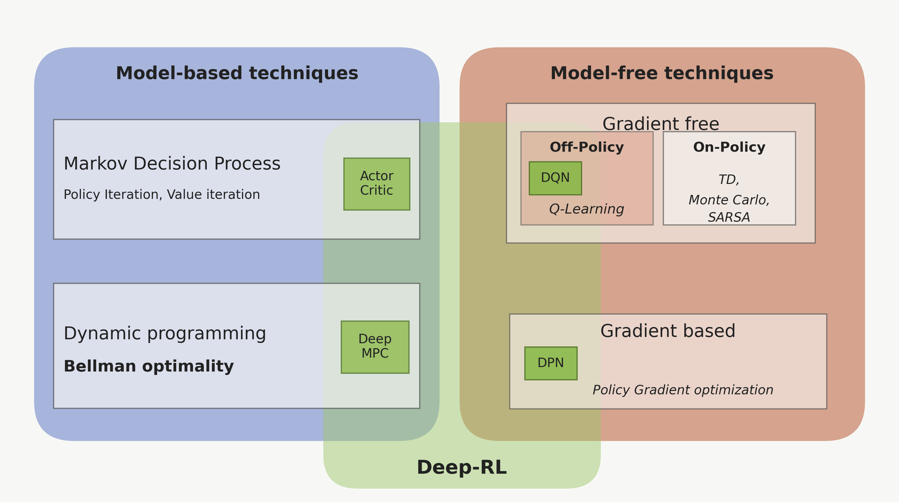
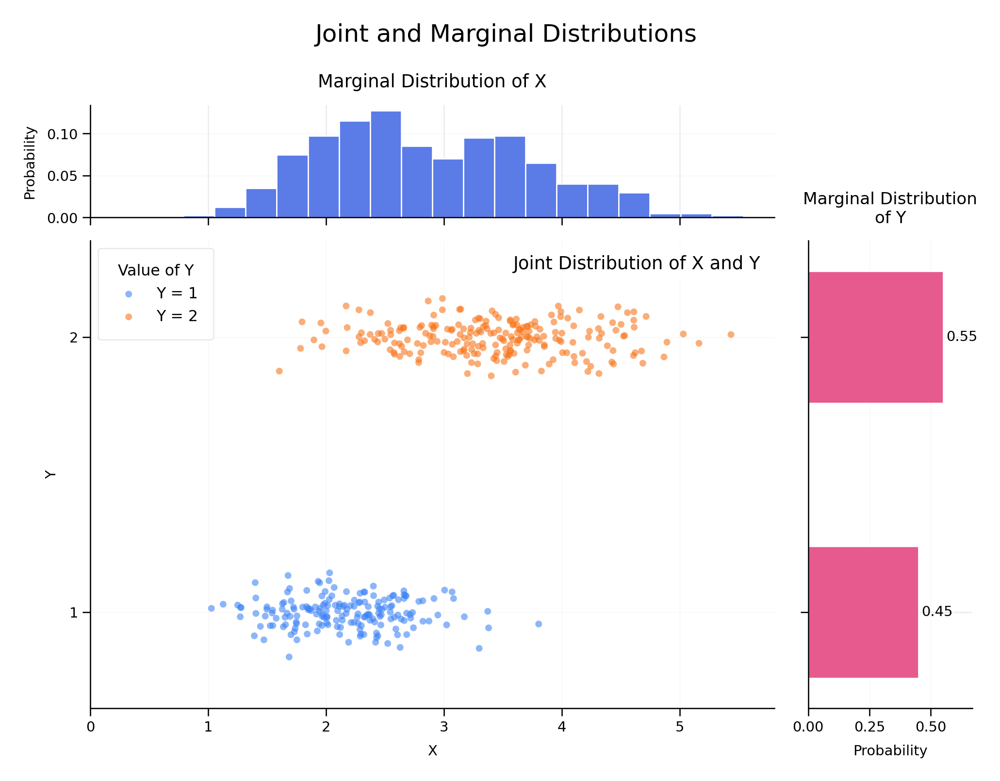
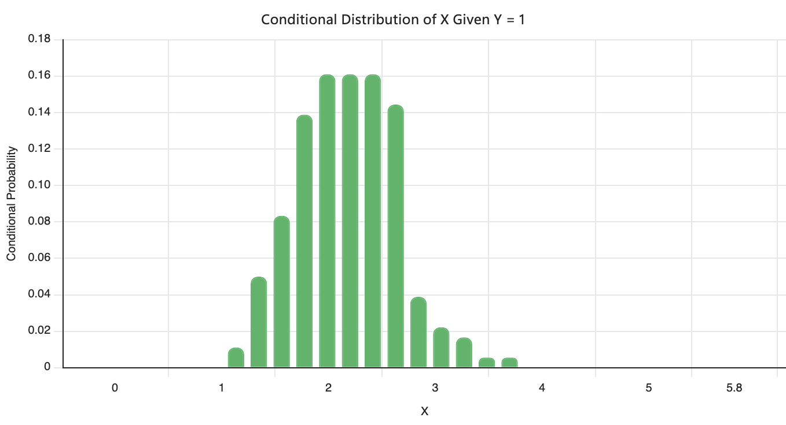
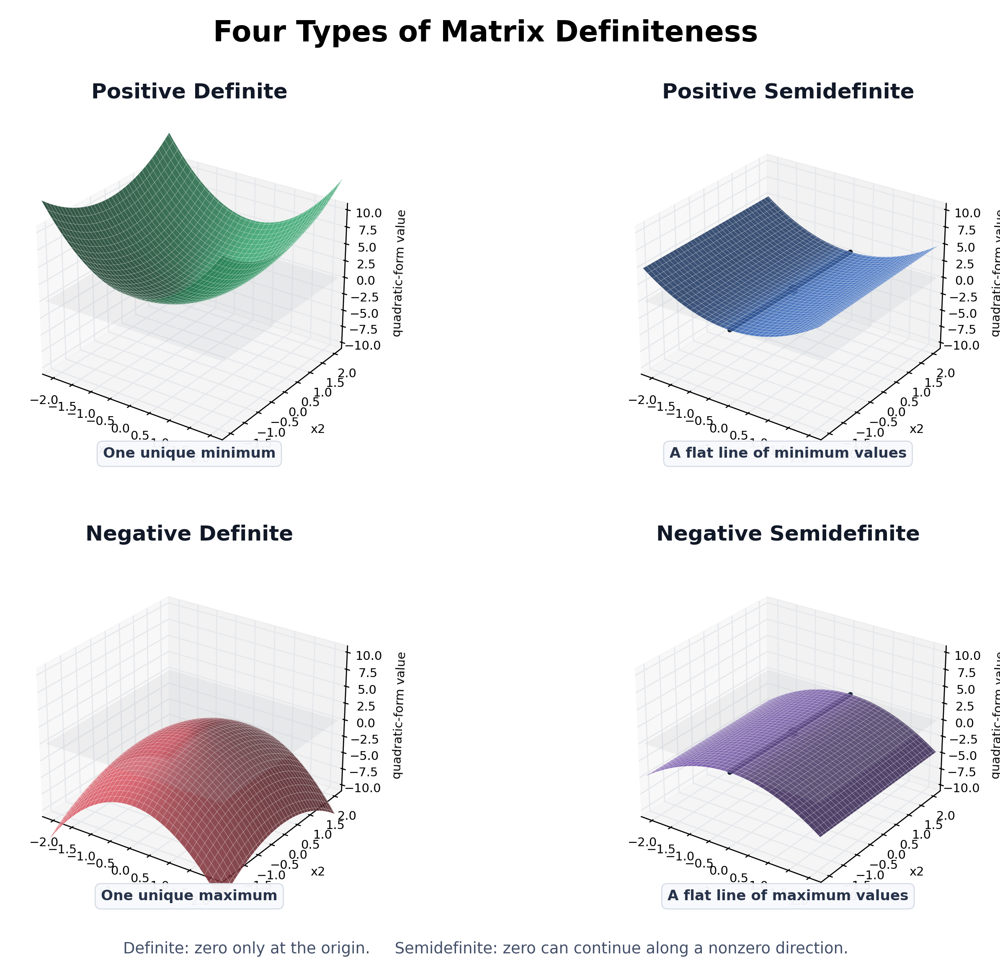

## Reinforcement Learning

- Learn how to make a good sequence of decisions by interacting with the environment.



### Characteristics of RL

- **Trial and Error**: Based learning approach.
- **Optimization**: Find good sequences of actions or decisions.
- **Delayed Consequences/Rewards**: Takes time to relize the actions or decisions are good or bad.
- **Exploration**: Learn by making decisions or forming actions or through experiences. Trying new actions to discover their effects.
- **Exploitation**: Choosing actions with the highest expected reward, based on current knowledge.
- **Generalization**: Use previous experiences or knowledge to new or unseen situations effectively.

### Framwork of RL

- OpenAI Gym
- Torch RL
- AWS DeepRacer

## RL Math

### Probability

- Sample Space ($\Omega$): The set of all possible outcomes of a random experiment.

#### Bonferroni's Inequality

$$P(A \cap B) \geq P(A) + P(B) - 1$$
$$P(\cap^{n}_{i=1} A_i) \geq \sum_{i=1}^{n} P(A_i) - (n-1)$$

- Gives a lower bound on the intersection probability which is useful when this probability is difficult to compute directly.
- It is useful when the probabilities of individual events are sufficiently large.

#### Boole's Inequality

$$P(\cup^{n}_{i=1} A_i) \leq \sum_{i=1}^{n} P(A_i)$$

for any sets $A_1, A_2, ..., A_n$.

- It is useful when finding an upper bound for the probabilities of the union of events.

#### Bayes' Rule

$$P(A|B) = \frac{P(A \cap B)}{P(B)}$$
$$P(A\cap B) = P(B|A) P(A) = P(A|B) P(B)$$
$$P(A|B)P(B) = P(B|A)P(A)$$
$$P(A|B) = \frac{P(B|A) P(A)}{P(B)}$$

- It allows us to compute the conditional probability $P(A|B)$ from the inverse conditional probability $P(B|A)$.
- Let $A_1, A_2, ..., A_n$ be a partition of the sample space $S$. Then let $B$ be any subset of $S$ we have:

$$P(A_i|B) = \frac{P(B|A_i) P(A_i)}{\sum_{j=1}^{\infty} P(B|A_j) P(A_j)}$$

#### Independent Events

$$P(A \cap B) = P(A) P(B)$$

- A family $A_i :i \in I$ of events is independent if for every finite subset $J \subseteq I$ we have:
$$P\left(\bigcap_{i \in J} A_i\right) = \prod_{i \in J} P(A_i)$$

- The pair-wise independence of events does not imply their mutual independence.

#### Conditional Independence

$$P(A \cap B|C) = P(A|C) P(B|C)$$

- where $P(C) > 0$.
- or equivalently, $P(A|B \cap C) = P(A|C)$ and $P(B|A \cap C) = P(B|C)$.

#### Induced Probability Function

$$P_X(x_i) = P\big(\{w_j \in \Omega : X(w_j) = x_i\}\big)$$

- $\Omega = \{w_1, w_2, ..., w_m\}$ is the sample space.
- $X$ is a random variable with range $X = \{x_1, x_2, ..., x_n\}$.
- The result set $\{w_j \in \Omega : X(w_j) = x_i\}$ is the set of all outcomes in the sample space that map to the value $x_i$ under the random variable $X$.

#### Cumulative Distribution Function (CDF)

$$ F_X(x) = P_X(X \leq x) \quad \forall x \in \mathbb{R}$$

- $F_X(x)$ is a cdf $\iff$ the following conditions hold:
  - **Monotonicity**: $F_X(x)$ is non-decreasing.
  - **Limiting values**: $\lim_{x \to -\infty} F_X(x) = 0$ and $\lim_{x \to \infty} F_X(x) = 1$.
  - **Right-Continuity**: $\lim_{y \downarrow x} F_X(y) = F_X(x) \quad \forall x \in \mathbb{R}$.

```text
F_X(t)

1.0 |                         ●────────────
    |                         ↑  ↑  ↑
    |                      3.001 3.01 3.1
0.7 |              ●─────────○
    |              ↑  ↑  ↑
    |           2.001 2.01 2.1
0.3 |     ●────────○
    |     ↑  ↑  ↑
    |  1.001 1.01 1.1
0.0 |─────○
    +-------------------------------------- t
          1         2         3
          x         x         x
```

#### Continuous & Discrete Random Variables

- if $X$ is **continuous**, then $F_X(x)$ is **continuous and differentiable** almost everywhere. The probability density function (pdf) is defined as:
  $$f_X(x) = \frac{d}{dx} F_X(x)$$
- if $X$ is **discrete**, then $F_X(x)$ is a **step function** and the probability mass function (pmf) is defined as:
  $$p_X(x_i) = P(X = x_i)$$

```text
1 ────────────────────────━━━━━━━━
                        ╱
                      ╱
                    ╱
                  ╱
0 ━━━━━━━━━━━━━━━───────────────── x
```

```text
1 ─────────────────────────●━━━━━━
                           │
0.7 ─────────────●━━━━━━━━━○
                 │
0.3 ─────●━━━━━━━○
         │
0 ━━━━━━━○──────────────────────── x
         1         2         3
```

```text
1 ──────────────────────────━━━━━━
                          ╱
                        ╱
0.7 ───────────●━━━━━━━
               │
0.5 ───────────○
             ╱
           ╱
0 ━━━━━━━━──────────────────────── x
               a
```

#### Probability Mass Function (PMF)

$$
f_X(x)= \begin{cases} (1-p)^{x-1}p, & x=1,2,3,\ldots \\ 0, & \text{otherwise} \end{cases}
$$  

- A discrete random variable $X$ is given by $f_X(x) = P(X=x)$ for $x \in \mathbb{R}$.
- It represents the probability that **the first success occurs exactly on the $x$-th trial** in a sequence of independent trials.

#### Probability Density Function (PDF)

$$
F_X(x) = \int_{-\infty}^{x} f_X(t) dt \quad \forall x \in \mathbb{R}
$$

- A continuous random variable $X$ is given by $f_X(x)$ for $x \in \mathbb{R}$.
- The probability is calculated as the area under the probability density function over a specific interval.

#### Expectation

$$E[X] = \sum x P(X=x) \quad \text{if } X \text{ is discrete}$$

$$E[X] = \int_{-\infty}^{\infty} x f_X(x) dx \quad \text{if } X \text{ is continuous}$$

- **Linearity**: $E[aX + bY + c] = aE[X] + bE[Y] + c$ for any constants $a$, $b$, and $c$.
- **Non-negativity**: If $X \geq 0$ then $E[X] \geq 0$ because it is a weighted average of non-negative values.
- **Monotonicity**: If $X \geq Y$ then $E[X] \geq E[Y]$ because it is a weighted average of values that are greater than or equal to the corresponding values of $Y$.
- **Boundedness**: If $a \leq X \leq b$ then $a \leq E[X] \leq b$ because it is a weighted average of values that are bounded by $a$ and $b$.

```text
a ●──────────────●──────────────● b
       가능한 값들    평균
                   E[X]
```

#### Moments

$$ \mu'_n = E[X^n] \quad \forall n \in \mathbb{N} $$

- The $n^{th}$ central moment of $X$ is:
$$ \mu_n = E[(X - E[X])^n] = E(X - \mu)^n $$

- 1th central moment is the mean, $\mu_1 = E[X]$.
- 2th central moment is the variance, $\mu_2 = E[(X - E[X])^2] = \text{Var}(X)$.
  - It emphasizes the variability of the distribution.
  - $\text{Var}(aX + b) = a^2 \text{Var}(X)$ for any constants $a$ and $b$.
- 3th central moment is the skewness, $\mu_3 = E[(X - E[X])^3]$.
  - It emphasizes the skewness of the distribution.
- 4th central moment is the kurtosis, $\mu_4 = E[(X - E[X])^4]$.
  - It emphasizes the tail behavior and extreme values of the distribution.

#### Covariance

$$ \text{cov(X, Y)} = E[(X - E[X])(Y - E[Y])]$$

- It measures how muc htwo random variables change together.
- Negative Covariance
- Near Zero Covariance
- Positive Covariance

```text
Y: 시험 점수

높음  |                ●
     |          ●  ●
     |       ●
     |    ●
낮음  | ●
     +-------------------- X: 공부 시간
       적음             많음

       Cov(X,Y) > 0
```

#### Correlation

$$ p(X, Y) = \frac{\text{cov(X, Y)}}{\sqrt{\text{Var}(X)\text{Var}(Y)}}$$

- Individual variances must be non-zero.
- $p(X, Y)$ lies in the range $[-1, 1]$.

#### Joint Distributions

$$f_{X,Y}:\mathbb{R}^2\to[0,1], \\ f_{X,Y}(x,y) = P(X=x, Y=y) \quad \text{if } X, Y \text{ are discrete}$$

- Joint Probability Mass Function (PMF) for discrete random variables $X$ and $Y$.

```text
Y
1 ┤  ● 1/4       ● 1/4
  │ (0,1)       (1,1)
0 ┤  ● 1/4       ● 1/4
  │ (0,0)       (1,0)
  └──────────────────── X
      0           1
```

#### Marginal Distributions

$$f_X(x) = \sum_{y} f_{X,Y}(x,y) \\ f_Y(y) = \sum_{x} f_{X,Y}(x,y)$$

- Fixing one variable and summing over the other variable gives the marginal distribution of the fixed variable.

```text
             Y=0       Y=1       행의 합
X=0          0.10      0.20        0.30
X=1          0.30      0.40        0.70
             ─────────────────────────
열의 합       0.40      0.60        1.00
```

- $f_X(0) = 0.10 + 0.20 = 0.30$: sum of the first row.
- $f_X(1) = 0.30 + 0.40 = 0.70$: sum of the second row.
- $f_Y(0) = 0.10 + 0.30 = 0.40$: sum of the first column.
- $f_Y(1) = 0.20 + 0.40 = 0.60$: sum of the second column.
- **Marginalization**: It sums or integrates over all possible values of an unwanted variable to obtain the distribution of the variable of interest.



#### Conditional Distributions

$$f_{X|Y}(x|y) = P(X = x | Y = y) = \frac{f_{X,Y}(x,y)}{f_Y(y)} \quad \text{if } f_Y(y) > 0$$

- It represents the probability distribution of $X$ given that $Y$ has a specific value.
- If $f_Y(y) = 0$, then $f_{X|Y}(x|y)$ is undefined.



#### Bernoulli Distribution

$$X = \begin{cases} 1, & \text{with probability } p \\ 0, & \text{with probability } 1-p \end{cases}$$

- $E[X] = p$
- $\text{Var}(X) = p(1-p)$
- The outcome of a Bernoulli trial is either **a success (1) or a failure (0)**.

#### Binomial Distribution

- probability of success in a single trial: $p$
- probability of failure in a single trial: $q = 1 - p$

$$ P(X = x|n, p) = \binom{n}{x} p^x q^{n-x} \\ \text{where} \binom{n}{x} = \frac{n!}{x!(n-x)!}, \quad 0 \leq x \leq n$$

- $E[X] = np$
- $\text{Var}(X) = npq = np(1-p)$
- The binomial distribution describes **the number of successes in a fixed number of independent** Bernoulli **trials**.
- $X \sim \text{Binomial}(10, 0.7)$
  - $P(X = 7) = \binom{10}{7} (0.7)^7 (0.3)^3 \approx 0.2668$

#### Geometric Distribution

- probability of success in a single trial: $p$
- probability of failure in a single trial: $q = 1 - p$

$$ P(X = x|p) = (q^{x-1}) p \\ \text{where } x = 1, 2, 3, ... $$

- $E[X] = \frac{1}{p}$
- $\text{Var}(X) = \frac{q}{p^2}$
- The geometric distribution describes **the number of trials before the first success** in a sequence of independent Bernoulli trials.
- $X \sim \text{Geometric}(0.7)$
  - $P(X = 3) = (0.3)^2 (0.7) \approx 0.063$

#### Uniform Distribution

$$f_X(x|a,b) = \begin{cases} \frac{1}{b-a}, & a \leq x \leq b \\ 0, & \text{otherwise} \end{cases}$$

- $E[X] = \frac{a+b}{2}$
- $\text{Var}(X) = \frac{(b-a)^2}{12}$
- The uniform distribution describes **a continuous random variable that has an equal probability of taking any value within a specified range**.
- The probability depends on the length of the interval, not its location.

#### Normal Distribution

$$ f_X(x) = \frac{1}{\sqrt{2\pi\sigma^2}} e^{-\frac{(x-\mu)^2}{2\sigma^2}}, \quad -\infty < x < \infty $$

$$ X \sim N(\mu, \sigma^2) $$

- **Central Limit Theorem**: the distribution of the sum (or average) of a large number of independent, identically distributed variables will be approximately normal, regardless of the underlying distribution.

$$ \bar{X} = \frac{1}{n} \sum_{i=1}^{n} X_i \approx N\left(\mu, \frac{\sigma^2}{n}\right) $$

#### Multivariate Normal Distribution

$$ N(x|\mu, \Sigma) = \frac{1}{\sqrt{(2\pi)^D |\Sigma|}} e^{-\frac{1}{2} (x-\mu)^T \Sigma^{-1} (x-\mu)} $$

- $\mu$ is the $D$-dimensional mean vector.
- $\Sigma$ is the $D \times D$ covariance matrix.
- $|\Sigma|$ is the determinant of the covariance matrix.

#### Beta Distribution

$$f(x|\alpha, \beta) = \frac{\Gamma(\alpha + \beta)}{\Gamma(\alpha)\Gamma(\beta)} x^{\alpha - 1} (1 - x)^{\beta - 1}, \quad 0 < x < 1$$

- $\Gamma(n) = (n-1)!$ is the gamma function.
- $E[X] = \frac{\alpha}{\alpha + \beta}$
- $\text{Var}(X) = \frac{\alpha \beta}{(\alpha +
  \beta)^2 (\alpha + \beta + 1)}$

```text
α < β                  α = β                  α > β

높이                   높이                   높이
│╲                     │    ╭──╮             │        ╱
│ ╲___                 │  ╭─╯  ╰─╮           │    ___╱
└──────── x            └────────── x         └──────── x
0        1             0          1           0        1

0 쪽 강조              가운데 강조             1 쪽 강조
```

```text
Beta(8,2)                 Beta(80,20)

       ╭────╮                    /\
     ╭─╯    ╰─╮                 /  \
─────╯        ╰───        ─────/────\─────
         0.8                      0.8

불확실성 큼                 불확실성 작음
```

- $p | \text{data} \sim \text{Beta}(\alpha + s, \beta + f)$
  - where new observations are $s$ successes and $f$ failures.
- The Beta distribution is a distribution of success probabilities for a Bernoulli or Binomial distribution.
- Application
  - Measuring uncertainty in the probability of success for a Bernoulli or Binomial distribution.
  - Conversion rate or click-through rate (CTR) in online advertising.
  - Defect rate in manufacturing.

### Linear Algebra

#### Axioms of Vector Spaces

- **Commutative Law**: $u + v = v + u, \quad \forall u, v \in V$
- **Associative Law**: $(u + v) + w = u + (v + w), \quad \forall u, v, w \in V$
- **Additive Identity**: $\exists 0 \in V$ such that $v + 0 = v, \quad \forall v \in V$
- **Additive Inverse**: $\forall v \in V, \exists -v \in V$ such that $v + (-v) = 0$
- **Distributive Law**:
  - $a(u + v) = au + av, \quad \forall a \in F, u, v \in V$
  - $(a + b)v = av + bv, \quad \forall a, b \in F, v \in V$
- **Associative Law**: $(ab)v = a(bv), \quad \forall a, b \in F, v \in V$
- **Unitary Law**: $1v = v, \quad \forall v \in V$

#### Subspace

- $x + \alpha y \in W, \quad \forall x, y \in W, \forall \alpha \in \mathbb{R}$

#### Norm

$$ f: \mathbb{R}^n \to \mathbb{R} $$

- It outputs a real number that represents the length or size of a vector in a vector space.

$$ x=(x_1,x_2,\ldots,x_n) \mapsto f(x)=\lVert x\rVert $$

- **Non-negativity**: $\forall x \in \mathbb{R}^n, \quad \lVert x\rVert \geq 0$
- **Definiteness**: $f(x) = 0 \iff x = 0$
- **Homogeneity**: $\forall x \in \mathbb{R}^n, \quad \forall t \in \mathbb{R}, f(tx) = |t| f(x)$
- **Triangle inequality**: $\forall x,y \in \mathbb{R}^n, \quad f(x+y) \leq f(x) + f(y)$
  - $\lVert x + y \rVert \leq \lVert x \rVert + \lVert y \rVert$
- A norm is non-negative, only the zero vector has a norm of zero, scaling a vector by two doubles its norm, and the direct distance cannot be greater than the detoured distance.

$$ \lVert x \rVert_p = (\sum_{i=1}^{n} |x_i|^p)^{\frac{1}{p}}, \quad p \geq 1 $$

- **L1 norm**: $\lVert x \rVert_1 = \sum_{i=1}^{n} |x_i|$
  - Manhattan distance.
- **L2 norm**: $\lVert x \rVert_2 = \sqrt{\sum_{i=1}^{n} |x_i|^2}$
  - Euclidean distance.
- **L-infinity norm**: $\lVert x \rVert_\infty = \max_i|x_i|$
  - $ \lVert (3, 4) \rVert_\infty = \max\{3, 4\} = 4 $

$$ \lVert A \rVert_F = \sqrt{\sum_{i=1}^{m} \sum_{j=1}^{n} |a_{ij}|^2} = \sqrt{\text{tr}(A^T A)} $$

- **Frobenius norm**: $A = \begin{bmatrix} 1 & 2 \\ 3 & 4 \end{bmatrix}$
  - $ \lVert A \rVert_F = \sqrt{1^2 + 2^2 + 3^2 + 4^2} = \sqrt{30} $
  - It is the square root of the sum of the absolute squares of its elements.

#### Span

$$ span\{x_1, x_2, ..., x_n\} = \{ \alpha_1 x_1 + \alpha_2 x_2 + ... + \alpha_n x_n : \alpha_n \in \mathbb{R}\} $$

- A set of vertors $X = \{x_1, x_2, ..., x_n\}$ in a vector space $V$ is said to **span** $V$ if every vector in $V$ can be expressed as a linear combination of the vectors in $X$.
- Span is the entire region that can be reached **by scaling and adding the given vectors**.

#### Range

$$ R(A) = \{\alpha_1 a_1 + \alpha_2 a_2 + ... + \alpha_n a_n : \alpha_n \in \mathbb{R}\} $$

- The range of a matrix $A$ is the set of all possible linear combinations of its column vectors.
- Same as the **columnspace** of the matrix $A$.

#### Nullspace

$$ N(A) = \{x \in \mathbb{R}^n : Ax = 0\} $$

- A set of all vectors that equal **0** when multiplied by the matrix $A$.
- The dimensionality of the nullspace is called the **nullity** of the matrix $A$.

#### Linear Independence

- A set of vectors $\{v_1, v_2, ..., v_n\}$ is said to be **linearly independent** if the only solution to the equation $\alpha_1 v_1 + \alpha_2 v_2 + ... + \alpha_n v_n = 0$ is $\alpha_1 = \alpha_2 = ... = \alpha_n = 0$.
- **Column rank**: The maximum number of linearly independent column vectors in a matrix.
- **Row rank**: The maximum number of linearly independent row vectors in a matrix.
- If one row vector is a combination of other row vectors, then it is **linearly dependent**.
- The number of rows that are removed due to redundancy is the **Rank** of the matrix.
- Due to the redundancy, the number of directions which is vanishing is the **Nullity** of the matrix.

#### Rank

$$ Rank(A) = \text{dim}(R(A)), \quad A \in \mathbb{R}^{m \times n} $$

- $rank(A) \leq \min(m, n), \quad A \in \mathbb{R}^{m \times n} $
  - if $rank(A) = min(m, n)$, then $A$ is said to be **full rank**.
  - Rank cannot exceed the number of rows or columns in the matrix.
- $rank(A) = rank(A^T), \quad A \in \mathbb{R}^{m \times n} $
  - The rank of a matrix is equal to the rank of its transpose.
  - The amount of independent information in the rows is equal to the amount of independent information in the columns.
- $rank(AB) \leq \min(rank(A), rank(B)), \quad A \in \mathbb{R}^{m \times n}, B \in \mathbb{R}^{n \times p}$
  - The information content of the product of two matrices cannot exceed the information content of either matrix.
- $rank(A + B) \leq rank(A) + rank(B), \quad A, B \in \mathbb{R}^{m \times n}$
  - The information content of the sum of two matrices cannot exceed the sum of the information content of each matrix.

#### Orthogonal Matrices

$$ U \in \mathbb{R}^{n \times n} \text{ is orthogonal } \iff v_i^T v_j = \begin{cases} 1 & \text{if } i = j \\ 0 & \text{if } i \neq j \end{cases} $$

- $UU^T = U^TU = I_n$
- $\lVert Ux \rVert_2 = \lVert x \rVert_2, \quad \forall x \in \mathbb{R}^n$
- **Orthonormal**: A set of vectors is orthonormal if they are all unit vectors and orthogonal to each other.
- **Rotation**: $$ R(\theta) = \begin{bmatrix} \cos\theta & -\sin\theta \\ \sin\theta & \cos\theta \end{bmatrix} $$
- **Reflection**: $$ R = \begin{bmatrix} 1 & 0 \\ 0 & -1 \end{bmatrix} $$

#### Quadratic Form

$$ Q(x) = x^T A x, \quad A \in \mathbb{R}^{n \times n} $$

- The quadratic form $x^TAx$ gives a scalar value that **measures the cost, energy, or weighted magnitude of the vextor $x$**, according to the quadratic surface defined by the matrix $A$.
  - Positive definite: $Q(x) > 0, \quad \forall x \neq 0$
  - Positive semi-definite: $Q(x) \geq 0, \quad \forall x \neq 0$
  - Negative definite: $Q(x) < 0, \quad \forall x \neq 0$
  - Negative semi-definite: $Q(x) \leq 0, \quad \forall x \neq 0$
  - Indefinite: $Q(x)$ can be positive or negative for different $x \neq 0$



- 행렬의 정부호성(양의 정부호, 양의 준정부호, 음의 정부호, 음의 준정부호, 부정정부호)

$$ A^TA = A^TA \implies Q(x) = x^T A^T A x = (Ax)^T (Ax) = \lVert Ax \rVert^2 \geq 0 $$

- Always positive semi-definite because it is the square of the norm of the vector $Ax$.

#### Eigenvalues & Eigenvectors

$$ \lambda \in \mathbb{R} \text{ is an eigenvalue of } A \in \mathbb{R}^{n \times n} \iff A\vec{x} = \lambda \vec{x} , \quad \vec{x} \in \mathbb{R}^n, \vec{x} \neq 0 $$

- An eigenvector is a nonzero vector that remains on the same line when transformed by a matrix.
- Its eigenvalue tells us how much the vector is scaled and whether its direction is reversed.

$$\text{det}(A - \lambda I) = 0$$

- $A = \begin{bmatrix} 4 & 1 \\ 2 & 3 \end{bmatrix}$
- $A - \lambda I = \begin{bmatrix} 4 - \lambda & 1 \\ 2 & 3 - \lambda \end{bmatrix}$
- $\text{det}(A - \lambda I) = (4 - \lambda)(3 - \lambda) - 2 = \lambda^2 - 7\lambda + 10 = (\lambda - 5)(\lambda - 2) = 0$
- $ \lambda_1 = 5, \quad \lambda_2 = 2 $

$$\text{tr}(A) = \sum_{i=1}^{n} \lambda_i$$

- The trace is the sum of the scaling factors along all eigenvector directions.

$$ \text{det}(A) = \prod_{i=1}^{n} \lambda_i $$

- The determinant is the product of the eigenvalues, representing the overall signed scaling factor for area or volume.

$$ rank(A) = \text{number of non-zero eigenvalues of } A $$

- For a diagonalizable matrix, the rank equals the number of nonzero eigenvalues, counted with multiplicity.

$$ \lambda_i (A^{-1}) = \frac{1}{\lambda_i(A)} $$

- The eigenvalues of the inverse of a matrix are the reciprocals of the eigenvalues of the original matrix.

$ A \vec{x} = \lambda \vec{x} \\ \implies A^{-1} A \vec{x} = A^{-1} \lambda \vec{x} \\ \implies \vec{x} = \lambda A^{-1} \vec{x} \\ \implies A^{-1} \vec{x} = \frac{1}{\lambda} \vec{x}$

#### Diagonalization

$S = \begin{bmatrix} \vdots & \vdots & \cdots & \vdots \\ \vec{v_1} & \vec{v_2} & \cdots & \vec{v_n} \\ \vdots & \vdots & \cdots & \vdots \end{bmatrix}$
$AS = \begin{bmatrix} \vdots & \vdots & \cdots & \vdots \\ \lambda_1\vec{v_1} & \lambda_2\vec{v_2} & \cdots & \lambda_n\vec{v_n} \\ \vdots & \vdots & \cdots & \vdots \end{bmatrix} \\ = \begin{bmatrix} \vdots & \vdots & \cdots & \vdots \\ \vec{v_1} & \vec{v_2} & \cdots & \vec{v_n} \\ \vdots & \vdots & \cdots & \vdots \end{bmatrix} \begin{bmatrix} \lambda_1 & 0 & \cdots & 0 \\ 0 & \lambda_2 & \cdots & 0 \\ \vdots & \vdots & \ddots & \vdots \\ 0 & 0 & \cdots & \lambda_n \end{bmatrix} \\ = S\Lambda$

- $S^{-1}AS = \Lambda$
  - $AS = S\Lambda$
  - $S^{-1}AS = S^{-1}S\Lambda = \mathbb{I}\Lambda = \Lambda$
  - A matrix $A$ that appears complicated in the original coordinate system becomes the diagonal matrix $\Lambda$ when expressed in the eigenvector coordinate system.
- $A = S\Lambda S^{-1}$
  - In the eigenvector basis, the matrix $A$ becomes the diagonal matrix $\Lambda$.

#### Symmetric Matrices

- A real symmetric matrix satisfies $A=A^T$.
- All eigenvalues of a real symmetric matrix are real.
- A real symmetric matrix has a complete set of orthonormal eigenvectors.
- Therefore, the eigenvector matrix $S$ is orthogonal.

$$
S^TS=\mathbb{I}
\quad\Longrightarrow\quad
S^{-1}=S^T
$$

- The diagonalization of a symmetric matrix is

$$
A=S\Lambda S^T
$$

- $S$ contains the orthonormal eigenvectors of $A$.
- $\Lambda$ contains the corresponding eigenvalues.
- $S^T$ converts $x$ into the eigenvector basis.
- $\Lambda$ scales each eigenvector direction by its corresponding eigenvalue.
- $S$ converts the result back to the original basis.

#### Definiteness of Symmetric Matrices

- Using $A=S\Lambda S^T$ and $y=S^Tx$,

$$
x^TAx
=
x^TS\Lambda S^Tx
=
y^T\Lambda y
=
\sum_{i=1}^{n}\lambda_i y_i^2
$$

- $y_i$ is the component of $x$ along the $i$-th eigenvector.
- Since $y_i^2\geq0$, the sign of $x^TAx$ depends entirely on the signs of the eigenvalues.

- If all eigenvalues are positive, $A$ is **positive definite**.

$$
\lambda_i>0\text{ for all }i
\quad\Longrightarrow\quad
x^TAx>0\text{ for all }x\neq0
$$

- If all eigenvalues are non-negative, $A$ is **positive semidefinite**.

$$
\lambda_i\geq0\text{ for all }i
\quad\Longrightarrow\quad
x^TAx\geq0
$$

- If all eigenvalues are negative, $A$ is **negative definite**.

$$
\lambda_i<0\text{ for all }i
\quad\Longrightarrow\quad
x^TAx<0\text{ for all }x\neq0
$$

- If all eigenvalues are non-positive, $A$ is **negative semidefinite**.

$$
\lambda_i\leq0\text{ for all }i
\quad\Longrightarrow\quad
x^TAx\leq0
$$

- If $A$ has both positive and negative eigenvalues, $A$ is **indefinite**.
- The eigenvectors determine the principal directions of the quadratic surface.
- The eigenvalues determine the curvature and sign along those directions.
- The definiteness of a symmetric matrix is determined entirely by the signs of its eigenvalues.

#### Eigenvalues of a Positive Semidefinite Matrix

- If $A$ is positive semidefinite, then

$$
x^TAx\geq0
$$

- For an eigenvector $\vec{x}\neq\vec{0}$ with eigenvalue $\lambda$,

$$
A\vec{x}=\lambda\vec{x}
$$

$$
\vec{x}^{\,T}A\vec{x}
=
\vec{x}^{\,T}(\lambda\vec{x})
=
\lambda\vec{x}^{\,T}\vec{x}
=
\lambda\lVert\vec{x}\rVert^2
\geq0
$$

- Since $\vec{x}\neq\vec{0}$,

$$
\lVert\vec{x}\rVert^2>0
$$

- Therefore,

$$
\lambda\geq0
$$

- Hence, all eigenvalues of a positive semidefinite matrix are non-negative.
- A zero eigenvalue means that the corresponding eigenvector direction is collapsed to the zero vector.
