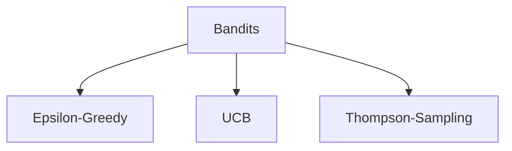

## Sequential Decision Making

- A sequence is a series of events or actions that occur in a specific order over time.
- **Goal**: select actions that maximize total expected future reward.
- It may require balancing immediate and long-term rewards.
- It may be better to sacrifice short-term gains for long-term benefits.
- It may require strategic behavior to achieve high rewards.

### Example of SDM

- Web Ads
  - Agent AdBot
    1. Choose and Ad $A_t$.
    2. Receives View time $O_t$
    3. Receives Click on Ad $R_t$
  - Environment
    1. Receives the Chosen Ad $A_t$.
    2. Provides the View time $O_{t+1}$.
    3. Provides the Click on Ad $R_{t+1}$.
- Robot picking trash
  - Agent Robot
    1. Moves arms to pickup trash $A_t$.
    2. Receives Camera image of the room $O_t$.
    3. Receives Reward if no trash on the floor $R_t$
  - Environment
    1. Receives robots action/arm movements $A_t$.
    2. Provides Camera Image of the room $O_{t+1}$.
    3. Provide reward of +1 $R_{t+1}$
- Robot making Pizza.
  - Agent Robot
    1. Makes an action from Action space $A_t$ (a range of possible actions, Arm Movements, Get Pizz from Oven, Place Pizza on Tray, Cut Pizza...).
    2. Receives Camera image of the kitchen $O_t$.
    3. Receives Reward if pizza is made correctly $R_t$
  - Environment
    1. Receives robots action/arm movements $A_t$.
    2. Provides Camera Image of the kitchen $O_{t+1}$.
    3. Provide reward appropriate to the action $R_{t+1}$.
  - Reward space
    - +10 Successfully made pizza.
    - +1 Get Pizza from oven.
    - +1 Place Pizza on tray.
    - +1 Get Packing box.
    - +1 Cut Pizza successfully.

## Rewards

- a scalar signal that indicates how well the agent is doing at time step $t$. (agent's performance)
- Examples of rewards:
  - Robot play soccor:
    - $+ve$ reward for scoring a goal.
    - $-ve$ reward for kicking the ball out of bounds.
  - Chess
    - $+ve$ reward for winning the game.
  - Autonomous drone flying stunt:
    - $+ve$ reward for following the intended trajectory.
    - $-ve$ reward for crashing into an obstacle.

## History

$$ H_t = \{O_1, A_1, R_1, O_2, A_2, R_2, ..., O_t, A_t, R_t\} $$

- a sequence of past Observations, Actions, and Rewards up to time step $t$.
- Agent selects actions base on history.
- Environment selects observations and reward.

## State

$$ S_t = f(H_t) $$

- The information used to determine what happens next.
- A function of the history that captures all relevant information for decision-making.

### Environment State

- $S_t^e$: the environment's private representation of the current state.
- It used to generate next observation and reward.
- It is not directly accessible to the agent (Invisible to the agent).
- If it is visible to the agent, it may contain information not required by the agent to make decisions (e.g., the internal state of a robot's motors).

### Agent State

- $S_t^a$: the agent's private representation of its state.
- Information used to pick next action and used by RL algorithms to learn from experience.
- It can be a function of the history: $S_t^a = f(H_t)$

### Information State

$$P[S_{t+1} | S_t] = P[S_{t+1} | S_1, \cdots, S_t]$$

- It contains all useful information from the history as known as the **Markov State**.
- `Probability[next state | current state] =  Probability[next state | given the whole history]`
- The future is independent of the past given the present.
- The dog example illustrates a situation where the agent needs to remember past signals in order to receive a food reward.
- Possible definitions of the agent state:
  - Last 3 events in the sequence
    - Example: bell ring → light → bell press
    - Useful when recent observations are enough to predict the reward
  - Counts of events
    - Example: number of lights, bell rings, and bell presses
    - Useful for compressing information, but it loses the order of events
  - Complete sequence
    - Example: bell ring → light → bell press → bell ring → ...
    - Contains all past information, but can become too large and difficult to learn from
- Each state definition **involves a trade-off between the amount of information stored and the complexity of learning**.
- A good state should **contain enough information to predict the next state and reward**.

## Markov assumption

- Markov assumption is popular because it simplifies decision-making in RL.
- A Markov state can always be created by defining the state as the full history:
  - $S_t = H_t$
  - This includes all past observations, actions, and rewards.
  - It satisfies the **Markov property** because no extra past information is needed.
- However, using the full history creates a very large state space.
  - More computation
  - More memory
  - More data required
  - Harder learning
- Ideally, the current observation is enough:
  - $S_t = O_t$
  - This means the current observation is a sufficient statistic of the history.
  - The agent does not need to remember the full past.
- Smaller state spaces are preferred because they reduce computational complexity and data requirements.
- The choice of state representation affects:
  - Computational complexity
  - Amount of data required
  - Final performance
- Main idea: A good state should be small, but still contain enough information to predict the next state and reward.

### Markov Property

- The current state contains all relevant information from the history needed to predict the future.
- The future is independent of the past given the present state.

## Full Observable Environments, MCPs

$$ O_t = S_t^a = S_t^e $$

- **Full observable**: Agent is able to directly observe the environment.
- Agent State = Environment State = Information State
- Known as **Markov Decision Process**

## Partially Observable Environments, POMDPs

- **Partially observable**: Agent only observes partial information about the environment.
- Agent State != Environment State
- Agent must construct its own internal state \(S_t^a\)
- Ways to construct agent state:
  - Complete history:
    - \(S_t^a = H_t\)
  - Belief state:
    - \(S_t^a = b(S_t^e)\)
    - Probabilities over possible environment states
  - RNN hidden state:
    - previous hidden state + current observation → new hidden state
- Known as **Partially Observable Markov Decision Process**, POMDP.
- Examples:
  - Soccer-playing robot with a camera and limited information about its exact location.
  - Share trading agent that observes current share price but not full market trends or company history.
  - Card games where opponent cards and deck order are hidden.

## Exploration vs Exploitation

- **Exploration**: Learn more about the environment, may lose immediate reward
- **Exploitation**: Exploit known information to maximize rewards
- Discover a good policy, while interacting with the environment, the agent must balance exploration and exploitation.
- These are key aspects of RL learning, due to trial-and-error learning and the need to maximize long-term rewards.
- Examples:
  - Playing Chess
    - Exploitation: Use familiar opening lines that have won in the past.
    - Exploration: Try a new opening sequence.
  - Online Advertisements
    - Exploitation: Show ads with the highest past click rate.
    - Exploration: Show different ads and collect feedback such as clicks or view time.
  - Gold Mining
    - Exploitation: Mine at the best-known location.
    - Exploration: Mine at a new location.

## Bandits



- Actions that are taken has no influence on next observations. (Slot machines)
- No delayed rewards.
- RL problem with one state.
- Examples:
  - Design of Clinical trials
  - Online ad suggestion, placement
  - Games
  - Web page personalization
- Action now, Reward now.
- Single State $(S_t = S_1)$.
- Set of Actions = $\{A_1, A_2, ..., A_n\}$.
- Reward space = $[0, 1]$.
- Learn a Stochastic Reward Function: Reward probabilities for actions are unknown in advance, so they must be learned stochastically through trial and error.

### Online Ad suggestion

$$\text{PayOff} = \text{CTR} \times \text{Payment Rate}$$

- How to maximize PayOff among hundreds thousands of ads?
- CTR, ClickThroughRate: Probability that users click on the ad.
- Payment Rate: Money paid by the advertiser for each click.
- Arms: $\{Ad_1, Ad_2, ..., Ad_n\}$
- Rewards: $\{ \$0: \text{No Click}, \$1: \text{Click} \}$
  - Assuming a uniform payment of $1 for all ads, maximizing revenue simplifies to accurately estimating the Click-Through Rate (CTR).
- **Exploration vs. Exploitation**: Should we display new ads with unknown CTRs to test them (Exploration), or continuously show top-performing ads with the highest historical CTR (Exploitation)?
  - No known optimal solution, but there are many heuristic approaches to balance exploration and exploitation.

### $\epsilon$-Greedy

- a common exploration strategy to balence getween exploiting the current best action and exploring new actions in order to learn an optimal policy.
- Select the Arm with highest average reward so far
- May get struck with no exploration.
- $\epsilon$: The probability of selecting a random arm and used a greedy selection.

```py
Init, for Arm = 1 to k:
  Q(Arm) = 0
  N(Arm) = 0

Loop:
  # Explore
  A = Random action with probability 𝜖
  # Exploit
  A = argmax(Q(Arm)) with probability (1 - 𝜖)

  R = bandit(A)
  N(A) += 1
  Q(A) = Q(A) + (1 / N(A)) * (R - Q(A))
```

- Q: Estimated reward for each Arm
- N: Number of time each Arm is pulled.
- A: Action
- R: Reward

`NewEstimate = OldEstimate + StepSize[Target - OldEstimate]`

### UCB

$$ UCBValue = Q(A) + \sqrt{\frac{2 \ln(t)}{N(A)}} $$

- used to balance between exploiting known good actions and exploring potentially better actions.
- **Optimism in the face of uncertaintiy**: It will choose actions systematically that have a high potential for being optimal based on both their estimated value and their uncertatity.

```bash
Init, for Arm = 1 to k:
  Q(Arm) = 0
  N(Arm) = 0

Loop:
  UCBValue = Q(A) + sqrt((2 * log(t)) / N(A))
  A = argmax(UCBValue)
  R = bandit(A)

  N(A) += 1
  Q(A) = Q(A) + (1 / N(A)) * (R - Q(A))
```

- t: Time step
- Q: Estimated reward for each Arm
- N: Number of time each Arm is pulled
- A: Action
- R: Reward

General Update Rule same as $\epsilon$-Greedy.
