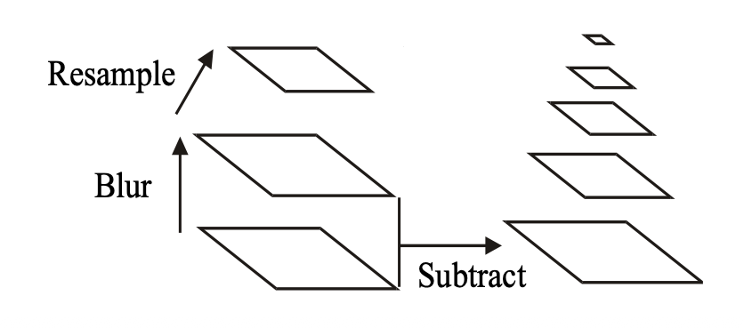

## Edge Detectors

- Roberts, Sobel, Prewitt
  - Simple and fast
  - Must verify if they are adequate for the application
  - Sobel is often used
- LoG, Canny
  - More sophisticated
  - LoG uses the total gradient magnitude and direction to find edges
  - Canny uses the 2nd derivative magnitude in the gradient direction
  - Canny is more accurate and most often used

## Binary Morphology

- Taking binary images and modifying them systematically to extract information about the shapes in the image.
- A system of algebraic operations
  - conveniently process binary objects
  - elimate object shape distortions, typically due to acquisition noise
  - decomposing objects into simpler objects for easier shape characterization
- Dilation, Erosion, Closing, Opening, Shrinking, Skeletonization, and Thinning

### Dilation

$A \oplus B = \{ c \in E^N | c = a + b, a \in A, b \in B \}$

```text
# A
0 0 0 0 0 0 0
0 0 0 0 0 0 0
0 0 0 1 0 0 0
0 0 0 1 0 0 0
0 0 0 1 1 0 0
0 0 1 0 0 0 0 
0 0 0 0 0 0 0

# B
1 1 1
1 1 1
1 1 1

# like stamping

# A \oplus B
0 0 0 0 0 0 0
0 0 X X X 0 0
0 0 X X X 0 0
0 0 X X X X 0
0 X X X X X 0
0 X X X 0 0 0
```

```text
# A
0 0 0 0 0 0 0
0 0 0 0 0 0 0
0 0 0 1 0 0 0
0 0 0 1 0 0 0
0 0 0 1 1 0 0
0 0 1 0 0 0 0
0 0 0 0 0 0 0

# B
0 1 0
1 0 1
0 1 0

# A \oplus B
0 0 0 0 0 0 0
0 0 0 X 0 0 0
0 0 X X X 0 0
0 0 X X X 0 0
0 0 X X X X 0
0 X 0 X X 0 0
0 0 X 0 0 0 0
```

### Erosion

$A \ominus B = \{ x \in E^N | x + b \in A, \forall b \in B \}$

- It reducs the image based on the structing element B.
- Simple way of computing the erosion is to translate the initial image in the directions opposite of B 1s and AND the results.
- It checks the neighboring pixels and keeps only the pixels where the entire structuring element fits within the foreground.

### Opening and Closing

$A \circ B = (A \ominus B) \oplus B$

- $A \circ K \neq A$

$A \bullet B = (A \oplus B) \ominus B$

- $A \bullet K \neq A$

### Controlled Erosions

- It doesn't result in the complete removal of the object.
- **Shrinking**: Repeatedly reduces an object until each connected component becomes a single point or a minimal shape.
- **Skeletonization**: Reduces an object to a one-pixel-wide skeleton while preserving its overall topology and structural shape.
- **Thinning**: Reduces the thickness of an object while preserving its connectivity and general shape.

## Object geometrical properties

- Area
- Centroid
- Perimeter pixels
- Perimeter length
- Circularity
  - Haralick circularity
- Bouding box
- Spatial moments

```m
riceim = imread('rice.png')
imshow(riceim);

level = graythresh(riceim);
bw = imbinarize(riceim, level);
rice_level = bwlabel(bw);

rice_level_rgb = label2rgb(rice_level);
imshow(rice_level_rgb);

pl_im = imread("Alaska_Airlines_Boeing_737-898.jpg")
pl_im = imresize(pl_im, 0.25);
pl_grey = rgb2gray(pl_im);
imshow(pl_grey);

se = strel('square', 3);
pl_erode = imerode(pl_BW, se);
pl_erode = imerode(pl_erode, se);
pl_erode = imerode(pl_erode, se);
figure(2);
imshow(pl_erode);

pl_skel = bwmorph(pl_BW, 'skel', Inf);
imshow(pl_skel);

pl_thin = bwmorph(pl_BW, 'thin', Inf);
imshow(pl_thin);

se_close = strel('disk', 20);
pl_close = imclose(pl_BW, se_close);
imshow(pl_close);

pl_skel2 = bwmorph(pl_close, 'skel', Inf);
imshow(pl_skel2);

cell_im = imread('cell.tif');
imshow(cell_im);

cell_edge = edge(cell_im, 'Sobel');
imshow(cell_edge);

se_close = strel('disk', 7);
cell_edge_close = imclose(cell_edge, se_close);
imshow(cell_edge_close);

cell_edge_close_clean = imclearborder(cell_edge_close);
imshow(cell_edge_close_clean);
figure(3);
imshow(labeloverlay(cell_im, cell_edge_close_clean));
```

## Matching, Finding or Tracking Objects

1. Detect invarient features of the image
2. Describe the local area around each feature
3. Match patterns of the local feature descriptions

## Corners

- Invariant to rotation, translation and scaling
- Harris corner detector is a popular method

## Features

- **Detectors**: detects the location of the features in an image or video
- **Descriptors**: summarizes the apperance of the neighborhood.
- Used in many applications: Tracking, object matching, stero vision, object and action recognition.

### SIFT

> Scale-Invariant Feature Transform

1. Build a scale-space pyramid of Differences of Gaussians (DoG) and detect minima/maxima.
2. Localize **Keypoints**
3. Assign key point and orientation and scale
4. Compute the SIFT descriptor at the assigned orientation and scale.


