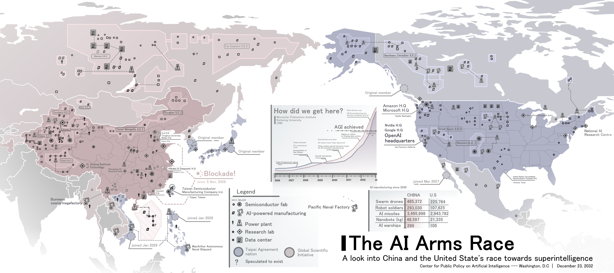

## The AI Arms Race

- As the stakes became higher and higher in a world inching towards superintelligence, no room could be found for safety checks and alignment.

### ACS Code of Professional Ethics

- **2.1.c (Honesty):** Not remain silent when you detect unprofessional conduct.
- **2.2.b (Trustworthiness):** Practise integrity. Be consistent in your views, words and actions. Declare and manage any conflicts of interest. Do not allow the undue influence of others or bias to prevent you complying with this Code.
- **2.2.e (Trustworthiness):** Communicate your own capabilities clearly when accepting, performing and delivering work, including potential learning and growth gaps that may need to be addressed.
- **2.2.f (Trustworthiness):** Not undertake work for which you do not have the necessary skills and knowledge.
- **2.3.1.a (Respect for Others):** For unavoidable harm, develop mitigation strategies.
- **2.3.1.c (Respect for Others):** Be impartial and fair and do not discriminate unfairly against people in interpersonal interactions or in the design and function of systems.
- **2.3.2.c (Respect for the Profession):** Seek to enhance, in the professional choices you make, the environmental sustainability of ICT systems and the overall quality of life of those affected by them. Ensure that the public interest is defended.

## Win-win exploitation

- Mutually beneficial exploitation (착취)
- **Superficial Mutual Benefit:** The vulnerable party receives a minor gain (e.g., small compensation, free service), creating the illusion of voluntary consent.
- **Severe Surplus Asymmetry:** The stronger party captures a vastly disproportionate share of the total value created.
- **Vulnerability & Lack of Alternatives:** Leverages power/information imbalances and the weaker party's lack of viable alternatives.
- **Ethical Rationalization:** The exploiter justifies the unfair structure by claiming "both sides benefit" to deflect moral and systemic responsibility.

## Solutions

- **Expand "Trustworthiness" (Algorithmic Alignment & Truthfulness):**
  - 감사(Audit)가 불가능한 의사결정 벡터를 가진 자율 모델 배포 금지
  - 생성형 AI의 환각(Hallucination)에 대한 출력 신뢰성 검증 의무화
- **Re-engineer "Respect for Others" (Automated Discrimination & Labor):**
  - 알고리즘 편향(Bias) 완화 명시
  - 조작적인 AI 상호작용으로부터 인간의 자율성 보호
  - 워크플로 자동화로 인한 노동력 대체(일자리 감소)에 대한 선제적 완화 계획 수립
- **Reorient "Respect for the Profession" (Planetary & Systemic Safety):**
  - 대규모 연산(High-compute) 모델 학습 시 환경 기준을 타협 불가능한 필수 조건으로 전환
  - 배포 전 단기적 운영 위험뿐만 아니라 장기적·시스템적 위험(Systemic risks)까지 평가 의무화
- **Shift from Principles to Practical Enforceability:**
  - 선언적 원칙에 그치지 않고 '필수 알고리즘 영향 평가' 및 '오픈소스 감사 로그' 같은 실질적인 도구를 전문가 의무로 직접 규정
