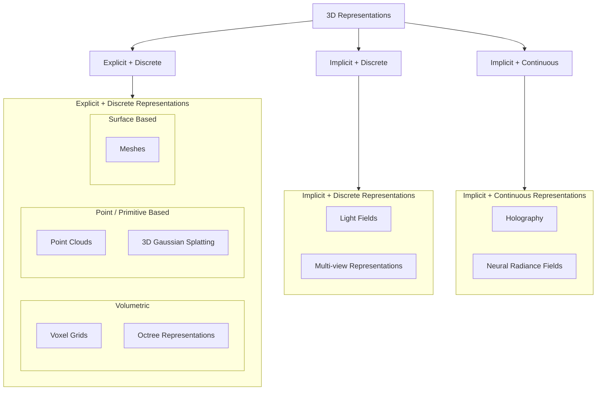

## 3D Taxonomy



- **Explicit representations** store geometric structure directly.
  - The geometry can be directly inspected as points, voxels, vertices, faces, or primitives.
- **Implicit representations** encode 3D structure indirectly.
  - Geometry must be inferred, reconstructed, or queried from a function, field, or set of observations.
- **Discrete representations** consist of a finite set of elements or samples.
- **Continuous representations** define information over a continuous spatial domain.
- **Explicit + Discrete**
  - Voxel grids divide 3D space into uniform volumetric cells.
  - Octrees are hierarchical volumetric representations that adapt resolution to spatial complexity.
  - Point clouds represent a scene as a set of 3D points.
  - 3D Gaussian Splatting represents a scene as a finite set of Gaussian primitives.
  - Meshes represent surfaces using vertices, edges, and faces.
- **Implicit + Discrete**
  - Light fields and multi-view representations store sampled observations rather than explicit geometry.
- **Implicit + Continuous**
  - Neural Radiance Fields represent a scene as a continuous function mapping coordinates and viewing directions to density and color.
  - Holography represents 3D information through optical wave or phase fields.

## Classic 3D Representations

### Point Cloud

- The simplest form of a 3D model, a collection of 3D coordinates of each point plotted in 3D space.
  - Color
  - Reflectance
  - Normals
  - Semantics
- May be unstructured or be defined on a grid.
- Native output of sensors (LiDAR, MVS)
- Static Point Cloud: a single 3D frame without a temporal dimension.
- Dynamic Point Cloud: a sequence of point-cloud frames over time.
  - Dynamic point clouds capture motion and temporal changes in 3D scenes.
  - Instead of encoding every frame independently, changes between frames can be encoded.
- Pros: Flexible, Easy capture
- Cons: No topology, Hard to render well, Coding complexity
- **Photogrammetry**: science of making measurements from photographs
  - it uses photos of an object taking a different locations
- `Vertices -> Edges -> Faces -> Polygons -> Surfaces`
- PCL: Point Cloud Library

```
Point 1 = (1.27, 3.14, 2.81), red
Point 2 = (1.31, 3.12, 2.79), red
Point 3 = ...
```

### Voxels

> Volumetric Pixel

- Divided scene into a regular 3D grid
- Instead of encoding the location of each point, encode if the position in the grid is occupied or not and the color at that point.

$$\text{Voxel}(i,j,k) = [x_i, x_i+Δ] × [y_j, y_j+Δ] × [z_k, z_k+Δ]$$

```
Voxel[0,0,0] = empty
Voxel[0,0,1] = occupied, red
Voxel[0,0,2] = occupied, blue
Voxel[0,0,3] = empty
```

- Pros:
  - Regular grid makes processing easier
  - No need to store explicit coordinates for every occupied voxel; its position is determined by the grid index.
- Cons:
  - No explicit surface topology
  - Hard to render
  - Lots of wasted space if most voxels are empty.

### Octrees

- Divide space coarsely into 8 blocks.
  - If a block contains geometry and the desired resolution has not been reached, subdivide it into 8 sub-blocks.
- Record whether a block is subdivided and link it to its children.
- Continue subdividing until the desired resolution is reached or the block is empty.
- At the target resolution, occupied leaf nodes represent the geometry.
  - Empty regions do not need to be subdivided further.
  - Internal nodes are not empty; they represent regions that have been subdivided.
- Pros:
  - Hierarchical, semi-regular grid structure makes spatial processing easier.
  - No need to store explicit coordinates for every occupied element; its position is determined by the path through the tree.
  - Less wasted space than a dense voxel grid.
  - Adaptive resolution: empty or simple regions can remain coarse, while complex regions can be subdivided further.
- Cons:
  - No explicit surface topology, unlike meshes.
  - Rendering is less direct because the tree must be traversed to find occupied regions.
  - Random access is more expensive than in a regular voxel grid because reaching an element requires tree traversal.
  - Tree structure introduces additional memory and traversal overhead.

### Meshes

- Represent surfaces using connected vertices, edges, and faces.
- Pros:
  - Compact representation of surfaces.
  - Hardware-friendly, especially for GPU rendering.
  - Strong ecosystem and broad support in graphics software and hardware.
- Cons:
  - Complex appearance may require additional textures, materials, or shaders.
  - Sensitive to noise when reconstructed from captured 3D data.
  - Requires explicit topology, which can be difficult to estimate from raw point clouds or scans.

```
Point Cloud
●   ●      ●
    ●
→ 점만 있음

Mesh
●────●
│   /│
│  / │
●────●
→ 어떤 점이 연결되어 surface를 만드는지 알고 있음
```

### Limitations of Geometry Focused Representations

- Geometry does not fully determine appearance.
- Appearance also depends on lighting, material properties, and viewing direction.
- Transparency, refraction, reflections, and view-dependent effects are difficult to represent using geometry alone.
  - Transparency: 유리처럼 뒤가 비쳐 보이는 현상
  - Refraction: 빛이 유리나 물을 통과하면서 방향이 꺾이는 현상
  - Reflection: 금속, 유리 등에 주변 환경이 반사되는 현상
  - View-dependency: 보는 방향에 따라 appearance가 달라지는 현상
- Increasing demand for photorealistic rendering and novel-view synthesis exposes the limitations of geometry-only representations.

## Light Fields and Multi-view Representations

- **Parallax**
  - Apparent shift of objects caused by a change in viewpoint.
  - Nearby objects show a larger image shift than distant objects.
  - The amount of parallax provides information about **depth**.
- **Multi-view Representations**
  - Capture the same scene from multiple viewpoints.
  - Differences between views can be used to recover the **3D structure** of the scene.
  - Moving through the views creates a sense of 3D structure.
  - Intermediate views can be generated using **view interpolation**.
- **Light Fields**
  - Capture both the **position and direction** of incoming light.
  - A microlens array separates light arriving from different directions.
  - A light field can be reorganized into many slightly offset **sub-aperture views**.
  - This is similar to capturing the scene from many nearby viewpoints.
- **Key Idea**
  - Multi-view uses multiple viewpoints to capture parallax.
  - Light fields capture spatial and angular light information more densely.
  - Both can represent 3D structure without explicitly storing geometry.
- Pros
  - Single-shot capture of multiple viewpoints or angular information (Light Field only).
  - High visual fidelity, including view-dependent appearance.
  - Supports computational re-focusing.
  - Can be converted into other representations, such as depth maps, novel views, or 3D geometry.
- Cons
  - High data volume because many views or light-ray samples must be stored.
  - Light Field capture may require specialized camera hardware.
  - Direct Light Field viewing may require specialized display hardware.
  - Spatial or angular resolution can be limited because sensor resolution is shared across multiple views.

### Light Field Re-focusing

- **Light Field Capture**
  - Light field cameras capture light from multiple directions using a **microlens array**.
  - A single capture contains many slightly different **sub-aperture views**.
- **Re-focusing**
  - Objects at different depths show different amounts of parallax across the views.
  - The views can be shifted so that objects at a selected depth align with each other.
  - Aligned objects become sharp when the views are combined.
  - Objects at other depths remain misaligned and appear blurred.
- **Virtual Lens**
  - A virtual lens computationally reproduces the focusing behavior of a physical lens.
  - This allows the focus position to be changed after the image has already been captured.
- **Depth of Field**
  - Depth of field is the range of depths that appear sharp.
  - Light field data can also be used to computationally change the depth of field after capture.

## Holography

- Reflect light off an object and record its wavefront as an interference pattern using a reference beam.
- Recording
  - A laser is split into an object beam and a reference beam.
  - The object beam reflects off the object and carries the object's wavefront information.
  - A sensor can measure light intensity, but cannot directly measure phase.
  - The reference beam is combined with the object beam so their phase difference becomes a recordable interference pattern.
- Reconstruction
  - A reconstruction beam is sent through the recorded interference pattern.
  - The hologram reconstructs the original wavefront, making the object appear in 3D.
- Holography does not directly encode the object's geometry.
  - It encodes the structure of light reflected from the object.
- Pros
  - Physically accurate reconstruction of light rays.
  - No explicit surface reconstruction required.
  - Quick capture.
- Cons
  - High data volume.
  - Requires a stable coherent light source, usually a laser.
  - Difficult to capture colour and large scenes.
  - Holographic display hardware is expensive and complex.
  - Software reconstruction and post-processing are complex.
- Application
  - Digital Holographic Microscopy (DHM) can reconstruct 3D structures such as red blood cells.

```
                     Object
                       ↓
Laser → Beam splitter ─────→ Object beam
          │                  ↓ 반사
          │                  ↓
          └────────────→ Reference beam
                             ↓
                    [ Recording plate ]
                       두 빛이 만남
                             ↓
                   Interference pattern
```

## NeRFs

> Neural Radiance Fields

- [NeRF Studio](https://docs.nerf.studio/)

## Gaussian Splatting

- Instead of building objects using polygons, it represents everything using millions of tiny soft 3D shapes called **Gaussians**.
- Less computational costs, more efficient.
- Run in parallel using GPU rasterization.

1. First, it builds a rough point cloud from images
2. Then, replaces those points with these Gaussian blobs
3. It will optimize them until it match original photos as closely as possible.

```
Gaussian primitive
↓
position
scale
orientation
color
opacity
...
```
