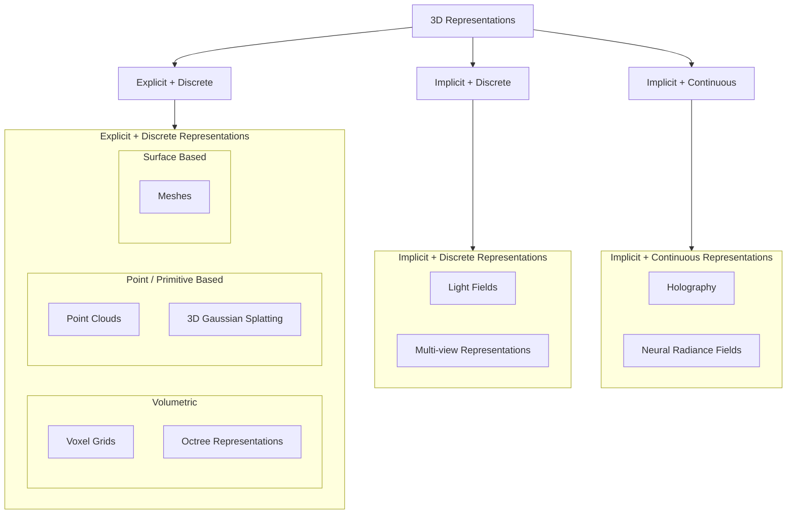

## 3D Taxonomy



- **Explicit representations** store geometric structure directly.
  - The geometry can be directly inspected as points, voxels, vertices, faces, or primitives.
- **Implicit representations** encode 3D structure indirectly.
  - Geometry must be inferred, reconstructed, or queried from a function, field, or set of observations.
- **Discrete representations** consist of a finite set of elements or samples.
- **Continuous representations** define information over a continuous spatial domain.
- **Explicit + Discrete**
  - Voxel grids divide 3D space into uniform volumetric cells.
  - Octrees are hierarchical volumetric representations that adapt resolution to spatial complexity.
  - Point clouds represent a scene as a set of 3D points.
  - 3D Gaussian Splatting represents a scene as a finite set of Gaussian primitives.
  - Meshes represent surfaces using vertices, edges, and faces.
- **Implicit + Discrete**
  - Light fields and multi-view representations store sampled observations rather than explicit geometry.
- **Implicit + Continuous**
  - Neural Radiance Fields represent a scene as a continuous function mapping coordinates and viewing directions to density and color.
  - Holography represents 3D information through optical wave or phase fields.

## Point Cloud

- The simplest form of a 3D model, a collection of 3D coordinates of each point plotted in 3D space.
  - Color
  - Reflectance
  - Normals
  - Semantics
- May be unstructured or be defined on a grid.
- Native output of sensors (LiDAR, MVS)
- Static Point Cloud: a single 3D frame without a temporal dimension.
- Dynamic Point Cloud: a sequence of point-cloud frames over time.
  - Dynamic point clouds capture motion and temporal changes in 3D scenes.
  - Instead of encoding every frame independently, changes between frames can be encoded.
- Pros: Flexible, Easy capture
- Cons: No topology, Hard to render well, Coding complexity
- **Photogrammetry**: science of making measurements from photographs
  - it uses photos of an object taking a different locations
- `Vertices -> Edges -> Faces -> Polygons -> Surfaces`
- PCL: Point Cloud Library

```
Point 1 = (1.27, 3.14, 2.81), red
Point 2 = (1.31, 3.12, 2.79), red
Point 3 = ...
```

## Voxels

> Volumetric Pixel

- Divided scene into a regular 3D grid
- Instead of encoding the location of each point, encode if the position in the grid is occupied or not and the color at that point.

$$\text{Voxel}(i,j,k) = [x_i, x_i+Δ] × [y_j, y_j+Δ] × [z_k, z_k+Δ]$$

```
Voxel[0,0,0] = empty
Voxel[0,0,1] = occupied, red
Voxel[0,0,2] = occupied, blue
Voxel[0,0,3] = empty
```

- Pros:
  - Regular grid makes processing easier
  - No need to store explicit coordinates for every occupied voxel; its position is determined by the grid index.
- Cons:
  - No explicit surface topology
  - Hard to render
  - Lots of wasted space if most voxels are empty.

## Octrees

- Divide space coarsely into 8 blocks.
  - If a block contains geometry and the desired resolution has not been reached, subdivide it into 8 sub-blocks.
- Record whether a block is subdivided and link it to its children.
- Continue subdividing until the desired resolution is reached or the block is empty.
- At the target resolution, occupied leaf nodes represent the geometry.
  - Empty regions do not need to be subdivided further.
  - Internal nodes are not empty; they represent regions that have been subdivided.
- Pros:
  - Hierarchical, semi-regular grid structure makes spatial processing easier.
  - No need to store explicit coordinates for every occupied element; its position is determined by the path through the tree.
  - Less wasted space than a dense voxel grid.
  - Adaptive resolution: empty or simple regions can remain coarse, while complex regions can be subdivided further.
- Cons:
  - No explicit surface topology, unlike meshes.
  - Rendering is less direct because the tree must be traversed to find occupied regions.
  - Random access is more expensive than in a regular voxel grid because reaching an element requires tree traversal.
  - Tree structure introduces additional memory and traversal overhead.

## Meshs

## NeRFs

> Neural Radiance Fields

- [NeRF Studio](https://docs.nerf.studio/)

## Gaussian Splatting

- Instead of building objects using polygons, it represents everything using millions of tiny soft 3D shapes called **Gaussians**.
- Less computational costs, more efficient.
- Run in parallel using GPU rasterization.

1. First, it builds a rough point cloud from images
2. Then, replaces those points with these Gaussian blobs
3. It will optimize them until it match original photos as closely as possible.

```
Gaussian primitive
↓
position
scale
orientation
color
opacity
...
```
