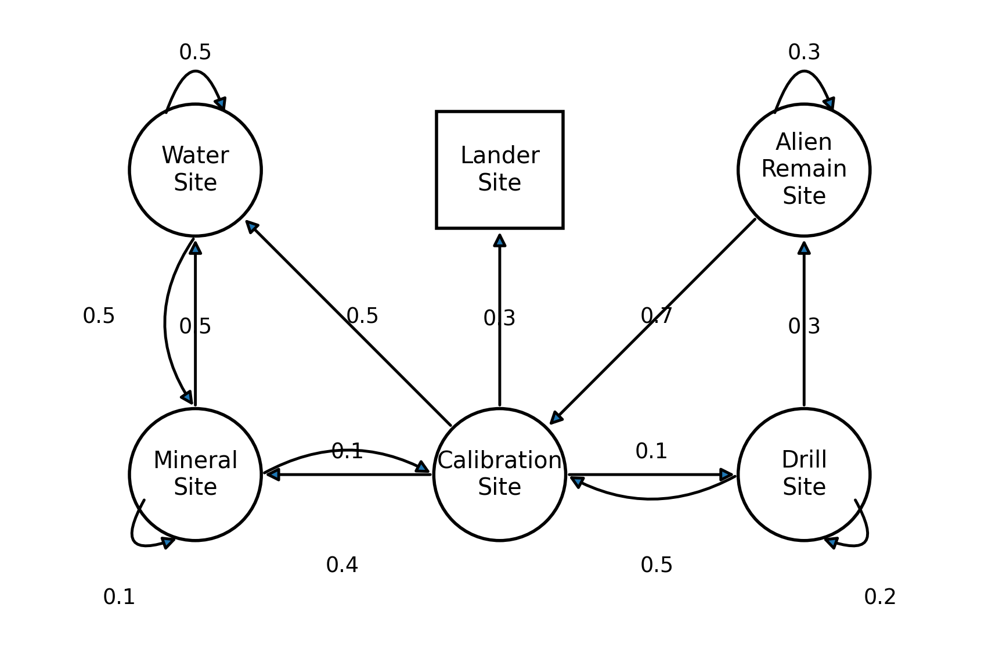
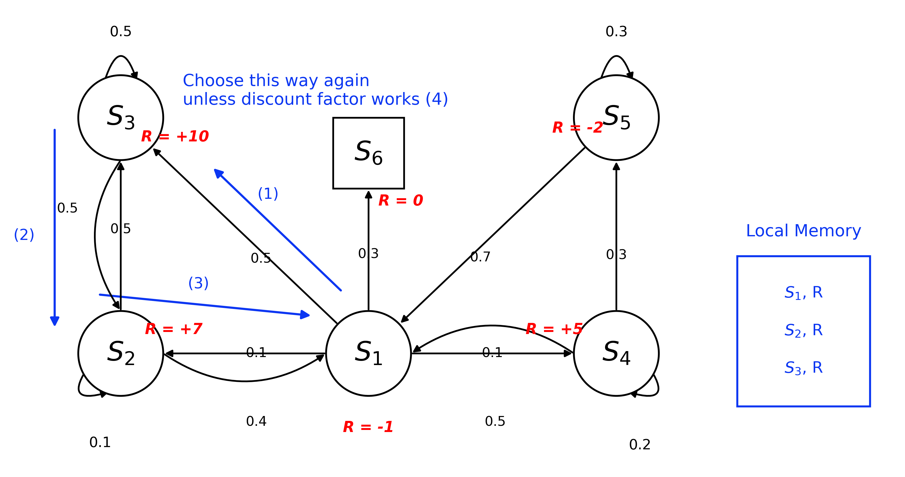
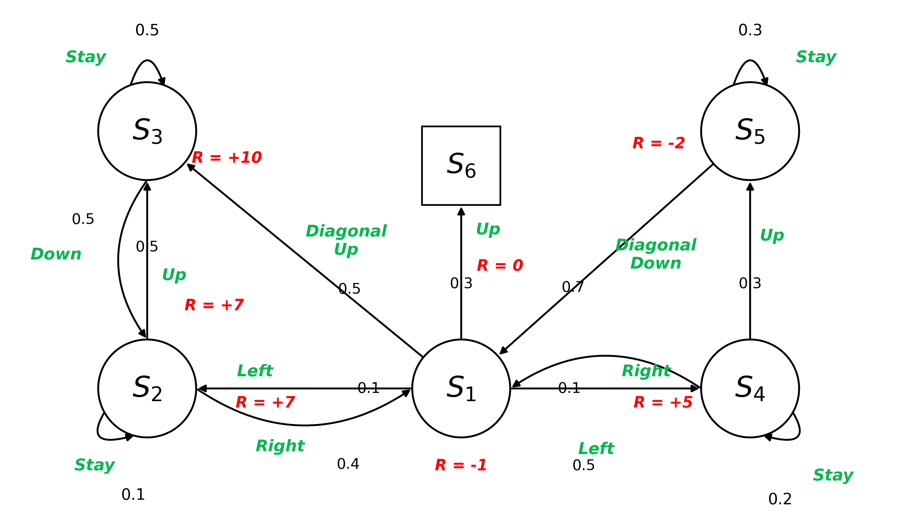

## Markov Property

- The future is independent of the past given the present state.
- The current state is sufficient to determine the future, without history.

### Markov State

$$P[S_{t+1} | S_t] = P[S_{t+1} = s' | S_t = s]$$

- $t$: Time step
- $S_{t+1}$: Next state
- $S_t$: Current state
- $S_1, \ldots, S_t$: History (All previous states)

## State Transition Probability

$$P_{ss'} = P[S_{t+1} = s' | S_t = s]$$

- Likelihood or probability of moving from one state $s$ to another state $s'$ in the next time step $t+1$.
- $s$: Markov State
- $s'$: Successor State
- $t$: Time step
- State transition matrix $P$ defines the transitions probabilities between all states $s$ to all successor states $s'$.

## State Transition Matrix

$$
\mathcal{P} = 
\begin{array}{rl}
  & \begin{matrix} \textcolor{red}{\boldsymbol{s_1}} & \textcolor{red}{\boldsymbol{\dots}} & \textcolor{red}{\boldsymbol{s_n}} \end{matrix} \quad \leftarrow \text{(to state)} \\
  \begin{matrix} \textcolor{red}{\boldsymbol{s_1}} \\ \textcolor{red}{\boldsymbol{\vdots}} \\ \textcolor{red}{\boldsymbol{s_n}} \end{matrix}
  & \hspace{-10pt}
  \begin{bmatrix}
    \mathcal{P}_{11} & \dots & \mathcal{P}_{1n} \\
    \vdots & \ddots & \vdots \\
    \mathcal{P}_{n1} & \dots & \mathcal{P}_{nn}
  \end{bmatrix} \\
  \begin{matrix} \uparrow \\[-2pt] \mathclap{\text{(from state)}} \end{matrix} &
\end{array}
$$

- State transition matrix $P$ defines the transition probabilities between all states $s$ to all successor states $s'$.
- Probability of moving from state $s_n$ to $s_1$ is $\mathcal{P}_{n1}$.

## Math cal

> Reinforcement Learning and Math Major Symbols

- $\mathcal{P}$: Transition Probability Matrix
- $\mathcal{S}$: State Space
- $\mathcal{A}$: Action Space
- $\mathcal{R}$: Reward Function
- $\mathcal{L}$: Loss Function
- $\mathcal{N}(\mu, \sigma^2)$: Normal Distribution
- $\mathcal{D}$: Dataset
- $\mathcal{H}$: Entropy / Hypothesis Space

## Markov Process

> Markov Chain

- What is going to be happened next?
- it goes through a sequence of states overtime.
- **Stochastic Process**: The next state $S_{t+1}$ is determined by the current state $S_t$ and the transition probability matrix $P$ that exhibits the Markov Property.
- Current state is independent of the past states.
- **Memoryless**: History of states leading up to the current state is not necessary to predict the next/future state.
- **MP**: $\langle\mathcal{S},\mathcal{P}\rangle$, What states comes next?, Observer's Perspective.
- **MRP**: $\langle\mathcal{S},\mathcal{P},\mathcal{R},\gamma\rangle$, How good/How much reward is this state in the long run?, Evaluator's Perspective.
- **MDP**: $\langle\mathcal{S},\mathcal{A},\mathcal{P},\mathcal{R},\gamma\rangle$, What action should I take right now to maximize the long-term reward?, Decision Maker's Perspective.

$$\mathcal{P}_{ss'} = P[S_{t+1} = s' | S_t = s]$$

- $S$: a finite set of states.
- $\mathcal{P}$: a state transition matrix, defines the transitions probabilities from all states $s$ to all successor states $s'$.
- NO REWARD, NO ACTIONS.

### Transition Diagram

- Box: where it ends
- Arrow: transitions
- Circle: states
- Number: probability of transitioning to the state

$$
\mathcal{P} = 
\begin{bmatrix}
0 & 0.1 & 0.5 & 0.1 & 0 & 0.3 \\
0.4 & 0.1 & 0.5 & 0 & 0 & 0 \\
0 & 0.5 & 0.5 & 0 & 0 & 0 \\
0.5 & 0 & 0 & 0.2 & 0.3 & 0 \\
0.7 & 0 & 0 & 0 & 0.3 & 0 \\
0 & 0 & 0 & 0 & 0 & 1
\end{bmatrix}
$$

- S1: Calibration Site
- S2: Mineral Site
- S3: Water Site
- S4: Drill Site
- S5: Alien Remain Site
- S6: Lander Site

### Markov Chain Episode

- A sequence of states from a starting state to a terminal state.
- $S_1, S_3, S_2, S_1, S_6$
- $S_1, S_3, S_3, S_2, S_1, S_4, S_4, S_1, S_6$

### Episodic Task vs Continuous Task

| Feature | Episodic Tasks | Continuing Tasks |
| - | - | - |
| **Termination** | Has a well-defined terminal state ($T$) | Runs indefinitely without termination ($T = \infty$) |
| **Real-World Examples** | • Video games (e.g., Super Mario: level clear or death) • Navigation (reaching destination) • Board games (e.g., Chess: checkmate/draw) | • Smart thermostat (HVAC temperature control) • 24/7 industrial robotic process control • Automated trading & server load management |
| **Execution Flow** | Environment resets to a start state once finished | Operates continuously without automatic resets |

- **Episodic Tasks**: Tasks with a defined end/terminal state.
- **Continuing Tasks**: Tasks without a defined end/terminal state.
- It may require different MDP formulation and solution methods for each type of task.

## Markov Reward Process

> Markov Chain + Reward

$$\langle\mathcal{S},\mathcal{P},\mathcal{R},\gamma\rangle$$

- $S$: a finite set of states.
- $\mathcal{P}$: a state transition matrix (Transition Dynamics)
- $\mathcal{R}$: a reward function to compute expected reward from a state.
  - $\mathcal{R}_s = \mathbb{E}[R_{t+1} | S_t = s]$
  - In the state $s$, how much reward can you expect to get in the next time step?
- $\gamma$: a discount factor, to balance the immediate and future rewards.
  - $\gamma \in [0, 1]$

### Return

$$G_t = R_{t+1} + R_{t+2} + \cdots + R_T$$

- $G_t$: Goal Reward
  - The sum of the rewards received from time step $t$.
- $R_{t+1}, R_{t+2}, \ldots, R_T$: the sequence of rewards received after time step $t$
- $T$: terminal state
- $t$: time step

## Discount

- The present value of future rewards.
- $\gamma = 0$: Myopic evaluation for maximizing immediate reward.
- $\gamma = 1$: Far-sighted/Long-term evaluation for maximizing future reward.

### Discounted Return

$$G_t = R_{t+1} + \gamma R_{t+2} + \gamma^2 R_{t+3} + \cdots + \gamma^{T-t-1} R_T = \sum_{k=0}^{\infty} \gamma^k R_{t+k+1}$$

- $G_t$: Discounted Return
- $\gamma = 1$: Undiscounted Markov Reward Process, if all sequences terminate (like games)

## Value Function

$$v(s) = \mathbb{E}[G_t | S_t = s]$$

- The expected return from state $s$.
- How much total reward can you expect to get starting from this state?
- A function returning the expected cumulative reward starting from state $s$

## Markov Decision Process

> Markov Reward Process + Actions(Decisions)

$$\langle\mathcal{S},\mathcal{A},\mathcal{P},\mathcal{R},\gamma\rangle$$

- $S$: a finite set of states.
- $\mathcal{A}$: a finite set of actions.
- $\mathcal{P}$: a state transition matrix
  - $\mathcal{P}_{ss'}^a = P[S_{t+1} = s' | S_t = s, A_t = a]$
- $\mathcal{R}$: a reward function
  - $\mathcal{R}_s^a = \mathbb{E}[R_{t+1} | S_t = s, A_t = a]$
- $\gamma$: a discount factor

## Policy

$$\pi(a | s) = P[A_t = a | S_t = s]$$

- Policy specifies what actions to take in each state.
  - $\pi(\text{left} | \text{wall}) = 0.8$
  - $\pi(\text{right} | \text{wall}) = 0.2$
  - $\pi(\text{straight} | \text{wall}) = 0.0$
  - The agent's playbook for any given state.
- It fully defines the behavior of the agent.
- MDP's policy does not depends on history, only on the current state.

### Value Function of a Policy

$$v_\pi(s) = \mathbb{E}_{\pi}[G_t | S_t = s]$$

- The state value function $v_\pi(s)$ is the expected return starting from state $s$ and following policy $\pi$.
- How good it is to be in state $s$ (under policy $\pi$)?

$$q_\pi(s, a) = \mathbb{E}_{\pi}[G_t | S_t = s, A_t = a]$$

- The expected return of taking action $a$ in state $s$, taking action $a$ and then following policy $\pi$.
- $q$: a quality of action $a$ in state $s$ (under policy $\pi$).

| Feature | **State-Value Function ($v_\pi(s)$)** | **Action-Value Function ($q_\pi(s, a)$)** |
| :- | :- | :- |
| **Decision Flow** | Follows policy $\pi$ right from state $s$ | Commits to action $a$ first, then follows policy $\pi$ |
| **Intuitive Question** | "How good is it to **be in this state**?" | "How good is it to **take this specific action** in this state?" |

## Solving MDPs

> **Goal**: Find optimal policy $\pi_*$ that maximizes the expected return.

- Using Value Iteration or Policy Iteration.
- Updating value functions and policies iteratively until convergence.
- **Evaluation**: Compute the value function $v_\pi(s)$ for a given policy $\pi$.
- **Improvement**: Update the policy $\pi$ to choose better actions based on the updated value function.
  - To converge to the optimal value function and policy $v^*, \pi^*$

## POMDPs

> MDPs with hidden states.

$$\langle \underbrace{\mathcal{S}, \mathcal{A}, \mathcal{O}}_{\text{공간 (Spaces)}}, \underbrace{\mathcal{P}, \mathcal{R}, \mathcal{Z}}_{\text{함수 / 규칙 (Functions)}}, \underbrace{\gamma}_{\text{상수 (Discount Factor)}} \rangle$$

- $S$: a finite set of states
- $\mathcal{A}$: a finite set of actions
- $\mathcal{O}$: a finite set of observations
  - e.g. driving in foggy weather.
- $\mathcal{P}$: a state transition matrix
- $\mathcal{R}$: a reward function
- $\mathcal{Z}$: an observation function
  - $\mathcal{Z}_{s', o}^a = P[O_{t+1} = o | S_{t+1} = s', A_t = a]$
  - an observation function specifying the probability of receiving observation $o$ given state $s'$ and action $a$
  - After taking action $a$ and landing in state $s'$, how likely is the agent to observe $o$?
- $\gamma$: a discount factor
- e.g.
  - Robot navigation with noisy/uncalibrated sensors.
  - Autonomous Driving with Sensor uncertainty due to bad weather conditions and unexpected events.

## Finite Horizon MDPs

- **Finite Time Steps ($T$)**: A sequential decision-making process **restricted to a fixed, finite number of steps ($T$) to maximize cumulative rewards**.
- Target Applications: Well-suited for problems with explicit deadlines or time-varying environment dynamics.
- Decision Basis: Optimal decisions are made using current state ($S_t$), available actions ($A_t$), transition probabilities ($\mathcal{P}$), and immediate rewards ($\mathcal{R}$).
- Representative Example: A robot navigating a grid world with a limited step count or battery budget to reach a goal while avoiding obstacles.
- Discount Factor ($\gamma$): Because the horizon $T$ is finite, the cumulative return cannot diverge to infinity, allowing the use of undiscounted formulations ($\gamma = 1$).
- **Time-Dependent (Non-Stationary) Policy**:
  - Unlike infinite-horizon MDPs, the optimal action depends explicitly on the remaining time steps ($T - t$).
  - **Policy Notation**: $\pi_t(s)$ (indexed by time step $t$).
  - *Intuition: An agent may play conservatively early on, but take high-risk, high-reward actions right before the deadline.*

| Dimension | **Finite-Horizon MDP** | **Infinite-Horizon MDP** |
| :- | :- | :- |
| **Time Horizon ($T$)** | $T < \infty$ (Explicit terminal step) | $T \to \infty$ (Perpetual / ongoing) |
| **Policy Nature** | **Non-Stationary** ($\pi_t(s)$, changes over time) | **Stationary** ($\pi(s)$, time-invariant) |
| **Discount Factor ($\gamma$)** | $\gamma \le 1$ ($\gamma = 1$ is valid) | Typically $\gamma < 1$ required for convergence |
| **Objective Function** | $\max \mathbb{E} \left[ \sum_{t=0}^{T} \gamma^t R_{t+1} \right]$ | $\max \mathbb{E} \left[ \sum_{t=0}^{\infty} \gamma^t R_{t+1} \right]$ |

## Limitations of MDPs

- **Markovian Assumption**: Assumes future transitions depend solely on the current state $S_t$, ignoring past historical trajectories and temporal dependencies that matter in real-world dynamics (e.g., momentum, acceleration).
  - State augmentation, frame stacking, RNN/Transformer, POMDP
- **Complete Knowledge Requirement**: Assumes exact *a priori* knowledge of transition probabilities $\mathcal{P}$ and reward functions $\mathcal{R}$, which are rarely accessible without sample-based learning in complex environments.
  - Model-free RL: Q-learning, SARSA, Policy Gradient
- **Finite State and Action Spaces**: Restricted to discrete and countable sets, whereas real-world robotics and physical control tasks typically involve continuous states and actions.
  - Function approximation, Actor-Critic: DDPG, TD3, SAC, PPO
- **Curse of Dimensionality**: Tabular value and policy storage scale exponentially as state dimensions grow ($|\mathcal{S}| \times |\mathcal{A}|$), making high-dimensional environments (e.g., raw pixel inputs) computationally intractable.
  - Deep RL: neural approximation of $V$, $Q$, or $\pi$
- **Partial Observability**: Assumes full access to the true ground-truth state ($O_t = S_t$), failing to account for real-world sensor noise, occlusions, and incomplete observations.
  - POMDP, belief-state estimation, recurrent policies
