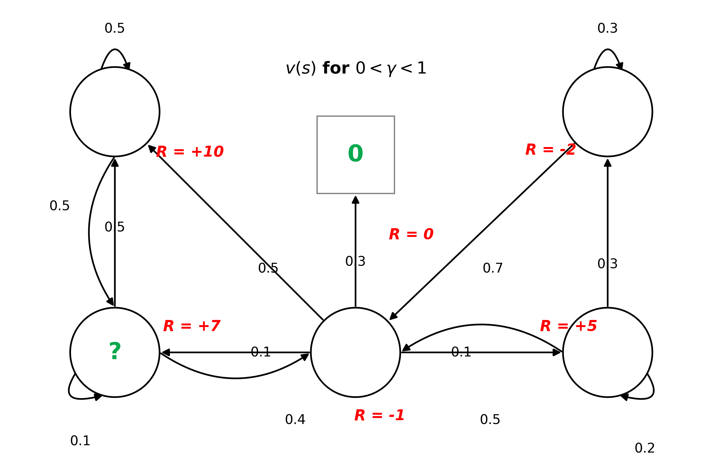

## Bellman Equation

$$v_\pi(s) = \mathbb{E}_\pi \left[ \underbrace{R_{t+1}}_{\text{Immediate Reward}} + \gamma \underbrace{v_\pi(S_{t+1})}_{\text{Discounted Future Value}} \;\middle|\; \underbrace{S_t = s}_{\text{Starting at state s}} \right]$$

- Fundamental concept in RL using a recursive equation to express a way to compute the value of a state based on the values of its successor states.

$$
\begin{aligned}
v(s) &= \mathbb{E} \left[ R_{t+1} + \gamma R_{t+2} + \gamma^2 R_{t+3} + \dots \;\middle|\; S_t = s \right] \\[8pt]
&= \mathbb{E} \left[ R_{t+1} + \gamma \underbrace{\left( R_{t+2} + \gamma R_{t+3} + \dots \right)}_{G_{t+1}} \;\middle|\; S_t = s \right] \\[8pt]
&= \mathbb{E} \left[ R_{t+1} + \gamma G_{t+1} \;\middle|\; S_t = s \right] \\[8pt]
&= \mathbb{E} \left[ R_{t+1} + \gamma v(S_{t+1}) \;\middle|\; S_t = s \right] \\[8pt]
&= \underbrace{\mathbb{E}[R_{t+1} \mid S_t = s]}_{\text{Immediate Reward } \mathcal{R}(s)} + \gamma \, \underbrace{\mathbb{E}[v(S_{t+1}) \mid S_t = s]}_{\text{Expected Next State Value}} && (\because \mathbb{E}[X + \gamma Y] = \mathbb{E}[X] + \gamma\mathbb{E}[Y]) \\[10pt]
&= \mathcal{R}(s) + \gamma \underbrace{\sum_{s'} \mathcal{P}(s' \mid s) v(s')}_{\text{Transition Dynamics}} && \left(\because \mathbb{E}[g(X)] = \sum_x P(x)g(x)\right)
\end{aligned}
$$

### Bellman Equation Example

$$v(s_{\text{BL}}) = 7 + \gamma(0.1 \cdot v(s_{\text{BL}}) + 0.5 \cdot(s_{TL}) + 0.4 \cdot(s_{BR})) $$

### Bellman Equation in Matrix Form

$$v = \mathcal{R} + \gamma \mathcal{P} v$$

$$
\begin{aligned}
\underbrace{
\begin{bmatrix}
v(s_1) \\
\vdots \\
v(s_n)
\end{bmatrix}}_{\text{V of a particular state}}
=
\underbrace{\begin{bmatrix}
\mathcal{R}(s_1) \\
\vdots \\
\mathcal{R}(s_n)
\end{bmatrix}}_{\text{Immediate Reward}}
+ \gamma \underbrace{\begin{bmatrix}
\mathcal{P}_{11} & \cdots & \mathcal{P}_{1n} \\
\vdots & \ddots & \vdots \\
\mathcal{P}_{n1} & \cdots & \mathcal{P}_{nn}
\end{bmatrix}}_{\text{Transition Matrix}}
\underbrace{\begin{bmatrix}
v(s_1) \\
\vdots \\
v(s_n)
\end{bmatrix}}_{\text{V of future state}}
\end{aligned}
$$

### Solving the Bellman Equation

#### Linear System of Equations

$$
\begin{aligned}
\mathcal{v} &= \mathcal{R} + \gamma \mathcal{P}\mathcal{v} \\
\mathcal{v} - \gamma \mathcal{P}\mathcal{v} &= \mathcal{R} \\
(I - \gamma \mathcal{P})\mathcal{v} &= \mathcal{R} \\
\mathcal{v} &= (I - \gamma \mathcal{P})^{-1} \mathcal{R}
\end{aligned}
$$

- Computational Complexity: $O(n^3)$
- **For small MDPs**: direct solution is possible (up to 100 states)
- **For large MDPs**:
  - Iterative methods
  - Dynamic Programming
  - Monte Carlo Tree
  - TD learning

#### State-Value Function

$$
\begin{aligned}
\underbrace{v_\pi(s)}_{\text{Value of state } s} = \underbrace{\mathbb{E}_\pi}_{\text{Follows policy } \pi} \left[ \underbrace{R_{t+1}}_{\text{Immediate Reward}} + \gamma \underbrace{v_\pi(S_{t+1})}_{\text{Discounted Value of Next State}} \;\middle|\; \underbrace{S_t = s}_{\text{Starting at state } s} \right]
\end{aligned}
$$

- Evaluates the expected return starting from state $s$ and following policy $\pi$ thereafter.
- How good is it to be in state $s$?
- $v_\pi(s)$: Expected cumulative return starting from state $s$ under policy $\pi$.
- $\mathbb{E}_\pi$: Expectation over action selections ($A_t \sim \pi$) and transition dynamics ($S_{t+1} \sim \mathcal{P}$).
- $R_{t+1}$: Immediate reward received upon transitioning out of state $s$.
- $\gamma v_\pi(S_{t+1})$: Discounted expected value of the next successor state $S_{t+1}$.
- $S_t = s$: Condition that the agent starts at state $s$ at time step $t$.

$$v_{\pi}(s) = \sum_{a \in \mathcal{A}} \pi(a \mid s) q_{\pi}(s, a)$$

- The value of state $s$ is the **policy-weighted average** of the values of all possible actions that can be taken from that state.
- $v_{\pi}(s)$: Expected cumulative return starting from state $s$ under policy $\pi$.
- $\pi(a \mid s)$: Probability of taking action $a$ in state $s$ under policy $\pi$.
- $q_{\pi}(s, a)$: Value of taking action $a$ in state $s$ under policy $\pi$.

#### Action-Value Function

$$
\begin{aligned}
\underbrace{q_\pi(s, a)}_{\text{Action-Value of } (s, a)} = \underbrace{\mathbb{E}_\pi}_{\text{Follows policy } \pi} \left[ \underbrace{R_{t+1}}_{\text{Immediate Reward}} + \gamma \underbrace{q_\pi(S_{t+1}, A_{t+1})}_{\text{Discounted Next Action-Value}} \;\middle|\; \underbrace{S_t = s, A_t = a}_{\text{Starting at } s \text{ taking action } a} \right]
\end{aligned}
$$

- Evaluates the expected return of taking an arbitrary action $a$ in state $s$, and subsequently following policy $\pi$ from step $t+1$ onward.
- How good is it to take action $a$ in state $s$?
- $q_\pi(s, a)$: Value of taking action $a$ in state $s$ under policy $\pi$ (Q-value).
- $\mathbb{E}_\pi$: Expectation over the next transition ($S_{t+1} \sim \mathcal{P}$) and the subsequent action ($A_{t+1} \sim \pi$).
- $R_{t+1}$: Immediate reward resulting from the state-action pair $(s, a)$.
- $\gamma q_\pi(S_{t+1}, A_{t+1})$: Discounted expected value of the successor state-action pair $(S_{t+1}, A_{t+1})$.
- $S_t = s, A_t = a$: Condition that both the initial state and the initial action are fixed at time $t$.

$$
\begin{aligned}
v_\pi(s) = \sum_{a \in \mathcal{A}} \pi(a \mid s) \left( \mathcal{R}_s^a + \gamma \sum_{s' \in \mathcal{S}} \mathcal{P}_{ss'}^a v_\pi(s') \right)
\end{aligned}
$$

- Evaluates state $s$ directly by averaging over all possible action branches ($\pi$) and their subsequent environmental transitions ($\mathcal{P}$).
- $\mathcal{R}_s^a$: Immediate reward resulting from the state-action pair $(s, a)$.
- $\gamma \sum_{s' \in \mathcal{S}} \mathcal{P}_{ss'}^a v_\pi(s')$: Discounted expected value of the successor state $s'$ resulting from the state-action pair $(s, a)$.
- $\mathcal{P}_{ss'}^a$: Probability of transitioning from state $s$ to state $s'$ when action $a$ is taken.
- $\mathcal{S}$: Set of all possible states.
- $\mathcal{A}$: Set of all possible actions.
- $\pi(a \mid s)$: Probability of taking action $a$ in state $s$ under policy $\pi$.
- $v_\pi(s')$: Value of state $s'$ under policy $\pi$.

#### Bellman Expectation Equation

$$
\begin{aligned}
q_\pi(s, a) = \mathcal{R}_s^a + \gamma \sum_{s' \in \mathcal{S}} \mathcal{P}_{ss'}^a \sum_{a' \in \mathcal{A}} \pi(a' \mid s') q_\pi(s', a')
\end{aligned}
$$

- Evaluates the state-action pair $(s, a)$ by summing immediate reward and the expected value of future action pairs $(s', a')$, averaged across transition dynamics $\mathcal{P}$ and next-step policy choices $\pi$.
- $\mathcal{R}_s^a$: Immediate reward resulting from the state-action pair $(s, a)$.
- $\gamma \sum_{s' \in \mathcal{S}} \mathcal{P}_{ss'}^a \sum_{a' \in \mathcal{A}} \pi(a' \mid s') q_\pi(s', a')$: Discounted expected value of the successor state-action pair $(s', a')$ resulting from the state-action pair $(s, a)$.
- $\mathcal{P}_{ss'}^a$: Probability of transitioning from state $s$ to state $s'$ when action $a$ is taken.
- $\mathcal{S}$: Set of all possible states.
- $\mathcal{A}$: Set of all possible actions.
- $\pi(a' \mid s')$: Probability of taking action $a'$ in state $s'$ under policy $\pi$.

$$
\begin{matrix}
v_\pi(s) & \xrightarrow{\text{Action Policy } \pi} & q_\pi(s, a) \\
\uparrow & & \downarrow \text{Environment Transition } \mathcal{P} \\
v_\pi(s') & \xleftarrow{\text{Environment Transition } \mathcal{P}} & q_\pi(s', a')
\end{matrix}
$$

### Optimal Value Function

$$V_*(s) = \max_\pi v_\pi(s)$$

- The optimal State-Value Function $V_*(s)$
- Maximum value function over all policies, or maximum possible reward that can be achieved from state $s$.

$$q_*(s, a) = \max_\pi q_\pi(s, a)$$

- The Optimal Action-Value Function $q_*(s, a)$
- Maximum action-value function over all policies, or given state $s$ and action taken $a$, what is the maximum reward that can be achieved from there onwards.

## Optimal Policy

$$\pi_* \geq \pi \iff v_{\pi_*(s)} \geq v_\pi(s) \quad \forall s \in \mathcal{S}$$

- If certain policy is better than another policy, then the value of the better policy is greater than or equal to the value of others in all states.

### Theorem fo any MDP

- **Existence of an Optimal Policy**: There always exists at least one optimal policy $\pi_*$ that is better than or equal to all other policies across all states ($\pi_* \ge \pi, \; \forall \pi$).
- **Uniqueness of the Optimal State-Value Function**: Although multiple distinct optimal policies may exist (e.g., when two different paths yield the exact same maximum expected return), all optimal policies achieve the exact same unique optimal state-value function ($v_{\pi_*}(s) = v_*(s)$).
- **Uniqueness of the Optimal Action-Value Function**: Similarly, all optimal policies achieve the exact same unique optimal action-value function ($q_{\pi_*}(s, a) = q_*(s, a)$).

### Finding an Optimal Policy

$$
\pi_*(a \mid s) = \begin{cases} 1 & \text{if } a = \arg\max_{a \in \mathcal{A}} q_*(s, a) \\ 0 & \text{otherwise} \end{cases}
$$

- If $q_*(s, a)$ is known, optimal policy is achieved.
- A deterministic optimal policy always exists for any MDP.
