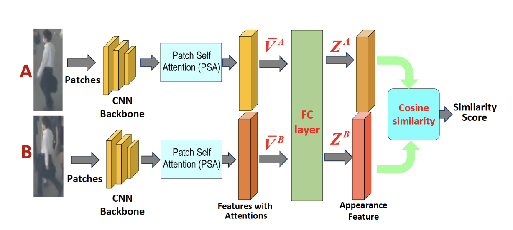
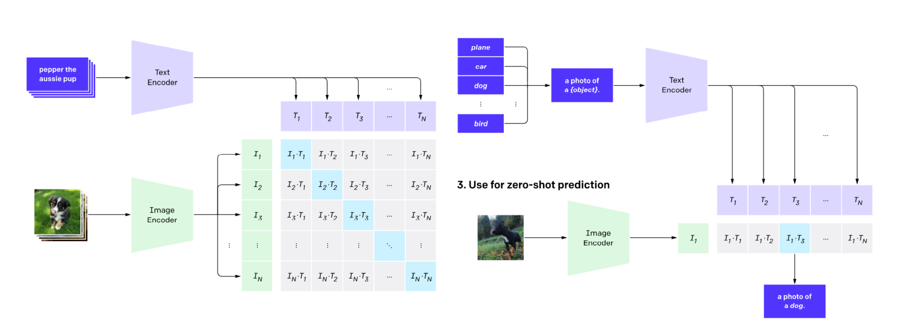

## Pattern recognition

- recognizing patterns of interest oin data
- applications
  - image and video analysis
  - speech analysis
  - natural language processing
  - genomic research and bioinformatics
  - data mining and analytics for business, finance, marketing, trade
  - network traffic analysis
  - analysis of Web data
  - social media analysis

## ML Problems

- Classification: predict a categorical value from an array of numerical/categorical features.
  - The input is assigned to the class with the highest score/probability.
- Regression: predict a numerical value from an array of numerical/categorical features.
- Clustering: group numerical data homogeneously into clusters.

## Probabilistic Classifier

- The class scores are simply bounded between 0 and 1 and add up to 1 over all classes.
- probability of class $c$ given input $x$, or $p(c|x)$.
  - $p(c = \text{apple}|x) = 0.7$
  - $p(c = \text{banana}|x) = 0.2$
  - $p(c = \text{orange}|x) = 0.1$
- All contemporary deep learning classifiers are probabilistic.
- **Training objective**: assign the largest possible probability to the correct labels.

### Hyperparameters

- Type of model: logistic regression, CNN, random forest, SVM etc.
- Size of a mask (3x3, 5x5) or of feature vector (100, 200)
- Number of clusters
- All discrete choices and any coefficient within the loss function.

### Datasets

- Training set: it is used with the loss function to automatically find the optimal parameters for various, arbitrarily chosen values of the hyperparameters
- Validation set: it is used to find the best values for the hyperparameters (best performance evaluation metric)
- Test set: it is used with the chosen parameters and hyperparameters to measure and report the final model’s accuracy/performance

### Popular algorithms

- K-means
- K-medoids, or PAM (partitioning around medoids)
- Other female-named clustering algorithms:
  - AGNES
  - DIANA
  - DAISY

## Models

- U-Net: Classify individual pixels rather than entire images
- SMILETrack: track objects in video having a certain shape

- OpenAI CLIP: Trained with pairs of images and captions, and at run time is able to classify images into any category of choice

- Stable Diffusion
