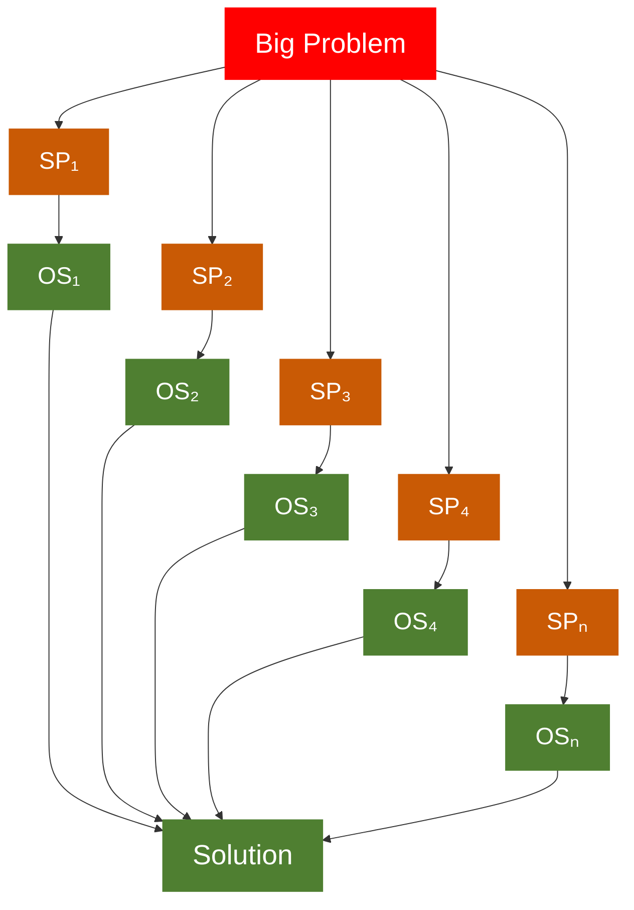
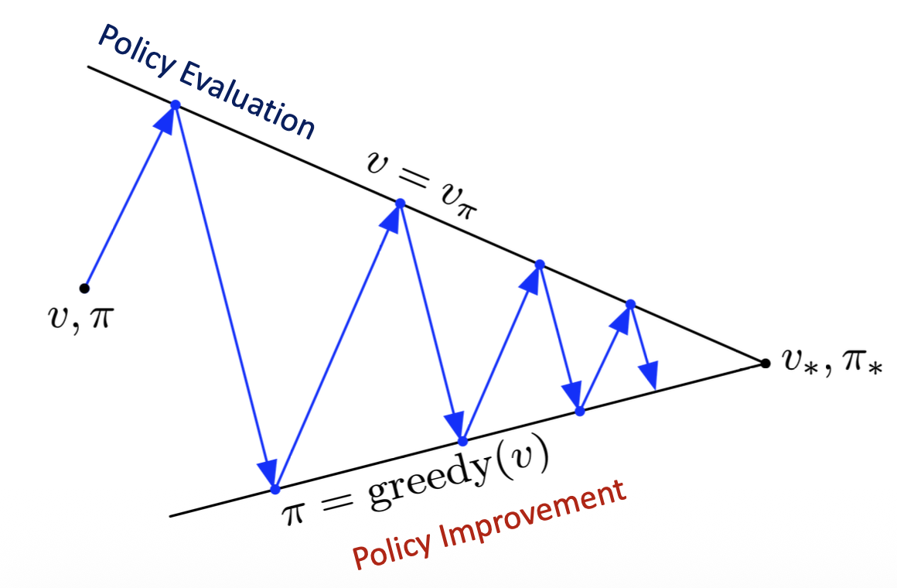

## MDP

$$(\mathcal{S}, \mathcal{A}, \mathcal{P}, \mathcal{R}, \gamma)$$

- At each time step $t$, the agent observes state $S_t \in \mathcal{S}$ and chooses action $A_t \in \mathcal{A}$
- Receives reward $R_{t+1} \in \mathcal{R}$
- Transitions to a new state \$S\_{t+1}

## Transition Dynamics

> Transition Probability

- How the environment responds to an action, independent of the agent's policy
- Policy: Whether to brake or accelerate when the traffic light is yellow.
- Transition Dynamics: How much the car decelerates after braking, and what the resulting next state is.

$$P(s'|s,a) = P(S_{t+1} = s'|S_t = s, A_t = a)$$

## Policy

- A policy is the agent’s rule for choosing actions.
- It tells the agent what action to take in a given state.
- It defines agent's behavior.

$$\text{Deterministic Policy}: \pi(s) = a$$

- Direct mapping, and no randomness
- All probability on one action

$$\text{Stochastic Policy}: \pi(a|s) = P(A_t = a | S_t = s)$$

- A probability distribution over actions.
- More general, all four Bellman Equations are stochastic, use $\pi(a|s)$ to represent the policy.
- Policy is what the agent controls.

## Value Functions

$$v_\pi(s) = \mathbb{E}_\pi[R_{t+1} + \gamma v_\pi(S_{t+1}) | S_t = s]$$

- How good is this state?
- $\mathbb{E}_\pi[G_t | S_t = s]$

$$q_\pi(s,a) = \mathbb{E}_\pi[R_{t+1} + \gamma v_\pi(S_{t+1}) | S_t = s, A_t = a]$$

- How good is this action in this state?
- $\mathbb{E}_\pi[G_t | S_t = s, A_t = a]$

$$v_\pi(s) = \sum_{a \in \mathcal{A}} \pi(a|s) q_\pi(s,a)$$

- The average value of the actions, weighted by the probability of choosing each action.
  - $a_1$ is brake
  - $a_2$ is accelerate
  - $v_\pi(s) = 0.8 * 10 + 0.2 * 20 = 10$

$$
q_\pi(s,a) = \mathcal{R}(s,a) + \gamma \sum_{s' \in \mathcal{S}} P(s'|s,a) v_\pi(s')
$$

- The value of taking action $a$ in state $s$: the immediate reward plus the discounted expected value of the possible next states.

## Four Types of Bellman Equations

$$
\begin{aligned}
&v_\pi(s)
= \sum_{a} \pi(a|s) q_\pi(s,a)
\\
&q_\pi(s,a)
= \mathcal{R}(s,a)
+ \gamma \sum_{s'} P(s'|s,a) v_\pi(s')
\\
&v_\pi(s)
= \sum_{a} \pi(a|s)
\left[
\mathcal{R}(s,a)
+ \gamma \sum_{s'} P(s'|s,a) v_\pi(s')
\right]
\\
&q_\pi(s,a)
= \mathcal{R}(s,a)
+ \gamma \sum_{s'} P(s'|s,a)
\sum_{a'} \pi(a'|s') q_\pi(s',a')
\end{aligned}
$$

- Evaluate a state: $v_\pi(s)$
- Evaluate an action: $q_\pi(s,a)$
- Calculate Bellman by only $v$: Third equation
- Calculate Bellman by only $q$: Fourth equation

## Dynamic Programming

> Optimization method  for sequential problem

- Dynamic: **Sequential** or **Temporal** component
- Programming: **Optimizing** a program or policy

- Sub Problem
- Optimal Solution

## Prediction and Control

- Prediction: Evaluate a given policy $v_\pi(s)$
- Control: Find the optimal policy $\pi_*$

## Policy Improvement

- $\pi \to v_\pi \to \pi'$
- $\pi' = \text{greedy}(v_\pi)$
- Evaluate current policy, Improve it greedily, then get a better policy

### Modified Policy Iteration

- Policy iteration can be computationally expensive
- **MPI**: cut off the policy evaluation after a few iterations $k$ then step to policy improvement.
  - $k = 1 \Rightarrow \text{Value iteration}$
  - $k = 3,4 \Rightarrow \text{Modified Policy iteration}$
  - $k \quad \text{is large enough} \Rightarrow \text{Policy iteration}$
