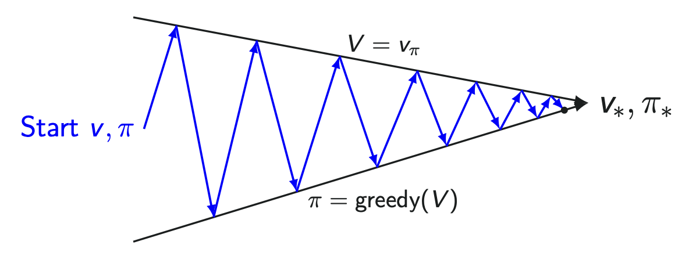
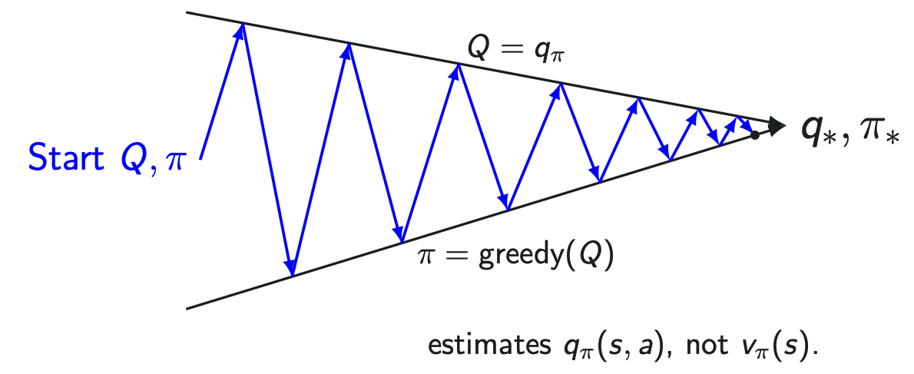

## Known MDP vs Unknown MDP

| Aspect | Known MDP | Unknown MDP |
| :- | :- | :- |
| **Environment Knowledge ($P, R$)** | Full knowledge of state transition dynamics $P$ and reward function $R$ | $P$ and $R$ are unknown; agent must explore the environment |
| **Problem Approach** | Well-defined optimization problem $\rightarrow$ Pure planning via computation | Trial-and-error interaction $\rightarrow$ Must learn and optimize simultaneously |
| **Primary Goal** | Directly compute the optimal policy ($\pi_*$) | Learn and optimize policies without prior model knowledge |
| **Representative Methods** | Value Iteration, Policy Iteration (Dynamic Programming) | Monte Carlo, Q-Learning, SARSA (Reinforcement Learning) |
| **Paradigm** | Model-based (Planning) | Model-free (Reinforcement Learning) |

## Model-based vs Model-free

| Aspect | Model-Based Learning | Model-Free Learning |
| :- | :- | :- |
| **Model Access ($P, R$)** | Has full access to transition dynamics $P$ and reward function $R$ | No access to environment dynamics ($P$ and $R$ are unknown) |
| **Optimization Approach** | Direct mathematical computation and planning using the known model | Direct learning and trial-and-error optimization through interaction |
| **Estimation Source** | Computes values and optimal policy $\pi_*$ via dynamic programming equations | Estimates $v_\pi, q_\pi$, and $\pi_*$ directly from sampled **experience** |
| **Computation vs. Sampling** | Pure computation / Planning (requires no real-time environment sampling) | Sample-based learning (requires trajectories / episodic experience) |
| **Typical Methods** | Policy Iteration, Value Iteration (DP) | Monte Carlo Methods, TD Learning, Q-Learning, SARSA |

## Monte Carlo Methods

- A Computational technique that uses random sampling and statistical methods to solve complex problems and estimate numerical results.
  - Named after the Monte Carlo Casino in Monaco.
  - It means **Estimate an unknown quantity by sampling, and averaging what you observe**.
- Used fo any estimation method whose operation involves a significant random component.
- Used in mathematics, physics, engineering, finance, computer science, etc.
- It is particularly valuable when an **analytical solution is difficult or impossible to obtain**.

### Estimating $\pi$ by Sampling (Monte Carlo Simulation)

- **Mechanism**:
  - Generate uniform random points $(x, y) \in [-1, 1] \times [-1, 1]$.
  - Count points falling inside the unit circle ($x^2 + y^2 \le 1$).
  - Estimate $\pi$ via area proportions:

$$
\begin{aligned}
\frac{\text{Area}_{circle}}{\text{Area}_{square}} = \frac{\pi}{4} \\ 
& \pi \approx 4 \times \frac{\text{\#points inside circle}}{\text{\#total points}}
\end{aligned}
$$

- **Empirical Validation**:
  - Total samples ($n$): $3000$ points
  - Estimated value: $\pi = 3.1386666666666665$
  - Relative error: $-0.0931\%$ from true value ($\approx 3.14159265$)

## Monte Carlo Prediction

$$v_\pi(s) = \mathbb{E}_{\pi}[G_t | S_t = s] \approx \frac{1}{N} \sum_{i=1}^{N(s)} G^{(i)}$$

- $\frac{1}{N} \sum_{i=1}^{N(s)} G^{(i)}$: Mean of the returns/rewards
- **Model-Free Learning**: Operates without prior knowledge of transition dynamics $P$ or reward function $R$.
- **Learning from Complete Episodes**: Learns state-value functions $v_\pi$ exclusively from full trajectories under policy $\pi$. Only works for **episodic tasks** where termination at step $T$ is guaranteed.
- **No Bootstrapping**: Does not update estimates using other value estimates $v(s')$; instead, updates rely solely on actual empirical returns observed at the end of the episode.
- **Empirical Mean Returns**: The value of state $s$ is estimated by the sample average of all observed returns starting from $s$:

### An Episode of Experience & Return Formulation

- **Trajectory Structure**:
  $S_0 \xrightarrow{A_0, R_1} S_1 \xrightarrow{A_1, R_2} S_2 \dots \xrightarrow{A_{T-1}, R_T} S_T$
- **Discounted Return ($G_t$)**:
  $G_t = R_{t+1} + \gamma R_{t+2} + \gamma^2 R_{t+3} + \dots + \gamma^{T-t-1} R_T$
- **Discount Factor ($\gamma = 1$)**: For episodic tasks with terminal-only rewards (such as Blackjack), setting $\gamma = 1$ is standard practice because the episode length is finite.

## First-Visit Monte Carlo

- First-Visit MC estimates the value function $V(s)$ by averaging returns following **only the first occurrence** of state $s$ within each sampled episode.
- Algorithmic Flow:
  - Initialize counters $N(s) \leftarrow 0$ and accumulate returns: $G(s) \leftarrow 0 \quad \forall s \in S$
  - Sample a complete episode $i = \{S_{i,0}, A_{i,1}, R_{i,2}, \dots, S_{i,T_i}\}$ generated under policy $\pi$
  - Compute return $G_{i,t} = \sum_{k=t+1}^{T_i} \gamma^{k-t-1} R_{i,k}$ from step $t$ to termination.
  - Only for the first time step $t$ where state $s$ appears in episode $i$:
    - $N(s) \leftarrow N(s) + 1$ (Increment counter for total first visits)
    - $G(s) \leftarrow G(s) + G_{i,t}$ (Increment total return)
    - $V(s) \leftarrow \frac{G(s)}{N(s)}$ (Update the value by mean return)

$$A \xrightarrow{R_1=1} B \xrightarrow{R_2=2} A \xrightarrow{R_3 = 1} C \xrightarrow{R_4 = 1} \text{terminal}$$

| **State** s | $N(s)$ | $G(s)$ | $V(s) = \frac{G(s)}{N(s)}$ |
| :- | :- | :- | :- |
| A | 1 | 9 | 9.00 |
| B | 1 | 8 | 8.00 |
| C | 1 | 5 | 5.00 |

## Every-Visit Monte Carlo

- Every-Visit MC treats **every single occurrence of state $s$ within an episode as a valid data sample**, accumulating its corresponding return into the empirical mean.
- Algorithmic Flow:
  - Initialize counters $N(s) \leftarrow 0$ and accumulate returns: $G(s) \leftarrow 0 \quad \forall s \in S$
  - Sample a complete episode $i = \{S_{i,0}, A_{i,1}, R_{i,2}, \dots, S_{i,T_i}\}$ generated under policy $\pi$
  - Compute return $G_{i,t} = \sum_{k=t+1}^{T_i} \gamma^{k-t-1} R_{i,k}$ from step $t$ to termination.
  - For each time step $t$ where state $s$ appears in episode $i$:
    - $N(s) \leftarrow N(s) + 1$ (Increment counter for total visits)
    - $G(s) \leftarrow G(s) + G_{i,t}$ (Increment total return)
    - $V(s) \leftarrow \frac{G(s)}{N(s)}$ (Update the value by mean return)

$$A \xrightarrow{R_1=1} B \xrightarrow{R_2=2} A \xrightarrow{R_3 = 1} C \xrightarrow{R_4 = 1} \text{terminal}$$

| **State** s | $N(s)$ | $G(s)$ | $V(s) = \frac{G(s)}{N(s)}$ |
| :- | :- | :- | :- |
| A | 2 | 9+6=15 | 7.50 |
| B | 1 | 8 | 8.00 |
| C | 1 | 5 | 5.00 |

| Dimension | First-Visit MC | Every-Visit MC |
| :- | :- | :- |
| **Returns used per episode** | Only the first occurrence | Every occurrence |
| **Sample independence** | Independent across episodes (i.i.d.) | Correlated within an episode (mitigated by sampling) |
| **Bias (finite samples)** | Unbiased | Biased, but $\text{bias} \to 0$ |
| **Convergence** | Consistent (Law of Large Numbers) | Consistent (as $\text{episodes} \to \infty$) |
| **Implementation** | Requires a "seen this episode?" check | Simpler — no check needed |
| **Practical Use** | Standard theoretical baseline | Frequently preferred (uses all available data) |

## Incremental Mean

$$\mu_k = \frac{1}{k} \sum_{j=1}^{k} x_j$$

$$
\begin{aligned}
\mu_{k+1} &= \frac{1}{k+1} \sum_{j=1}^{k+1} x_j \\
&= \frac{1}{k+1} \left( \sum_{j=1}^{k} x_j + x_{k+1} \right) \\
&= \frac{1}{k+1} \left( k \mu_k + x_{k+1} \right) \\
&= \mu_k + \frac{1}{k+1} (x_{k+1} - \mu_k)
\end{aligned}
$$

- New estimate = Old estimate + step-size \* (new sample - old estimate).
- Memory efficient: Only need to store the old estimate ($\mu_k$) and the number of visits ($k$).

## Incremental Monte Carlo

- Updates the value function $V(s)$ incrementally after each trajectory without requiring memory to store individual past returns.
- Algorithmic Flow:
  - Initialize $N(s) \leftarrow 0$ and $V(s) \leftarrow 0$ for all $s \in S$.
  - Episode sampling: Execute episode $i$ under policy $\pi$ and compute returns $G_{i,t} = \sum_{k=t+1}^{T_i} \gamma^{k-t-1} R_{k}$.
  - Incremental update: For each visited state $s$ at time step $t$:
    - $N(s) \leftarrow N(s) + 1$ (Increment counter for total visits)
    - $V(s) \leftarrow V(s) + \alpha (G_{i,t} - V(s))$ (Update the value by mean return)
    - Where $G_{i,t} - V(s)$ represents the **temporal difference** (TD) error between the sampled return target and the current estimate.
- Choice step size $\alpha$
  - $\alpha = \frac{1}{N(s)}$: Replicates the exact empirical sample-average of Every-Visit MC where all observed samples receive equal weight.
  - $\alpha = \text{constant}$: Implements an exponential recency-weighted running average that decays outdated experience, making it suited for non-stationary environments where MDP dynamics change over time.
- **Cons**:
  - Requires a significant number of episodes to converge to the true value function.
  - Requires to terminate the episode.

## Model-free Control

- The MDP model is unknown, or too large/complex to use directly.
- But experience can be sampled.
- Applications:
  - Robo soccer
  - Autonomous vehicles
  - Robotics
  - Game playing
  - Recommender systems
  - Finance & portfolio management

### On-Policy vs Off-Policy

| Dimension | On-Policy Learning | Off-Policy Learning |
| :- | :- | :- |
| **Definition** | Evaluates and improves the **exact same policy** currently used to generate action decisions | Evaluates/improves a **target policy** ($\pi$) while behaving via a **different behavior policy** ($b$) |
| **Data Generation** | Trajectories must be generated by the current active policy $\pi$ | Trajectories can come from exploratory policies, historical logs, or human demonstrations |
| **Exploration Trade-off** | Must balance exploration directly within the target policy (e.g., $\epsilon$-greedy) | Separates exploration (behavior policy) from exploitation/optimality (target policy) |
| **Representative Algorithms** | **GLIE Monte Carlo Control**, SARSA | Q-Learning, Deep Q-Networks (DQN) |

## General Policy Iteration

- Alternates between Policy Evaluation ($V \approx v_\pi$ or $Q \approx q_\pi$) and Policy Improvement ($\pi \leftarrow \text{greedy}$).
- This interplay drives the system asymptotically toward the optimal pair $(v_*, \pi_*)$ or $(q_*, \pi_*)$.

$$\pi'(s) = \text{argmax}_{a \in A} \big( \mathcal{R}(s, a) + \gamma \sum_{s' \in S} \mathcal{P}(s' | s, a) V(s') \big)$$

- Why $V(s)$ Fails in Model-Free Settings:
  - Finding the maximizing action over $V(s)$ strictly requires the transition model $P(s' \mid s, a)$ and reward function $R(s, a)$.
  - In Model-Free RL, these dynamics are unavailable; hence, $V(s)$ alone cannot guide policy updates without an explicit environment model.

$$\pi'(s) = \text{argmax}_{a \in A}Q(s,a)$$

- Model-Free Advantage:
  - By estimating **$Q(s, a)$ directly** through sample episodes, policy improvement requires no knowledge of $P$ or $R$.
  - This fundamental shift makes $Q(s, a)$ estimation the standard paradigm for Model-Free Control (Monte Carlo Control, SARSA, Q-Learning).

| | $V(s)$ | $Q(s, a)$ |
| :- | :- | :- |
| **Question** | How good is this state? | How good is this action in this state? |
| **Includes Action?** | No | Yes |
| **Policy Evaluation** | Very suitable | Slightly more difficult |
| **Policy Improvement** | Requires a model | Directly possible |
| **Model-Free Control** | Inconvenient | Very suitable |

- This is why MC Control estimates $q_\pi(s,a)$, not $v_\pi(s)$.

## Exploration Problem

$$
a = \arg\max_a Q(s,a)
$$

- A greedy agent always chooses the action with the highest current estimated value.
- But what if the current $Q(s,a)$ estimates are inaccurate?

### Mystery Box Example

Initially,

$$
Q(\text{red}) = 0, \qquad Q(\text{blue}) = 0
$$

1. Open the **red** box:\
   $R = 0 \rightarrow Q(\text{red}) = 0$
2. Open the **blue** box:\
   $R = +1 \rightarrow Q(\text{blue}) = 1$
3. Keep opening the **blue** box:\
   $R = +1, +3, +2, \ldots \rightarrow Q(\text{blue}) \approx 2$
4. A purely greedy agent now keeps choosing the blue box because\
   $Q(\text{blue}) > Q(\text{red})$.
5. However, the red box may actually be better. For example,\
   $\mathbb{E}[R \mid \text{red}] = 5$.

   The agent does not know this because it sampled the red box only once.

### Exploitation vs. Exploration

- **Exploitation**: Choose the action that currently has the highest estimated value.
- **Exploration**: Try less-sampled or unfamiliar actions to discover whether they may actually be better.
- In this example, the agent should occasionally explore the red box because it has not been sampled enough to confidently conclude that it is worse.

## $\epsilon$-Greedy Exploration
