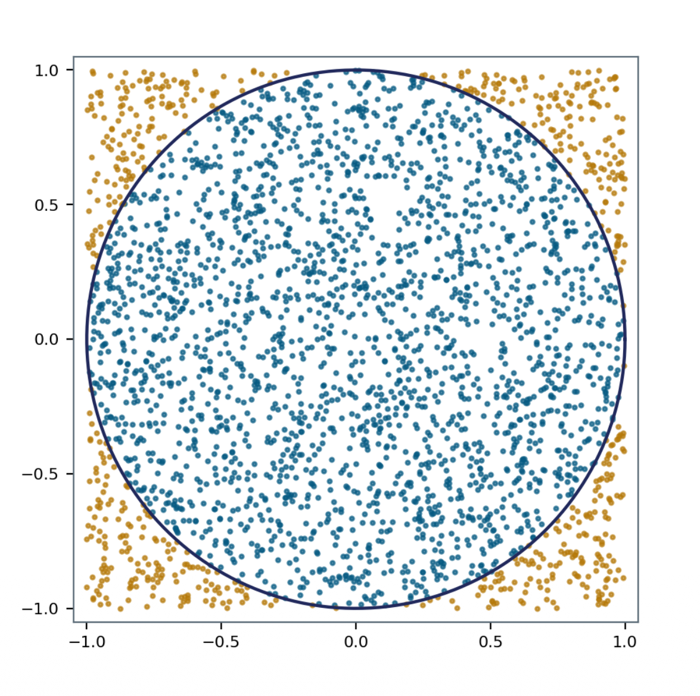

## Known MDP vs Unknown MDP

| Aspect | Known MDP | Unknown MDP |
| :- | :- | :- |
| **Environment Knowledge ($P, R$)** | Full knowledge of state transition dynamics $P$ and reward function $R$ | $P$ and $R$ are unknown; agent must explore the environment |
| **Problem Approach** | Well-defined optimization problem $\rightarrow$ Pure planning via computation | Trial-and-error interaction $\rightarrow$ Must learn and optimize simultaneously |
| **Primary Goal** | Directly compute the optimal policy ($\pi_*$) | Learn and optimize policies without prior model knowledge |
| **Representative Methods** | Value Iteration, Policy Iteration (Dynamic Programming) | Monte Carlo, Q-Learning, SARSA (Reinforcement Learning) |
| **Paradigm** | Model-based (Planning) | Model-free (Reinforcement Learning) |

## Model-based vs Model-free

| Aspect | Model-Based Learning | Model-Free Learning |
| :- | :- | :- |
| **Model Access ($P, R$)** | Has full access to transition dynamics $P$ and reward function $R$ | No access to environment dynamics ($P$ and $R$ are unknown) |
| **Optimization Approach** | Direct mathematical computation and planning using the known model | Direct learning and trial-and-error optimization through interaction |
| **Estimation Source** | Computes values and optimal policy $\pi_*$ via dynamic programming equations | Estimates $v_\pi, q_\pi$, and $\pi_*$ directly from sampled **experience** |
| **Computation vs. Sampling** | Pure computation / Planning (requires no real-time environment sampling) | Sample-based learning (requires trajectories / episodic experience) |
| **Typical Methods** | Policy Iteration, Value Iteration (DP) | Monte Carlo Methods, TD Learning, Q-Learning, SARSA |

## Monte Carlo Methods

- A Computational technique that uses random sampling and statistical methods to solve complex problems and estimate numerical results.
  - Named after the Monte Carlo Casino in Monaco.
  - It means **Estimate an unknown quantity by sampling, and averaging what you observe**.
- Used fo any estimation method whose operation involves a significant random component.
- Used in mathematics, physics, engineering, finance, computer science, etc.
- It is particularly valuable when an **analytical solution is difficult or impossible to obtain**.

### Estimating $\pi$ by Sampling (Monte Carlo Simulation)

- **Mechanism**:
  - Generate uniform random points $(x, y) \in [-1, 1] \times [-1, 1]$.
  - Count points falling inside the unit circle ($x^2 + y^2 \le 1$).
  - Estimate $\pi$ via area proportions:

$$
\begin{aligned}
\frac{\text{Area}_{circle}}{\text{Area}_{square}} = \frac{\pi}{4} \\ 
& \pi \approx 4 \times \frac{\text{\#points inside circle}}{\text{\#total points}}
\end{aligned}
$$

- **Empirical Validation**:
  - Total samples ($n$): $3000$ points
  - Estimated value: $\pi = 3.1386666666666665$
  - Relative error: $-0.0931\%$ from true value ($\approx 3.14159265$)

## Monte Carlo Prediction

$$v_\pi(s) = \mathbb{E}_{\pi}[G_t | S_t = s] \approx \frac{1}{N} \sum_{i=1}^{N(s)} G^{(i)}$$

- $\frac{1}{N} \sum_{i=1}^{N(s)} G^{(i)}$: Mean of the returns/rewards
- **Model-Free Learning**: Operates without prior knowledge of transition dynamics $P$ or reward function $R$.
- **Learning from Complete Episodes**: Learns state-value functions $v_\pi$ exclusively from full trajectories under policy $\pi$. Only works for **episodic tasks** where termination at step $T$ is guaranteed.
- **No Bootstrapping**: Does not update estimates using other value estimates $v(s')$; instead, updates rely solely on actual empirical returns observed at the end of the episode.
- **Empirical Mean Returns**: The value of state $s$ is estimated by the sample average of all observed returns starting from $s$:

### An Episode of Experience & Return Formulation

- **Trajectory Structure**:
  $S_0 \xrightarrow{A_0, R_1} S_1 \xrightarrow{A_1, R_2} S_2 \dots \xrightarrow{A_{T-1}, R_T} S_T$
- **Discounted Return ($G_t$)**:
  $G_t = R_{t+1} + \gamma R_{t+2} + \gamma^2 R_{t+3} + \dots + \gamma^{T-t-1} R_T$
- **Discount Factor ($\gamma = 1$)**: For episodic tasks with terminal-only rewards (such as Blackjack), setting $\gamma = 1$ is standard practice because the episode length is finite.

## First-Visit Monte Carlo

- First-Visit MC estimates the value function $V(s)$ by averaging returns following **only the first occurrence** of state $s$ within each sampled episode.
- Algorithmic Flow:
  - Initialize counters $N(s) \leftarrow 0$ and accumulate returns: $G(s) \leftarrow 0 \quad \forall s \in S$
  - Sample a complete episode $i = \{S_{i,0}, A_{i,1}, R_{i,2}, \dots, S_{i,T_i}\}$ generated under policy $\pi$
  - Compute return $G_{i,t} = \sum_{k=t+1}^{T_i} \gamma^{k-t-1} R_{i,k}$ from step $t$ to termination.
  - Only for the first time step $t$ where state $s$ appears in episode $i$:
    - $N(s) \leftarrow N(s) + 1$ (Increment counter for total first visits)
    - $G(s) \leftarrow G(s) + G_{i,t}$ (Increment total return)
    - $V(s) \leftarrow \frac{G(s)}{N(s)}$ (Update the value by mean return)

$$A \xrightarrow{R_1=1} B \xrightarrow{R_2=2} A \xrightarrow{R_3 = 1} C \xrightarrow{R_4 = 1} \text{terminal}$$

| **State** s | $N(s)$ | $G(s)$ | $V(s) = \frac{G(s)}{N(s)}$ |
| :- | :- | :- | :- |
| A | 1 | 9 | 9.00 |
| B | 1 | 8 | 8.00 |
| C | 1 | 5 | 5.00 |

## Every-Visit Monte Carlo
