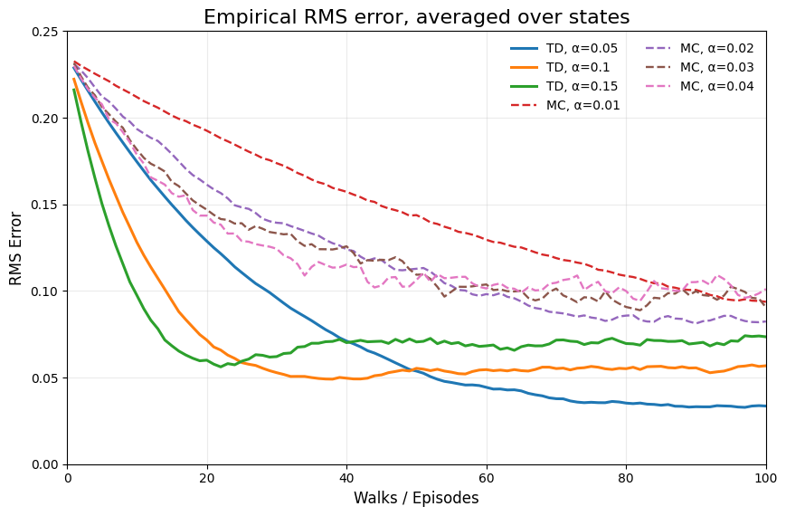
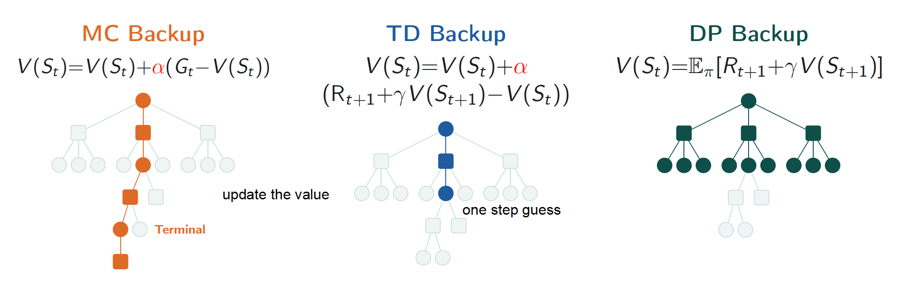
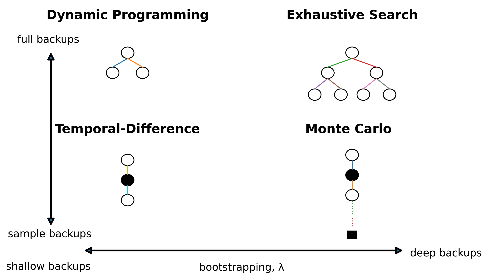
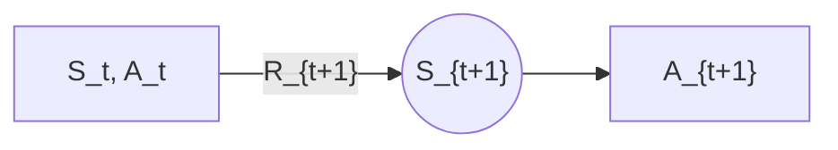

## Temporal-Difference Learning

> Updates a guess towards a guess.

- **Model-free**: No MDP Dynamics or Rewards
- Learns directly from episodes of experience.
- **Bootstrapping**: Estimate value function using estimated value from incomplete episodes.
  - Update estimate using another estimate.
- **Updates the estimate of $V$ immediately after each step.**
- Combines Monte Carlo and Dynamic Programming (Bootstrapping idea).

### MC

$$V(S_t) = V(S_t) + \alpha [\underbrace{G_t}_{\text{Goal}} - \underbrace{V(S_t)}_{\text{Previous estimate}} ]$$

- Update $V(S_t)$ towards the actual return.
- $\alpha = \frac{1}{n}$: Every-visit MC.
  - gives equal weight to all past samples in the *arithmetic mean*.
- Fixed $\alpha > \frac{1}{n}$: gives more weight to recent experience and reduces the influence of older episodes faster.
  - $\alpha = 0.1, \quad V(S) = 10$
  - $V(S) \leftarrow 10 + 0.1 (20 - 10) = 11$
  - $V(S) \leftarrow 11 + 0.1 (30 - 11) = 12.9$
  - Move 10% of the way towards the new value.

### One-Step Bootstrapping

> $\text{TD}(0) \rightarrow \text{TD}(\lambda) \rightarrow \text{TD}(1) \approx \text{MC}$

- $\lambda$ controls how much longer-term return information is used in the TD update.
  - It controls how far into the future TD learns from.
- $\lambda = 0$: uses one-step bootstrapping, corresponding to TD(0).
- As $\lambda$ increases, rewards further into the future have more influence on the update.
- $\lambda = 1$: approaches the *Monte Carlo* return in episodic tasks.

$$V(S_t) = V(S_t) + \alpha [\underbrace{\underbrace{R_{t+1} + \gamma V(S_{t+1})}_{\text{TD target}} - V(S_t)}_{\text{TD Error}} ]$$

- Only one immediate reward is used $R_{t+1}$.
- Everything after that is replaced by the current guess $V(S_{t+1})$ instead of actual future rewards.
- It uses actual reward for the first step and the estimated value/guess for the rest.

```text
MC
Sₜ ──Rₜ₊₁──> Sₜ₊₁ ──Rₜ₊₂──> ... ──> Terminal
│                                        │
└────────── episode 끝까지 기다림 ────────┘
                   ↓
               actual Gₜ
                   ↓
              V(Sₜ) update


TD(0)
Sₜ ──Rₜ₊₁──> Sₜ₊₁ ── ? ──> ...
│              │
│              └─ current V(Sₜ₊₁)
│
└── Rₜ₊₁ + γV(Sₜ₊₁)로 즉시 V(Sₜ) update
```

### TD(0) Algorithm

$$
\begin{aligned}
&\text{Loop for each episode:} \\
&\quad \text{Initialize} \quad S \\
&\quad \text{Loop for each step of the episode:} \\
&\quad \quad A \leftarrow \text{action given by policy} \quad \pi \\
&\quad \quad \text{Take action} \quad A, \quad \text{observe} \quad R, \quad S' \\
&\quad \quad V(S) \leftarrow V(S) + \alpha [R + \gamma V(S') - V(S)] \\
&\quad \quad S \leftarrow S' \\
&\quad \text{Until} \quad S \text{ is terminal} \\
\end{aligned}  
$$

- No need to wait until the end of the episode to update the value function.

### MC vs. TD

| Aspect | Monte Carlo (MC) | Temporal-Difference (TD) |
| - | - | - |
| **Learning sequence** | Learns from complete episodes | Learns from incomplete episodes |
| **Target** | Actual return $G_t$ | Estimated return using bootstrapping |
| **Update timing** | After the episode ends | Before the episode ends / step by step |
| **Future information** | Uses actual future rewards | Uses observed reward(s) + estimated future value |
| **Bootstrapping** | No | Yes |
| **Bias** | Unbiased | Biased |
| **Variance** | High | Low |
| **Environment** | Episodic / terminating environments | Also works in continuing / non-terminating environments |
| **Practical speed** | Slower updates | Faster updates in practice |



- In practice, TD is faster than MC because it can learn from incomplete episodes.



- MC: Full sampled path to the end.
- TD: Just one real step.
- DP: Every branch, weighted by probability, no sampling.



## SARSA

> $S_t, A_t, R_{t+1}, S_{t+1}, A_{t+1}$

- Follows generalized Policy Iteration.
  - Policy Evaluation: TD Policy Evaluation $Q \approx q_\pi$
  - Policy Improvement: $\epsilon$-greedy policy improvement, allowing exploration.
  - Update happens after every time step.
- Use **TD methods** for evaluation. $Q(S, A)$
- TD Evaluation + $\epsilon$-greedy Policy Improvement = **SARSA**

$$Q(S_t, A_t) = Q(S_t, A_t) + \alpha [\underbrace{R_{t+1} + \gamma Q(S_{t+1}, A_{t+1})}_{\text{TD target}} - Q(S_t, A_t)]$$

- $(S_t, A_t, R_{t+1}, S_{t+1}, A_{t+1})$: transition from one state-action pair to the next.
- The process repeatedly alternates between improving $Q$ and improving the policy.
- The estimates gradually move toward the optimal action-value function $q_*$ and the optimal policy $\pi_*$.
- Unlike classical policy iteration, SARSA does not need to complete policy evaluation before improving the policy.

### SARSA Example



- $Q(S_t,A_t)=10$
- $R_{t+1}=2$
- $\gamma=0.9$
- $\alpha=0.5$
- $Q(S_{t+1},A_{t+1})=8$
- TD Target $=2+0.9(8)=9.2$
- TD Error $=9.2-10=-0.8$
- Updated $Q(S_t,A_t)=10+0.5(-0.8)=9.6$

### SARSA Algorithm

$$
\begin{aligned}
&\text{Loop for each episode:} \\
&\quad \text{Initialize} \quad S \\
&\quad \text{Choose} A_t \text{ from } S_t \text{ using policy } \pi \text{ derived from } Q\\
&\quad \text{Loop for each step of the episode:} \\
&\quad \quad \text{Take action} \quad A_{t+1}, \quad \text{observe} \quad R_{t+1}, \quad S_{t+1} \\
&\quad \quad Q(S_t, A_t) \leftarrow Q(S_t, A_t) + \alpha [R_{t+1} + \gamma Q(S_{t+1}, A_{t+1}) - Q(S_t, A_t)] \\
&\quad \quad S_t \leftarrow S_{t+1} \\
&\quad \quad A_t \leftarrow A_{t+1} \\
&\quad \text{Until} \quad S \text{ is terminal} \\
\end{aligned}
$$

- As SARSA learns, each episode is completed faster.
- As the Q-values improve, the agent learns from action-value pairs and reaches the goal using fewer steps.

## Q-Learning
