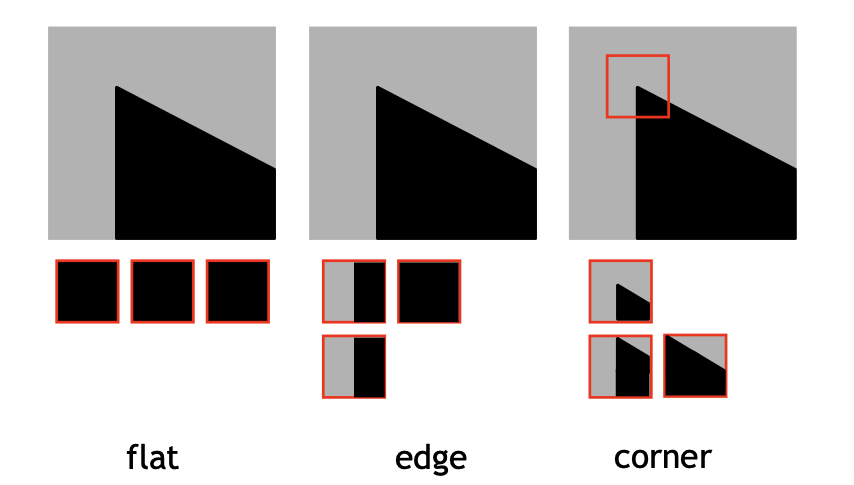
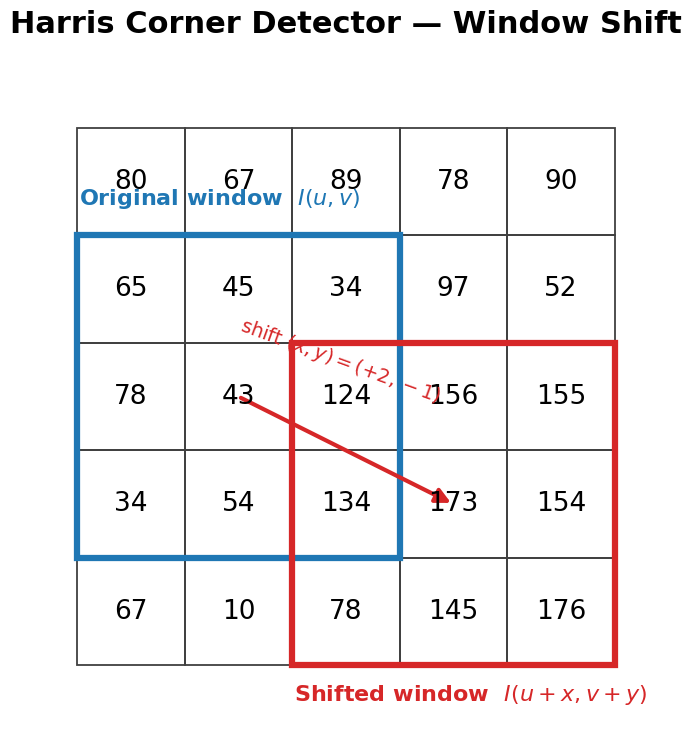
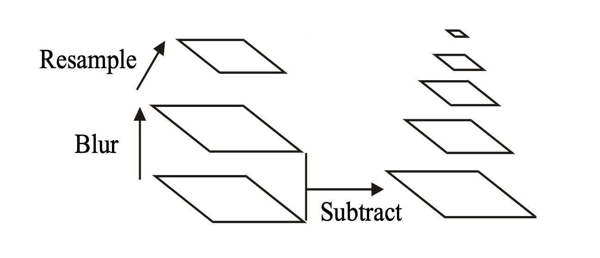
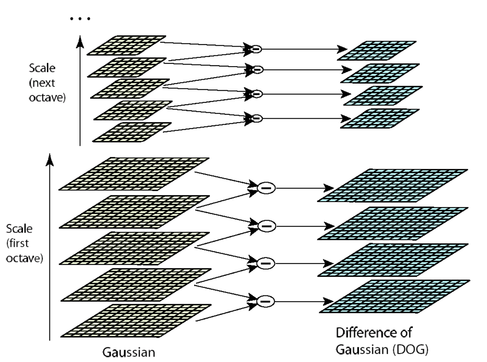
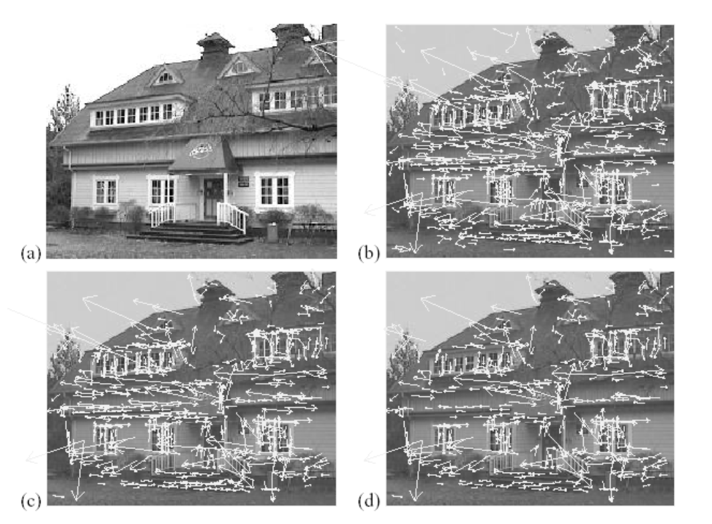
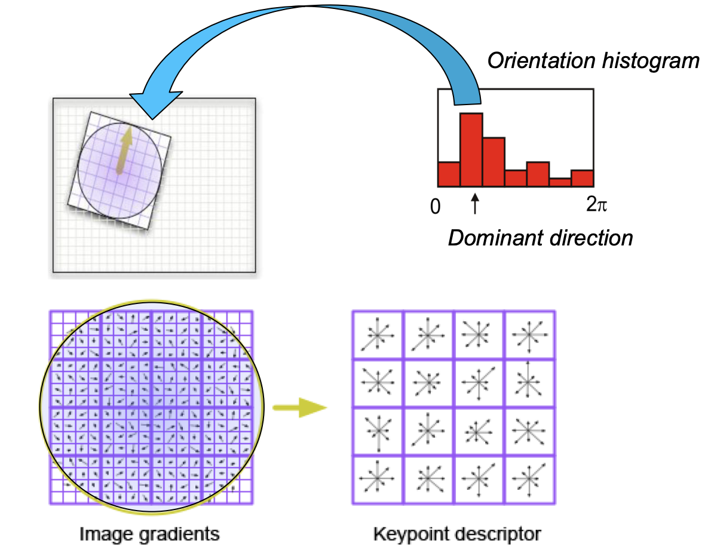
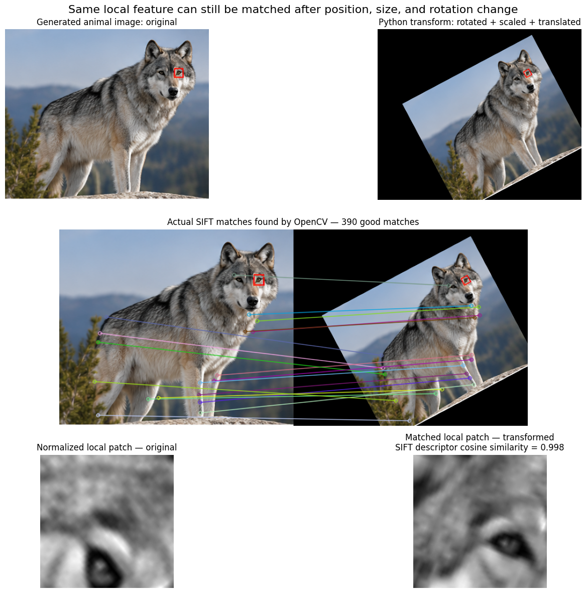
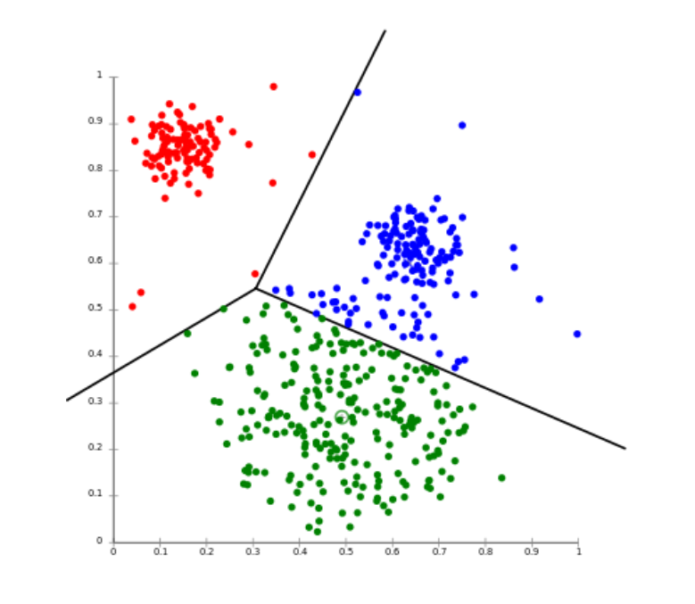
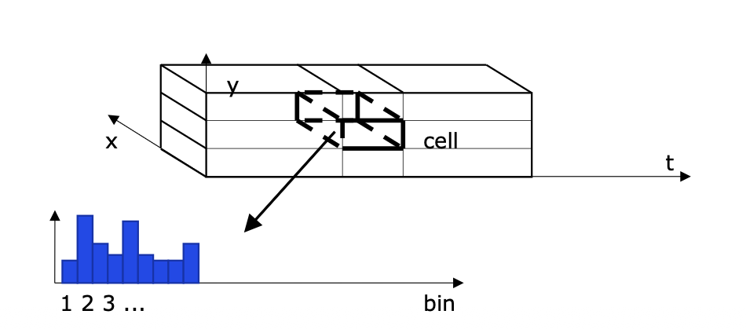

## Feature Detection

1. Detect invariant features of the image.
2. Describe the local area around each feature.
3. Match patterns of the feature descriptions.

### Moravec conner detector

$$E(u, v) = \sum_{x, y} [I(x, y) - I(x + u, y + v)]^2$$

- One of the earliest corner detectors (1980)
- Moravec detects a corner by shifting a small window in different directions and checking whether the image changes significantly in every direction.
  - Shifting a window in any direction should give a large change in intensity, measured in terms of **Sum of Squared Differences** (SSD).
- $(u, v)$ is how much the window is shifted.
- Larger $E$ indicates the image changes more after the shift.



- Flat: $E \approx 0$, No change in any direction
- Edge: $E \approx 1$, Change in some direction
- Corner: $E \approx 40$, Large change in every direction

### Harris corner detector

$$ E(x, y) = \sum_{u}\sum_{v} \underbrace{W(u, v)}_{\text{Window function}} [\underbrace{I(u + x, v + y)}_{\text{Shifted Intensity}} - \underbrace{I(u, v)}_{\text{Intensity}}]^2$$

- Improvement over Moravec change of intensify for a shifted windoe centered at $(u, v)$



- $(x, y) = (1, 0) \rightarrow$ move 1px to the right.
- $(x, y) = (0, 1) \rightarrow$ move down 1px.
- $(x, y) = (2, 1) \rightarrow$ move 2px to the right and 1px down.
- $I(u, v)$: Pixel intensity of the original point.
- $I(u + x, v + y)$: Pixel intensity of the shifted point.
- SSD: if $I(u,v) = 65$, and $I(u + x, v+ y) = 124$, then the SSD is $(124 - 65)^2 = 3481$.
- $w(u, v)$: window function, usually apply gaussian weighting to the pixels around the center.
  - if we calculate all the $(x, y)$ step by step, it will be computationally expensive.
  - so we use Taylor Expansion to approximate the intensity change.

#### Taylor Expansion

$$I(u + x, v + y) \approx I(u, v) + I_x(u, v)x + I_y(u, v)y$$

- Let $I_x$ and $I_y$ be the partial derivatives of $I$
- Approximates the intensity of the slightly shifted point, using the current intensity and gradient information.
- $I_x = \frac{\partial I}{\partial x}$: How much the intensity changes when moving to the right or left a little bit.
- $I_y = \frac{\partial I}{\partial y}$: How much the intensity changes when moving up or down a little bit.

$$E(x, y) \approx \sum_{u}\sum_{v} w(u, v) [I_x(u, v)x + I_y(u, v)y]^2$$

- because $I(u + x, v + y) \approx I(u, v) + I_x(u, v)x + I_y(u, v)y$.
- we can calculate **intensity change** by x/y gradient and the window shift.
- $(ax + by)^2 = a^2x^2 + 2abxy + b^2y^2 = [x, y] \begin{bmatrix} a^2 & ab \\ ab & b^2 \end{bmatrix} \begin{bmatrix} x \\ y \end{bmatrix}$

$$E(x,y) = [x, y] \underbrace{\begin{bmatrix} \sum_{u}\sum_{v} w(u, v) I_x^2 & \sum_{u}\sum_{v} w(u, v) I_xI_y \\ \sum_{u}\sum_{v} w(u, v) I_xI_y & \sum_{u}\sum_{v} w(u, v) I_y^2 \end{bmatrix}}_{A} \begin{bmatrix} x \\ y \end{bmatrix}$$

- Eigenvector = direction of the change
- Eigenvalue = magnitude of the change
- if both $\lambda_1 \text{ and } \lambda_2 \approx 0$, the point is flat.
- if either $\lambda_1 \text{ or } \lambda_2 \gg 0$ the point is an edge.
- if both $\lambda_1 \text{ and } \lambda_2 \ll 0$ the point is a corner.

$$R = \det(A) - k(\text{trace}(A))^2$$

- $\det(A) = \lambda_1 \lambda_2$
  - it can check if the point is a corner by checking if $\lambda_1 \text{ and } \lambda_2$ are both large.
- $\text{trace}(A) = \lambda_1 + \lambda_2$
  - it can penalizes edge-like responses where one eigenvalue is large but the other is small.
- $R = \lambda_1 \lambda_2 - k(\lambda_1 + \lambda_2)^2$
  - $k$ is an empirical constant, typically set $0.04 \leq k \leq 0.06$.
  - A threshold is applied an corners detected, non-maxima are suppressed.
  - $R$ can be derived from eigenvalues of the matrix $A$.
  - $R \approx 0$ the point is flat.
  - $R < 0$ the point is an edge.
  - $R \gg 0$ the point is a corner.

#### Harris corner detection pipeline

- Compute the Harris response $R$ for every pixel.
- Large positive $R$ indicates a strong corner response.
- Apply a threshold to remove weak responses.
- Apply non-maximum suppression to keep only local maxima.
- Overlay the remaining points on the original image as detected corners.

## Detector vs descriptor

- **Detector**: detect the location of the features in an image or video (WHERE).
- **Descriptor**: descriptors summarize the appearance of the neighborhood (WHAT IT LOOKS LIKE).
- A good feature detector should be:
  - make similar descriptors for similar features of the same object.
  - **Invariance**: the descriptor should be invariant to translation, rotation, scale, and illumination.

## SIFT

> Scale-Invariant Feature Transform

- It was proposed by Lowe in 1999, includes both a detector and a descriptor.
- A method to detect and match local features despite changes in scale and rotation.
- Core idea: build multiple blurred versions of the image, compute their differences, and find points that stand out across scales.

1. Build a scale-space pyramid of Differences of Gaussians (DoG) and detect minima/maxima.
2. Localize keypoints.
3. Assign them an orientation.
4. Compute the SIFT descriptor.



- $L(x, y, \sigma) = G(x, y, \sigma) * I(x, y)$: Blurred image at scale $\sigma$.
- $D(x, y, \sigma) = L(x, y, k\sigma) - L(x, y, \sigma)$: Difference of Gaussians at scale $\sigma$.
- **Octave**: a group of scale-space images at the same resolution.
- After each octave, the image is typically downsampled by a factor of 2.



### Key point localization

> $\text{Image} \rightarrow \text{Gaussian scale space} \rightarrow \text{DoG} \rightarrow \text{DoG extrema} \rightarrow \text{Filter low-contrast and edge responses} \rightarrow \text{Keypoints}$

- Detect local maxima and minima in DoG scale space.
- Remove low-contrast points because they are unstable and sensitive to noise.
- Remove edge responses because their locations are poorly localized.
- Use the ratio of principal curvatures to distinguish edges from stable corner/blob-like features.
- Example: $832 \rightarrow 729 \rightarrow 536$



- (a): Original image (233x189)
- (b): 832 DoG extrema
- (c): 729 left after peak-value threshold
- (d): left after testing the ratio of principal curvatures.

### Orientation assignment

- For every keypoint, compute the gradient at each location in its local neighborhood.
- The gradients are computed on the Gaussian-blurred image at the keypoint's scale, $\sigma$.
- Gradient directions are quantized into 36 bins over $360^\circ$.
- Each gradient contributes to the histogram according to its magnitude.
- The dominant histogram bin is assigned as the keypoint's orientation.
  - $[10, 20, 20, 30, 20] \rightarrow 20$
  - This orientation becomes the anchor direction for the SIFT descriptor.

### SIFT descriptor

> SIFT descriptor = 128-dimensional vector

- A 16x16 grid of locations of the gradient at $\sigma$ scale around the keypoint.
- The grid is divided into 4x4 sub-grids of 4x4 locations each.
- For each sub-grid, an 8-bin histogram of the magnitude weighted gradient orientation is computed.
  - All 8 bins are retained.
- The histogram from all the sub-grids are concatenated into the SIFT descriptor.
  - The dimensionality is given by 8 bins x 16 histograms = 128.

> $\text{Image} \rightarrow \text{Gaussian scale space} \rightarrow \text{DoG} \rightarrow \text{DoG extrema} \rightarrow \text{Filter low-contrast and edge responses} \rightarrow \text{Keypoints} \rightarrow \text{Assign orientation} \rightarrow \text{Build 128-D descriptor}$



- SIFT Features encode information about at 16x16 area around the feature point at the appropriate scale.
- It is scale, rotation, and translation invariant.
- Similar features give similar SIFT values regardless of orientation, scale, and translation.



### Applications of SIFT

- Object recognition: SIFT descriptors are extracted from an input image and matched to the SIFT descriptors of known objects in a database.
- Stereo vision: SIFT descriptors from the left and right images are matched to create the disparity map.
- Tracking: SIFT descriptors from successive frames are matched to track a target.
- Object and action classification: histograms of SIFT descriptors are computed over single frames or whole videos and used as input for a classifier.

## Object classification

- Object classification uses histograms of SIFT descriptors to characterize the class of an object.
- A popular histogram representation is called **Bag of Features (BoF)**.
  - BoF first requires creating a **dictionary**, also called a **codebook**, from the training set.
  - Once the dictionary is computed, a Bag of Features can be computed for any image.
  - The resulting Bag of Features is then used for classification.

```py
# Example SIFT descriptors from training images
descriptors = [
    [1.0, 1.2],
    [0.9, 1.1],
    [1.1, 0.8],

    [5.0, 5.1],
    [4.8, 5.2],
    [5.2, 4.9],

    [9.0, 1.0],
    [8.8, 1.2],
]

# Representative descriptors after clustering
codebook = [
    [1.0, 1.0],   # codeword 1
    [5.0, 5.0],   # codeword 2
    [9.0, 1.0],   # codeword 3
]

# SIFT descriptors from a new image
new_image_descriptors = [
    [1.2, 0.9],
    [0.8, 1.1],
    [5.1, 4.9],
    [9.2, 1.1],
    [8.9, 0.8],
]

# Nearest codeword assignments
assignments = [
    0,  # -> codeword 1
    0,  # -> codeword 1
    1,  # -> codeword 2
    2,  # -> codeword 3
    2,  # -> codeword 3
]

# Bag of Features histogram
bof = [2, 1, 2]
```

### Dictionary creation

- Extract all SIFT descriptors from the training images.
- Use a clustering algorithm, typically k-means, to group the descriptors into $k$ clusters.
- The descriptor space is partitioned into $k$ regions.
  - Example: $k=1000$.
- The resulting clusters form the dictionary/codebook.



### Bag of Features

- Map all SIFT descriptors of an image to clusters in the dictionary.
- Count the number of descriptors assigned to each cluster.
- Form a histogram with $k$ bins.
- Use this histogram as a measurement vector for a classifier.
- Possible classifiers include Bayes, SVM, KNN, and neural networks.

### Other Local Features

- SURF (Speeded Up Robust Features): another local feature method designed to provide robust features with faster computation.
- GLOH (Gradient Location and Orientation Histogram): describes local image structure using gradient location and orientation histograms.
- HOG (Histogram of Oriented Gradients): represents local regions using histograms of gradient orientations.
- For classification, descriptors can be extracted either from detected interest points or from a regular grid.
- Descriptors extracted from a regular grid are called dense features.

## Spatio-temporal local features

- In video, local features can be extracted from each frame separately or as 3D local features.
- Here, “3D” means $x, y, t$, where $t$ is time.
- These are called spatio-temporal features.
- They describe the appearance of local **cuboids** across space and time.



### Other Spatio-temporal local features

- HOG/HOF: Histogram of Optical Flow.
- HOG3D: a spatio-temporal extension of HOG.
- ESURF: Extended SURF.
- MBH: Motion Boundary Histograms.
- DTF: Dense Trajectory Features.
- For classification, these descriptors can be computed either at detected points or over a regular grid.
