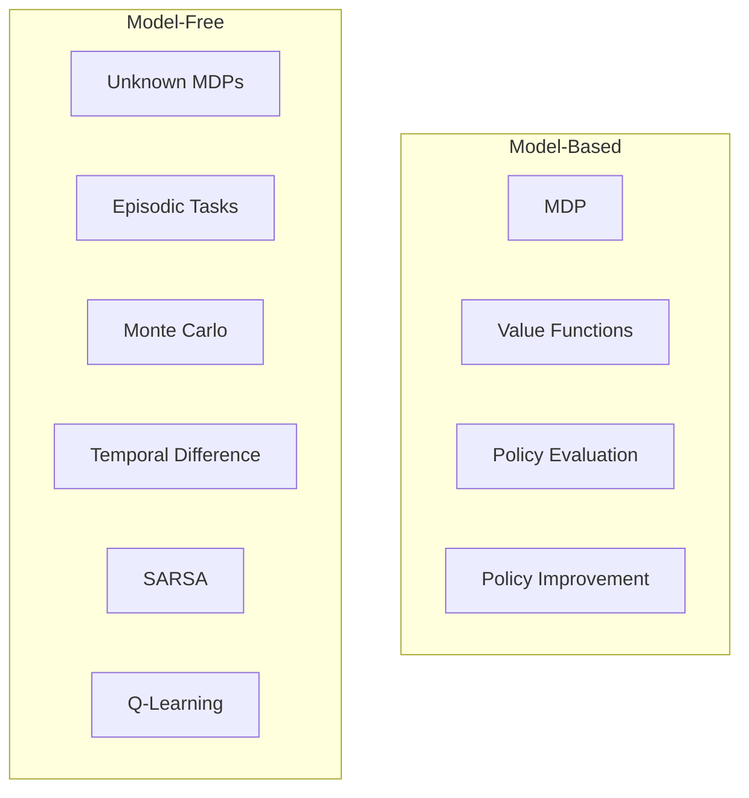
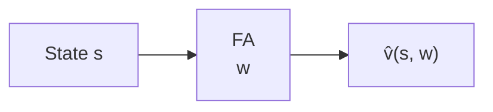
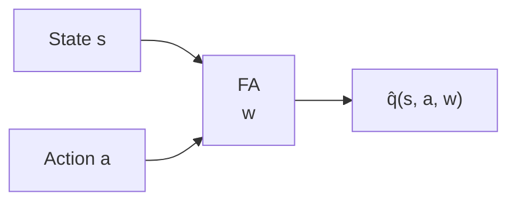
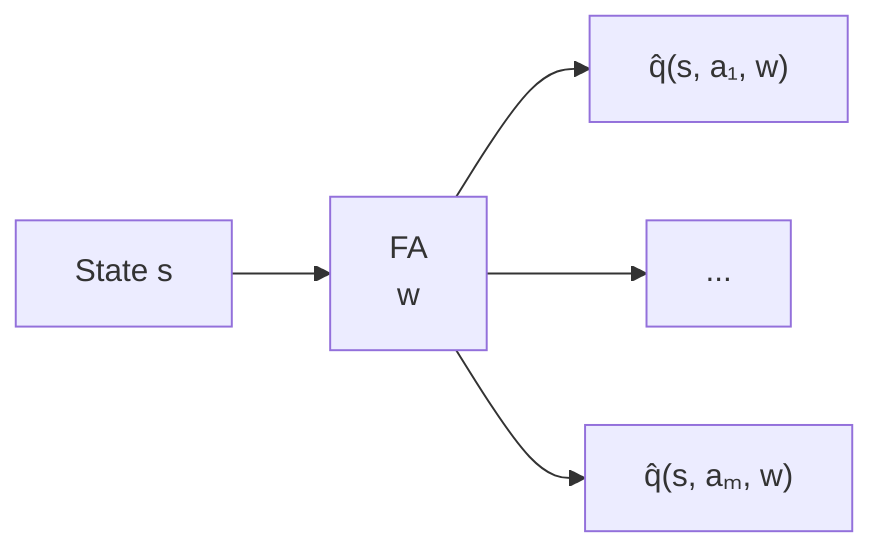

## RL Taxonomy

## Drawbacks of previous methods

- Large state space:
  - Go: $10^{170}$
  - Backgammon: $10^{20}$
  - Atari games: $10^9 \text{ to } 10^{11}$
- Scale-up model-free based techniques for prediction and control is challenging.
- Value function used look-up table representation
  - All states has an entry in $V(s)$
  - All state-action pair $(s,a)$ has an entry in $Q(s,a)$
- Too many state, and stat-action pair to store in memory
- Slow learning process for each states, due to large space.
- Each states needs to be explored sufficiently.
- For large MDPs
  - Function approximation: Almost near optimal value.
  - Estimate value function with function approximation.
    - $\hat{v}(s,w) \approx v_\pi(s)$
    - $\hat{q}(s,a,w) \approx q_\pi(s,a)$
  - Generalize from seen states to unseen states.
  - Using MC or TD learning techniques: Update parameter $w$.

## Function Approximation

- A technique for estimating unknown underlying function using historical or available observations.
- Assumption: an underlying mapping function exists
  - $f(x) \approx \hat{f}(x)$
- Function: $x \xrightarrow{f} y$

### Types of Value Function Approximation

**State-value:** state $s$ → scalar $\hat{v}(s,w)$

**Action-value (s, a input):** state $s$ and action $a$ → scalar $\hat{q}(s,a,w)$

**Action-value (s input, all actions out):** state $s$ → $\hat{q}(s,a_1,w),\ldots,\hat{q}(s,a_m,w)$

- $w$ is the parameter vector of the function approximator.
  - e.g. Neural Network weights
