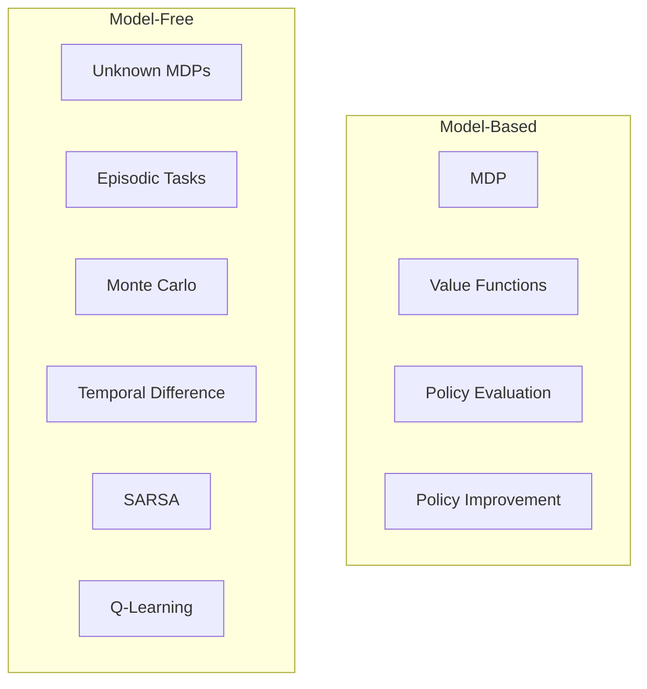
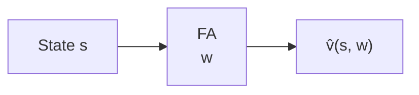
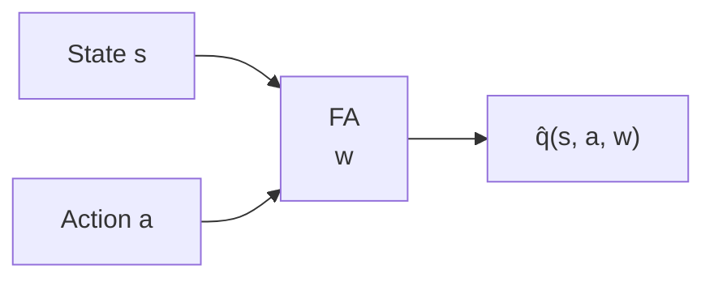
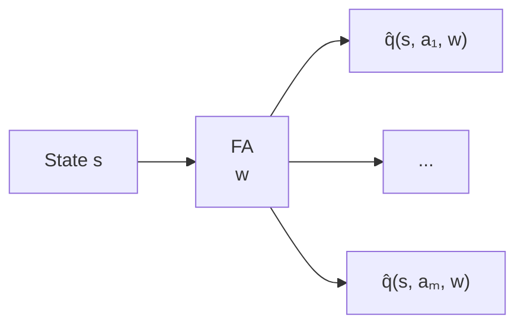
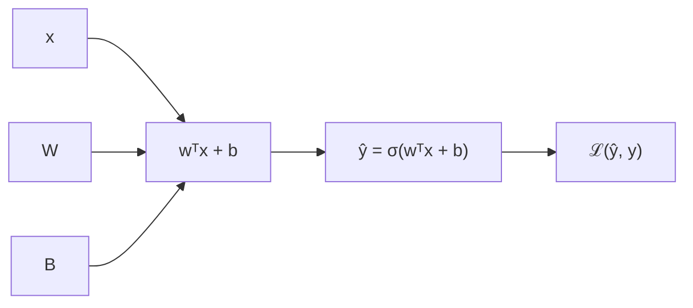

## RL Taxonomy

## Drawbacks of previous methods

- Large state space:
  - Go: $10^{170}$
  - Backgammon: $10^{20}$
  - Atari games: $10^9 \text{ to } 10^{11}$
- Scale-up model-free based techniques for prediction and control is challenging.
- Value function used look-up table representation
  - All states has an entry in $V(s)$
  - All state-action pair $(s,a)$ has an entry in $Q(s,a)$
- Too many state, and stat-action pair to store in memory
- Slow learning process for each states, due to large space.
- Each states needs to be explored sufficiently.
- For large MDPs
  - Function approximation: Almost near optimal value.
  - Estimate value function with function approximation.
    - $\hat{v}(s,w) \approx v_\pi(s)$
    - $\hat{q}(s,a,w) \approx q_\pi(s,a)$
  - Generalize from seen states to unseen states.
  - Using MC or TD learning techniques: Update parameter $w$.

## Function Approximation

- A technique for estimating unknown underlying function using historical or available observations.
- Assumption: an underlying mapping function exists
  - $f(x) \approx \hat{f}(x)$
- Function: $x \xrightarrow{f} y$

### Types of Value Function Approximation

**State-value:** state $s$ → scalar $\hat{v}(s,w)$

**Action-value (s, a input):** state $s$ and action $a$ → scalar $\hat{q}(s,a,w)$

**Action-value (s input, all actions out):** state $s$ → $\hat{q}(s,a_1,w),\ldots,\hat{q}(s,a_m,w)$

- $w$ is the parameter vector of the function approximator.
  - e.g. Neural Network weights

### Types of Function Approximator

- Tabular
  - V-Table: $s \rightarrow v(s)$
  - Q-Table: $(s,a) \rightarrow q(s,a)$
- Decision Trees, Nearest Neighbors
  - $s = [\text{speed} = 49, \text{distance} = 10]$
  - $s \rightarrow \text{Decision Tree / KNN} \rightarrow \hat{v}(s)$
- Linear Function approximation
  - Linear Combination of Features
  - Values are linear function for features $\hat{v}(s,w) = w^Tx(s)$
  - $x(s) = \begin{bmatrix} \text{speed} \\ \text{distance} \\ \text{fuel} \end{bmatrix}$
  - $\hat{v}(s,w) = w^Tx(s)$
  - $\hat{v}(s,w) = w_1x_1(s) + \cdots + w_n x_n(s)$
- Differentiable function approximation
  - $\hat{v}(s,w)$ is a differentiable function of $w$, can be *non-linear* in $s$
  - e.g. Neural Network, or CNN
    - $\frac{\partial \hat{v}(s,w)}{\partial w}$
    - $w \leftarrow w - \alpha \nabla_wL$
    - $\text{Pixels} \xrightarrow{CNN} \hat{v}(s)$

### Which FA to use?

In principle, any FA that fits the RL framework can be used.

| FA | Notes |
| - | - |
| Tabular | Easy; not scalable; does not generalise |
| Linear | Requires good features |
| Differentiable (better choice) | Scalable; not always well understood |
| Neural Networks | Performs well |
| Deep Neural Networks | Popular choice; performs well |

- Need training methods that are suitable for **non-stationary** data.

## ANN

### Logistic Regression

$$\mathcal{L}(a, y) = -y \log(a) - (1-y) \log(1-a)$$

- Loss function for Logistic Regression

### Gradient Descent

> Goal: Find $w$ tht minimize $J(w)$ or find a local minimum of $J(w)$.

- An iterative approach for error correction.
- For one sample, $\mathcal{L}(a, y) = -y \log(a) - (1-y) \log(1-a)$
- For $m$ samples,

$$J(w, b) = \frac{1}{m} \sum_{i=1}^m \mathcal{L}(a^{(i)}, y^{(i)})$$

- Find $w$ and $b$ that will minimize $J(w, b)$
  - $\min_{w, b} J(w, b)$
  - $J(w)$ is loss function.

$$w \leftarrow w - \alpha \frac{\partial J(w, b)}{\partial w}, \quad b \leftarrow b - \alpha \frac{\partial J(w, b)}{\partial b}$$

$$\Delta w J(w) = \big(\frac{\partial J(w)}{\partial w_1}, \ldots, \frac{\partial J(w)}{\partial w_n}\big)$$

- Adjust the $w$ in the direction of the -ve gradient.
  - $w = w - \alpha \Delta w, \quad b = b - \alpha \Delta b$
  - where $\alpha$ is the learning rate.
  - and, $\Delta w = \frac{\partial J(w, b)}{\partial w}, \quad \Delta b = \frac{\partial J(w, b)}{\partial b}$

### ANN as a Function Approximator

- Need a method to estimate: $\Delta w$
- Method to incrementally adjust and update: $w$
- **Representation of some aspects of RL environments as feature vector $x(s)$**
- Aspects can be approximated: $V(s) \text{ or } Q(s, a)$
  - Estimate value functions with function approximation.
  - $\hat{V}(s, \color{red}{w}\color{black}) \approx V(s)$
  - $\hat{Q}(s, a, \color{red}{w}\color{black}) \approx Q(s, a)$
- A mechanism to plugin **MC** and **TD** for function approximation.
