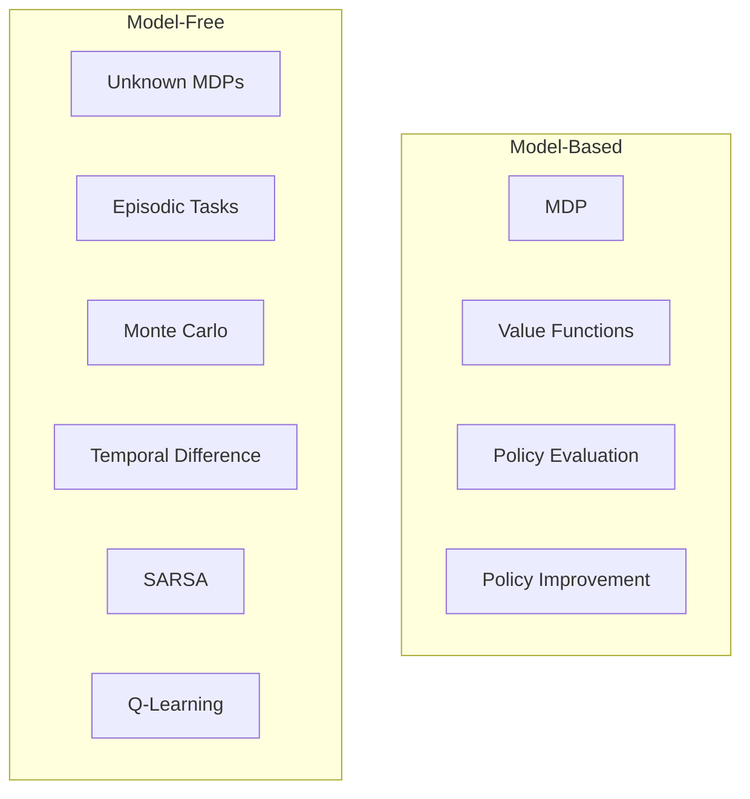
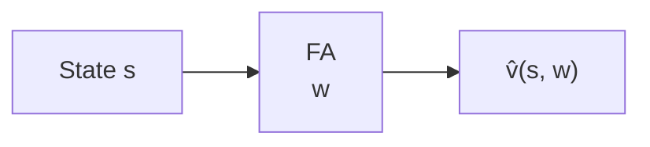
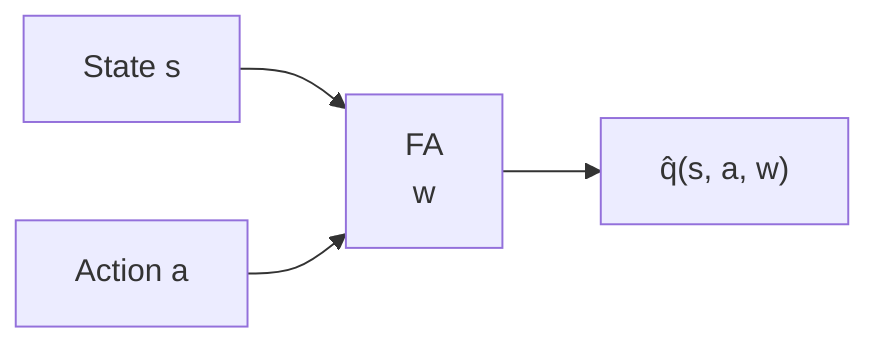
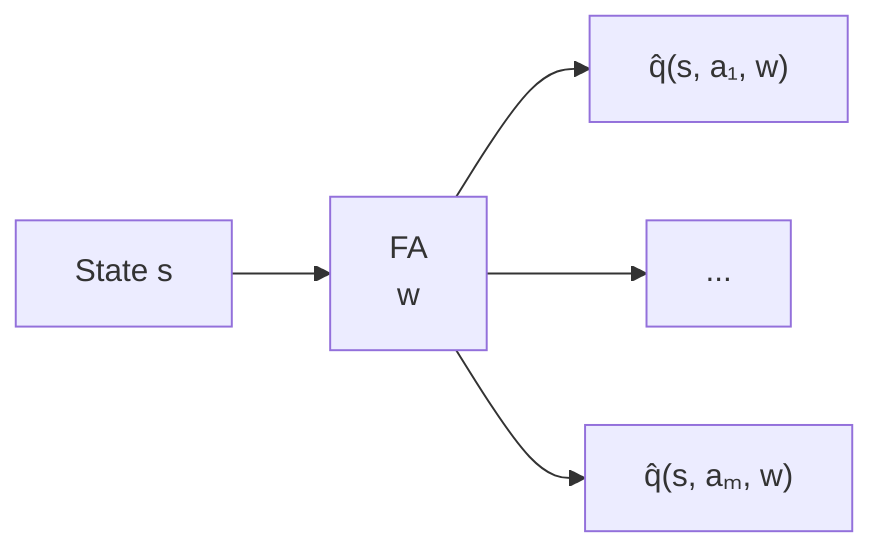
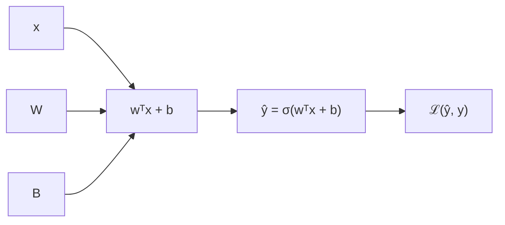

## RL Taxonomy

## Drawbacks of previous methods

- Large state space:
  - Go: $10^{170}$
  - Backgammon: $10^{20}$
  - Atari games: $10^9 \text{ to } 10^{11}$
- Scale-up model-free based techniques for prediction and control is challenging.
- Value function used look-up table representation
  - All states has an entry in $V(s)$
  - All state-action pair $(s,a)$ has an entry in $Q(s,a)$
- Too many state, and stat-action pair to store in memory
- Slow learning process for each states, due to large space.
- Each states needs to be explored sufficiently.
- For large MDPs
  - Function approximation: Almost near optimal value.
  - Estimate value function with function approximation.
    - $\hat{v}(s,w) \approx v_\pi(s)$
    - $\hat{q}(s,a,w) \approx q_\pi(s,a)$
  - Generalize from seen states to unseen states.
  - Using MC or TD learning techniques: Update parameter $w$.

## Function Approximation

- A technique for estimating unknown underlying function using historical or available observations.
- Assumption: an underlying mapping function exists
  - $f(x) \approx \hat{f}(x)$
- Function: $x \xrightarrow{f} y$

### Types of Value Function Approximation

**State-value:** state $s$ → scalar $\hat{v}(s,w)$

**Action-value (s, a input):** state $s$ and action $a$ → scalar $\hat{q}(s,a,w)$

**Action-value (s input, all actions out):** state $s$ → $\hat{q}(s,a_1,w),\ldots,\hat{q}(s,a_m,w)$

- $w$ is the parameter vector of the function approximator.
  - e.g. Neural Network weights

### Types of Function Approximator

- Tabular
  - V-Table: $s \rightarrow v(s)$
  - Q-Table: $(s,a) \rightarrow q(s,a)$
- Decision Trees, Nearest Neighbors
  - $s = [\text{speed} = 49, \text{distance} = 10]$
  - $s \rightarrow \text{Decision Tree / KNN} \rightarrow \hat{v}(s)$
- Linear Function approximation
  - Linear Combination of Features
  - Values are linear function for features $\hat{v}(s,w) = w^Tx(s)$
  - $x(s) = \begin{bmatrix} \text{speed} \\ \text{distance} \\ \text{fuel} \end{bmatrix}$
  - $\hat{v}(s,w) = w^Tx(s)$
  - $\hat{v}(s,w) = w_1x_1(s) + \cdots + w_n x_n(s)$
- Differentiable function approximation
  - $\hat{v}(s,w)$ is a differentiable function of $w$, can be *non-linear* in $s$
  - e.g. Neural Network, or CNN
    - $\frac{\partial \hat{v}(s,w)}{\partial w}$
    - $w \leftarrow w - \alpha \nabla_wL$
    - $\text{Pixels} \xrightarrow{CNN} \hat{v}(s)$

### Which FA to use?

In principle, any FA that fits the RL framework can be used.

| FA | Notes |
| - | - |
| Tabular | Easy; not scalable; does not generalise |
| Linear | Requires good features |
| Differentiable (better choice) | Scalable; not always well understood |
| Neural Networks | Performs well |
| Deep Neural Networks | Popular choice; performs well |

- Need training methods that are suitable for **non-stationary** data.

## ANN

### Logistic Regression

$$\mathcal{L}(a, y) = -y \log(a) - (1-y) \log(1-a)$$

- Loss function for Logistic Regression

### Gradient Descent

> Goal: Find $w$ tht minimize $J(w)$ or find a local minimum of $J(w)$.

- An iterative approach for error correction.
- For one sample, $\mathcal{L}(a, y) = -y \log(a) - (1-y) \log(1-a)$
- For $m$ samples,

$$J(w, b) = \frac{1}{m} \sum_{i=1}^m \mathcal{L}(a^{(i)}, y^{(i)})$$

- Find $w$ and $b$ that will minimize $J(w, b)$
  - $\min_{w, b} J(w, b)$
  - $J(w)$ is loss function.

$$w \leftarrow w - \alpha \frac{\partial J(w, b)}{\partial w}, \quad b \leftarrow b - \alpha \frac{\partial J(w, b)}{\partial b}$$

$$\Delta w J(w) = \big(\frac{\partial J(w)}{\partial w_1}, \ldots, \frac{\partial J(w)}{\partial w_n}\big)$$

- Adjust the $w$ in the direction of the -ve gradient.
  - $w = w - \alpha \Delta w, \quad b = b - \alpha \Delta b$
  - where $\alpha$ is the learning rate.
  - and, $\Delta w = \frac{\partial J(w, b)}{\partial w}, \quad \Delta b = \frac{\partial J(w, b)}{\partial b}$

### ANN as a Function Approximator

- Need a method to estimate: $\Delta w$
- Method to incrementally adjust and update: $w$
- **Representation of some aspects of RL environments as feature vector $x(s)$**
- Aspects can be approximated: $V(s) \text{ or } Q(s, a)$
  - Estimate value functions with function approximation.
  - $\hat{V}(s, \color{red}{w}\color{black}) \approx V(s)$
  - $\hat{Q}(s, a, \color{red}{w}\color{black}) \approx Q(s, a)$
- A mechanism to plugin **MC** and **TD** for function approximation.

## Value Function Approximation for policy evaluation

> VFA: Value Function Approximation

- $v_\pi(s)$ is given, so making it supervised.
- $\hat{v}(s, w)$ is estimated value if it follows the policy $\pi$ by using ANN.
- $x \rightarrow \hat{y} \quad \text{vs} \quad y$ (supervised learning)
- $s \rightarrow \hat{v}(s, w) \quad \text{vs} \quad v_\pi(s)$ (Reinforcement learning)

$$ J(w) = \mathbb{E}_\pi[\big(v_\pi(s) - \hat{v}(s, w)\big)^2]$$

- Find $w$ that minimizes $J(w)$
  - $J(w)$: Loss function.
  - $\hat{v}(s, w)$: Guess from the value function approximation.
  - $v_\pi(s) - \hat{v}(s, w)$: Error between the true value and the estimated value.
  - $\mathbb{E}_\pi[\cdot]$: Expected average over all states $s$ according to the policy $\pi$.

$$
\begin{aligned}
& \Delta w = -\frac{1}{2} \alpha \nabla_w J(w) \\
& \Delta w = \alpha \mathbb{E}_\pi[\underbrace{\big(v_\pi(s) - \hat{v}(s, w)\big)}_{Error} \underbrace{\nabla_w \hat{v}(s, w)}_{Gradient}]
\end{aligned}
$$

- $\Delta w = $ Step size X Error X Gradient

### VFA with SGD

$$ \Delta w = \alpha (v_\pi(s) - \hat{v}(s, w)) \nabla_w \hat{v}(s, w)$$

- Stochastic Gradient Descent **sample** the gradient
- Sample a state randomly, find what $v_\pi(s)$ is, and find the estimate
  - $\Delta w = \alpha [\text{Error at } s \times \text{Gradient at } s]$
  - Sample $s_t$ from $\pi$, and update $w$
- Expected value update using SGD update is same as full gradient update
  - Random sampling will be eventually the same as full gradient update

## Linear Value Function Approximation

- Represent Value function (state or action) by a linear combination of features
  - $\hat{v}(s, w) = x(s)^Tw = \sum_{j=0}^n x_j(s) w_j$
- Loss function: $J(w) = \mathbb{E}_\pi[\big(v_\pi(s) - \hat{v}(s, w)\big)^2]$

$$\Delta w = \alpha \underbrace{\big(v_\pi(s) - \hat{v}(s, w)\big)}_{Error} \underbrace{x(s)}_{Feature}$$

- Weight update: step size X Error X Feature value
- SGD converges to global mininum

### Incremental methods for prediction

- Real-world RL is not supervised, instead, it is guided by rewards.
- No $v_\pi(s)$ is given.
- Instead, substitute a **target** for $v_\pi(s)$

$$ \Delta w = \alpha(G_t - \hat{v}(s_t, w)) \nabla_w \hat{v}(s_t, w)$$

- Monte Carlo updates: target is the return $G_t$

$$ \Delta w = \alpha(\underbrace{R_{t+1} + \gamma \hat{v}(s_{t+1}, w)}_{\text{TD Target}} - \hat{v}(s_t, w)) \nabla_w \hat{v}(s_t, w)$$

- TD updates: use TD Target

### VFA for Monte Carlo

- MC return $G_t$ is an unbiased, noisy sample of true value $v_\pi(s_t)$
  - if $G_t = 3, 7, 4, 6, 5, \cdots$
  - but in average, $\frac{1}{N} \sum_{i=1}^N G_t^{(i)} \approx v_\pi(s)$
- $\langle S_1, G_1 \rangle, \langle S_2, G_2 \rangle, \cdots, \langle S_N, G_N \rangle$ is an estimate of $v_\pi(s)$
  - $x \rightarrow y$ (supervised learning)
  - $s_t \rightarrow G_t$ (Reinforcement learning)
- so it learns to $\hat{v}(s, w) \approx G_t$

$$
\begin{aligned}
& \Delta w = \alpha(G_t - \hat{v}(s, w)) \nabla_w \hat{v}(s, w) \\
& \Delta w = \alpha \big(G_t - \hat{v}(s, w)\big) x(s)
\end{aligned}
$$

- In Linear VFA, $\hat{v}(s,w) = w^Tx(s)$
  - $x(s)$ is the feature vector of state $s$
  - $w$ is the weight vector
  - so $\nabla_w \hat{v}(s, w) = \nabla_w (w^Tx(s)) = x(s)$
- Update = Learning rate X Error X state features

$$
\begin{aligned}
& \text{Initialize } w = 0, k = 1 \\
& Loop: \\
& \quad \text{Sample k-th episode } (s_{k1}, a_{k1}, r_{k1}, ..., S_{kL_k}) \text{ using policy } \pi \\
& \quad \text{For } t = 1, ... L_k: \\
& \quad \quad \text{if First Visit to } (s) \text{ in episode } k, then \\
& \quad \quad \quad G_t(s) = \sum_{j=t}^{L_k} \gamma_{k,j} \\
& \quad \quad \quad \text{Weight update: } \quad w \leftarrow w - \alpha(G_t - \hat{v}(s,w))x(s) \\
& \quad \quad k = k + 1 \\
& \end{aligned}
$$

- $G_t = R_{t+1} + \gamma R_{t+2} + \gamma^2 R_{t+3} + \cdots + \gamma^{L_k-t} R_{L_k}$

### VFA for TD Learning

- Use bootstrapping and sampling to approximate the target $v_\pi$
  - Sampling: Use a sampled transition  $S_t, A_t, R_{t+1}, S_{t+1}$ instead of computing the full expectation over possible transitions.
  - Bootstrapping: Construct the TD target using the current estimate $\hat{v}(S_{t+1}, w)$, instead of waiting for the complete episodic return.

$$R_{t+1} + \gamma \hat{v}(S_{t+1}, w)$$

- **TD Target** is a biased sample of true value $v_\pi(S_t)$
- Can use supervised learning on a training set of $\langle S, R \rangle$ paris
  - $\langle S_1, R_2 + \gamma \hat{v}(S_2, w) \rangle, \langle S_2, R_3 + \gamma \hat{v}(S_3, w) \rangle, \cdots, \langle S_{T-1}, R_T \rangle$

$$ \Delta w = \alpha(R + \gamma \hat{v}(s', w) - \hat{v}(s, w)) \nabla_w \hat{v}(s, w)$$

- Linear VFA + TD(0) for prediction and policy evaluation
- TD Error: $\delta_t = R_{t+1} + \gamma \hat{v}(S_{t+1}, w) - \hat{v}(S_t, w)$
- $\Delta w = \alpha \delta_t \nabla_w \hat{v}(S_t, w)$
  - $\nabla_w \hat{v}(s, w) = x(s)$
  - $\Delta w = \alpha \delta_t x(s)$
  - $w \leftarrow w - \alpha \delta_t x(s)$

$$
\begin{aligned}
& \text{Initialize } w = 0 \\
& Loop: \\
& \quad \text{Initialize } s \\
& \quad \text{Sample transition } (s, a, r, s') \text{ using policy } \pi \\
& \quad \text{Weight update: } \quad w \leftarrow w - \alpha(R + \gamma \hat{v}(s', w) - \hat{v}(s, w))x(s)  \\
& \end{aligned}
$$

## Overall

- Linear VFA: $\hat{v}(s, w) = w^Tx(s)$
- MC Target = $G_t$
- TD Target = $R_{t+1} + \gamma \hat{v}(s', w)$
- MC: $w \leftarrow w + \alpha(G_t - \hat{v}(s, w)) x(s)$
- TD: $w \leftarrow w + \alpha(R_{t+1} + \gamma \hat{v}(s', w) - \hat{v}(s, w))x(s)$
