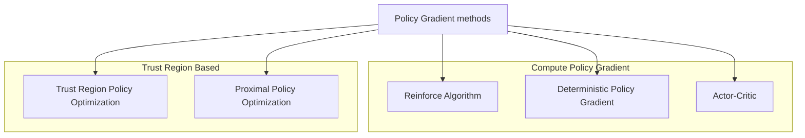
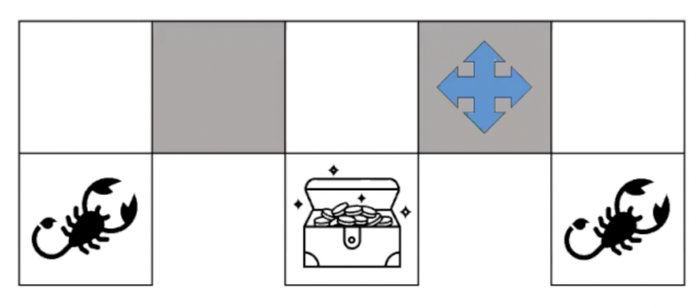
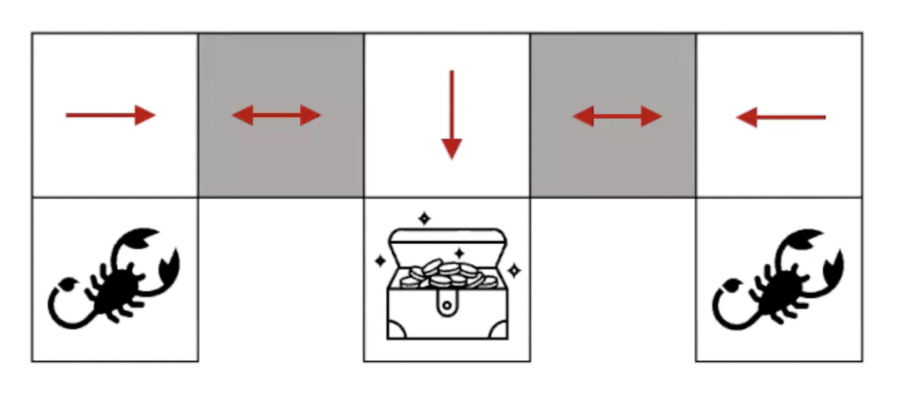

## Policy Search Methods

> Instead of $V$ and $Q$ functions, we directly estimate the optimal policy.

$$\pi^{\theta}(a|s) \approx P(a|s, \theta)$$

- Policy was generated directly from the value function (e.g. $\epsilon$-greedy)
- Parameterize the policy directly.
  - Instead of $v(s,w)$ or $\hat{q}(s,a,w)$, we have $\pi^{\theta}(a|s)$
  - Given a particular state $s$, what actions should we take? (What is probability of that particular action?)
  - $\theta$ is a learnable parameter which could be a neural network.

### Value-based and Policy-based Methods

- Value-based: Learnt value function, Implicit policy (e.g. $\epsilon$-greedy)
- Policy-based: No value function, Learnt policy.
  - Good convergence properties
  - Effective in high-dimensional or continuous action spaces
    - if it is really continuous and large, it is not efficient as well.
  - Can learn stochastic policies.
  - Sometimes policies are relatively simple, values and models are complex.
  - Typically reaches local optima.
  - Obtained knowledge is specific and does not generalize well.
- Actor-Critic: Learnt value function, Learnt policy.

### Policy Gradient Techniques

- Trust-Region Based: Optimize the policy in a trust zone (closer circle).

## Stochastic policies

### Rock-Paper-Scissors

- A deterministic policy is easily exploited
  - Deterministic policy: If we follow a set of action or sequence of actions, we will definitely reach the goal and will always reach teh same location.
- A uniform random policy is optimal policy.

### Grid World

$$
\phi(s,a) = \big(\underbrace{1 0 1 0}_{walls}, \underbrace{0 1 0 0}_{actions}\big)
$$

- Agent cannot differentiate between the grey states.
- $\phi(s,a)$ features describing state $s$ and action $a$.
- $\phi(s,E) = (\underbrace{1, 0, 1, 0}_{\text{NESW}}, \underbrace{0, 1, 0, 0}_{\text{NESW}})$ is the North and the South are walls and the agent will move to the East.
- If $\pi(\text{grey}) = W$, then when the agent is in the left grey state, it will move west, get stuck in a loop, and never reach the goal.

- Therefore, an optimal stochastic policy moves randomly $E$ or $W$ in grey states.
  - $\pi_{\theta}(\text{wall to N and S, move E}) = 0.5$
  - $\pi_{\theta}(\text{wall to N and S, move W}) = 0.5$
- The agent will reach the goal with high probability.
- Policy-based methods can learn Stochastic policies.
  4563

## Objective Function in Policy-based Methods

> Given a policy $\pi_{\theta}(a|s)$ with parameters $\theta$, the goal is to find the best $\theta$.

$$
J_1(\theta) = v_{\pi_{\theta}}(S_1)
$$

- In an episodic task (with an end state), $J_1(\theta)$ is for that particular start state and measures how much expected return we can get.
- $S_1$ is the start state.
- $J(\theta)$ is the measure of the quality of the policy or the objective function to optimize.

$$
J_{avV}(\theta) = \sum_{s}\mu_{\pi\theta}(s)v_{\pi\theta}(s)
$$

- In continuing environments (doesn't have an end state), consider the states and take the average value weighted by how often the agent visits each state.
- $\mu_{\pi\theta}(s)$ is how often the agent is visiting that particular state $s$.

$$
J_{avR}(\theta) = \sum_{s}\mu_{\pi\theta}(s)\sum_{a}\pi_{\theta}(a|s)\sum_{r}p(r|s,a)r
$$

- Use the average reward per time step.
- Small batches can be used to estimate this average reward during training.

## Policy-based Methods

- Policy-based RL is an optimization problem, find $\theta$ that maximize $J(\theta)$.
  - $J(\theta)$ is the policy objective function.
- **Gradient-free** methods: Hill Climbing, Genetic Algorithms, ...
- **Gradient-based**

$$\Delta{\theta} = \alpha \nabla_{\theta} J(\theta)$$

- Policy gradient method will search for a local minimum in $J(\theta)$ by ascending the gradient of the Policy.
  - why ascending? because we want to maximize the objective function's value/rewards.
  - $\nabla_{\theta} J(\theta) = \begin{pmatrix} \frac{\partial J(\theta)}{\theta_1} \\ \vdots \\ \frac{\partial J(\theta)}{\theta_n} \end{pmatrix}$
  - $\alpha$ is the step size.

$$
\Delta{\theta} J(\theta) = \nabla_{\theta} \mathbb{E}_d[v_{\pi\theta}(s)]
$$

- Assume the policy $\pi_{\theta}$ is differentiable.
- Compute an estimate of the policy gradient.
- Compute $\Delta{\theta} J(\theta)$ using Monte Carlo samples since we need to explore the environment, gather information, and then learn the policy.

## Score Function

- Assume the policy $\pi_{\theta}$ is differentiable.
- $\nabla_{\theta} \pi_{\theta}(s, a)$ is the gradient.

$$
\begin{aligned}
\nabla_\theta \pi_\theta(s,a)
&=
\pi_\theta(s,a)
\frac{\nabla_\theta \pi_\theta(s,a)}
{\pi_\theta(s,a)}
\\
&=
\pi_\theta(s,a)
\nabla_\theta \log \pi_\theta(s,a)
\quad
\big(
\because \
\nabla_\theta \log f(\theta)
=
\frac{1}{f(\theta)}
\nabla_\theta f(\theta)
\big)
\end{aligned}
$$

- Multiplying and dividing by $\pi_\theta(s,a)$ is called the **Likelihood Ratio Trick**.
  - Since $\frac{\pi_\theta(s,a)}{\pi_\theta(s,a)} = 1$, this does not change the original value.
    - $\nabla_\theta \pi_\theta(s,a)$ is Gradient of the policy
    - $\pi_\theta(s,a)$ is the policy.
    - $\frac{\nabla_\theta \pi_\theta(s,a)}{\pi_\theta(s,a)}$ measures how sensitive the policy is to changes in $\theta$, relative to the policy value itself.
  - From the derivative rule of the logarithm, $\frac{\nabla_\theta \pi_\theta(s,a)}{\pi_\theta(s,a)} = \nabla_\theta \log \pi_\theta(s,a)$.
- $\nabla_\theta \log \pi_\theta(s,a)$ is called the **Score Function**.
