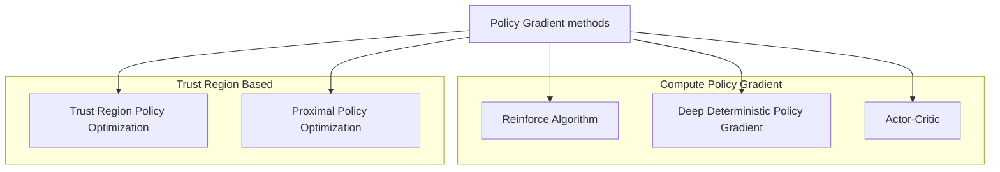
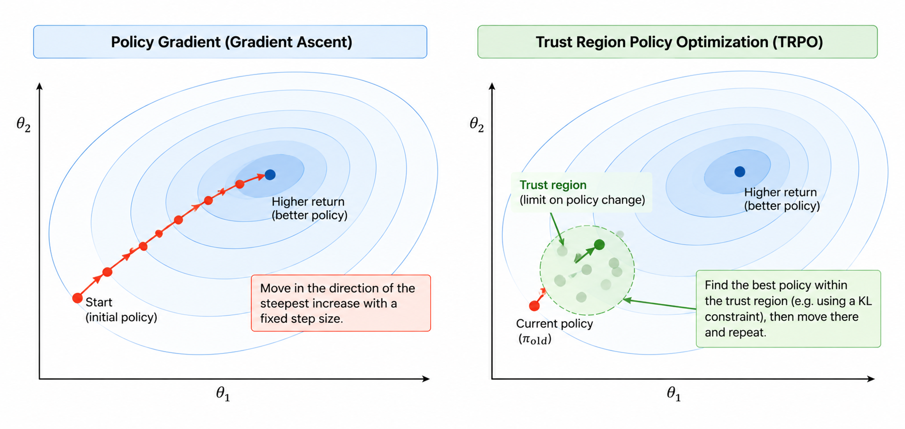
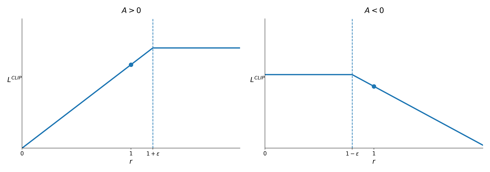

## Policy Search Methods

> Instead of $V$ and $Q$ functions, we directly estimate the optimal policy.

$$\pi^{\theta}(a|s) \approx P(a|s, \theta)$$

- Policy was generated directly from the value function (e.g. $\epsilon$-greedy)
- Parameterize the policy directly.
  - Instead of $v(s,w)$ or $\hat{q}(s,a,w)$, we have $\pi^{\theta}(a|s)$
  - Given a particular state $s$, what actions should we take? (What is probability of that particular action?)
  - $\theta$ is a learnable parameter which could be a neural network.

### Value-based and Policy-based Methods

- Value-based: Learnt value function, Implicit policy (e.g. $\epsilon$-greedy)
- Policy-based: No value function, Learnt policy.
  - Good convergence properties
  - Effective in high-dimensional or continuous action spaces
    - if it is really continuous and large, it is not efficient as well.
  - Can learn stochastic policies.
  - Sometimes policies are relatively simple, values and models are complex.
  - Typically reaches local optima.
  - Obtained knowledge is specific and does not generalize well.
- Actor-Critic: Learnt value function, Learnt policy.

### Policy Gradient Techniques

- Trust-Region Based: Optimize the policy in a trust zone (closer circle).

## Stochastic policies

### Rock-Paper-Scissors

- A deterministic policy is easily exploited
  - Deterministic policy: If we follow a set of action or sequence of actions, we will definitely reach the goal and will always reach teh same location.
- A uniform random policy is optimal policy.

### Grid World

$$
\phi(s,a) = \big(\underbrace{1 0 1 0}_{walls}, \underbrace{0 1 0 0}_{actions}\big)
$$

- Agent cannot differentiate between the grey states.
- $\phi(s,a)$ features describing state $s$ and action $a$.
- $\phi(s,E) = (\underbrace{1, 0, 1, 0}_{\text{NESW}}, \underbrace{0, 1, 0, 0}_{\text{NESW}})$ is the North and the South are walls and the agent will move to the East.
- If $\pi(\text{grey}) = W$, then when the agent is in the left grey state, it will move west, get stuck in a loop, and never reach the goal.

- Therefore, an optimal stochastic policy moves randomly $E$ or $W$ in grey states.
  - $\pi_{\theta}(\text{wall to N and S, move E}) = 0.5$
  - $\pi_{\theta}(\text{wall to N and S, move W}) = 0.5$
- The agent will reach the goal with high probability.
- Policy-based methods can learn Stochastic policies.
  4563

## Objective Function in Policy-based Methods

> Given a policy $\pi_{\theta}(a|s)$ with parameters $\theta$, the goal is to find the best $\theta$.

$$
J_1(\theta) = v_{\pi_{\theta}}(S_1)
$$

- In an episodic task (with an end state), $J_1(\theta)$ is for that particular start state and measures how much expected return we can get.
- $S_1$ is the start state.
- $J(\theta)$ is the measure of the quality of the policy or the objective function to optimize.

$$
J_{avV}(\theta) = \sum_{s}\mu_{\pi\theta}(s)v_{\pi\theta}(s)
$$

- In continuing environments (doesn't have an end state), consider the states and take the average value weighted by how often the agent visits each state.
- $\mu_{\pi\theta}(s)$ is how often the agent is visiting that particular state $s$.

$$
J_{avR}(\theta) = \sum_{s}\mu_{\pi\theta}(s)\sum_{a}\pi_{\theta}(a|s)\sum_{r}p(r|s,a)r
$$

- Use the average reward per time step.
- Small batches can be used to estimate this average reward during training.

## Policy-based Methods

- Policy-based RL is an optimization problem, find $\theta$ that maximize $J(\theta)$.
  - $J(\theta)$ is the policy objective function.
- **Gradient-free** methods: Hill Climbing, Genetic Algorithms, ...
- **Gradient-based**

$$\Delta{\theta} = \alpha \nabla_{\theta} J(\theta)$$

- Policy gradient method will search for a local minimum in $J(\theta)$ by ascending the gradient of the Policy.
  - why ascending? because we want to maximize the objective function's value/rewards.
  - $\nabla_{\theta} J(\theta) = \begin{pmatrix} \frac{\partial J(\theta)}{\theta_1} \\ \vdots \\ \frac{\partial J(\theta)}{\theta_n} \end{pmatrix}$
  - $\alpha$ is the step size.

$$
\Delta{\theta} J(\theta) = \nabla_{\theta} \mathbb{E}_d[v_{\pi\theta}(s)]
$$

- Assume the policy $\pi_{\theta}$ is differentiable.
- Compute an estimate of the policy gradient.
- Compute $\Delta{\theta} J(\theta)$ using Monte Carlo samples since we need to explore the environment, gather information, and then learn the policy.

## Score Function

- Assume the policy $\pi_{\theta}$ is differentiable.
- $\nabla_{\theta} \pi_{\theta}(s, a)$ is the gradient.

$$
\begin{aligned}
\nabla_\theta \pi_\theta(s,a)
&=
\pi_\theta(s,a)
\frac{\nabla_\theta \pi_\theta(s,a)}
{\pi_\theta(s,a)}
\\
&=
\pi_\theta(s,a)
\nabla_\theta \log \pi_\theta(s,a)
\quad
\big(
\because \
\nabla_\theta \log f(\theta)
=
\frac{1}{f(\theta)}
\nabla_\theta f(\theta)
\big)
\end{aligned}
$$

- Multiplying and dividing by $\pi_\theta(s,a)$ is called the **Likelihood Ratio Trick**.
  - Since $\frac{\pi_\theta(s,a)}{\pi_\theta(s,a)} = 1$, this does not change the original value.
    - $\nabla_\theta \pi_\theta(s,a)$ is Gradient of the policy
    - $\pi_\theta(s,a)$ is the policy.
    - $\frac{\nabla_\theta \pi_\theta(s,a)}{\pi_\theta(s,a)}$ measures how sensitive the policy is to changes in $\theta$, relative to the policy value itself.
  - From the derivative rule of the logarithm, $\frac{\nabla_\theta \pi_\theta(s,a)}{\pi_\theta(s,a)} = \nabla_\theta \log \pi_\theta(s,a)$.
- **Score Function**: $\nabla_\theta \log \pi_\theta(s,a)$.

## Policy Gradient Theorem

> **Policy Gradient** = How policy changes $\times$ How good the action is.

- It generalizes the likelihood ratio approach to multi-step MDPs.
- Replaces the instantaneous reward $r(s,a)$ with the action value function $Q^{\pi\theta}(s,a)$.
  - $s_1 \xrightarrow{a_1} s_2 \xrightarrow{a_2} s_3 \xrightarrow{a_3} \text{Goal}$

$$
\
\nabla_\theta J(\theta) = \mathbb{E}_{\pi\theta}[ \underbrace{\nabla_\theta \log \pi_\theta(s,a)}_{\text{Score Function}} \underbrace{Q^{\pi\theta}(s,a)}_{\text{Action Value Function}} ]
$$

- The theorem applies to start state objective, average reward, and average value objectives.
- $Q^{\pi_\theta}(s,a)$: the expected long-term reward starting from state $s$, taking action $a$ and following policy $\pi_\theta$
- $\nabla_\theta \log \pi_\theta(s,a)$: How sensitive the policy is to changes in $\theta$.
- $\mathbb{E}{\pi\theta}[\cdot]$: Average over all possible states and actions according to the policy $\pi_\theta$.
- $\nabla_\theta J(\theta)$: The direction in which $\theta$ should be changed to increase the objective $J(\theta)$.

### Simplified Policy Gradient steps

1. Loop
2. Collect trajectories for Policy $\pi_\theta$
3. Estimate advantage function $A$
4. Compute Policy Gradient $\hat{g}$
5. Update Policy Parameter $\theta_{\text{new}} = \theta_{\text{old}} + \alpha \hat{g}$

- $\hat{g}$ is the estimated policy gradient.
  - Can be MC policy gradient, or Actor-Critic Policy Gradient.
- if $\alpha$ is too big, data collected under bad policy and it cannot be recovered.
- if $\alpha$ is too small, it is not efficient use of experience.

## REINFORCE Algorithm

- Monte Carlo Policy Gradient: explore and learn from the environment and learn the optimal policy.
- Update Parameters by Stochastic Gradient **Ascent**.
- Using policy gradient theorem: find the partial derivatives to find the direction of the gradient.
- Using return $v_t$ as an unbiased sample of $Q^{\pi\theta}(s,a)$.
  - $Q^{\pi\theta}(s_t,a_t) = \mathbb{E}_{\pi\theta}[v_t | s_t, a_t]$

$$\Delta{\theta} = \alpha \nabla_\theta \log \pi_\theta(s_t,a_t) v_t$$

$$
\begin{array}{l}
\textbf{Function REINFORCE}
\\
\qquad \text{Initialize } \theta \text{ arbitrarily}
\\
\qquad \textbf{for each episode }
\{s_1,a_1,r_1,\ldots,s_{T-1},a_{T-1},r_T\}
\sim \pi_\theta
\textbf{ do}
\\
\qquad\qquad \textbf{for } t=1 \textbf{ to } T-1 \textbf{ do}
\\
\qquad\qquad\qquad
\theta
\leftarrow
\theta
+
\alpha
\nabla_\theta
\log \pi_\theta(s_t,a_t)
v_t
\\
\qquad \textbf{return } \theta
\\
\end{array}
$$

### REINFORCE: Sutton and Barto

$$
\begin{array}{l}
\textbf{Input: } \text{a differentiable policy parameterization } \pi(a \mid s,\theta)
\\
\textbf{Algorithm parameter: } \text{step size } \alpha > 0
\\
\textbf{Initialize } \text{policy parameter } \theta \in \mathbb{R}^{d'} \text{ (e.g., to 0)}
\\
\\
\textbf{Loop forever (for each episode):}
\\
\qquad \text{Generate an episode }
S_0,A_0,R_1,\ldots,S_{T-1},A_{T-1},R_T,
\text{ following } \pi(\cdot \mid \cdot,\theta)
\\
\qquad \textbf{Loop for each step of the episode } t=0,1,\ldots,T-1:
\\
\qquad\qquad
G
\leftarrow
\sum_{k=t+1}^{T}
\gamma^{k-t-1}R_k
\qquad (G_t)
\\
\qquad\qquad
\theta
\leftarrow
\theta
+
\alpha
\gamma^t
G
\nabla
\ln \pi(A_t \mid S_t,\theta)
\end{array}
$$

- Slow to converge.
- Going to have low bias but high variance.

## Actor-Critic

- Actor has a supervisor (Critic) that tells it how good or bad the action actor took is.
- **Actor**: Controls agent's behavior using Policy-based methods.
- **Critic**: Measures how good the action taken by the agent is using Value-based methods.

### Reducing Variance using a Critic

$$Q_w(s,a) \approx Q^{\pi\theta}(s,a)$$

- Monte Carlo policy gradient has high variance.
- Use a Critic to estimate the action-value function.
- Actor-Critic algorithms maintains two sets of parameters:
- **Critic**: Updates action-value function parameters $w$.
  - It is solving the problem of policy evaluation.
  - How good is the policy $\pi_\theta$ for current parameters $\theta$?
  - MC or TD methods to estimate the value function.
- **Actor**: Updates policy parameters $\theta$ in the direction advised by the Critic.

$$
\Delta_{\theta} J(\theta) = \mathbb{E}_{\pi\theta}[ \nabla_\theta \log \pi_\theta(s,a) Q_w(s,a) ] \\
\Delta_{\theta} = \alpha \nabla_\theta \log \pi_\theta(s,a) Q_w(s,a)
$$

- It follows an approximate policy gradient.

### Action-Value Actor-Critic

- Using Linear value function approximation: $Q_w(s,a) = \phi(s,a)^T w$
- **Critic**: Use Linear TD(0) to update $w$.
- **Actor**: Use policy gradient to update $\theta$.

$$
\begin{array}{l}
\textbf{Function Actor-Critic}
\\
\qquad \text{Initialize } \theta, s
\\
\qquad \text{Sample } a \sim \pi_\theta
\\
\\
\qquad \textbf{for each step do}
\\
\qquad\qquad \text{Sample reward } r = R_s^a 
\\ 
\qquad\qquad\text{Sample transition } s' \sim P_s^a
\\
\qquad\qquad \text{Sample action } a' \sim \pi_\theta(s',a')
\\
\\
\qquad\qquad \delta = r + \gamma Q_w(s',a') - Q_w(s,a)
\\
\qquad\qquad \theta = \theta + \alpha \nabla_\theta \log \pi_\theta(s,a) Q_w(s,a)
\\
\\
\qquad\qquad \mathbf{w} \leftarrow \mathbf{w} + \beta \delta \phi(s,a)
\\
\qquad\qquad a \leftarrow a',\; s \leftarrow s'
\end{array}
$$

- $\delta$ is Critic.
- $\theta$ is Actor.
- Update $w$: Critic can provide a better advice.

### Actor-Critic: Sutton and Barto

$$
\begin{array}{l}
\textbf{Input: } \text{a differentiable policy parameterization } \pi(a \mid s,\theta)
\\
\textbf{Input: } \text{a differentiable state-value function parameterization } \hat{v}(s,\mathbf{w})
\\
\textbf{Parameters: } \text{step sizes } \alpha^\theta > 0,\; \alpha^{\mathbf{w}} > 0
\\
\textbf{Initialize } \text{policy parameter } \theta \in \mathbb{R}^{d'}
\text{ and state-value weights } \mathbf{w} \in \mathbb{R}^{d}
\text{ (e.g., to 0)}
\\
\textbf{Loop forever (for each episode):}
\\
\qquad \text{Initialize } S \text{ (first state of episode)}
\\
\qquad I \leftarrow 1
\\
\qquad \textbf{Loop while } S \textbf{ is not terminal (for each time step):}
\\
\qquad\qquad A \sim \pi(\cdot \mid S,\theta)
\\
\qquad\qquad \text{Take action } A,\; \text{observe } S',R
\\
\qquad\qquad
\delta
\leftarrow
R
+
\gamma \hat{v}(S',\mathbf{w})
-
\hat{v}(S,\mathbf{w})
\qquad
\left(
\text{if } S' \text{ is terminal, then } \hat{v}(S',\mathbf{w}) \doteq 0
\right)
\\
\qquad\qquad
\mathbf{w}
\leftarrow
\mathbf{w}
+
\alpha^{\mathbf{w}}
\delta
\nabla \hat{v}(S,\mathbf{w})
\\
\qquad\qquad
\theta
\leftarrow
\theta
+
\alpha^\theta
I
\delta
\nabla
\ln \pi(A \mid S,\theta)
\\
\qquad\qquad
I
\leftarrow
\gamma I
\\
\qquad\qquad
S
\leftarrow
S'
\end{array}
$$

## TRPO, Trust Region Policy Optimization

$$A(s,a) = Q(s,a) - V(s)$$

- **Advantage**: the difference between the Q and the V values.
  - How good is an action compared to the average action for a specific state.
- $Q(s,a)$ = the expected long-term return when taking action $a$ in state $s$
- $V(s)$ = the expected average long-term return when following the policy from state $s$
- Used in many Deep RL algorithms such as TRPO, PPO, GRP and etc.
- Stationary Target: Fixed target during training.

> Update the old policy to a new policy such that they are with in a "Trusted" distance apart.

- Conservative policy update allows improvement instead of degradation of policy.
- Improve training stability by avoiding parameter updates that changes the policy too much at one step.
- By enforcing KL divergence constraint on size of the policy update at each iteration.

### Kullback-Leibler Divergence

> KL divergence score

$$ KL(P || Q)$$

- It quantifies how much one probability distribution differs from another probability distribution.
- $||$ indicates **divergence** or $P$'s divergence from $Q$.

$$D_{KL}(P || Q) = \sum_{x \in X} P(x) \log \frac{P(x)}{Q(x)}$$

- Given two probability distributions $P$ and $Q$ over a discrete random variable $X$, the KL divergence is the expected value under $P$ of the log ratio between $P$ and $Q$.
  - Multiplying by $P(x)$ gives more weight to events that occur frequently under $P$.
  - $P$ large, $Q$ small → large divergence
  - $P$ small, $Q$ large → effect is smaller
- e.g. $\pi_{\text{old}}(a_1|s) = 0.8$ and $\pi_{\text{old}}(a_2|s) = 0.2$, while $\pi_{\text{new}}(a_1|s) = 0.1$ and $\pi_{\text{new}}(a_2|s) = 0.9$
  - The policy changed drastically in one update step.
- TRPO prevents this by enforcing $D_{KL}(\pi_{\text{old}} \| \pi_{\text{new}}) \leq \delta$.

### TRPO vs Gradient Descent

| Comparison | Gradient Descent | Trust Region |
| - | - | - |
| **Optimization approach** | Picks the steepest direction. | Defines a region in which to search for the next point. |
| **Step** | Moves forward by a step size. | Determines the maximum step size to explore. |
| **Next point** | Moves directly in the selected direction. | Locates the optimal point within the trust region. |
| **Search process** | Repeats the directional step. | Resumes the search from the selected point. |
| **Main characteristic** | Fast and simple for optimizing an objective function. | Controls how far the optimization explores at each step. |
| **In Reinforcement Learning** | May not work well in reinforcement learning. | Provides a restricted region for finding the next optimal point. |

## PPO, Proximal Policy Optimization

- TRPO is relatively complicated, every time we need to find trust region and solve the optimization problem, leading to high computational cost.
- **PPO** simplifies it by using a **Clipped Surrogate function**
- Based on a ratio of two policies
  - Current Policy $\pi_{\theta}$
  - Baseline Policy (Old Policy) $\pi_{\theta_{\text{old}}}$

### Policy Ratio

$$
r_t(\theta)
=
\frac{\pi_\theta(a_t|s_t)}
{\pi_{\theta_{\text{old}}}(a_t|s_t)}
$$

- $r_t(\theta)=1$: no policy change
- $r_t(\theta)>1$: the action becomes more likely
- $r_t(\theta)<1$: the action becomes less likely

The surrogate objective is:

$$
J(\theta)
=
\mathbb{E}_t
\left[
r_t(\theta)\hat A_t
\right]
$$

- $\hat A_t>0$: the action was better than expected → increase its probability.
- $\hat A_t<0$: the action was worse than expected → decrease its probability.
- Without a restriction, the policy may change too much in a single update.

### Clipped Surrogate Objective

$$
J^{CLIP}(\theta)
=
\hat{\mathbb E}_t
\left[
\min
(
\underbrace{r_t(\theta)\hat A_t}_{\text{Normal Policy Gradient objective}},
\underbrace{\operatorname{clip}
(r_t(\theta),1-\epsilon,1+\epsilon)}_{\text{Clipped Policy Gradient Objective}}\hat A_t
)
\right]
$$

- $r_t(\theta) = \frac{\pi_\theta(a_t|s_t)}{\pi_{\theta_{\text{old}}}(a_t|s_t)}$ is the ratio of the new policy to the old policy.
- $\hat A_t = Q(s_t,a_t) - V(s_t)$ is the advantage function.
- $\epsilon$ is a hyperparameter, usually $0.1$ or $0.2$.
- If $\epsilon=0.2$, the clipping range is $[0.8,1.2]$.
- For $\hat A_t>0$, PPO removes the benefit of increasing $r_t$ above $1+\epsilon$.
- For $\hat A_t<0$, PPO removes the benefit of decreasing $r_t$ below $1-\epsilon$.
- The policy ratio itself is not strictly forced to remain inside the clipping range.
- Instead, clipping removes the incentive for excessively large beneficial policy updates.

$$
\begin{array}{l}
\textbf{Algorithm: PPO with Clipped Objective} \\

\textbf{Input: } \theta_0,\ \epsilon \\

\textbf{for } k=0,1,2,\ldots \textbf{ do} \\

\qquad \text{Collect set of partial trajectories } \mathcal{D}_k
\text{ on policy } \pi_k=\pi(\theta_k) \\

\qquad \text{Estimate advantages } \hat{A}_t^{\pi_k}
\text{ using any advantage estimation algorithm} \\

\\

\qquad \text{Compute policy update} \\

\qquad \theta_{k+1}
=
\arg\max_{\theta}
\mathcal{L}_{\theta_k}^{CLIP}(\theta) \\

\\ 

\qquad \text{by taking } K \text{ steps of minibatch SGD (via Adam), where} \\

\qquad
\mathcal{L}_{\theta_k}^{CLIP}(\theta)
=
\mathbb{E}_{\tau\sim\pi_k}
\left[
\sum_{t=0}^{T}
\min
\left(
r_t(\theta)\hat{A}_t^{\pi_k},
\operatorname{clip}
\left(
r_t(\theta),1-\epsilon,1+\epsilon
\right)
\hat{A}_t^{\pi_k}
\right)
\right] \\

\end{array}
$$

- $\theta_0$: Initial policy parameters.
- $\epsilon$: Clipping threshold.
- $\hat{A}_t^{\pi_k}$: $A_\pi(s,a)=Q_\pi(s,a)-V_\pi(s)$, where $a_t\sim\pi(a_t\mid s_t),\quad
  s_{t+1}\sim P(s_{t+1}\mid s_t,a_t)$, for $t\ge0$.
