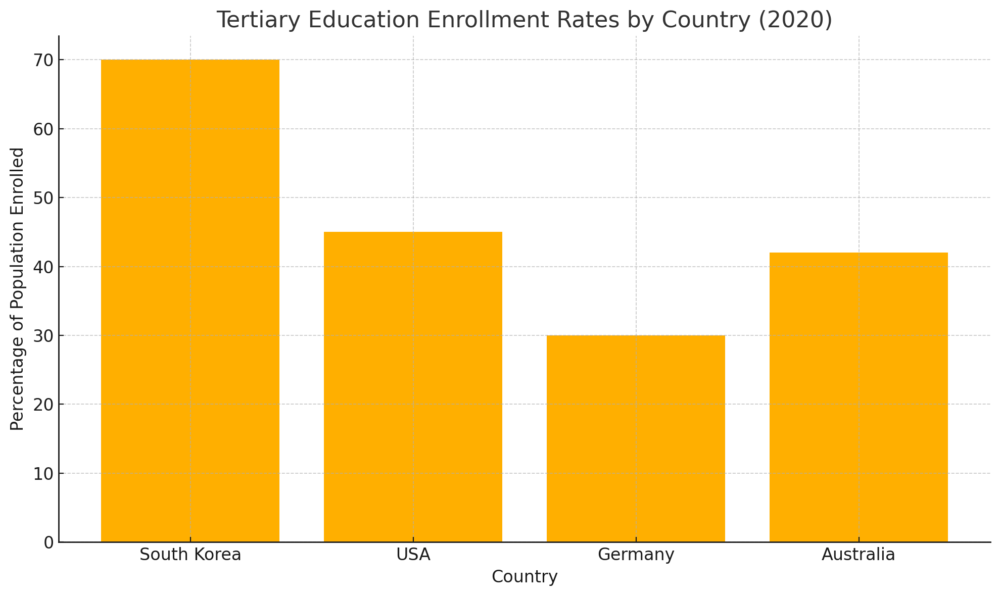

## Task1

> The bar chart above shows tertiary education enrollment rates (percentage of the population enrolled) in South Korea, the USA, Germany, and Australia in 2020.

The bar chart above shows tertiary education enrollment rates in four countries in 2020. It is clear that South Korea has the highest rate, while Germany records the lowest.

Specifically, South Korea leads with approximately 70% of its population enrolled in tertiary education. The USA follows at around 45%, and Australia registers a slightly lower rate of approximately 42%. In contrast, Germany's enrollment stands at about 30%, the lowest among the four nations. These figures demonstrate a significant gap of 40 percentage points between South Korea and Germany.

This disparity may be attributable to differing national policies and cultural emphasis on higher education. South Korea's government has invested heavily in university access and societal norms strongly favour academic achievement, which likely drives its high enrollment. Meanwhile, Germany's dual system of vocational training and apprenticeships provides an alternative pathway, reducing the proportion pursuing university degrees. The intermediate rates in the USA and Australia reflect balanced systems combine academic and vocational opportunities. In summary, while all four are developed countries, their tertiary enrollment rates vary widely due to policy and cultural factors.

## Task2

> Some people argue that online education will eventually replace traditional classroom learning. Discuss both views and give your own opinion.

Advances in digital technology have fuelled debate over whether online education will supplant traditional classroom learning. While virtual platforms offer flexibility and access, many maintain that face-to-face instruction remains indispensable. In my view, neither mode can fully replace the other; instead, a blended approach is optimal.

Advocates of online education highlight its convenience. Students can access lectures and materials remotely, accommodating diverse schedules and geographical limitations. Moreover, interactive tools such as discussion forums and quizzes enable self-paced learning and instant feedback. This model reduces travel costs and allows institutions to reach a broader audience, particularly in underserved regions.

Conversely, proponents of conventional classrooms argue that in-person interaction fosters deeper engagement. Live discussions, hands-on activities and immediate teacher support enhance comprehension and motivation. Classroom environments also build social skills and peer collaboration, which are harder to replicate online. Additionally, maintaining discipline and focus can be more challenging when learners study independently.

However, insisting on a single approach overlooks their complementary strengths. A blended model combining online lectures with periodic in-person seminars can leverage digital convenience while preserving interactive benefits. For instance, foundational concepts might be taught online, freeing classroom time for discussion and practical application. Such integration not only caters to varied learning styles but also prepares students for a digitally connected world.

In conclusion, online education and traditional classrooms each offer unique advantages that the other lacks. Rather than viewing one as the inevitable successor, educational stakeholders should embrace a hybrid system to maximize learning outcomes.

## Vocabulary & Expressions

| Term / Expression | Definition / Paraphrase | Simpler Paraphrases |
| --- | --- | --- |
| **Supplant** | To take the place of something else | replace |
| **Fuelled debate** | Caused or intensified discussion | started or increased discussion |
| **Self-paced learning** | Studying at one’s own speed | learning at your own speed |
| **Peer collaboration**  | Working together with classmates | students working together |
| **Insisting on** | Demanding or maintaining a position | demanding |
| **Complementary** | Combining well to enhance each other’s strengths | working well together |
| **Hybrid system** | A mix of two different methods | a mixture of both |
