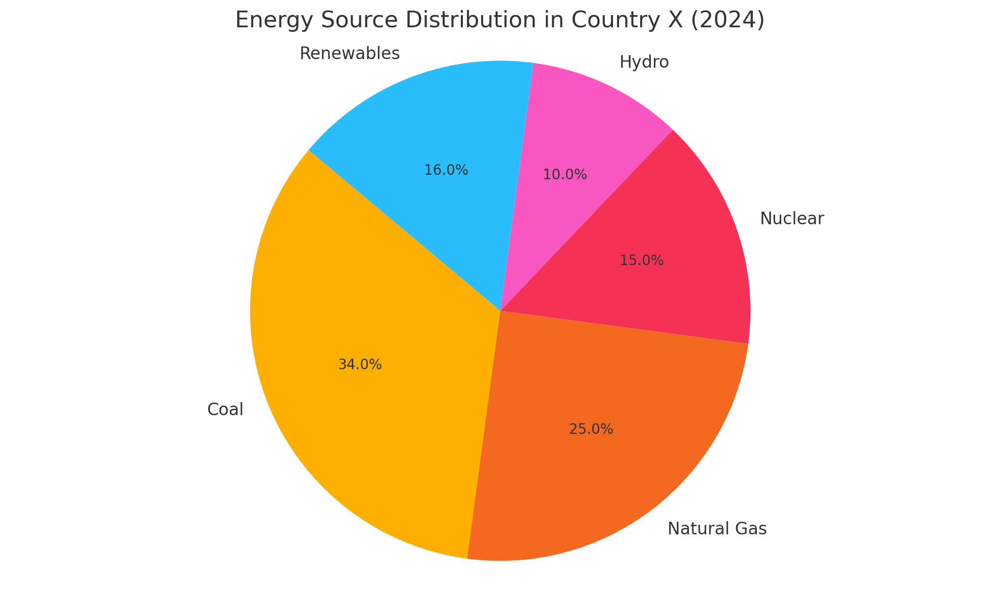

## Task1

> The pie chart above shows the percentage distribution of energy sources in Country X in 2024.

The pie chart illustrates the proportions of different energy sources used in Country X in 2024. It is evident that fossil fuels still dominate the energy mix, although renewable and cleaner alternatives make up a substantial share.

Coal accounts for the largest portion of the energy supply at 34%, followed by natural gas at 25%. Combined, these two fossil fuels represent nearly 60% of total energy consumption. Nuclear power contributes 15%, offering a low-emission but non-renewable option. Hydropower and other renewable sources comprise the remainder, with 10% and 16% respectively.

The data highlights a gradual shift towards sustainable energy. Although coal remains the primary source, renewables slightly exceed nuclear energy in contribution. The presence of hydropower also reflects investment in low-impact infrastructure. However, the high reliance on coal and natural gas suggests the country may face challenges meeting long-term emission targets without significant policy changes.

Overall, while Country X has diversified its energy portfolio, fossil fuels continue to play a central role, indicating both progress and persistent dependence on conventional sources.

## Task2

> Many people believe that economic growth should be the top priority for governments, while others argue that protecting the environment is more important. Discuss both views and give your own opinion.

Economic development and environmental conservation are often perceived as competing priorities for governments. While some advocate for policies that drive economic growth, others argue that environmental protection should come first. I believe a balanced approach is essential.

Supporters of economic growth argue that it is the foundation for national prosperity. Expanding industries create employment opportunities, raise living standards, and generate tax revenue that can be reinvested into social services. For developing countries especially, rapid economic expansion is crucial to reducing poverty and improving infrastructure. Proponents also contend that strong economies are better equipped to invest in environmental technologies over time.

In contrast, environmentalists emphasize the long-term consequences of unchecked growth. Industrial expansion often leads to deforestation, air and water pollution, and increased greenhouse gas emissions. These effects can undermine public health, deplete natural resources, and accelerate climate change. Critics warn that prioritizing economic gains without sustainability measures could lead to irreversible damage.

I believe governments should not view these goals as mutually exclusive. Instead, policies should aim for sustainable development-economic advancement that does not compromise the environment. Investments in green technology, eco-friendly infrastructure, and regulatory frameworks can stimulate the economy while safeguarding natural ecosystems. Countries like Sweden and Costa Rica exemplify how environmental and economic goals can coexist.

In conclusion, while economic growth is vital for national progress, it should not come at the expense of the environment. A sustainable, dual-focus strategy will yield more resilient and equitable outcomes in the long run.

## Vocabulary & Expressions

| Term / Expression | Definition | Simpler Paraphrase |
| --- | --- | --- |
| **Diversified portfolio** | A mix of different components (here, energy sources) | A mix of different types |
| **Sustainable energy** | Energy that doesn’t run out or harm the environment | Eco-friendly and renewable energy |
| **Unchecked growth** | Economic growth with no restrictions | Growth that isn’t controlled |
| **Sustainable development** | Growth that meets current needs without harming the future | Growth that doesn’t hurt the environment |
| **Regulatory frameworks** | Laws and policies that control activities | Rules made by the government |
| **Mutually exclusive** | Cannot happen at the same time | Can’t go together |
| **Safeguarding** | Protecting from harm | Keeping safe |
