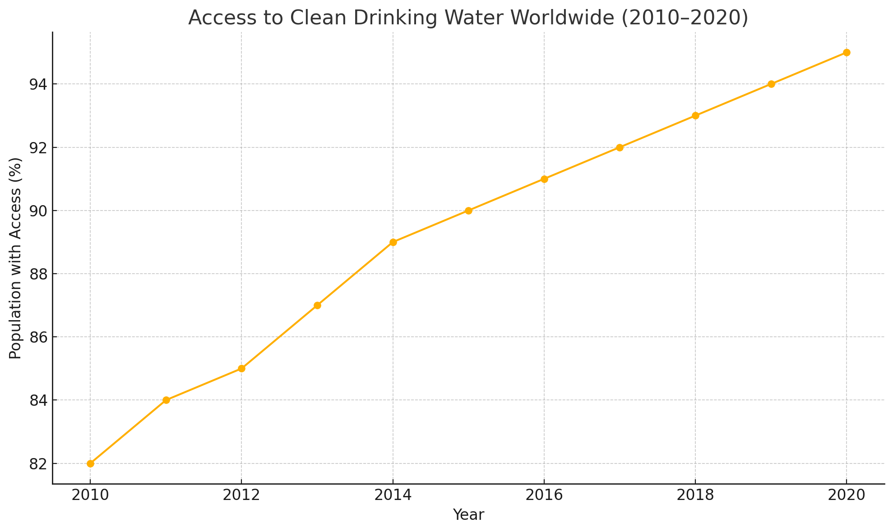

## Task1

> The line graph above shows the percentage of the global population with access to clean drinking water from 2010 to 2020.

The line graph illustrates the worldwide increase in access to clean drinking water between 2010 and 2020. Overall, there was a steady upward trend, with access rising from 82% to 95% over the decade.

In 2010, approximately 82% of the global population had access to clean water. This figure climbed gradually, reaching 85% in 2012 and 89% by 2014. From 2015 onwards, the increase was more moderate but consistent, with rates of 90% in 2015, 92% in 2017 and ultimately 95% in 2020. The most significant annual gain occurred between 2010 and 011, where access rose by 2 percentage points.

The data reflects successful international efforts, such as the United Nations' Sustainable Development Goal to ensure water and sanitation for all. Despite progress, the graph indicates that 5% of the population still lacked access by 2020, underscoring ongoing challenges related to infrastructure and resource allocation.

## Task2

> Some people believe that governments should invest heavily in space exploration, whereas others think those funds are better spent on solving problems on Earth. Discuss both views and give your own opinion.

The debase over funding space exploration versus addressing terrestrial issues has persisted for decades. Advocates of outer space research argue it drives scientific breakthroughs, while critics assert that immediate needs on Earth warrant priority. I contend that a balanced allocation is crucial.

Proponents of space programmes emphasize technological innovation. Missions to the Moon and Mars foster advancements in robotics, materials science, and telecommunications, with downstream benefits such as improved medical imaging and environmental monitoring. Furthermore, space exploration inspires future generations in STEM fields and enhances global collaboration on ambitious projects.

Conversely, opponents argue that pressing problems-such as poverty, climate change, and healthcare-demand urgent resources. With millions lacking basic necessities, critics contend that government budgets should focus on public welfare rather than uncertain extraterrestrial ventures. They point out that excessive spending on space could exacerbate social inequalities and delay solutions to environmental crises.

In my view, governments should maintain robust support for both domains. A fixed percentage of the budget could be earmarked for space research, ensuring continued innovation, while the remainder addresses critical Earth-bound challenges. Collaborative initiatives, like using satellite technology for disaster relief, demonstrate the synergy between space and terrestrial goals.

In conclusion, space exploration and solving Earth's problems are not mutually exclusive. Through prudent budgeting and interdisciplinary projects, societies can advance scientific frontiers while safeguarding human welfare.

## Vocabulary & Expressions

| Term / Expression | Definition | Simpler Paraphrase |
| --- | --- | --- |
| **Steady upward trend** | A consistent increase over time | A continual rise |
| **Infrastructure** | Basic physical systems and facilities needed for society | Essential facilities |
| **Terrestrial issues** | Problems related to Earth | Earth-based problems |
| **Extraterrestrial ventures** | Projects or missions beyond Earth | Space missions |
| **Downstream benefits** | Positive effects that occur as a result of something else | Benefits that follow from it |
| **Synergy** | Interaction that produces a combined effect greater than parts | Working together for better results |
| **Earmarked** | Reserved for a specific purpose | Set aside |
| **Interdisciplinary** | Involving two or more academic disciplines or fields of study | Combining different areas of study |
