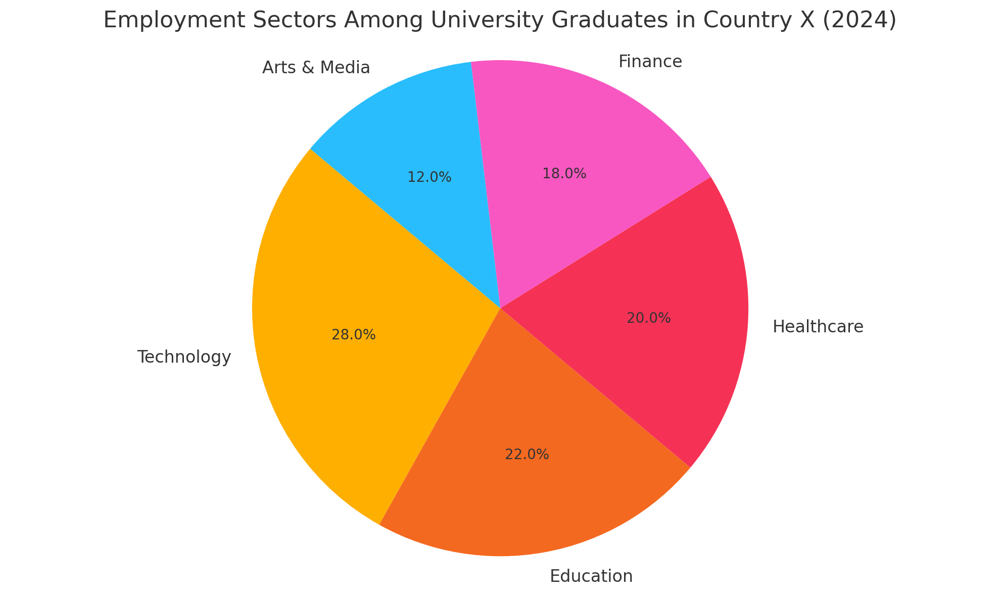

## Task1

> The pie chart below shows the distribution of employment sectors among university graduates in Country X in 2024.

The pie chart illustrates the proportion of university graduates working in various employment sectors in Country X in 2024. Overall, the technology sector attracted the highest number of graduates, while the arts and media field employed the fewest.

Specifically, 28% of graduates were employed in the technology sector, making it the most popular field. Education and healthcare followed with 22% and 20%, respectively. The finance sector employed 18% of graduates, whereas the smallest proportion - 12% - pursued careers in arts and media.

These figures suggest a strong preference among graduates for fields offering stability and growth opportunities. Technology's dominance reflects global demand for digital skills, while healthcare and education remain essential services. The lower percentage in arts and media may be due to fewer job openings or perceived job insecurity.

In summary, most university graduates in Country X are entering high-demand, service-oriented fields, indicating current trends in both education and labour market preferences.

## Task2

> Some people think that the increasing use of artificial intelligence (AI) in workplaces is beneficial, while others believe it may have negative effects on employment and society.
> Discuss both views and give your own opinion.

The rapid advancement of artificial intelligence (AI) has sparked debates about its impact on employment and society. While some welcome AI for its efficiency and innovation, others express concern over job displacement and ethical implications. I believe that with careful management, AI can offer more advantages than drawbacks.

However, critics highlight the risks of widespread automation. Many fear that AI could replace workers in sectors such as manufacturing, retail, and transportation, leading to increased unemployment and inequality. Ethical concerns also arise, particularly around data privacy and decision-making transparency.

In my view, the solution lies in regulation and adaption. Governments should implement policies that retrain displaced workers and ensure AI technologies are used responsibly. Education systems must evolve to prepare future generations with skills that complement AI, such as critical thinking, creativity, and emotional intelligence.

In conclusion, while AI presents legitimate challenges, its benefits can outweigh the risks if approached thoughtfully. Societies that invest in inclusive, forward-thinking policies will be best positioned to thrive in an AI-integrated future.

## Vocabulary & Expressions

| Term / Expression | Definition | Simpler Paraphrase |
| --- | --- | --- |
| **Displacement** | Being replaced or moved out of a role | Losing one’s job |
| **Diagnostics** | Identifying the nature of a medical problem | Finding out what illness someone has |
| **Optimize** | Make something work as well as possible | Make better |
| **Ethical concerns** | Worries about right and wrong | Moral worries |
| **Decision-making transparency** | How clear and open the process of making choices is | Easy to see how decisions are made |
| **Forward-thinking** | Planning for the future with new ideas | Thinking ahead in a smart way |
| **Emotional intelligence** | The ability to understand and manage emotions | Handling emotions well |
