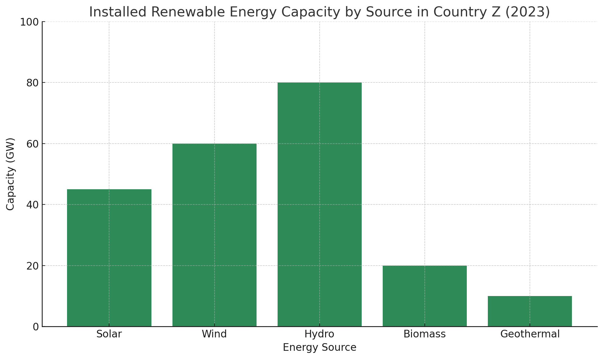

## Task1

> The bar chart above shows the installed renewable energy capacity (in gigawatts) by source in Country Z in 2023.

The bar chart compares the installed renewable energy capacity of five sources in Country Z in 2023. It is evident that hydro power leads significantly, whereas geothermal contributes the least.

Hydro energy accounts for the largest capacity at 80 GW. Wind follows with 60 GW, and solar stands at 45 Gw. Biomass has a modest capacity of 20 GW, while geothermal sits at 10 GW, the smallest share. Overall, hydro capacity is four times that of geothermal and double that of wind, indicating a heavy reliance on water-based power generation.

The disparity among success suggests strategic priorities and resource availability. Country Z's abundant river systems likely facilitate extensive hydro installations. Meanwhile, moderate wind and solar capacities reflect ongoing investments, and lower biomass and geothermal figures may be due to technological or geographical constraints. In summary, although Country Z is diversifying its renewable portfolio, the energy mix remains dominated by hydropower.

## Task2

> Some people believe that governments should prioritize investing in public parks and green spaces to enhance urban living, while others argue that funds should be allocated to infrastructure such as roads and public transport.
> Discuss both views and give your own opinion.

Urban planners often debate the allocation of municipal funds between green spaces and infrastructure development. Advocates of public parks emphasize health and environmental benefits, whereas proponents of roads and transit prioritize economic growth and mobility. I maintain that a balanced approach best serves urban populations.

Supporters of green spaces argue that parks improve air quality, reduce urban heat islands, and provide recreational areas crucial for physical and mental well-being. Studies show access to green spaces correlates with lower stress levels and enhanced community cohesion. Additionally, urban greenery can support biodiversity and stormwater management.

Conversely, those favouring infrastructure investments contend that efficient roads and public transport systems drive economic activity, reduce congestion, and enhance accessibility. Well-maintained transport networks facilitate commerce and connect residential areas with employment hubs. In rapidly growing cities, inadequate infrastructure can stifle productivity and exacerbate social inequalities.

I believe integrating both objectives yields optimal outcomes. Cities should designate sufficient areas for parks while simultaneously upgrading transport corridors. For example, linear greenaways alongside bike lanes and bus rapid transit can merge recreational and mobility functions. Such hybrid developments exemplify how urban design can promote sustainability without sacrificing efficiency.

In conclusion, although public parks and infrastructure serve different needs, their benefits are complementary. Thoughtful urban planning that blends green and built environments will foster healthier, more dynamic
