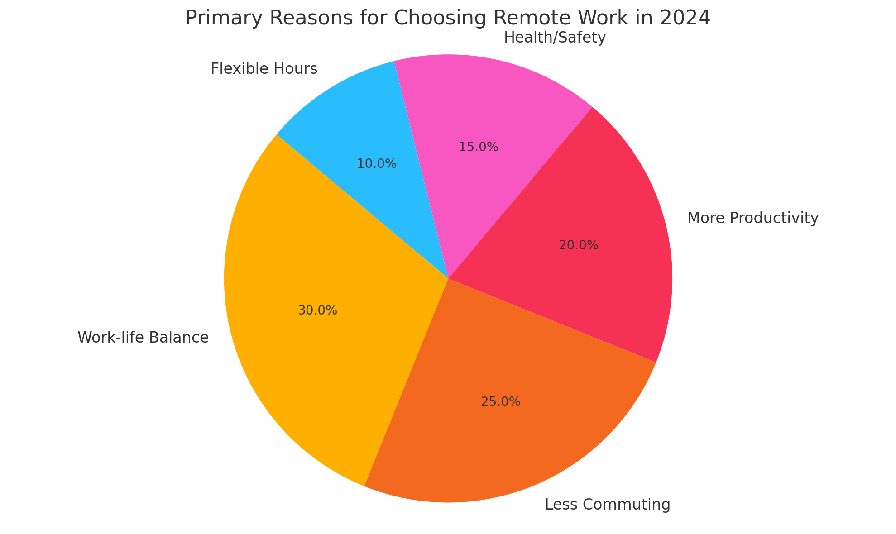

## Task1

> The pie chart above shows the primary reasons why people chose to work remotely in 2024.
> Summarize the information by selecting and reporting the main features, and make comparisons where relevant.

The pie chart illustrates the main factors influencing people's decision to work remotely in 2024. The data reveals that work-life balance and reduced commuting time were the most cited reasons.

Work-life balance accounted for 30% of the responses, making it the leading factor. This was followed closely by the desire to avoid commuting, which represented 25%. Increased productivity was the third most common reason, at 20%, while health and safety concerns contributes to 15% of responses. Finally, flexible working hours were cited by 10% of participants.

The data shows a clear trend toward personal convenience and well-being. The top of three reasons-balance, commute, and productivity-collectively represent 75% of the motivations, indicating a preference for conditions that enhance individual efficiency and lifestyle. Health-related concerns, while significant during global health crises, appear less dominant in 2024, suggesting a shift in focus from safety to sustained comfort and autonomy.

In conclusion, the chart underscores the growing importance of quality of life and flexibility in shaping modern work preferences.

## Task2

> Some people think it is more important to focus on the present, while others believe planning for the future is essential
> Discuss both views and give your own opinion.

There is an ongoing debate over whether people should prioritize living in the moment or concentrate on future planning. While present-focused individuals argue for making the most of today, others maintain that long-term thinking is vital for success. I believe both perspectives have merit and should be balanced.

Advocates of living in the present argue that focusing on the now enhances happiness and reduces anxiety. They contend that excessive worry about the future can lead to missed opportunities and mental stress. Mindfulness practices, which encourage awareness of the present moment, have been shown to improve emotional well-being and foster gratitude.

In contrast, those who support planning ahead believe that setting goals and preparing for possible challenges ensures greater stability. Financial planning, career development, and health maintenance all require foresight. Without long-term thinking, people may struggle tot achieve lasting success or face avoidable setbacks.

In my view, the most effective approach integrates both attitudes. While it is essential to enjoy and engage with daily life, planning for the future provides direction and security. For example, saving money for retirement does not prevent someone from enjoying today's experiences, but rather ensures peace of mind in the long run.

In conclusion, while it is beneficial to embrace the present, neglecting future planning can lead to adverse consequences. A balanced mindset that values both present enjoyment and future preparedness is key to a fulfilling life.
