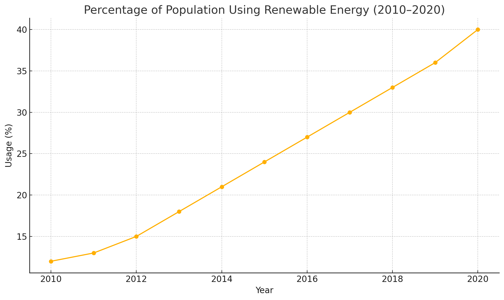

## Task1

> The line graph shows the percentage of the population using renewable energy between 2010 and 2020.

The line graph illustrates the proportion of the population using renewable energy over an 11-year period from 2010 to 2020. Overall, there was a consistent upward trend throughout the decade.

In 2010, only 12% of the population used renewable energy sources. This figure rose steadily, reaching 18% by 2013 and surpassing 30% by 2017. The increase continued more sharply from 2018 onwards, culminating in 40% usage by 2020. The largest annual growth occurred between 2019 and 2010.

The graph suggests that public adoption of renewable energy gained momentum, likely due to technological improvements, government incentives, and increased environmental awareness. By the end of the period, more than triple the number of people used clean energy compared to 2010, highlighting a substantial behavioral shift in energy consumption.

## Task2

> Some people believe that online education is as effective as traditional classroom learning.
> To what extent do you agree or disagree?

With the rise of digital platforms, online education has gained significant popularity. While some argue that it matches traditional learning in quality, other remain skeptical. I believe that while online learning offers valuable flexibility, it is not yet a full substitute for classroom-based education.

One major strength of online education is accessibility. Students from remote or underserved areas can access high-quality resources without the need to travel. In addition, digital platforms often allow learners to progress at their own pace and review material repeatedly, which can enhance understanding.

However, traditional classrooms offer vital social and interactive components that online platforms often lack. Real-time discussions, immediate feedback from teachers, and group activities foster deeper engagement and critical thinking. Furthermore, hands-on subjects such as science or art often require physical presence and equipment, which are difficult to replicate virtually.

In my opinion, a blended model that incorporates both formats is the most effective. Online tools cna supplement in-person instruction, offering convenience while maintaining academic rigor and interpersonal interaction.

In conclusion, although online education has considerable advantages, it cannot entirely replace the rich, dynamic experience of traditional classrooms. A hybrid approach is likely to yield the best educational outcomes.

## Vocabulary & Expressions

| Term / Expression | Definition | Simpler Paraphrase |
| --- | --- | --- |
| **Consistent upward trend** | A steady and ongoing increase | Keeps going up |
| **Culminating** | Reaching the highest point | Ending at a peak |
| **Gained momentum** | Increased in speed or importance | Grew faster |
| **Blended model** | A mix of online and in-person learning | Combining both ways |
| **Hands-on subjects** | Courses that involve physical activity or tools | Practical subjects |
| **Academic rigor** | High standards and thorough learning | Serious and deep study |
| **Substitute** | Something that replaces another | A replacement |
